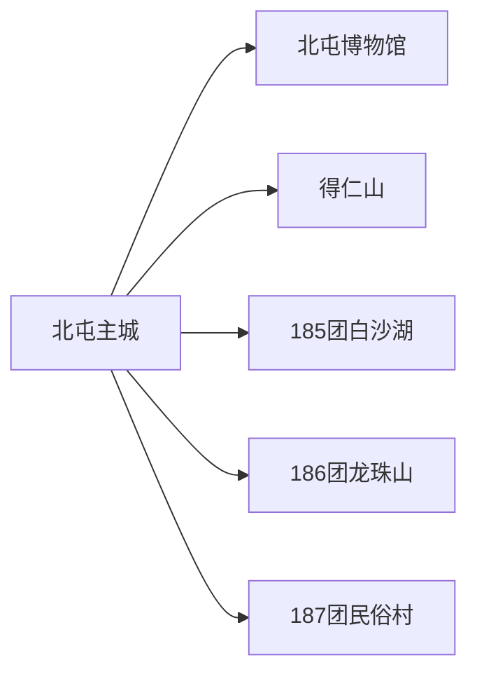
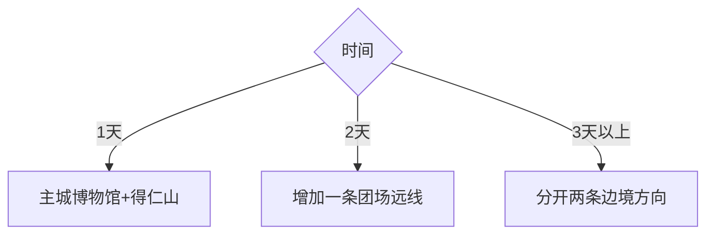

# 北屯旅行指南

北屯是第十师师部所在的兵团城市，主城适合用得仁山、北屯博物馆和额尔齐斯河—乌伦古河水系建立一日框架。第十师团场分布广，白沙湖、龙珠山与图瓦民俗村位于不同边境团场；它们不是北屯主城区近郊，选择一条就应配置完整往返、证件和当日道路信息。

## 城市速览

| 项目 | 信息 |
|---|---|
| 旅行主线 | 北屯主城军垦史—得仁山—一条第十师边境团场远线 |
| 建议停留 | 主城 1 天；每条团场远线另留 1 天以上 |
| 住宿 | 主城适合铁路抵离与补给；远线按接待点和返程条件决定 |
| 交通 | 北屯市站、公路车辆和团场方向合规接驳 |
| 季节 | 夏秋适合户外，冬季严寒、积雪与风吹雪改变道路条件 |
| 边界 | 北屯法定市域、第十师管理范围、阿勒泰地区县域与边境管理区分别核对 |
| 亲子 | 博物馆和得仁山适合轻量科普，远线以车程和卫生间取舍 |
| 无障碍 | 主城公共空间较易安排；山坡、冰雪和团场远线连续性需确认 |

## 城市格局与游览区域

| 区域 | 旅行内容 | 怎么安排 |
|---|---|---|
| 主城 | 军垦史、公共文化、城市生活与补给 | 1 天，铁路抵离可拆成两个半日 |
| 得仁山 | 城市绿地与观景 | 与博物馆同日 |
| 一八五团方向 | 白沙湖与边境团场文化 | 完整远线，核对边境要求 |
| 一八六团方向 | 龙珠山等当期开放项目 | 与一八五团分日选择 |
| 一八七团方向 | 图瓦民俗文化接待 | 以正式运营和预约为准 |

## 主要景点

| 景点 | 区域 | 类型 | 核心体验 | 用时 | 环境 | 体力 | 研究价值 | 拥挤 | 优先级 |
|---|---|---|---|---:|---|---|---|---|---|
| 北屯博物馆 | 主城 | 军垦与地方文博 | 第十师沿革、屯垦与区域民俗 | 2–4 小时 | 室内 | 低 | 高 | 低 | A |
| 得仁山 | 主城 | 城市公园 | 城市观景、绿洲与兵团城市空间 | 2–3 小时 | 室外 | 中 | 中高 | 中 | A |
| 主城河湖公共空间 | 主城 | 滨水休闲 | 额尔齐斯河—乌伦古河区域水系与城市生活 | 1–3 小时 | 室外 | 低 | 中 | 低 | B |
| 白沙湖景区 | 一八五团 | 湖泊与边境生态 | 沙地湖泊、林草与团场历史 | 1 天含往返 | 室外 | 中 | 高 | 中高 | B |
| 龙珠山景区 | 一八六团 | 山地与边境风光 | 团场山地景观和边境文化 | 1 天含往返 | 室外 | 中高 | 中 | 中 | C |
| 图瓦民俗文化旅游村当期项目 | 一八七团 | 民俗接待 | 合规村落接待与区域文化 | 1 天含往返 | 混合 | 中 | 中高 | 中 | C |

北屯博物馆内部展厅按一个场馆计算。师市管理范围、北屯法定市域和团场生产用地并不完全重合；农牧业生产区、水利设施、边境巡护路和居民院落只在明确接待范围活动。

## 美食与餐饮

| 选择 | 怎么点 | 适合场景 |
|---|---|---|
| 牛羊肉、抓饭与拌面 | 一人选主食，多人加烤肉和蔬菜 | 主城正餐 |
| 冷水鱼 | 询问鱼种、来源、重量和做法 | 多人晚餐 |
| 团场路餐 | 主城准备饮水、馕、水果和保温食物 | 长距离远线 |

## 经典行程

### 一日北屯主城线
**路线**：博物馆 → 午餐 → 得仁山 → 滨水短段。**逻辑**：历史与城市格局互补。**预约锚点**：博物馆开放。**休息**：午后室内或酒店。**删除条件**：大风严寒时删除山坡。

### 两日主城与白沙湖
**路线**：主城日 → 一八五团白沙湖。**逻辑**：最具代表性的边境团场线独占一天。**预约锚点**：证件、车辆和景区开放。**休息**：沿正式服务点。**删除条件**：封路或边境要求未落实时保留主城。

### 两日主城与龙珠山
**路线**：主城日 → 一八六团方向。**逻辑**：以一条远线替代多团场赶路。**预约锚点**：道路、接待和返程。**休息**：车内分段。**删除条件**：冬季风雪或运营暂停时删除整线。

### 民俗接待线
**路线**：北屯 → 一八七团正式接待项目 → 返回。**逻辑**：以预约项目承接文化体验。**预约锚点**：运营主体、餐饮和活动边界。**休息**：午餐长休。**删除条件**：未获明确接待确认时改博物馆。

### 亲子科普线
**路线**：北屯博物馆 → 得仁山短段 → 城区早晚餐。**逻辑**：减少长车程。**预约锚点**：儿童服务与卫生间。**休息**：山坡前后室内休息。**删除条件**：低温或儿童疲劳时只留博物馆。

### 冬季低温线
**路线**：博物馆 → 城区短途 → 当期冰雪项目。**逻辑**：先确认运营再出门。**预约锚点**：道路、装备与活动保险。**休息**：短时户外、频繁回暖。**删除条件**：寒潮、风吹雪或能见度低时取消户外。

### 铁路衔接线
**路线**：北屯市站 → 住宿寄存 → 博物馆或得仁山二选一。**逻辑**：用单一项目适配到发。**预约锚点**：车站接驳和行李。**休息**：预留候车时间。**删除条件**：列车调整时直接回站。

## 住宿区域

主城区适合大多数旅行者，可优先选择靠近餐饮、出租车上客和主干道的住宿。团场远线若需要异地住宿，应确认其经营资质、供暖、餐饮、通信、证件检查与次日返程，不用地图距离推定服务能力。

## 市内交通

北屯市站与主城需要地面接驳。主城项目可用出租车或网约车组合；团场远线提前落实合规车辆、司机工时、油料、保险与边境检查。冬季把风吹雪、暗冰和车辆低温性能纳入出发决定。

## 不同旅行者须知

| 旅行者 | 怎么安排 |
|---|---|
| 独行者 | 主城自由组合，远线选择正规产品并共享车牌与行程 |
| 自驾者 | 按公开国省道和团场道路行驶，边境巡护路与生产便道服从封控 |
| 亲子与长者 | 以主城一日为底盘，只在车程和设施明确时增加远线 |
| 摄影者 | 湖岸、团场、边境和居民点使用正式观景与接待范围 |

## 行前核对

- 向十师北屯市和景区核对博物馆、白沙湖、龙珠山与民俗项目开放。
- 向公安、边境管理和运营方确认线路证件与拍摄要求。
- 向交通、气象部门核对冬季风雪、道路与铁路运行。
- 团场农牧业、水利、边境与居民生活空间按生产和管理边界活动。

## 来源与更新记录

| 来源 | 支持内容 | 核验日期 |
|---|---|---|
| [第十师北屯市人民政府](http://www.bts.gov.cn/) | 师市政务、道路、文化与动态公告 | 2026-09-01 |
| [文化和旅游部：第十师北屯市线路](https://zhuanti.mct.gov.cn/xcss2024_xcygj/ningxia/xjbt/detail/7215.html) | 得仁山、博物馆、一八五至一八七团旅行结构 | 2026-09-01 |
| [民政部行政区划代码查询](https://dmfw.mca.gov.cn/xzqh/getList?code=65&trimCode=true&maxLevel=3) | 北屯市法定代码与层级 | 2026-09-01 |
| [GeoNames 1529594](https://www.geonames.org/1529594/) | 北屯固定居民点 | 2026-09-01 |
| [Wikidata Q814946](https://www.wikidata.org/wiki/Q814946) | 北屯市实体与 GeoNames 对齐 | 2026-09-01 |

| 日期 | 更新 |
|---|---|
| 2026-09-01 | 首次完成北屯旅行研究；建立主城、团场远线与师市边界 |
