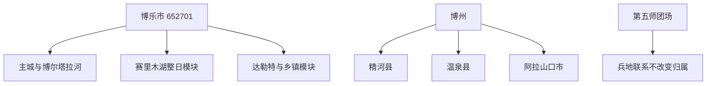

# 博乐旅行指南

博乐市是行政区划代码 **652701** 的县级市，也是博尔塔拉蒙古自治州首府。城市首访可用博州博物馆、博尔塔拉河旅游区和主城公共文化空间认识博州历史与绿洲城市生活；赛里木湖虽然距主城较远，却确实位于博乐市境内，应按整日山地湖泊模块安排。达勒特古城遗址、乡村季节点和北部保护区另有开放与保护条件，不能把“全域旅游”理解为市域处处可自由进入。

> 建议停留：主城 1–2 天；赛里木湖另留整日，旺季或低体力者宜在湖区或线路节点增加住宿 
> 旅行关键词：博州文博、博尔塔拉河、赛里木湖、绿洲城市、多民族餐饮、边境生态
> 主要体力：低至中等；赛里木湖有高海拔、强风、长车程和环湖交通压力
> 最近研究：2026-08-12

## 城市速览

| 项目 | 旅行信息 |
|---|---|
| 主要旅行价值 | 博州博物馆建立自治州历史背景，博尔塔拉河旅游区承接城市休闲，赛里木湖是高山湖泊整日核心；主城与远湖不能压成一条步行线。 |
| 建议停留 | 1 天看主城文博与博河；2 天增加赛里木湖；达勒特古城或季节乡村点另占半日至一日，不与湖区硬拼。 |
| 较舒适季节 | 春末至秋季常见湖泊、花期和城市活动，但赛湖天气变化快；冬季可有冰雪体验，也伴随低温、雾、风雪和道路结冰。 |
| 预算特点 | 主城公共文化和河岸短线较易控费；赛湖门票、区间交通、正规车辆、旺季住宿和远线餐食是主要增量。 |
| 步行强度 | 主城可用车辆分段；赛湖即使乘景区交通也有上下车、风口和长时间户外，不能用“环湖车游”推断零体力。 |
| 主要天气风险 | 赛湖至五台路段可能出现低能见度大雾，另有大风、降雪、结冰和强对流；主城夏季日晒，河岸还需关注水情与临时活动。 |
| 独行旅行 | 主城适合独立安排；赛湖锁定正规往返与住宿，边境山地、保护区和偏远乡村不单独走无资质线路。 |
| 亲子旅行 | 博州博物馆、主城公园与博河短段容易拆分；赛湖需持续防风保暖、防晒和看护，远离湖水、冰面、车道与保护区。 |
| 长者与低体力旅行 | 一座场馆加博河短段较易减负；赛湖先问景区车、落客、卫生间、座椅和轮椅装载，并准备中途删点。 |
| 无障碍信息 | 博州博物馆明确提供无障碍卫生间、轮椅借用和导盲犬例外；这只证明馆内部分服务，不代表主城道路、车辆与赛湖形成连续链。 |

固定清单中的 **GeoNames 8521718** 是名为 `Bole` 的居民点，**Wikidata Q894256** 的 GeoNames 属性 P1566 精确对应 8521718，法定代码也对应 652701。GeoNames 的 `PPL` 只表示居民点类型，不取消博乐的县级市和博州首府身份；居民点坐标、县级市全域和博尔塔拉蒙古自治州也不能相互替代。

博乐市官方 2025 年资料列出四镇、一乡、一个国营牧场和五个街道。精河县、温泉县和阿拉山口市是博州内其他独立县市，不因从博乐集散就成为博乐市景点；新疆生产建设兵团第五师及其团场与博乐有兵地、交通和水系联系，也不自动并入 652701 的法定市域。阿拉山口是独立县级市与口岸城市，不属于博乐北郊。

## 城市格局与游览区域

博乐可分成主城文博与公共文化、博尔塔拉河城市休闲带、赛里木湖远线、达勒特与西部乡镇，以及北部山地和边境生态保护空间。主城前两类可以在一天内分段；后三类须按开放、交通、季节和保护规则另排。

| 区域 | 主要内容 | 游览特点 | 与其他区域的关系 |
|---|---|---|---|
| 主城文博与公共文化片区 | 博州博物馆、西部文化广场、文化馆、图书馆及当期活动 | 室内和城市公共空间为主，适合到达日、亲子与恶劣天气备选 | 州级展陈覆盖博州历史，不把精河、温泉和阿拉山口景点并入博乐 |
| 博尔塔拉河城市休闲带 | 博尔塔拉河旅游区、博河记忆及正式开放步道 | 河岸生态、城市桥梁与夜间休闲，适合半日或傍晚 | 只走维护开放段，不进入河道、施工、水利设施和非公开湿地 |
| 赛里木湖远线 | 国家 5A 景区、环湖风光与生态保护分区 | 高山湖泊，主城往返与环湖均需整日；天气会改变游线 | 位于博乐市境内、邻近霍城县，但不属于伊宁市或霍城县景点 |
| 达勒特与西部乡镇 | 达勒特古城遗址、乡村季节点、农牧文化 | 遗址保护与季节活动并重，需核对开放入口 | 达勒特镇属于博乐；温泉县仍是独立县，不能继续向西无限外推 |
| 北部山地与边境生态空间 | 夏尔希里、哈日图热格等保护与规划区域 | 生态敏感、边境和山地条件叠加，公开介绍不等于自由准入 | 没有明确游客开放公告时只作边界说明，不自行穿越或追踪野生动物 |

赛里木湖官方资料确认其位于博乐市境内，海拔约 2071 米，并划分环湖游览、生态保育、珍稀鸟类栖息地和原生态保持等不同功能区。行政归属不意味着全湖岸等量开放；游客只按景区入口、区间交通、停车点和正式步道活动，不进入湿地草甸、水体、栖息地或围栏后的保护区。

达勒特古城遗址位于达勒特镇原破城子村北缘，是全国重点文物保护单位。2026 年公开的保护条例草案说明遗址仍需按文物保护范围与管理要求利用，不能据此假设遗址内部、考古区或新馆已经按固定时间全面开放。只在主管部门或运营方明确开放的入口参观，不捡拾遗物、不攀爬土遗址、不进入考古和施工范围。

## 主要景点

优先级用于行程取舍：**A** 为首访核心，**B** 按兴趣和季节增加，**C** 表示开放证据、交通或季节限制更强。规划中、建设中或只有宣传介绍的点不写成稳定开放景点。

### 主城文博与城市休闲

| 景点 | 区域 | 类型 | 主要看点 | 建议用时 | 室内外 | 体力 | 预约风险 | 天气影响 | 优先级 |
|---|---|---|---|---:|---|---|---|---|---|
| 博尔塔拉蒙古自治州博物馆 | 主城公共文化片区 | 综合博物馆 | 博州历史、考古、多民族文化与区域自然背景 | 2–3 小时 | 室内 | 低至中 | 中；散客通常无需预约，讲解与节假日需确认 | 低；临时闭馆仍可能发生 | A |
| 博尔塔拉河旅游区 | 主城河岸 | 河岸生态与城市休闲、4A 景区 | 博河生态文化长廊、正式步道、桥梁与城市景观 | 2–4 小时 | 室外为主 | 低至中 | 中；开放段、活动、停车与夜间服务需确认 | 高；降雨、水情、风和冰雪影响 | A |
| 博乐商业步行街 | 主城 | 商业休闲、3A 景区 | 正规餐饮、城市消费与夜间生活 | 1.5–3 小时 | 混合 | 低至中 | 低至中；商户和活动时效性强 | 中 | B／路线节点 |
| 博乐市文化馆及当期公共活动 | 主城 | 公共文化 | 地方艺术、群众文化活动与恶劣天气备选 | 1–2.5 小时 | 室内 | 低 | 高；只在活动正式开放时安排 | 低 | C／路线节点 |

博州博物馆 2025 年参观须知明确：周一通常闭馆，散客可持有效证件安检入馆，免费参观；馆内有无障碍卫生间，并可在服务台借用轮椅、婴儿车和雨伞。节假日、设施维护和展陈调整仍会改变开放，团体讲解需提前联系。以上设施不外推到馆外道路或其他景区。

### 赛里木湖整日模块

| 景点 | 区域 | 类型 | 主要看点 | 建议用时 | 室内外 | 体力 | 预约风险 | 天气影响 | 优先级 |
|---|---|---|---|---:|---|---|---|---|---|
| 赛里木湖风景名胜区 | 博乐市南部山地 | 高山湖泊、国家 5A 景区 | 高山湖泊、草原、季节花景、雪山与生态保护分区 | 整日 | 室外为主 | 中 | 很高；门票、区间交通、自驾规则、入口和末班需确认 | 很高；大风、雾、降雪、结冰与强对流 | A |
| 赛湖正式冰雪或水上项目 | 景区指定运营区 | 季节体验 | 仅限有资质、明确运营和安全保障的项目 | 1–3 小时 | 室外 | 中至高 | 很高；运营、保险、年龄健康限制和取消条件需确认 | 极高 | C／条件性 |

赛湖不是从伊宁“顺路经过”就能完成的观景点。从博乐主城出发，要把到入口、购票换乘、环湖停靠、用餐、天气等待和返程合并计算；从伊宁或霍城方向进入，也不改变其博乐市归属。低能见度大雾曾覆盖赛湖至连霍高速五台路段，遇预警应推迟或取消，不以导航仍显示通行作为继续依据。

### 历史遗址与季节乡村点

| 景点 | 区域 | 类型 | 主要看点 | 建议用时 | 室内外 | 体力 | 预约风险 | 天气影响 | 优先级 |
|---|---|---|---|---:|---|---|---|---|---|
| 达勒特古城遗址正式开放区 | 达勒特镇 | 全国重点文物保护单位 | 宋元孛罗城遗址与丝路历史环境 | 2–3 小时 | 室外为主 | 中 | 很高；开放入口、考古施工与新馆状态需确认 | 高；风雨、积雪和泥泞影响 | B／条件性 |
| 万亩海棠生态园 | 主城西侧城郊 | 季节花园 | 海棠花期与城市近郊园林 | 1.5–3 小时 | 室外 | 低至中 | 高；花期、活动、营业和停车需确认 | 高 | B／季节性 |

夏尔希里国家自然保护区、哈日图热格山地以及边境附近林草空间只作保护边界。现有州级文旅规划把两地列入规划建设内容，这不等于面向普通游客的稳定开放公告。没有主管部门明确的开放公告、线路和接待主体时，不把它们列入经典行程，更不通过向导私带、越野轨迹或边境便道进入。

## 美食与餐饮

博乐的餐饮来自蒙古、哈萨克、维吾尔、回、汉等多种城市生活传统。现有官方资料可以确认博乐牛肉、奶茶、手抓肉、抓饭、拌面和烤包子等本地常见类型，赛湖服务区也提供部分地方餐食。页面按品类寻找，不把活动报道点名的商家固化为唯一推荐。

| 菜品或类型 | 常见区域 | 一个人用餐与份量 | 风味、过敏原与饮食限制 | 替代与避坑 |
|---|---|---|---|---|
| 博乐牛肉与牛羊肉菜 | 主城正规民族餐馆 | 可问单人份或按重量点，拼盘常适合共享 | 肉类、动物油、盐和香辛料较多 | 点餐前问重量、计价和做法，不因“有机”推断适合所有饮食限制 |
| 蒙古餐与手把肉 | 主城与博河周边正规餐馆 | 常为共享大份，独行选小份或套餐 | 牛羊肉、奶制品、面食和较高盐脂常见 | 先问份量和配菜，慢性病患者控制盐脂 |
| 奶茶、奶制品与发酵饮品 | 主城餐馆、正规饮品店 | 单杯尝试，儿童先少量 | 含乳糖；发酵饮品可能含酒精，另可能含盐、糖或坚果 | 询问配料与发酵程度，不凭“奶茶”名称推断甜味或无酒精 |
| 馕、烤包子、抓饭与拌面 | 主城步行街、市场和社区餐馆 | 多可单人点，面食份量较足 | 含麸质，常见牛羊肉、洋葱、动物油，可能接触芝麻 | 选择明码标价和卫生条件清楚的同类店 |
| 赛里木湖冷水鱼 | 景区与主城有资质餐馆 | 整鱼常按重量计价，独行先问小份做法 | 鱼类过敏者避免；可能用油炸、奶制品或坚果调味 | 下单前确认活重／净重、做法、价格和来源，不购买来源不明野生鱼 |
| 烧烤与夜间小吃 | 主城正规夜间餐饮区 | 可少量加点 | 肉类、孜然、辣椒、麸质和芝麻交叉接触常见 | 选择证照和价格清楚的经营点，不跟随无证流动摊贩 |
| 瓜果、蜂蜜与干果 | 正规市场和商店 | 按食用量购买 | 天然糖分较高，干果区可能接触坚果 | 不进入果园、蜂场或居民院落自行采买；留意储存和称重 |

尊重清真餐饮、蒙古与哈萨克等不同经营场所的空间、酒类、吸烟和拍摄提示。素食、乳糖不耐、麸质或坚果过敏者，逐项询问肉汤、油脂、奶、面粉、配料和共用厨具。

## 经典行程

### 一日主城文博与博河线

**路线**：博州博物馆 → 主城午餐与长休 → 博尔塔拉河旅游区正式开放短段 → 步行街或正规晚餐

- **串联逻辑**：先用州博认识区域历史，再把河流与绿洲城市生活放回现实空间；不把赛湖或温泉县塞进同日。
- **适用人群**：首访、独行、亲子、公共交通和中低体力旅行者。
- **减负方式**：点到点乘车，博河只走一段，晚间节点可随时取消。
- **预约锚点**：博物馆开馆与讲解、博河开放段和活动、返程叫车与餐厅营业。
- **休息与删减**：午间休息至少 60 分钟；体力不足删晚间，天气不佳删博河，只保留博物馆。

### 两日主城与赛里木湖线

**路线**：第 1 天主城文博与博河 → 第 2 天正规车辆到赛湖入口 → 按景区交通和开放点游览 → 预留天气等待 → 返回博乐或已确认住宿

- **串联逻辑**：主城和高山湖泊分日；湖区以当日运营游线为准，不追求把每个停靠点全部打卡。
- **适用人群**：首次来博乐、自然景观兴趣者和能承受整日车程者。
- **减负方式**：优先正规直达与景区交通，只下车 2–3 次，准备保暖、防晒、水和简餐。
- **预约锚点**：门票、入口、区间车或自驾规则、末班、天气、餐饮、车辆资质和返程。
- **休息与删减**：游客中心和车内定时休息；大雾、大风、风雪或道路管制时整线取消，不改走山地便道。

### 赛里木湖慢游两日线

**路线**：第 1 天抵达湖区正式入口 → 只游半环或少量开放点 → 湖区或线路节点住宿 → 第 2 天按天气补另一段 → 白天返回博乐或下一站

- **串联逻辑**：用住宿换取较少赶路和天气弹性，不把慢游理解为进入生态保育区。
- **适用人群**：摄影、长者、亲子、低体力和希望降低单日驾驶压力者。
- **减负方式**：每天只留 2–3 个停靠点，选择能明确接送和供暖的住宿。
- **预约锚点**：两日票务与交通规则、住宿地址、供暖、餐食、天气取消和行李转运。
- **休息与删减**：午间回游客服务或住宿；天气恶化先删第二日湖段，直接按公共道路离开。

### 达勒特历史半日线

**路线**：主城出发 → 达勒特古城遗址明确开放入口 → 达勒特镇正规午餐 → 返回主城博物馆或休息

- **串联逻辑**：先确认遗址开放，再以州博补足文物背景；不进入考古、施工和遗址保护范围。
- **适用人群**：丝路史、考古和乡镇历史兴趣者。
- **减负方式**：遗址只走指定短线，午后回主城，不继续跨到温泉县。
- **预约锚点**：开放入口、讲解、遗址博物馆状态、道路、卫生间与返程车辆。
- **休息与删减**：镇内午休；若只有建设信息而无开放确认，整段删除，改去博州博物馆。

### 花期与乡村季节线

**路线**：万亩海棠生态园或一个正式开放乡村景区 → 预约午餐 → 主城博河短段或直接返回住宿

- **串联逻辑**：一天只追一个花期或乡村主题，不把多个村庄、采摘园和农牧生产点连成“免费环线”。
- **适用人群**：亲子、花卉摄影和周末慢游者。
- **减负方式**：提前确定停车、遮阴和卫生间，避开正午，使用正规经营点。
- **预约锚点**：花期、景区营业、活动、餐饮、停车、采摘边界和返程。
- **休息与删减**：每小时补水休息；花期已过、风雨或经营暂停时直接取消，不进入农田寻找替代花海。

### 长者、轮椅与恶劣天气调整线

**路线**：博州博物馆 → 主城室内午餐与长休 → 文化馆正式活动或河岸最近的平缓短段二选一 → 返回住宿

- **串联逻辑**：只选已确认服务的室内点和可随时退出的短段，去掉高山湖泊与乡镇转场。
- **适用人群**：长者、轮椅使用者、低体力者，以及大风、雾、风雪或极端温度调整日。
- **减负方式**：车辆落客，借用轮椅前联系馆方；河岸不作为必选。
- **预约锚点**：无障碍落客、入口、卫生间、轮椅、活动开放、车辆等待和最近医疗点。
- **休息与删减**：馆内每 30–45 分钟休息；天气或体力不稳时删全部下午段。

## 住宿区域

| 区域 | 适合人群 | 优点 | 主要代价与核对项 |
|---|---|---|---|
| 主城公共文化与商业区 | 首访、无车、文博与餐饮 | 餐饮和城市服务相对集中，便于主城短线 | 博乐站和机场不一定在步行范围；核对夜间车辆与噪声 |
| 博尔塔拉河附近 | 河岸慢游、跑步和夜间休闲 | 接近博河正式开放段 | “河景”不保证入口直达；核对水情、施工、停车和夜间照明 |
| 博乐站或机场通道 | 早班、短中转、自驾 | 降低到发压力 | 与主城景点仍有距离；核对公交、出租车、餐饮和前台时段 |
| 赛湖景区或线路节点正规住宿 | 赛湖慢游、摄影、亲子与低体力 | 减少同日往返，增加天气弹性 | 房量、价格、供暖、餐食和退改波动大；确认是否在合法接待范围与实际入口 |

预订时区分“博乐市区”“赛里木湖景区”“五台方向”和其他博州县市。平台写“博州”不代表在博乐主城；温泉、精河、阿拉山口的住宿不能当作市区同片区。逐项核对取消、前台、供暖制冷、停车充电、无障碍客房和次日接送。

## 市内交通

博乐可通过博乐站、博乐阿拉山口机场和公路到达。中国民航局将博乐阿拉山口机场列为新疆运输机场；市政府公共交通页面列有主城、乡镇和博乐站方向公交线路，但固定站序会调整，页面只保留交通层级，不固化班次。

| 场景 | 可用方式 | 适用范围 | 出发前确认 |
|---|---|---|---|
| 抵达博乐 | 航班、铁路、长途客运 | 机场或博乐站到主城住宿 | 到发时刻、接驳、夜间车辆、行李与无障碍服务 |
| 主城游览 | 公交、出租车、合规网约车 | 博物馆、博河、步行街与餐饮 | 站点、候车环境、落客位置、运营时段和返程 |
| 前往赛里木湖 | 景区交通、正规旅游车、包车或符合当期规则的自驾 | 主城至湖区入口和环湖 | 实际入口、票种、区间车、自驾限制、末班、天气和住宿 |
| 达勒特与乡镇 | 城乡公交、正规包车或自驾 | 明确开放遗址和乡村景区 | 班次、开放、停车、返程、农牧生产边界 |
| 前往温泉、精河、阿拉山口 | 客运、铁路或正规车辆 | 独立县市联程 | 当作跨城交通，重新核对到发站、住宿和景区归属 |
| 边境与保护空间 | 仅公共道路和明确接待线路 | 有正式开放公告的点位 | 边境管理、自然保护、团场、矿业、草场与军事设施规则 |

赛湖日的最大风险是把景区游览和长途驾驶都塞到同一名驾驶员身上。核算门到门时间、停车换乘、环湖停靠、用餐、返程和强制休息；低能见度、大风、降雪或结冰时服从交警和景区管制。不要通过林草地、矿区、团场生产路或边境便道绕行。

## 不同旅行者须知

| 旅行者 | 更适合的安排 | 需要主动核对 | 应避免 |
|---|---|---|---|
| 独行旅行者 | 主城文博、正规赛湖直达或团体交通 | 车辆资质、返程、通信、住宿和紧急联系人 | 独自进入保护区、边境山地、河道或夜间搭无标志车辆 |
| 亲子家庭 | 博州博物馆、博河短段、赛湖少量停靠 | 儿童证件、座椅、卫生间、防风保暖、防晒和餐食 | 靠近湖水、自然冰面、车道、陡坡与遗址脆弱边缘 |
| 长者与低体力者 | 一馆一短点、赛湖两日慢游 | 落客、座椅、坡度、景区车、轮椅装载和医疗距离 | 单日主城往返赛湖后继续赶路 |
| 轮椅使用者 | 博州博物馆及逐段确认的住宿交通 | 客房—车辆—入口—卫生间—核心游线连续性 | 把馆内轮椅服务外推到博河与赛湖全线 |
| 自驾旅行者 | 一天一个方向，湖区适时过夜 | 轮胎、油电、驾驶员工时、雾雪预警、救援与退改 | 疲劳驾驶、冰雪中追日出、离开道路进入草场湿地 |
| 摄影与无人机使用者 | 公共观景点和明确许可机位 | 机场净空、边境、保护区、鸟类、活动与肖像规则 | 追逐野生动物、进入栖息地、在景区或边境擅飞 |
| 饮食限制者 | 主城菜单清楚、可沟通的正规餐馆 | 肉汤、奶、麸质、坚果、酒精、共锅与计价 | 仅凭民族菜名推断食材或过敏安全 |

## 行前核对

- 先确认目的地在博乐市、精河县、温泉县还是阿拉山口市；赛里木湖归博乐，阿拉山口是独立城市。
- 使用[博乐市人民政府](https://www.xjbl.gov.cn/)和[博州人民政府](https://www.xjboz.gov.cn/)核对景区、公共文化、交通、气象和临时公告。
- 赛湖逐项确认入口、门票、区间交通或自驾规则、末班、停车、住宿、冰雪／水上项目、无人机与天气取消。
- 博州博物馆节假日和临时维护会调整开放；团体讲解、轮椅、婴儿车和无障碍服务到访前联系确认。
- 达勒特古城只有在主管部门明确开放时进入，不把文旅发展规划或地图道路当作开放证明。
- 夏尔希里、哈日图热格和边境山地没有明确开放公告时不列入行程，不接受私带穿越、投喂或追踪野生动物。
- 公交站序只作网络背景，实际线路与时刻出发前查询；铁路通过[中国铁路 12306](https://www.12306.cn/)核对，航班通过承运方和[中国民用航空局](https://www.caac.gov.cn/)核对。
- 需要无障碍服务时逐段确认；赛湖还要问区间车轮椅装载、无障碍卫生间、停车落客与核心观景点地面。
- 自驾准备防滑、防风、备水、保暖、防晒和驾驶员休息，不进入河道、湿地、草场、矿区、团场或边境便道。
- 高等级大雾、大风、暴雪、结冰或强对流预警时取消赛湖和山地，不用社交平台实时视频替代官方管制。

## 来源与更新记录

| 主题 | 一手或权威入口 | 支持范围 | 使用边界 |
|---|---|---|---|
| 行政区划 | [博乐市行政区划](https://www.xjbl.gov.cn/xjbl/c126487/202508/c1ee6bd7ecec418a9ebf788e939eca8e.shtml) | 县级市、博州首府、4 镇 1 乡 1 牧场 5 街道 | 建成区面积不替代法定市域 |
| 法定代码 | [民政部行政区划代码查询](https://dmfw.mca.gov.cn/) | 博乐市代码 652701 | 以查询当期结果为准 |
| 地名标识 | [GeoNames 8521718](https://www.geonames.org/8521718/bole.html)、[Wikidata Q894256](https://www.wikidata.org/wiki/Q894256) | 固定居民点、县级市实体及 P1566 精确对应 | 开放地名不替代法定边界 |
| 城市与相邻关系 | [走进博乐](https://www.xjbl.gov.cn/xjbl/c126464/zjbl.shtml) | 博乐与精河、温泉、阿拉山口、伊犁方向关系 | 宣传荣誉不作为旅行决策依据 |
| 赛里木湖归属 | [博乐市政府赛里木湖介绍](https://www.xjbl.gov.cn/xjbl/c126482/202411/7fb566e718e248e28d23e0d7d462e379.shtml) | 位于博乐市境内、海拔与功能分区 | 介绍不保证全部湖岸开放 |
| 景区等级与城市游线 | [博乐市政府工作报告](https://www.xjbl.gov.cn/xjbl/c126551/202201/e060fd784783489ba9d644bb43726934.shtml) | 赛湖 5A、博河 4A、海棠园与博河生态文化长廊 | 报告用于确认长期空间结构，开放和等级出发前重查 |
| 博州博物馆 | [博州博物馆参观须知](https://www.xjboz.gov.cn/xjboz/c125981/202508/07cac52c69f44d318882200f8da5cbd9.shtml) | 开放框架、预约、无障碍卫生间、轮椅与婴儿车 | 节假日和维护调整以新公告为准 |
| 达勒特遗址 | [博州“十四五”文化和旅游发展规划](https://www.xjboz.gov.cn/xjboz/c126104/202506/1985f816e86e44ea87e86fae5df1689b.shtml) | 博乐市达勒特古城保护、展示利用与遗址公园规划 | 发展规划不等于固定开放 |
| 赛湖天气风险 | [博乐市大雾预警案例](https://www.xjbl.gov.cn/xjbl/c126495/202602/51cf8391014c49d5a5d496c0712acd77.shtml) | 赛湖至五台低能见度及交通影响 | 单次预警只说明风险类型 |
| 旅游安全 | [博乐市旅游安全与消费提示](https://www.xjbl.gov.cn/xjbl/c126654/202507/ccc9e62433084862b926c2e1a826dc55.shtml) | 正规交通、证件、饮食、危险活动与合同 | 通用提示需与目的地实时公告结合 |
| 公共交通 | [博乐市公共交通](https://www.xjbl.gov.cn/xjbl/c126630/202411/87322e5c097949f08d851f4435883631.shtml) | 主城、博乐站与城乡公交网络背景 | 固定站序和班次不长期固化 |
| 航空到达 | [中国民航局运输机场名录](https://www.caac.gov.cn/PHONE/GYMH/MHGK/MYJC/index_23.html) | 博乐阿拉山口机场的运输机场身份 | 不证明具体航线与班期 |
| 餐饮 | [博乐城市与牛肉资料](https://www.xjbl.gov.cn/xjbl/c126485/202411/70b167b8471b4bfe8efef7604748fb88.shtml)、[赛湖游客中心餐饮](https://www.xjbl.gov.cn/xjbl/c126616/202511/770f23aa4f13498cba79321babb723b7.shtml)、[乡村美食活动](https://www.xjbl.gov.cn/xjbl/c126853/202510/1d9e23585a3847ea92ae0d53657117de.shtml) | 博乐牛肉、奶茶、手抓肉、抓饭、拌面、烤包子等类型 | 活动和服务报道不转化为长期商户推荐 |
| 保护空间 | [博州“十四五”文化和旅游发展规划](https://www.xjboz.gov.cn/xjboz/c126104/202506/1985f816e86e44ea87e86fae5df1689b.shtml) | 夏尔希里与哈日图热格的规划建设定位 | 规划项目不构成普通游客准入证明 |

本页最近研究日期为 **2026-08-12**。长期保留的是县级市与博州首府关系、赛湖归属、主城和远线尺度、保护生产边界；门票、班次、开放、花期、天气、道路、项目运营和连续无障碍服务均在出发前重查。
