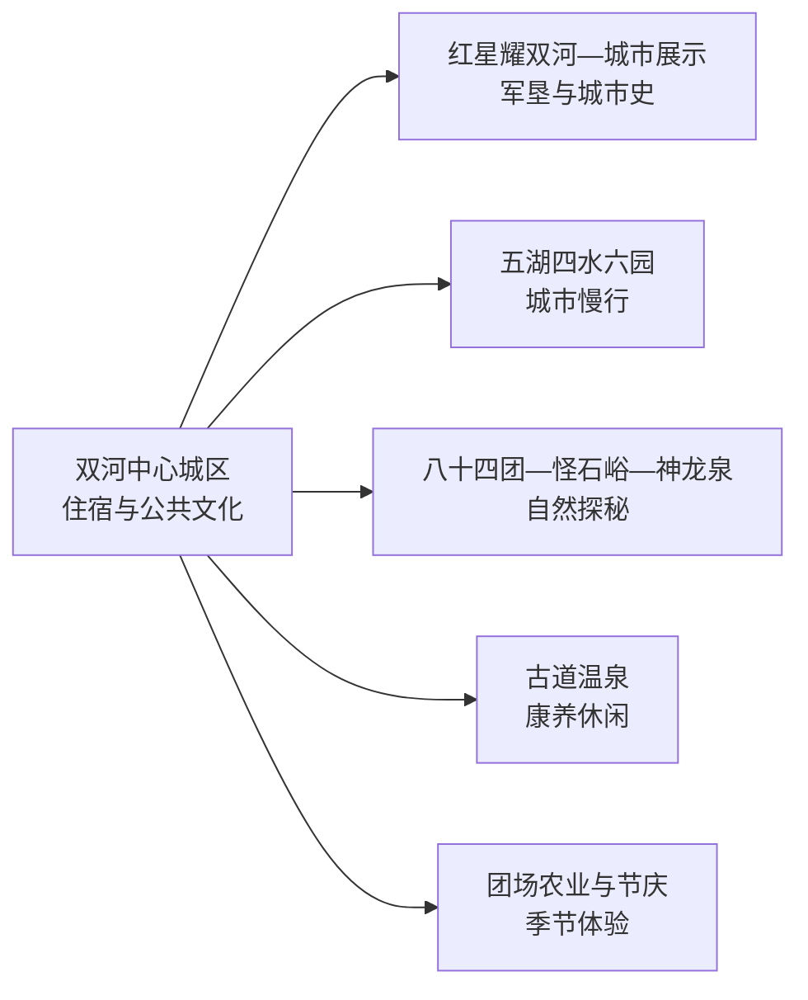
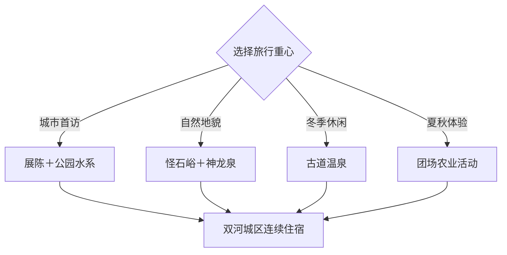

# 双河旅行指南

双河是第五师师市合一城市，中心城区以公园水系、军垦展陈和城市公共文化为主，怪石峪、古道温泉、农业园与团场活动分布在更大的师市范围。首访适合 2–3 天：城区一天，怪石峪“五带”环线一天，再从温泉或季节农业中选一天。

本页使用 GeoNames **11980730**（八十九团场）定位双河城市核心形成前的真实地名点，法定对象以双河市代码 `659007` 和 Wikidata `Q10930847` 为准。该点位于固定 `cities500` 快照外，只计入法定县级市覆盖。

## 城市速览

| 项目 | 信息 |
|---|---|
| 主线 | 双河城区—红星军垦展陈—怪石峪—古道温泉—团场农业 |
| 停留 | 城区 1 天；怪石峪环线 1 天；温泉或农业体验另留半日至 1 天 |
| 住宿 | 双河城区适合公园、场馆与换乘；景区或团场住宿重视季节接待 |
| 交通 | 博乐方向接入较方便，团场、怪石峪与边境方向以预约车辆为主 |
| 季节 | 春秋适合怪石与环线，夏秋适合农业活动，冬季可选温泉 |
| 预算 | 城区公共空间成本较低，远线车辆、门票、温泉和住宿增加支出 |

## 城市格局与游览区域

城区适合低体力慢游，怪石峪—神龙泉和团场农业需要按公路安排。赛里木湖、艾比湖、博乐市与阿拉山口是区域联程节点，是否属于双河法定市域须按实际入口判断。边境管理区、哨所执勤区、农牧业生产地、水利设施和自然保护地执行正式开放边界。

## 主要景点

| 景点 | 区域 | 类型 | 核心体验 | 用时 | 环境 | 体力 | 预约风险 | 天气影响 | 优先级 |
|---|---|---|---|---:|---|---|---|---|---|
| 怪石峪景区 | 八十四团方向 | 花岗岩地貌 | 风化怪石、山谷和观景步道 | 半天至1天 | 室外 | 中高 | 高 | 很高 | A |
| 红星耀双河陈列馆 | 中心城区 | 军垦与地方史 | 第五师历史、军垦文物和城市发展 | 1.5–2小时 | 室内 | 低 | 高 | 低 | A |
| 双河市城市展示中心 | 中心城区 | 城市展陈 | 城市规划、师市空间和建设历程 | 1–2小时 | 室内 | 低 | 高 | 低 | B |
| 金胡杨文化公园 | 中心城区 | 公园与文化 | 胡杨意象、公共艺术和城市休闲 | 1.5–2小时 | 室外 | 低 | 低 | 高 | A |
| 如意湖—人民公园慢行段 | 中心城区 | 湖园与慢行 | 城市水系、公园和日落 | 2–3小时 | 室外 | 低 | 低 | 高 | B |
| 双河古道温泉康养中心 | 团场方向 | 温泉与康养 | 温泉、热带植物空间和休息 | 半天 | 室内为主 | 低 | 很高 | 中 | A |
| 神龙泉景区正式游线 | 八十四团方向 | 戍边文化与自然 | 山地公路、展示点和木栈道 | 2–4小时 | 室外 | 中 | 很高 | 很高 | B |
| 金水湾休闲庄园当期项目 | 八十四团一连 | 乡村与营地 | 果蔬、民宿和休闲农业 | 2–4小时 | 混合 | 低 | 很高 | 高 | B |
| 夏尔西里马文化产业园 | 八十四团 | 马文化与体验 | 马匹观赏、骑行和马术项目 | 2–4小时 | 室外为主 | 中 | 很高 | 很高 | B |
| 团场葡萄、蟠桃或桑椹活动 | 八十一、八十七、九十一团等 | 农业与节庆 | 采摘、农产品和团场生活 | 2–4小时 | 室外 | 低中 | 很高 | 高 | C |

## 美食与餐饮

双河可选择手抓肉、抓饭、拌面、烤肉、奶茶和团场果蔬。城区适合解决日常餐饮，怪石峪与团场线路提前确认午餐；牛羊肉、乳制品、坚果、辣度及清真餐需求在点餐时说明。

## 经典行程

### 城区军垦线
**路线**：红星耀双河陈列馆—城市展示中心—午餐—金胡杨文化公园—如意湖。**逻辑**：先理解建城与军垦背景，再慢游城市水系。**预约锚点**：两处场馆。**休息**：公园服务点。**删除条件**：场馆闭馆时保留公园与文化馆活动。

### 怪石峪地貌线
**路线**：城区—怪石峪正式入口—核心步道—返城。**逻辑**：地貌景区独立半日至一天。**预约锚点**：门票、景区交通和车辆。**休息**：游客中心。**删除条件**：大风、雷暴、降雪或景区关闭时改城区线。

### 五带自然探秘线
**路线**：金水湾—八十四团公开小镇—怪石峪—神龙泉正式游线。**逻辑**：按官方环线串联乡村与山地。**预约锚点**：各点开放、边境规则和车辆。**休息**：金水湾或景区。**删除条件**：道路、边境或天气管控时缩短为怪石峪单点。

### 古道温泉线
**路线**：城区慢游—午餐—双河古道温泉—返城。**逻辑**：用康养项目平衡前一日步行。**预约锚点**：营业、票务和健康提示。**休息**：温泉中心。**删除条件**：项目维护或健康条件不适合时改城市公园。

### 马文化体验线
**路线**：城区—夏尔西里马文化产业园—团场午餐—返城。**逻辑**：把骑乘与团场生活集中安排。**预约锚点**：教练、保险、项目和车辆。**休息**：园区接待中心。**删除条件**：大风、降雨或项目暂停时改陈列馆。

### 秋季农业线
**路线**：正式采摘园—团场午餐—农产品展示—返城。**逻辑**：按葡萄、蟠桃或桑椹成熟期选一个团场。**预约锚点**：活动日期、接待与采摘价格。**休息**：正式农庄。**删除条件**：错过采收期时改古道温泉。

### 三日完整线
**路线**：首日城区展陈与公园，次日怪石峪环线，第三日温泉或农业体验。**逻辑**：城市、自然和季节体验分日。**预约锚点**：远线车辆、重点景区和退改。**休息**：连续住双河城区。**删除条件**：压缩为两天时删除季节支线。

## 住宿区域

双河中心城区适合场馆、公园和多方向换乘，连续住宿最省搬运行李。怪石峪、古道温泉或团场民宿适合主题慢游，预订时核对营业季、供暖、餐饮、夜间道路和取消规则；博乐住宿适合作为区域联程，但每日跨城通勤需计入车程。

## 市内交通

从博乐、阿拉山口或其他北疆节点进入时，按当天班次和公路条件核算。城区可步行加短途车辆，怪石峪、温泉和各团场以预约车辆更稳妥。边境公路、自然保护地、牧道、农田、水库和灌渠执行通行与生产限制；冬季冰雪和春季大风会放大远线时间。

## 不同旅行者须知

首次到访者选择城区加怪石峪，亲子家庭可用陈列馆、公园和温泉组合，摄影旅行者按怪石光线、胡杨叶色和农业花果期选日。骑马与户外项目选择正式经营者并确认保险；边境主题体验按实际证件、预约和带队要求执行。

## 行前核对

- 通过第五师双河市与兵团文旅渠道核对怪石峪、神龙泉、温泉和场馆开放。
- 核对博乐—双河接驳、远线车辆、边境路段和冬季返程时间。
- 团场采摘、节庆、骑马和民宿按当季接待、价格与保险预约。
- 查看大风、雷暴、降雪、结冰、森林草原火险和道路管制。

## 来源与更新记录

| 来源 | 支持内容 | 核验日期 |
|---|---|---|
| [第五师双河市“十四五”规划](https://www.xjshs.gov.cn/news-show-41690.html) | 城区水系公园、军垦展陈、怪石峪与团场文旅格局 | 2026-09-04 |
| [文化和旅游部：双河边境风光与自然探秘路线](https://zhuanti.mct.gov.cn/csxz2022/xjbt/detail_g7yU_734/4505.html) | 八十四团、金水湾、怪石峪、神龙泉和五带环线 | 2026-09-04 |
| [GeoNames 11980730](https://www.geonames.org/11980730/) | 八十九团场城市核心历史地名点 | 2026-09-04 |
