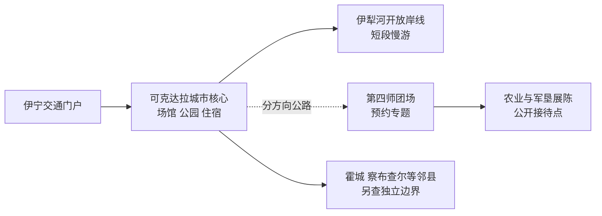
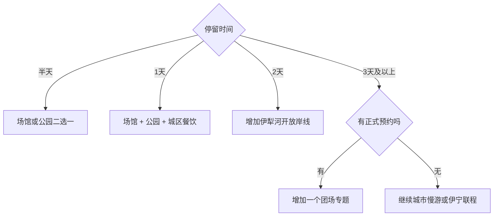

# 可克达拉旅行指南

可克达拉是新疆生产建设兵团第四师实行师市合一管理的县级市，城市核心位于伊犁河谷、伊宁市以西。首访适合用公共文化场馆、城市公园和伊犁河开放岸线理解新城与军垦历史；第四师团场分散在伊犁河谷多处，团场专题按独立方向安排。固定快照中的 **Ayxin Siri / GeoNames 1538358** 位于可克达拉市现行边界内，别名为爱新色里镇；该点与法定代码 `659008` 共同锚定本页。

> 建议停留：城市核心 1–2 天；团场专题另留 1 天  
> 旅行关键词：伊犁河谷、兵团新城、军垦文化、草原之夜、绿洲农业  
> 主要体力：城区低至中等，团场线以乘车和户外暴露为主  
> 最近研究：2026-09-03

## 城市速览

| 项目 | 旅行信息 |
|---|---|
| 主要旅行价值 | 用城市展示、公共公园与伊犁河谷空间认识第四师建城和“草原之夜”文化记忆，再选择一个团场了解农业与军垦生活 |
| 建议停留 | 1 天覆盖城市核心；2 天增加公开滨水和一项文化体验；团场或产业方向另留完整日 |
| 较舒适季节 | 春末至秋初适合河谷户外；花期、果期和秋色各有差异；冬季适合城市短线并关注冰雪路面 |
| 预算特点 | 公园和城市公共空间较易控制；跨团场车辆、体验、乡村餐饮与旺季住宿是主要增量 |
| 步行强度 | 新城街区和公园较平缓；完整滨水或团场线增加日晒、风和乘车时间 |
| 主要天气风险 | 大风、雷暴、强降雨、高温、寒潮和冰雪道路 |
| 独行旅行 | 城市核心便于自主安排；团场线先确认返程与接待 |
| 亲子旅行 | 公园、场馆和正规农业科普可组成低压力路线 |
| 长者与低体力旅行 | 采用车辆观城、一座场馆和一段平缓公园，减少连续滨水步行 |
| 无障碍信息 | 新城公共设施可优先询问无台阶入口；团场与自然空间的连续通行需向接待方确认 |

## 城市格局与游览区域

可克达拉城市核心以市民服务、公共文化和公园绿地为主，伊犁河及支流水系塑造了河谷景观。第四师团场散布于霍城、伊宁、新源等周边县市之间的非连续辖域，行政归属与旅行交通需要分别判断。

| 区域 | 主要内容 | 游览特点 | 与其他区域的关系 |
|---|---|---|---|
| 城市核心 | 公共文化场馆、城市轴线、广场与餐饮 | 平缓、服务集中，适合首次到访 | 与伊宁联系方便，可做团场线基地 |
| 城市公园与湖面 | 朱雀湖等公开公园、绿地与水景 | 适合早晚慢走，风和日晒影响明显 | 可与场馆同日组合 |
| 伊犁河开放岸线 | 河谷景观、湿地与公共游憩段 | 只选有管理与安全设施的开放段 | 水位、汛期和生态保护决定可走范围 |
| 第四师团场 | 军垦展陈、农业和聚落 | 距离与预约条件差异大 | 一日只选一个方向 |
| 相邻县市 | 伊宁、霍城、察布查尔等 | 拥有独立景区、住宿和交通 | 联游时按各自行政边界重新规划 |

## 主要景点

可克达拉是年轻城市，最有价值的体验来自城市空间、师市历史与河谷生活。具体场馆和活动以第四师可克达拉市公布的当期开放信息为准。

| 景点 | 区域 | 类型 | 主要看点 | 建议用时 | 室内外 | 体力 | 预约风险 | 天气影响 | 优先级 |
|---|---|---|---|---:|---|---|---|---|---|
| 可克达拉市公共文化与城市展示场馆 | 城市核心 | 文博、城市史 | 第四师历史、师市合一、新城建设和多民族河谷生活 | 1.5–3 小时 | 室内 | 低 | 高 | 低 | A |
| 朱雀湖及周边开放公园 | 城市核心 | 公园、水景 | 新城绿地、湖面和居民休闲 | 1.5–3 小时 | 室外 | 低 | 低 | 高 | A |
| “草原之夜”主题城市公共空间 | 城市核心 | 音乐文化、城市记忆 | 经典歌曲与可克达拉地名文化；活动和展演按当期公告 | 1–2 小时 | 混合 | 低 | 中 | 中 | B |
| 伊犁河开放滨水段 | 城市外围 | 河流、湿地 | 伊犁河谷地貌、夕照和季节生态 | 1.5–3 小时 | 室外 | 低至中 | 中 | 很高 | B |
| 第四师团场军垦文化展陈 | 指定团场 | 军垦史、聚落 | 团场建设、农业与日常生活；选择政府公布或正式预约点 | 半天至1天 | 混合 | 中 | 高 | 高 | C |
| 正规农业或食品产业体验 | 指定团场 | 农业、产业 | 果园、粮棉、薰衣草或食品加工背景；按接待项目选择 | 半天至1天 | 混合 | 中 | 高 | 高 | C |

伊犁河湿地、边境管理、农业生产、工厂仓储和水利设施均有明确边界。旅行使用公开岸线、正规道路和预约接待区，航拍与边境方向活动按属地规定执行。

## 美食与餐饮

可克达拉餐饮体现伊犁河谷的牛羊肉、面食、乳制品与时令果蔬。城市核心适合独行点单，团场餐饮更适合预约共享；进入清真餐饮场所时尊重门店标识与用餐习惯。

| 菜品或餐饮类型 | 常见区域 | 一个人用餐与常见份量 | 风味、过敏原与饮食限制 | 排队风险与替代方法 |
|---|---|---|---|---|
| 拌面、抓饭与汤饭 | 城市核心 | 一人一份方便，可问小份 | 小麦、牛羊肉和油脂；素食需确认汤底 | 午餐高峰错峰，备选居民区常规餐馆 |
| 烤肉、手抓肉 | 城区正餐区 | 按串数或重量点单 | 羊肉、孜然、盐和辣椒 | 晚餐高峰先问重量与出餐时间 |
| 馕与烤包子 | 市场、居民区 | 适合买小份搭配酸奶或茶 | 小麦、肉馅、芝麻、乳制品 | 选现做与标价清楚的门店 |
| 伊犁乳制品 | 城区与正规销售点 | 先尝小份 | 乳糖、牛奶蛋白和糖分 | 冷链条件清楚的包装产品更稳妥 |
| 时令瓜果与团场家常菜 | 团场、正规农产品点 | 果品小份购买，家常菜多人共享 | 清洗、糖分、坚果与肉类交叉接触 | 采摘和团餐提前预约，非产季改选正规门店 |

## 经典行程

### 一日经典路线

**路线**：公共文化与城市展示场馆 → 城区午餐 → 朱雀湖公园 → “草原之夜”主题公共空间。

- **串联逻辑**：先建立师市历史，再用公园和音乐文化理解新城生活。
- **预约锚点**：当日开放的博物馆、规划馆或文化馆。
- **休息安排**：场馆座席、午餐和公园遮阴点分段休息。
- **时间不足时**：保留场馆与朱雀湖，删除晚间活动。

### 两日城市路线

**第 1 天**：城市展示场馆 → 朱雀湖 → 城区晚餐  
**第 2 天**：伊犁河开放岸线短段 → 城区午休 → 文化活动或公园补充

- **串联逻辑**：第一天看建城，第二天看河谷自然环境。
- **预约锚点**：场馆、滨水开放段和文化活动。
- **休息安排**：第二天午后回城区避热与休息。
- **时间不足时**：第二天只保留一段安全滨水线。

### 三日深度路线

**第 1 天**：城市核心  
**第 2 天**：伊犁河开放岸线与公共公园  
**第 3 天**：一个预约团场的军垦或农业专题

- **串联逻辑**：城市、河流与团场分三种尺度理解第四师。
- **预约锚点**：第三天接待单位、地址、参观范围和车辆。
- **休息安排**：团场日在驻地或接待点完成补给。
- **时间不足时**：先删第三天，保留城市与河谷两条主线。

### 风沙、雷雨或冰雪路线

**路线**：开放的公共文化场馆 → 城区午餐 → 车辆短线观城 → 住宿处休息。

- **串联逻辑**：室内场馆与短距离移动降低天气暴露。
- **预约锚点**：场馆开放、道路和活动取消公告。
- **休息安排**：固定在城区室内空间。
- **时间不足时**：只保留一座场馆；预警期间取消滨水、农业和长途团场线。

### 亲子或低体力路线

**亲子路线**：城市展示场馆 → 午休 → 朱雀湖短线。  
**低体力路线**：车辆观城 → 公共文化场馆 → 靠近落客点的公园平台。

- **串联逻辑**：亲子线突出新城科普，低体力线减少久站与长距离步行。
- **预约锚点**：儿童活动、无障碍入口、电梯、卫生间和休息座椅。
- **休息安排**：午间固定休息，户外只走平缓短段。
- **时间不足时**：两线都保留场馆，删除公园延伸。

### 团场一日路线

**路线**：城市核心出发 → 已预约团场展陈 → 正规农业体验 → 团场驻地午餐 → 返回。

- **串联逻辑**：一次只看一个团场，把交通和交流时间留足。
- **预约锚点**：接待主体、生产安全、车辆和返程。
- **休息安排**：在团场驻地或接待点完成饮水与用餐。
- **时间不足时**：保留展陈，删除生产体验；无预约时改为城市慢游。

### 伊宁联程路线

**路线**：可克达拉城市核心 → 当晚返回或前往伊宁住宿 → 次日使用伊宁独立路线。

- **串联逻辑**：两城相近但拥有独立行政边界、景点和住宿体系。
- **预约锚点**：城际交通、住宿和次日场馆。
- **休息安排**：跨城后先入住和用餐，再安排夜间活动。
- **时间不足时**：只完成可克达拉城市核心，伊宁留到下一天。

## 住宿区域

| 区域 | 优点 | 缺点 | 适合人群 | 交通特点 |
|---|---|---|---|---|
| 可克达拉城市核心 | 接近公共文化、公园和城市服务 | 酒店数量与旺季房态需当期比较 | 城市首访、两日慢游 | 去伊宁和团场都需车辆 |
| 伊宁主城 | 航空、铁路、餐饮和住宿选择更多 | 每天往返会增加时间 | 伊犁河谷多城联游者 | 订车时写清可克达拉具体地址 |
| 已预约团场驻地 | 贴近军垦或农业专题 | 接待和夜间服务有限 | 自驾、专题旅行 | 先确认住宿登记、餐饮和加油 |
| 霍城方向 | 便于西向联程 | 与可克达拉城市核心不是同一住宿单元 | 计划霍尔果斯或霍城续行者 | 按跨县市路线核算时间 |

## 市内交通

| 场景 | 建议与取舍 | 行前需要重查的内容 |
|---|---|---|
| 从伊宁抵达 | 自驾、出租或当期城际客运均可 | 上下车点、班次、叫车范围和夜间抵达 |
| 城市核心移动 | 步行配合出租车适合场馆与公园 | 场馆入口、道路施工和活动交通组织 |
| 伊犁河岸线 | 车辆到达正式入口后走短段 | 水位、汛期、道路、停车和开放边界 |
| 团场方向 | 自驾或合规包车最便于锁定返程 | 接待地址、道路、加油、通信和返程 |
| 航空与铁路 | 主要使用伊宁机场和伊宁站 | 航班、车次、机场接驳和异地还车 |

## 不同旅行者须知

| 旅行维度 | 可行条件 | 主要取舍 | 需额外核对 |
|---|---|---|---|
| 独行旅行 | 住城市核心或伊宁，每天一个方向 | 团场和滨水远端返程选择少 | 车辆、末班、住宿登记和通信 |
| 亲子旅行 | 场馆、公园和正规农业科普 | 临水、日晒和长途乘车增加看护负担 | 护栏、儿童活动年龄、卫生间和防晒 |
| 长者或低体力旅行 | 车辆观城加一座场馆 | 久站、温差和团场乘车累积负担 | 座椅、电梯、落客点和医疗条件 |
| 无障碍需求 | 优先选择新城公共设施 | 滨水与团场通行资料较少 | 坡道、电梯、无障碍卫生间和陪同 |
| 摄影旅行 | 新城、湖面和河谷题材集中 | 风、强光与生态边界影响机位 | 三脚架、无人机、商业拍摄和边境规定 |
| 预算有限 | 公园和公共场馆组成城市一日线 | 团场包车和异地住宿成本高 | 场馆免费范围、客运与退改 |
| 晚出发或紧凑行程 | 选一座场馆或朱雀湖短线 | 团场与河岸长线需完整白天 | 最晚开放、日落和夜间交通 |
| 特殊天气或自然条件 | 室内场馆作为替代 | 风沙、雷暴、洪水与冰雪改变户外路线 | 气象、水利、交通与应急公告 |

## 行前核对

| 核对事项 | 为什么需要重查 | 建议核对时间 | 官方入口 |
|---|---|---|---|
| 场馆、公园与文化活动 | 年轻城市的开放场馆和活动安排变化较快 | 排入路线前及前一日 | [第四师可克达拉市人民政府](http://www.cocodala.gov.cn/) |
| 团场接待与行政边界 | 非连续辖域使地址、归属与交通需逐项确认 | 预约和订车时 | [第四师可克达拉市人民政府](http://www.cocodala.gov.cn/)；[新疆生产建设兵团](https://www.xjbt.gov.cn/) |
| 伊犁河水位与开放岸线 | 汛期、生态保护和工程管理会调整可走范围 | 出发前三日及当天 | 师市政府、水利与应急官方渠道 |
| 城际与团场交通 | 班次、道路、加油和返程具有时效性 | 出发前一周及当天 | [新疆交通运输厅](https://jtyst.xinjiang.gov.cn/) |
| 大风、雷暴与冰雪 | 河谷天气影响户外、航班和道路 | 出发前三日及当天 | [新疆气象局](http://xj.cma.gov.cn/) |

## 来源与更新记录

### 主要来源

| 来源 | 类型 | 支持内容 | 核验日期 |
|---|---|---|---|
| [民政部行政区划查询](https://dmfw.mca.gov.cn/xzqh/getList?code=65&trimCode=true&maxLevel=3) | 国家行政区划 | 可克达拉市法定县级市身份与代码 `659008` | 2026-09-03 |
| [第四师可克达拉市人民政府](http://www.cocodala.gov.cn/) | 师市政府 | 师市结构、团场动态、公共服务与旅行公告入口 | 2026-09-03 |
| [新疆生产建设兵团](https://www.xjbt.gov.cn/) | 兵团政府 | 第四师及兵团城市管理关系 | 2026-09-03 |
| [新疆文化和旅游厅](https://wlt.xinjiang.gov.cn/) | 自治区文旅部门 | 公共文化、景区与旅游动态入口 | 2026-09-03 |
| [新疆交通运输厅](https://jtyst.xinjiang.gov.cn/) | 交通部门 | 伊犁河谷公路、施工与交通信息 | 2026-09-03 |
| [GeoNames 1538358](https://www.geonames.org/1538358/) | 固定开放数据 | Ayxin Siri／爱新色里名称、坐标与人口点类型 | 2026-09-03 |

### 更新记录

| 日期 | 更新内容 |
|---|---|
| 2026-09-03 | 首次完成资料研究；建立城市核心—伊犁河—团场三层路线，并明确非连续辖域、邻县市、边境、湿地和生产空间边界 |
