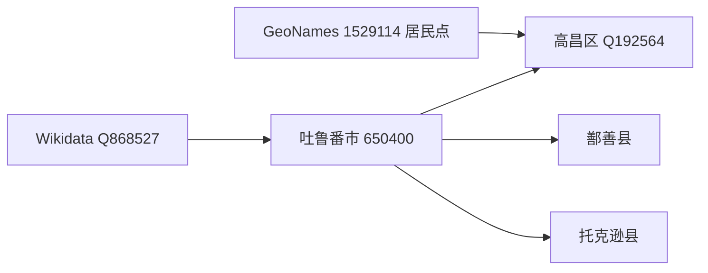
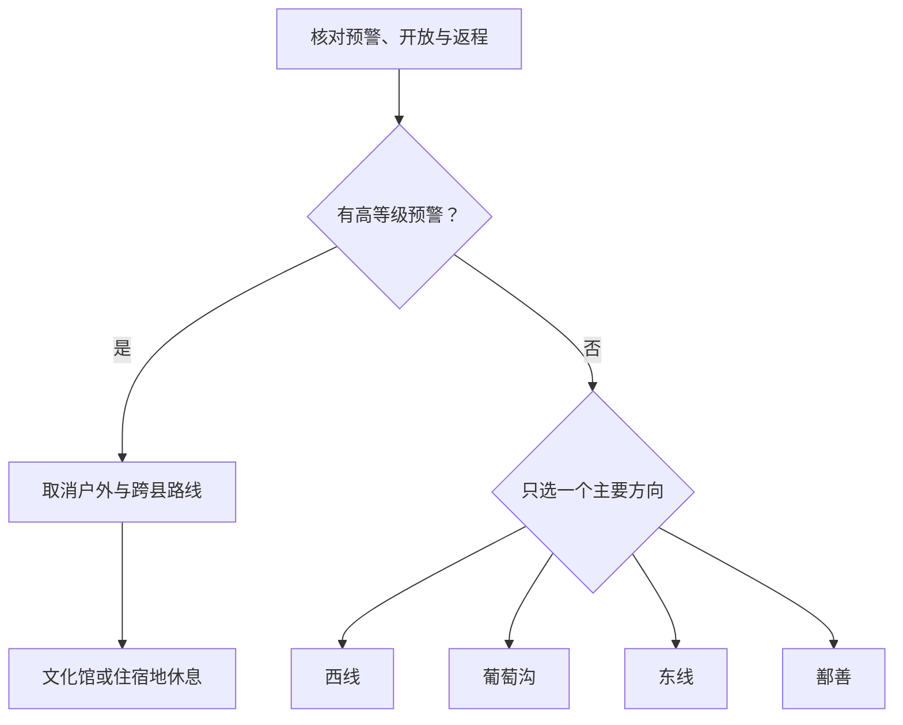

# 吐鲁番旅行指南

吐鲁番市是行政区划代码为 **650400** 的地级市，下辖高昌区、鄯善县和托克逊县。多数首访路线实际集中在高昌区：交河故城、坎儿井、葡萄沟、火焰山和高昌故城之间需要车辆串联；鄯善县的吐峪沟、库木塔格沙漠以及托克逊县方向都应作为独立县域模块。这里的核心取舍不是“多塞几个景点”，而是给极端高温、大风、遗址步行和跨县车程留足余量。

> 建议停留：高昌区 2 天；增加鄯善县至少另留 1 天；托克逊县另作独立安排 
> 旅行关键词：丝路遗址、坎儿井、葡萄绿洲、火焰山、荒漠高温 
> 主要体力：中等至较高；遗址裸露、车程分散，夏季热负荷很高 
> 最近研究：2026-08-12

## 城市速览

| 项目 | 旅行信息 |
|---|---|
| 主要旅行价值 | 以交河故城和高昌故城理解丝绸之路城市遗址，以依法开放的坎儿井参观点认识绿洲水利，再用葡萄沟、火焰山和鄯善荒漠观察绿洲与盆地地貌。 |
| 建议停留 | 1 天只能选择高昌区西线与葡萄沟；2 天增加火焰山—高昌故城；3 天再单列鄯善县。托克逊县不与鄯善县压成同一日。 |
| 较舒适季节 | 春秋通常较利于遗址步行，但仍可能有大风、沙尘和显著温差；盛夏可持续极端高温，必须把裸露遗址放在清晨，把正午留给室内、用餐和休息。 |
| 预算特点 | 市区餐饮和公共文化成本较低；车辆包用、跨县往返、景区接驳和司机等候是主要增量。只比较门票会低估整日交通成本。 |
| 步行强度 | 葡萄沟和城市公共文化可缩成短段；交河、高昌等土遗址路面裸露、遮阴少且可能有坡坎，火焰山和沙漠还叠加强日照、热地表与风沙。 |
| 主要天气风险 | 极端高温、大风、沙尘、低能见度、短时强降雨、山洪和局地崩塌泥石流；百里风区道路及火焰山沟谷的风险不能用主城天气代替。 |
| 独行旅行 | 高昌区成熟景点可用已确认的公交、旅游巴士或合规车辆串联；跨县和晚间返程不要依赖现场临时拼车，出发前锁定接应、等候和取消条件。 |
| 亲子旅行 | 坎儿井正式展陈、葡萄沟短线和公共文化空间较容易减负；遗址边缘、渠道井口、沙丘、游乐项目和高温地表需要持续看护，并逐项核对年龄与安全规则。 |
| 长者与低体力旅行 | 优先一处室内公共文化点、一处有正式接驳的景区和车辆观景；不因景区有摆渡车就推定从落客点到核心游线全程少步行。 |
| 无障碍信息 | 吐鲁番北站有电梯及重点旅客服务，交河故城有个案式轮椅和电动车协助、较早资料提及无障碍卫生间；这些证据不能证明遗址形成连续无障碍链，仍需逐点确认。 |

开放地名资料中，**GeoNames 1529114** 是名为 `Turpan` 的居民点，类别为 `PPLA2`；Wikidata 又将该编号关联到 **Q192564 高昌区**。法定地级吐鲁番市使用 **Wikidata Q868527**、行政代码 **650400**，其 GeoNames 属性 **P1566** 为 `1529113`。因此 1529114 只定位高昌主城居民点，不能代表吐鲁番全市；居民点、原县级吐鲁番市、高昌区和现地级吐鲁番市不能互相替代。

截至 2026 年 8 月 12 日，吐鲁番博物馆仍应按闭馆处理：官方公告称其自 2025 年 8 月 25 日起闭馆改造，恢复开放另行公告；2026 年 4 月项目报道只写“预计国庆前”开放，不能替代正式复馆公告。阿斯塔那古墓群则由市文物局明确公告于 2026 年 1 月 16 日至 9 月 30 日暂停开放。两处都不进入当前默认路线。

## 城市格局与游览区域

吐鲁番的旅行空间适合分成高昌主城、西部交河—坎儿井走廊、北部葡萄沟、东部火焰山—高昌故城、鄯善县和托克逊县六个尺度。2025 年旅游巴士小环线曾把吐鲁番北站、坎儿井、交河故城、博物馆和葡萄沟串在一条线上，可用来理解西线与主城的空间关系；它不是 2026 年固定班次承诺，必须出发前重新确认。

| 区域 | 主要内容 | 游览特点 | 与其他区域的关系 |
|---|---|---|---|
| 高昌主城 | 吐鲁番市文化馆、正规市场与葡萄夜市等城市生活节点 | 适合作为住宿、午间避暑、用餐和交通基地；博物馆闭馆期间室内替代有限 | 吐鲁番北站、机场、老吐鲁番站不是同一地点；主城只是地级市中心，不代表全市景点可步行 |
| 西部雅尔—交河走廊 | 交河故城、依法开放的坎儿井游客点 | 历史遗址与水利展陈方向相近，可用半日至一日；井渠、农田和居民生产空间边界清晰 | 可与主城或葡萄沟组合，夏季先去裸露遗址再进室内或树荫区域 |
| 北部葡萄沟 | 葡萄沟景区、葡萄种植与正式接待空间 | 绿洲、葡萄文化和较多遮阴，但仍有商业项目、村落、果园与渠道 | 适合高温日较晚时段；不进入私人院落、未开放葡萄园、晾房或灌溉设施 |
| 东部火焰山—高昌走廊 | 火焰山景区、高昌故城、阿斯塔那古墓群 | 地表与遗址暴露度高，宜独立一天早出；阿斯塔那当前停开 | 与西线同日会增加往返和热暴露；只走正式景区入口，不进入矿区、沟谷和文保缓冲区 |
| 鄯善县模块 | 吐峪沟、库木塔格沙漠及鄯善县城服务 | 县域尺度，文化村落与沙漠环境规则不同；至少单列一日，稳妥做法是在鄯善过夜 | 鄯善是吐鲁番市所辖普通县，不是高昌区远郊街区；到达与返程按县城、景区入口分别核算 |
| 托克逊县模块 | 托克逊县城、风区、农业绿洲及经官方确认开放的县域点位 | 与高昌、鄯善方向不同，大风、道路、生产用地和返程条件更重要 | 托克逊是吐鲁番市所辖普通县；没有稳定开放证据的矿山、电力、水利和农业生产空间不列入路线 |

2015 年原吐鲁番地区撤销、设立地级吐鲁番市，原县级吐鲁番市同时撤销并设高昌区。高昌区是现今中心城区和主要首访景点集中地，却不是地级市的同义词。全市约 7 万平方公里的法定范围还包括鄯善、托克逊两个普通县；县域景点可以进入这份地级市指南，但必须按真实入口、单程车时和住宿拆成模块，不能标成“市区顺路”。

坎儿井同时是文化遗产、水利工程和仍可能发挥输水作用的生产系统。只进入正式开放的展陈、游客通道和运营入口，不靠近竖井、不沿暗渠寻找“野生入口”，不跨越围栏进入水源地、农田或维护道路。交河、高昌、阿斯塔那等遗址则以文物部门开放边界为准；土遗址墙体、考古区和封闭段不得攀爬或抄近路。

## 主要景点

优先级用于安排行程，不代表绝对排名：**A** 为首访核心，**B** 为按兴趣补充，**C** 为跨县、季节性或当前不可用的目的地。交通站点、夜市和关闭地点可标为“路线节点”；同一景区内部的展馆、沟谷、民居和商业体验不重复拆成多个景点。

### 高昌区西线、主城与葡萄沟

| 景点 | 区域 | 类型 | 主要看点 | 建议用时 | 室内外 | 体力 | 预约风险 | 天气影响 | 优先级 |
|---|---|---|---|---:|---|---|---|---|---|
| 交河故城 | 雅尔镇方向 | 世界文化遗产组成部分、土遗址 | 台地上的城市遗址格局、街巷和建筑遗存；从正式入口理解遗址与河谷地貌 | 2–3 小时 | 室外 | 中至高 | 中；票务、摆渡和讲解需确认 | 很高；高温、大风、沙尘和降雨均影响 | A |
| 坎儿井正式游客点 | 交河—主城西部走廊 | 水利遗产与展陈 | 竖井、暗渠、明渠和绿洲灌溉原理；只选择主管部门或正规运营方明确开放的入口 | 1.5–2.5 小时 | 混合 | 低至中 | 中；具体园区、展陈与开放段需确认 | 中；高温影响外部段，大雨影响井渠安全 | A |
| 葡萄沟景区 | 高昌区北部 | 绿洲景区与生活生产社区 | 葡萄种植、绿荫沟谷、民族文化和正式经营体验 | 2–4 小时 | 混合 | 中 | 中至高；项目、接驳、演出和采摘的变动风险较高 | 中至高；高温、强风、降雨影响户外 | A |
| 吐鲁番市文化馆 | 高昌主城 | 公共文化空间 | 博物馆闭馆期间可优先核对的室内公共文化与活动空间 | 1–2.5 小时 | 室内 | 低 | 中；开放日、活动和入场方式需确认 | 低；极端天气可能临时调整 | B／路线节点 |
| 吐鲁番博物馆（闭馆改造） | 高昌主城 | 综合博物馆 | 吐鲁番历史、考古与文物收藏；截至研究日尚无正式复馆公告 | 当前不安排 | 室内 | 未知 | 很高；必须等正式复馆公告 | 低；施工和运营状态为决定因素 | C／当前关闭 |
| 葡萄夜市 | 高昌主城 | 季节性夜间餐饮节点 | 抓饭、烤肉等当地餐食与城市夜间生活；具体摊位和经营季每年变化 | 1–2 小时 | 混合 | 低至中 | 中；季节、活动和营业需确认 | 高温、大风和降雨影响明显 | 路线节点 |

### 火焰山、高昌故城与文物保护线

| 景点 | 区域 | 类型 | 主要看点 | 建议用时 | 室内外 | 体力 | 预约风险 | 天气影响 | 优先级 |
|---|---|---|---|---:|---|---|---|---|---|
| 火焰山景区 | 高昌区东部 | 荒漠地貌景区 | 火焰山地貌、盆地极端热环境和正式开放观景区 | 1.5–3 小时 | 室外为主 | 中 | 中；入口、项目和交通需确认 | 很高；极端高温、大风、沙尘均可取消 | A |
| 高昌故城 | 高昌区三堡乡方向 | 世界文化遗产组成部分、土遗址 | 古城格局、宗教建筑和丝路交通历史；仅走开放游线 | 2–3 小时 | 室外 | 中至高 | 中；票务、摆渡和开放段需确认 | 很高；高温、大风、沙尘和降雨影响 | A |
| 阿斯塔那古墓群（暂停开放） | 高昌区东部 | 全国重点文物保护单位、墓葬遗址 | 吐鲁番古代墓葬与出土文化背景；2026 年 9 月 30 日前官方暂停开放 | 当前不安排 | 室内外混合 | 未知 | 很高；复开另行公告 | 施工、保护和天气共同影响 | C／当前关闭 |

火焰山并不是可自由穿越的整片红色山体。景区外沟谷、铁路、公路、采矿、电力和其他生产设施各有管理边界；高温日也不能为了避开售检票而把非开放沟口当成替代观景点。阿斯塔那即使在公告期结束后，也只有文物部门正式发布恢复开放信息才可重新排入路线。

### 鄯善县与跨县模块

| 景点 | 区域 | 类型 | 主要看点 | 建议用时 | 室内外 | 体力 | 预约风险 | 天气影响 | 优先级 |
|---|---|---|---|---:|---|---|---|---|---|
| 吐峪沟景区及麻扎村公开游线 | 鄯善县吐峪沟乡 | 历史村落、峡谷与生活社区 | 村落格局、峡谷环境和依法开放的文化展示；宗教与居民生活优先于游览 | 2–4 小时 | 混合 | 中 | 高；开放区、拍摄、交通和活动需确认 | 很高；高温、山洪、落石和大风影响 | B |
| 库木塔格沙漠景区 | 鄯善县城南侧 | 沙漠景区 | 城市边缘沙丘景观与正式运营游线 | 3–5 小时 | 室外 | 中至高 | 中；项目、接驳和设备规则需确认 | 很高；高温、强风、沙尘和低能见度可取消 | A／跨县 |
| 艾丁湖方向正式开放点 | 高昌区南部方向 | 盆地与盐湖环境 | 低洼盆地、盐碱地和荒漠景观；只在正式入口与接待均确认时前往 | 条件满足时半日至一日 | 室外 | 中 | 很高；稳定开放边界与服务需确认 | 很高；高温、风沙、积水和道路影响 | C／条件式路线节点 |

吐峪沟既有遗产、宗教与居民生活，也有山洪和地灾风险。只走标示游线和对外开放院落，拍摄居民、礼拜活动、住宅内部或作坊前先取得同意。库木塔格只使用景区正式交通和开放沙丘，不翻越围栏进入无人管理区域；极端高温或风沙预警时，已购票和已到县城都不是继续进入的理由。

## 美食与餐饮

吐鲁番餐饮应围绕菜品、季节和正规经营区域选择，不把节庆报道中的单一店铺当成长期唯一答案。高昌主城和葡萄夜市适合寻找主食与烤肉，葡萄沟及乡村经营点则适合在确认接待后体验葡萄、桑葚等物产；果园、晾房、加工区和居民院落并不自动提供餐饮或参观。

| 菜品或餐饮类型 | 常见区域 | 一个人用餐与常见份量 | 风味、过敏原与饮食限制 | 排队风险与替代方法 |
|---|---|---|---|---|
| 抓饭 | 高昌主城、正规市场和夜市 | 通常一人一盘，油脂与肉量可能较足，可先问小份 | 常见羊肉、胡萝卜和米；素食者需问肉汤、动物油和共锅 | 午餐或活动高峰可能售罄；改选附近明码标价的正规餐馆 |
| 烤肉与馕坑肉食 | 主城、夜市与景区正规餐饮点 | 烤串可少量加点，大块肉先问重量、计价和主食 | 牛羊肉、孜然、盐和辣椒常见；可能接触芝麻和小麦 | 晚餐时段排队；不要只追一家热门摊位，可比较同类经营点 |
| 黄面配烤肉 | 高昌主城及火焰山方向正规餐馆 | 通常一人一份，肉可另点；先问是否能做少辣 | 面条含小麦麸质，调味可能含辣椒、蒜和芝麻 | 午餐高峰等待；以卫生、菜单和价格清楚的同类店替代 |
| 拌面、汤面与鸡肉餐 | 全城正规餐馆 | 主食份量通常较足，鸡肉菜可能适合多人共享 | 含小麦麸质；鸡肉、汤底、辣度和是否带骨需确认 | 翻台通常快；偏远景区不保证随时供餐，提前备水和合规简餐 |
| 馕、烤包子与面点 | 打馕店、市场和餐馆 | 馕可分食，烤包子可按个少量尝试 | 含小麦麸质，常见牛羊肉、洋葱、芝麻，可能接触奶蛋 | 出炉时段会排队；选择现制和储存条件清楚的替代店 |
| 葡萄、葡萄干与葡萄制品 | 葡萄沟、主城市场和正规商店 | 鲜果按实际食用量购买，果干注意净含量和储存 | 天然糖分较高；加工品可能另含糖、奶、坚果或添加物 | 上市期和品种每年不同；不进入私人果园采摘，改在正规销售点购买 |
| 桑葚、瓜果与果宴类餐食 | 主城、景区正规经营点和季节活动 | 小份尝试，果宴通常多人共享且需预约 | 糖分较高；加工饮品、糕点和菜肴可能含奶、蛋、坚果或酒精 | 强季节性；没有当期菜单时不把节庆名称当固定供应 |
| 奶茶、酸奶与干果 | 主城餐饮和正规市场 | 可单杯、小份或少量称重 | 乳制品含乳糖；干果区可能接触核桃、杏仁等坚果 | 选择配料和冷藏标识清楚的经营点，不买久置散装食品 |

当地清真餐饮和民族生活是日常文化，不是供游客表演的背景。遵守经营场所关于酒类、吸烟、拍摄和空间使用的提示；纯素、麸质过敏、乳糖不耐或坚果过敏者应询问汤底、油脂、馅料、调味与共用厨具，不能只凭菜名推断。

## 经典行程

### 一日高昌经典路线

**路线**：清晨交河故城 → 坎儿井正式游客点 → 高昌主城室内午餐与完整休息 → 傍晚葡萄沟 → 葡萄夜市或主城晚餐

- **串联逻辑**：先完成遮阴最少的交河故城，再进入坎儿井展陈和午间室内空间；葡萄沟放到日照较弱时段。西线与北线可由同一车辆串联，不增加东部遗址。
- **预约锚点**：交河故城售检票、摆渡与开放段，具体坎儿井园区，以及葡萄沟接驳和夜市当季营业；2025 年旅游巴士只作线路参考，2026 年班次另查。
- **休息安排**：正午在高昌主城至少安排一段完整制冷休息，少量多次补水；不要把车辆停留当成唯一降温措施。
- **时间不足时**：先删夜市，再缩短葡萄沟商业项目；若上午因高温或交通延误，只保留交河与一个坎儿井点，不把闭馆博物馆作为替代。

### 两日遗址与绿洲路线

**第 1 天**：交河故城 → 坎儿井正式游客点 → 主城午休 → 葡萄沟 → 主城晚餐

**第 2 天**：清晨火焰山景区 → 高昌故城 → 正式游客服务点午餐与休息 → 返回吐鲁番市文化馆或住宿地

- **串联逻辑**：第一天处理高昌区西、北两条绿洲线，第二天只走东部裸露地貌与遗址；不在东线加停开的阿斯塔那，也不跨入鄯善。
- **预约锚点**：四个景区的入口、摆渡、最晚入园和车辆；第二天需先确认火焰山、高昌故城均开放，任一关闭时不去非开放沟谷或遗址外围寻找替代。
- **休息安排**：两天都把 12 时前后留作室内或有可靠制冷的服务区休息；司机也应有等候和休息安排。
- **时间不足时**：第一天按一日路线删减；第二天优先保留高昌故城，火焰山只在时间、天气与体力允许时加入，或反向根据个人兴趣二选一。

### 三日高昌与鄯善路线

**第 1 天**：交河故城 → 坎儿井正式游客点 → 主城休息 → 葡萄沟

**第 2 天**：火焰山景区 → 高昌故城 → 主城长休与晚餐

**第 3 天**：高昌区或鄯善县城出发 → 吐峪沟公开游线 → 正式餐饮与休息 → 库木塔格沙漠景区 → 鄯善县城住宿或按约定车辆返程

- **串联逻辑**：前两天留在高昌区，第三天才进入鄯善县；吐峪沟与库木塔格同属鄯善模块，但仍要按路况、热负荷和沙漠最晚入园决定能否同日完成。
- **预约锚点**：第三天首先确认吐峪沟开放边界、村落交通与拍摄规则，再确认库木塔格项目、摆渡、天气停运和返程；稳妥方案是在鄯善住宿。
- **休息安排**：吐峪沟结束后在正规餐饮或县城安排长休，把沙漠放在温度下降后；不在路肩、河沟、农田或村民院落休息。
- **时间不足时**：第三天在吐峪沟与库木塔格之间二选一；不能把两处压缩后再夜间赶回高昌，更不临时增加托克逊方向。

### 极端高温、大风或沙尘调整路线

**路线**：住宿地等待官方预警更新 → 吐鲁番市文化馆等已确认开放的室内点 → 室内午餐与休息 → 预警解除且温度可承受时选择葡萄沟短段；否则返回住宿地

- **串联逻辑**：把可取消性放在首位，避免用长途乘车进入更暴露的遗址、沙漠和风区；文化馆也只有在当日正常开放时使用。
- **适用条件**：普通炎热可调整到早晚；高等级高温、大风、沙尘、雷暴、山洪或地灾预警时，交河、高昌、火焰山、艾丁湖、吐峪沟、库木塔格和跨县道路整段取消。
- **预约锚点**：文化馆开放、主城交通和住宿延住；博物馆仍在闭馆改造期间，不能作为雨天或高温备用。
- **休息安排**：以有可靠制冷、饮水和卫生间的室内空间为主；出现头晕、恶心、痉挛、意识异常等热相关症状时立即停止行程并求助。
- **时间不足时**：只保留一顿室内用餐和必要交通；不因行程最后一天而在预警期“快速打卡”户外点。

### 亲子或低体力路线

**亲子路线**：坎儿井正式展陈 → 室内午餐与长休 → 葡萄沟短线 → 返回主城

**低体力路线**：吐鲁番市文化馆 → 车辆到葡萄沟可确认的短段 → 主城休息；交河故城只在确认电动车、轮椅协助与核心游线条件后替换葡萄沟

- **串联逻辑**：两条路线都只保留一个知识点和一个绿洲点；亲子路线避开井口、渠道和沙丘，低体力路线不把土遗址摆渡车等同于连续平整路面。
- **减负方式**：儿童逐项核对护栏、游乐项目、车上安全和饮水；低体力旅行者逐点确认落客距离、轮椅装载、坡道、卫生间、遮阴和返程车辆。
- **预约锚点**：坎儿井具体园区、葡萄沟接驳、文化馆开放；若选交河，另向景区确认轮椅、电动车协助的适用对象、路线和等候方式。
- **休息安排**：正午长休，每个户外点只走短段；陪同者也要避免在高温停车场长时间等候。
- **时间不足时**：删除葡萄沟，只保留正式展陈和室内用餐；任何人出现热不适时立即结束。

### 鄯善独立一日路线

**路线**：鄯善县城早出发 → 吐峪沟公开游线 → 县城或正式服务点午餐与休息 → 库木塔格沙漠景区 → 鄯善县城住宿

- **串联逻辑**：从鄯善县城出发和结束，减少高昌区当天往返；村落文化与沙漠景观各用半天，不增加高昌故城或托克逊点位。
- **适用条件**：两处开放、道路、车辆、温度、风力、能见度和住宿均确认；极端高温、强风、沙尘、雷暴或山洪预警时整段取消。
- **预约锚点**：吐峪沟开放范围、讲解或活动、库木塔格接驳和项目、县城住宿及车辆；不使用未经许可的村内向导或沙漠车辆。
- **休息安排**：正午回到有制冷的县城或正式服务区，带足饮水、防晒与防风用品；不在峡谷口、沙丘背风处或车辆内硬扛高温。
- **时间不足时**：两处二选一，并仍回到鄯善县城；不夜间穿越风区赶往托克逊或乌鲁木齐。

## 住宿区域

| 区域 | 优点 | 缺点 | 适合人群 | 交通特点 |
|---|---|---|---|---|
| 高昌主城中心 | 餐饮、市场、公共文化和叫车较集中，适合作为两条高昌线路的基地 | 到交河、葡萄沟、火焰山和高昌故城均需车辆；博物馆闭馆减少室内备选 | 首访、独行、重视晚餐与午休者 | 适合分方向约车；订房时确认制冷、夜间前台和实际落客位置 |
| 吐鲁番北站—交河方向 | 便于高铁到发及西线起步，可减少赶早车或交河日穿城 | 餐饮和夜间生活未必有主城集中；北站、机场和老吐鲁番站仍不是同一点 | 铁路中转、早班车、西线优先者 | 先核对酒店到站距离和接送，不以“近车站”宣传代替地图门牌 |
| 葡萄沟正规住宿点 | 便于傍晚与清晨体验绿洲，减少正午户外 | 住宿资质、餐饮、车辆、商业项目和季节运营差异大 | 慢游、摄影、已确认景区内接待者 | 依赖景区交通或约定车辆；不住私人院落或生产晾房的非正规房源 |
| 鄯善县城 | 便于吐峪沟与库木塔格分开游览，降低高昌往返压力 | 与高昌区核心景点分离，跨县换住增加行李和交通成本 | 鄯善完整一日、沙漠早晚时段旅行者 | 铁路、公路和景区接驳分别核对；县城、车站和景区入口不是同一点 |
| 托克逊县城 | 只适合已确认托克逊县域安排或区域交通衔接 | 对高昌和鄯善首访景点不便利，遇大风时替代活动有限 | 托克逊专题、需要分段公路行程者 | 百里风区与道路状况优先；不把生产园区或路边设施当住宿地 |

夏季住宿的可靠制冷、停电应对、饮水、遮光和夜间前台比“景观房”更重要。预订乡村、景区或跨县住宿时，还要确认正规登记、餐食、热水、卫生间、停车、行李和返程；国际旅行者另行确认住宿登记能力。

## 市内交通

吐鲁番北站是高铁主要到达点，吐鲁番站是另一座既有铁路车站，两者不能互换；吐鲁番交河机场又是独立到达节点。高昌区景点分散，没有一条稳定公共线路能替代所有接驳，宜按“西线、北线、东线”分别锁定车辆。鄯善和托克逊是跨县移动，不是市区公交延伸。

| 场景 | 建议与取舍 | 行前需要重查的内容 |
|---|---|---|
| 从吐鲁番北站抵达 | 使用当期公交、出租车、合规网约车或住宿接送进入主城；重点旅客可提前申请铁路服务 | 到发车次、出站口、电梯、爱心服务、公交首末班、夜间叫车和道路施工 |
| 从吐鲁番站抵达 | 先确认票面站名和到主城接驳，不把吐鲁番站与吐鲁番北站当作同站换乘 | 实际到站、公交或出租车、晚间候车、行李和极端天气延误 |
| 从吐鲁番交河机场抵达 | 按机场、航空公司或市交通部门当期信息选择接驳；空铁联程仍需预留地面换乘 | 航线、航站楼、机场巴士、出租车上客点、安检和航班延误 |
| 高昌区西线与葡萄沟 | 公交或旅游巴士只有在当期官方确认后使用；多人、低体力或紧凑行程可比较合规车辆 | 线路、站点、首末班、景区停靠、通票、车辆资质和返程 |
| 火焰山—高昌故城东线 | 以已约车辆或正式运营接驳为主，早出并把两处作为当日唯一方向 | 景区开放、单程车时、百里风区、道路管制、司机等候和最晚返程 |
| 前往鄯善或托克逊 | 优先铁路或正规公路客运到县城，再处理最后一段；包车应写清等候、跨县和取消费用 | 实际车站、班次、景区入口、县域道路、住宿、风区、返程和司机资质 |
| 自驾 | 能减少换乘，但极端热、强侧风、沙尘、低能见度与长直道路会增加驾驶负担；不驶入文保、矿业、水利或农业便道 | 租车资质、保险、燃油充电、停车、限速、封路、轮胎和高温车辆故障应对 |

铁路、民航、住宿和部分景区实行实名制，应携带有效身份证件。景区宣传车、旅游小环线、航线和公路临时管制都具有时效性；只有当期运营方或主管部门公告能支持具体班次、票价和停靠点。

## 不同旅行者须知

| 旅行维度 | 可行条件 | 主要取舍 | 需额外核对 |
|---|---|---|---|
| 独行旅行 | 高昌主城与成熟景区可分方向安排 | 单人跨县包车成本高，偏远点与夜间返程容错低 | 合规车辆、末班交通、司机等候、住宿前台和紧急联系人 |
| 亲子旅行 | 坎儿井正式展陈、葡萄沟短线和公共文化活动可按年龄选择 | 井渠、遗址边缘、沙丘、游乐车和高温地表增加看护负担 | 护栏、推车、儿童票、身高年龄、饮水、卫生间和安全座椅 |
| 长者或低体力旅行 | 一处室内点加车辆接驳的葡萄沟短段容易减量 | 遗址裸露、摆渡后仍步行、跨县车程与高温会累积疲劳 | 落客点、座椅、遮阴、轮椅、电动车、卫生间和返程车辆 |
| 无障碍需求 | 北站有电梯与重点旅客服务，交河有个案式协助和无障碍卫生间证据 | 个案服务与单项设施不等于车站—车辆—景区—核心游线连续通行 | 轮椅装载、坡度、门宽、碎石土路、卫生间、陪同和撤离需逐段确认 |
| 摄影旅行 | 正式开放遗址、葡萄沟和沙漠游线题材差异大 | 正午强光、风沙、热浪和器材负担明显；文物、居民和生产空间限制更多 | 人像同意、三脚架、闪光灯、无人机、商业拍摄和文保规定 |
| 预算有限 | 主城用餐、公共文化和同方向拼合可控制成本 | 为单一远点包车和跨县换住最易超支 | 公交或旅游巴士当期运营、门票、拼车资质、退改和隐藏费用 |
| 晚出发或紧凑行程 | 只选葡萄沟、吐鲁番市文化馆或一处正规餐饮区 | 不临时去交河、高昌故城、火焰山、鄯善或托克逊 | 最晚入园、日落、末班交通、夜市营业和返程 |
| 极端高温、大风或沙尘 | 预警较低且交通正常时，可把户外压缩到清晨和傍晚 | 高等级预警时取消遗址、荒漠、沟谷和跨县线路，车辆空调不能消除户外风险 | 温度实况、风力、能见度、地灾预警、道路管制、停电和退改 |
| 强降雨、山洪或地灾 | 主城普通降雨可用室内点替代 | 山区沟谷、遗址边坡、吐峪沟、艾丁湖及矿区附近在预警期不进入 | 上游降雨、河沟水情、地灾预警、景区闭园、道路中断与返程 |
| 国际旅行者 | 正规住宿、铁路、民航和成熟景区可按公开流程办理 | 护照实名、移动支付、语言和线上预约可能需要人工替代 | 来华签证与停留、住宿登记、护照购票和具体景区证件 |

葡萄园、晾房和坎儿井仍可能承担生产功能；文物遗址、宗教与居民社区也有独立规则。拍摄居民、劳作、院落内部和宗教活动前先取得同意，不攀爬土墙、不触碰古树或葡萄、不进入井渠和私人地块。废弃矿井、煤矿、电力、铁路、水利工程及其维护道路均不作为“工业探险”点。

## 行前核对

| 核对事项 | 为什么需要重查 | 建议核对时间 | 官方入口 |
|---|---|---|---|
| 吐鲁番博物馆复馆 | 现有正式公告为闭馆改造，项目“预计开放”不等于复馆；开馆、预约和展陈均待新公告 | 排线前及到访前一日 | [高昌区政府闭馆公告](https://gcq.tlf.gov.cn/gcq/c116641/202512/260ae9529f284df199ed4fd78de46632.shtml) · [吐鲁番市项目进度](https://www.tlf.gov.cn/tlfs/c106451/202604/116316a00e434b36b739e8ea54579877.shtml) |
| 阿斯塔那古墓群 | 官方明确暂停至 2026 年 9 月 30 日，之后仍须等恢复开放公告 | 排线前及计划开放日当天 | [吐鲁番市文物局公告](https://www.tlf.gov.cn/tlfs/c106301/202601/feb27092719844e280cd2264ddc70b26.shtml) |
| 交河、高昌与火焰山 | 售检票、摆渡、开放段、讲解和高温闭园可能调整 | 预约前、前三日及当天 | [吐鲁番市文旅资源概况](https://www.tlf.gov.cn/tlfs/c106438/202604/8b0f7056789947d4bc5ddd861b917597.shtml)；各景区当期官方渠道 |
| 坎儿井参观 | 不同园区、展陈、井渠开放段与维护状态不同，生产水利系统不默认开放 | 确定入口前及当天 | [吐鲁番市坎儿井资料](https://www.tlf.gov.cn/tlfs/c106440/202211/72d8f3e5e8824ee2912ebda5bedc4539.shtml) · [自治区水利厅保护法规动态](https://slt.xinjiang.gov.cn/xjslt/c114493/202605/70cbb9a044fa41f59f3de44b8ed4ef35.shtml) |
| 葡萄沟、夜市与果品活动 | 采摘、演出、夜市、葡萄品种与经营季节每年变化 | 排入路线前、到访前一日及当天 | [吐鲁番市人民政府](https://www.tlf.gov.cn/)；[葡萄夜市动态](https://www.tlf.gov.cn/tlfs/c106219/202603/94ccee933aff49d19f6ced6844441c8d.shtml) |
| 吐峪沟与库木塔格 | 跨县入口、村落规则、沙漠项目、道路和返程具有时效性 | 订车订房前、前三日及当天 | [鄯善县人民政府](https://www.xjss.gov.cn/)；景区当期官方渠道 |
| 铁路、机场和旅游巴士 | 站名、车次、航线、停靠、票价和首末班会变化，2025 年线路不能直接沿用 | 购票时、出发前一周及当天 | [中国铁路 12306](https://www.12306.cn/) · [中国民航局新疆管理局](https://xj.caac.gov.cn/) · [高昌区交通信息](https://gcq.tlf.gov.cn/gcq/c124142/202505/72db0d4f148042c98a164f00d27edb30.shtml) |
| 高温、大风、沙尘与道路 | 极端热和百里风区会同时影响人体、景区、公路、铁路和航空 | 出发前三日、每日早晨及远点出发前 | [新疆气象局](http://xj.cma.gov.cn/) · [吐鲁番气候特征](https://www.tlf.gov.cn/tlfs/c106437/202604/92374ea4f09f42c78ffa9f5ccce1b7f6.shtml) · [吐鲁番风灾防御条例](https://www.tlf.gov.cn/tlfs/dfxfg/202408/848d458f12424404889669061983b9fe.shtml) |
| 强降雨、山洪与地灾 | 火焰山沟谷、道路边坡、遗址和矿区周边可能发生崩塌、泥石流或积水 | 前三日、前一晚及当天 | [高昌区地灾方案解读](https://gcq.tlf.gov.cn/gcq/c105958/202510/07508c3121af42e787261115f44e8415.shtml) · [吐鲁番市地灾规划](https://www.tlf.gov.cn/tlfs/c113295/202205/25ba2b7a92d242f3ac7ad97fa310896e.shtml) |
| 无障碍与重点旅客服务 | 现有证据只覆盖北站和交河部分设施，无法证明完整旅行链 | 订票时、预约景区时及到访前一日 | [吐鲁番北站服务](https://www.tlf.gov.cn/tlfs/c106219/202602/3a528a180d41473a954bc428b810cd0c.shtml) · [交河故城协助案例](https://www.tlf.gov.cn/tlfs/c106298/202604/4bae24fd755c4105af69113d6603d713.shtml) |
| 生产、文保与生态边界 | 井渠、农田、晾房、遗址缓冲区、矿山和能源设施的开放范围持续变化 | 进入任何非城市公共空间前 | [坎儿井保护法规](https://policy.mofcom.gov.cn/claw/clawContent.shtml?id=52960) · [国家文物局遗产规划](https://www.ncha.gov.cn/art/2021/11/18/art_2318_45063.html) · 属地现场标识 |
| 入境、住宿与实名 | 国际旅行者的签证、停留、住宿登记和护照购票规则具有时效性 | 订票订房前及出发前 | [国家移民管理局](https://www.nia.gov.cn/)；住宿、铁路、民航和景区正式答复 |

## 来源与更新记录

### 主要来源

| 来源 | 类型 | 支持内容 | 核验日期 |
|---|---|---|---|
| [吐鲁番市民政局：行政区划](https://www.tlf.gov.cn/tlfs/c106439/202604/09c26cb9a1554e40910bac8764861bc5.shtml) | 市政府、民政 | 地级市下辖高昌区、鄯善县、托克逊县及全市法定空间尺度 | 2026-08-12 |
| [高昌区概况](https://www.tlf.gov.cn/tlfs/c106442/202402/626d9f47302d4969a98d45257dbe31fc.shtml) | 市政府 | 2015 年撤地区设市、原县级吐鲁番市改高昌区及中心城区关系 | 2026-08-12 |
| [吐鲁番市文化旅游资源](https://www.tlf.gov.cn/tlfs/c106438/202604/8b0f7056789947d4bc5ddd861b917597.shtml) | 市政府、文旅 | 交河、高昌世界遗产、坎儿井水利遗产及全市文旅资源结构 | 2026-08-12 |
| [交河故城简介](https://gcq.tlf.gov.cn/gcq/c124143/202606/688013deddb84feabfddb29ccec71782.shtml) | 区政府、景区资料 | 交河故城位置、遗址格局和正式景区属性 | 2026-08-12 |
| [吐鲁番博物馆闭馆公告](https://gcq.tlf.gov.cn/gcq/c116641/202512/260ae9529f284df199ed4fd78de46632.shtml) | 区政府、场馆公告 | 2025 年 8 月 25 日起闭馆改造、恢复开放另行公告 | 2026-08-12 |
| [吐鲁番博物馆改扩建进度](https://www.tlf.gov.cn/tlfs/c106451/202604/116316a00e434b36b739e8ea54579877.shtml) | 市政府、项目进度 | 2026 年仍在施工及预计开放不等于正式复馆 | 2026-08-12 |
| [阿斯塔那古墓群暂停开放公告](https://www.tlf.gov.cn/tlfs/c106301/202601/feb27092719844e280cd2264ddc70b26.shtml) | 市文物局 | 2026 年 1 月 16 日至 9 月 30 日暂停开放 | 2026-08-12 |
| [吐鲁番市文化馆开放信息](https://gcq.tlf.gov.cn/gcq/c116641/202512/9a21f1398c5c4b53bfaff82ea930ef34.shtml) | 区政府、公共文化 | 博物馆闭馆期间可核对的公共文化替代空间与开放安排 | 2026-08-12 |
| [吐鲁番户外景区资料](https://www.tlf.gov.cn/tlfs/c106444/202009/391356d21a6b4b7da4e90d6c62826dd3.shtml) | 市政府、文旅 | 葡萄沟、交河、高昌、火焰山、库木塔格、吐峪沟和艾丁湖等空间归属；开放须另查 | 2026-08-12 |
| [坎儿井探源资料](https://www.tlf.gov.cn/tlfs/c106440/202211/72d8f3e5e8824ee2912ebda5bedc4539.shtml) | 市政府、水利文化 | 坎儿井结构、活态水利与文化遗产属性 | 2026-08-12 |
| [自治区水利厅：坎儿井保护条例修订](https://slt.xinjiang.gov.cn/xjslt/c114493/202605/70cbb9a044fa41f59f3de44b8ed4ef35.shtml) | 水利主管部门 | 水源、竖井、工程、旅游和维护的保护边界 | 2026-08-12 |
| [国家文物局：新疆文物保护利用规划](https://www.ncha.gov.cn/art/2021/11/18/art_2318_45063.html) | 国家文物主管部门 | 交河、高昌、坎儿井等重大遗产保护框架 | 2026-08-12 |
| [高昌区旅游巴士小环线](https://www.tlf.gov.cn/tlfs/c106445/202507/5f5cf48debd24d0f981185db39fb4cf4.shtml) | 市政府、交通旅游 | 北站、交河、坎儿井、主城和葡萄沟的空间串联；班次仅作历史参考 | 2026-08-12 |
| [高昌区交通出行](https://gcq.tlf.gov.cn/gcq/c124142/202505/72db0d4f148042c98a164f00d27edb30.shtml) | 区政府、交通 | 客运中心、公交、北站接驳和 12328 出行服务 | 2026-08-12 |
| [吐鲁番北站重点旅客服务](https://www.tlf.gov.cn/tlfs/c106219/202602/3a528a180d41473a954bc428b810cd0c.shtml) | 市政府、铁路服务 | 电梯、老幼病残孕重点旅客协助和站内接驳 | 2026-08-12 |
| [交河故城游客协助案例](https://www.tlf.gov.cn/tlfs/c106298/202604/4bae24fd755c4105af69113d6603d713.shtml) | 市政府、景区服务 | 对行动不便长者提供电动车与轮椅协助的个案；不证明全线无障碍 | 2026-08-12 |
| [吐鲁番市气候特征](https://www.tlf.gov.cn/tlfs/c106437/202604/92374ea4f09f42c78ffa9f5ccce1b7f6.shtml) | 市政府、气象 | 大陆性荒漠气候、极端高温和高温日条件 | 2026-08-12 |
| [吐鲁番市大风灾害防御条例](https://www.tlf.gov.cn/tlfs/dfxfg/202408/848d458f12424404889669061983b9fe.shtml) | 地方性法规 | 三十里、百里风区和景区、农业、道路的大风防御边界 | 2026-08-12 |
| [吐鲁番市地质灾害防治规划](https://www.tlf.gov.cn/tlfs/c113295/202205/25ba2b7a92d242f3ac7ad97fa310896e.shtml) | 市政府、自然资源 | 山区道路、沟谷、火焰山和矿区的崩塌、泥石流与塌陷风险 | 2026-08-12 |
| [葡萄夜市启幕](https://www.tlf.gov.cn/tlfs/c106219/202603/94ccee933aff49d19f6ced6844441c8d.shtml) | 市政府、文旅活动 | 夜市作为季节性餐饮节点；具体经营仍需当期确认 | 2026-08-12 |
| [吐鲁番地方餐饮答复](https://www.tlf.gov.cn/tlfs/c106287/202006/e9088dd6f0a1466f86389733ad6686fb.shtml) | 市政府、文旅 | 葡萄宴、桑叶宴、黄面烤肉、鸡肉与面食等餐饮类型 | 2026-08-12 |
| [中国铁路 12306](https://www.12306.cn/) | 铁路运营服务 | 吐鲁番北站、吐鲁番站到发与票务动态核对 | 2026-08-12 |
| [中国民用航空局新疆管理局](https://xj.caac.gov.cn/) | 民航主管部门 | 吐鲁番交河机场航班运行与民航安全入口 | 2026-08-12 |
| [民政部行政区划代码查询](https://dmfw.mca.gov.cn/) | 国家主管部门 | 吐鲁番市地级市身份与行政区划代码 650400 | 2026-08-12 |
| [GeoNames：Turpan 1529114](https://www.geonames.org/1529114/turpan.html) | 开放地名数据 | 高昌主城居民点名称、位置及 `PPLA2` 标记 | 2026-08-12 |
| [Wikidata：Q868527](https://www.wikidata.org/wiki/Q868527) · [Q192564](https://www.wikidata.org/wiki/Q192564) | 开放结构化数据 | 法定地级吐鲁番市与高昌区实体、代码及 P1566 粒度错位 | 2026-08-12 |

### 更新记录

| 日期 | 更新内容 |
|---|---|
| 2026-08-12 | 首次整理地级吐鲁番市指南；核对 GeoNames `1529114`、法定城市 Wikidata `Q868527`、高昌区 `Q192564` 与行政代码 `650400` 的粒度差异；明确高昌、鄯善、托克逊分区，博物馆与阿斯塔那关闭状态，坎儿井与文物保护边界，极端高温、大风、地灾、交通、无障碍和可执行路线 |
