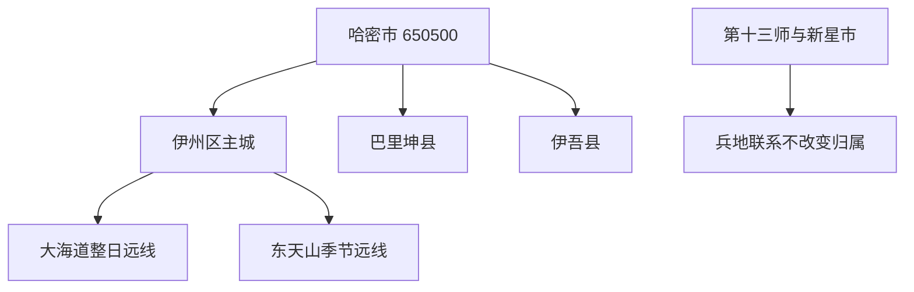
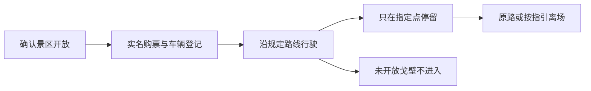

# 哈密旅行指南

哈密是行政区划代码 **650500** 的地级市，也是从甘肃进入新疆后的重要铁路、公路和航空节点。首访可先在伊州区用哈密市文博院、哈密王景区和西路军进疆纪念馆认识东疆历史，再把大海道雅丹或东天山单独安排为整日远线。巴里坤哈萨克自治县、伊吾县虽属哈密市，却不是主城近郊；两县各自的古城、草原、湿地、胡杨和纪念地必须按实际入口、道路与过夜地另算。

> 建议停留：伊州区主城 1–2 天；大海道或东天山各另留 1 天；巴里坤、伊吾按独立模块增加 1–2 天 
> 旅行关键词：丝路文博、哈密王景区、大海道雅丹、东天山、哈密瓜、东疆门户 
> 主要体力：中等；主城可减负，荒漠和山地远线对车程、天气与补给要求高 
> 最近研究：2026-08-12

## 城市速览

| 项目 | 旅行信息 |
|---|---|
| 主要旅行价值 | 伊州区把丝路文博、哈密王景区、红色历史和绿洲饮食集中在主城；大海道提供受管理的雅丹与古生物远线，东天山呈现山地气候；巴里坤和伊吾是独立县域模块。 |
| 建议停留 | 1 天只看主城文博；2 天增加大海道或东天山之一；巴里坤、伊吾与两条远线均不建议压成主城当天“顺路点”。 |
| 较舒适季节 | 春秋通常较适合主城与荒漠活动，但大风、沙尘和昼夜温差仍需核对；夏季主城及盆地酷热，冬季山地和公路可能积雪结冰。 |
| 预算特点 | 主城公共场馆可控制成本；大海道自驾车票、正规车辆、长距离油电补给，以及跨县住宿是主要增量。 |
| 步行强度 | 主城场馆可低强度组合；大海道、东天山与县域景点要在长车程之外保留步行余量，不以越野穿越代替正规游线。 |
| 主要天气风险 | 春季大风与沙尘，夏季高温、强日照和短时强对流，山地局地地灾，冬季低温、降雪、道路结冰与隧道口明暗变化。 |
| 独行旅行 | 主城适合独立安排；大海道、东天山和跨县线应锁定正规交通、通信、返程与应急联系人，不独自进入未开放戈壁。 |
| 亲子旅行 | 文博院、非遗展陈和主城短线较易拆分；雅丹、山地和坎儿井需持续防晒补水，并远离陡坎、洞口、车道和未开放遗址。 |
| 长者与低体力旅行 | 主城一天只选一座场馆加一处短点；远线优先景区车或正规车辆，先问落客、座椅、卫生间和上下车条件。 |
| 无障碍信息 | 现有官方资料足以确认部分公共服务，但不足以证明各场馆、车辆、雅丹、山地和县域景区形成连续无障碍链；须逐段电话确认。 |

固定清单中的 **GeoNames 1529484** 是名为 `Hami` 的主城居民点，当前 P1566 反向关联到 **Wikidata Q650585 伊州区**；法定地级哈密市实体则是 **Wikidata Q989892**，其 P1566 仍指向 GeoNames **1529482**。1529482 当前为旧“哈密市”行政记录，不能替代 2026 年的法定地级市边界。本页因此保留 1529484 作为固定清单定位点、Q989892 作为城市实体，并以代码 650500 和政府区划资料确定范围。

哈密市现辖伊州区、巴里坤哈萨克自治县和伊吾县。市域规划明确以这 **1 区 2 县** 为范围，并单列“不含新疆生产建设兵团第十三师”；新星市及团场与哈密存在兵地融合、道路和公共服务联系，不等于自动成为哈密市行政组成或公共景区。旅行产品中的“哈密”还可能只指伊州区主城，预订时应继续核对县区、入口与住宿地址。

## 城市格局与游览区域

哈密的核心矛盾不是景点数量，而是尺度：伊州区主城适合场馆与街区，南部大海道是受管理的荒漠整日线，东天山取决于季节和道路，巴里坤与伊吾则需跨越天山或长距离公路。地图同属一市，不代表可以连续步行或当日无负担往返。

| 区域 | 主要内容 | 游览特点 | 与其他区域的关系 |
|---|---|---|---|
| 伊州区中心城区 | 哈密市文博院、哈密王景区、西路军进疆纪念馆、文创园与城市餐饮 | 室内外可组合，适合作为到达日和恶劣天气调整线 | 市级场馆展示全市历史，不把巴里坤、伊吾景点变成主城景点 |
| 伊州区南部荒漠 | 大海道、五堡方向与正式景区入口 | 长距离、弱遮阴、受门票和车辆线路管理；适合整日 | 只走景区规定路线，不把戈壁轨迹、化石点或遗址生产路当公共道路 |
| 伊州区北部与东天山 | 白石头、鸣沙山、天山庙、松树塘等正式开放点 | 山地天气和 S249 道路状态直接决定开放，可能季节性闭园 | 与盆地主城气温不同；不能看到主城晴天就默认山地可进入 |
| 巴里坤县模块 | 巴里坤古城、巴里坤湖、高家湖湿地、怪石山 | 历史城镇、草原湖泊与湿地组合，适合在县城过夜 | 独立普通县；不纳入伊州区城市步行线，具体生态区域服从保护要求 |
| 伊吾县模块 | 伊吾胡杨、伊水园及县域红色历史 | 与主城距离长，胡杨季和冬季条件差异大 | 独立普通县；淖毛湖方向还涉及团场、农业、能源和边境生产空间 |

伊州区的旅游点也有明显距离差。文博院、哈密王景区可用市内交通连接；大海道位于五堡镇南部，东天山景区分散在白石头、鸣沙山、天山庙和松树塘等点位。官方景区表明确东天山多个点季节性闭园，天山庙还要看 S249 通车，不能把整片山地当作永远开放的城市公园。

大海道融合雅丹、古生物化石、古人类活动和历史遗迹，保护与安全规则比普通公园严格。游客和车辆须实名购票、服从调度，只按规定路线行驶停放；未开发区域、擅自探险、攀岩、采集化石标本、离开路基、非指定露营烧烤均不属于普通游览。获得探险报备也不等同于可以临时自行穿越。

## 主要景点

优先级用于规划而非绝对排名：**A** 是首访核心，**B** 按兴趣增加，**C** 需要更强季节、开放或交通条件。一个景区内部的展馆、步道和体验不拆成多个景点凑数。

### 伊州区主城与近郊

| 景点 | 区域 | 类型 | 主要看点 | 建议用时 | 室内外 | 体力 | 预约风险 | 天气影响 | 优先级 |
|---|---|---|---|---:|---|---|---|---|---|
| 哈密市文博院 | 伊州区环城路片区 | 博物馆、非遗中心、4A 景区 | 哈密古代文明、古生物与全市多民族非遗背景 | 2–4 小时 | 室内 | 低至中 | 中；开馆、实名、讲解和临展需确认 | 低；极端天气仍可能调整 | A |
| 哈密王景区 | 伊州区老城 | 历史建筑与墓园、4A 景区 | 哈密历史、建筑与地方政权遗存；王府与王墓分别核对 | 2–3 小时 | 混合 | 中 | 中；两个点票务、开放和摄影规则需确认 | 中；高温、风沙与冰雪影响室外段 | A |
| 中国工农红军西路军进疆纪念馆 | 伊州区机场路方向 | 纪念馆、3A 景区 | 西路军进疆历史与红色专题展陈 | 1.5–2.5 小时 | 室内 | 低 | 中；周一、节假日和团队讲解需确认 | 低 | B |
| 哈密文创园 | 伊州区新民五路 | 工业旧址更新、3A 景区 | 原纯碱厂空间、文创和夜间活动 | 1–2.5 小时 | 混合 | 低至中 | 中；商户与活动变化快 | 中；高温、风沙影响室外 | B／路线节点 |
| 塔库坎儿井景区 | 伊州区二堡镇 | 水利文化、2A 景区 | 干旱区地下水利与绿洲生产关系 | 1.5–2.5 小时 | 混合 | 中 | 高；季节开放、洞内条件和讲解需确认 | 中；高温、强降雨及道路影响 | C |

### 荒漠与东天山远线

| 景点 | 区域 | 类型 | 主要看点 | 建议用时 | 室内外 | 体力 | 预约风险 | 天气影响 | 优先级 |
|---|---|---|---|---:|---|---|---|---|---|
| 哈密翼龙—雅丹大海道景区 | 伊州区五堡镇南部 | 雅丹、古生物与自驾景区、4A | 雅丹地貌、翼龙化石背景与丝路遗迹环境 | 整日 | 室外为主 | 中至高 | 很高；实名、车票、线路、探险报备与末入园需确认 | 很高；大风、沙尘、高温、暴雨与低温均影响 | A |
| 东天山景区正式开放点 | 伊州区白石头乡等 | 山地自然与历史景观、4A | 白石头、鸣沙山、天山庙、松树塘等分散点 | 整日 | 室外 | 中 | 很高；季节闭园、S249 与各点开放分别确认 | 很高；山地降雪、大风、强对流和地灾 | A／季节性 |
| “一带一路”农博园 | 伊州区现代农业园区 | 农业展示、3A | 绿洲农业与现代农业展示 | 1.5–3 小时 | 混合 | 低至中 | 中；展馆、采摘和活动需确认 | 中；高温影响室外 | C |

### 巴里坤与伊吾县域模块

| 景点 | 区域 | 类型 | 主要看点 | 建议用时 | 室内外 | 体力 | 预约风险 | 天气影响 | 优先级 |
|---|---|---|---|---:|---|---|---|---|---|
| 巴里坤古城景区 | 巴里坤县城 | 历史城镇、4A 景区 | 东天山北麓古城格局、文博与街区 | 半日至一日 | 混合 | 中 | 中；馆舍和活动需确认 | 高；低温、风雪和降雨影响 | A／县域 |
| 巴里坤湖景区 | 巴里坤县海子沿乡 | 湖泊、草原与 4A 景区 | 山地盆地湖泊、草原与季节水体景观 | 2–4 小时 | 室外 | 中 | 高；海子沿乡正式入口、季节闭园、道路和停车需确认 | 很高；大风、低温、降雪与水情影响 | B／县域 |
| 巴里坤高家湖湿地景区 | 巴里坤县石人子乡 | 湿地生态、4A 景区 | 高山湿地、草甸与候鸟生态环境 | 2–4 小时 | 室外 | 中 | 高；石人子乡正式入口、季节闭园、栈道和保护范围需确认 | 很高；风雪、降雨、泥泞与水情影响 | B／县域 |
| 伊吾胡杨景区 | 伊吾县淖毛湖镇 | 荒漠胡杨、4A 景区 | 不同树龄胡杨与荒漠生态 | 3–5 小时 | 室外 | 中 | 高；门票、车辆线路、季节和末入园需确认 | 很高；高温、大风、沙尘与低温 | A／县域 |
| 伊水园景区 | 伊吾县伊吾镇 | 红色纪念与城市公园、3A | 四十天保卫战纪念设施与县城公共空间 | 2–3 小时 | 混合 | 低至中 | 中；纪念馆开馆和讲解需确认 | 中 | B／县域 |

巴里坤湖、高家湖湿地和伊吾胡杨均处于脆弱生态环境。只在景区入口、栈道、停车区和运营方明示范围活动；湖岸、湿地、草场、林地、农田和胡杨保护地不因没有围栏就可以驾车、露营、采集或生火。巴里坤和伊吾的矿业、能源、水利、边境与农业生产道路也不作为景区捷径。

## 美食与餐饮

哈密适合按菜品和经营区域选择，而不是追逐单家网红店。市政府资料明确提到哈密羊肉焖饼子、层层肉馕、手抓肉、牛肋排，以及三塘湖辣皮子和巴里坤面食；哈密瓜则有很强产季和品种差异。跨县路线要先确认用餐点，不把沿途农牧生产院落当作临时餐馆。

| 菜品或类型 | 常见区域 | 一个人用餐与份量 | 风味、过敏原与饮食限制 | 替代与避坑 |
|---|---|---|---|---|
| 哈密羊肉焖饼子 | 伊州区主城与正规地方餐馆 | 常为共享大份，独行先问小份或半份 | 羊肉、面饼和洋葱为主，含小麦麸质和动物油 | 问清份量、计价和出餐时间；不为单店跨城 |
| 抓饭、手抓肉与牛羊肉 | 主城、县城和正规民族餐馆 | 可问单人份，手抓肉宜先确认重量 | 肉类与动物油较多，抓饭可能含葡萄干；素食需问肉汤和共锅 | 选择明码标价经营点，慢性病患者控制盐脂 |
| 肉馕、烤包子与面食 | 主城街区、市场和县城 | 可按个购买，适合少量尝试 | 含麸质，肉馅常见牛羊肉、洋葱，可能接触芝麻 | 选现制、储存清楚的门店，不买久置食品 |
| 哈密瓜与当季水果 | 正规市场、商店和明确开放采摘点 | 少量购买，长线当天不囤过量 | 天然糖分高，品种成熟期不同 | 不进入瓜田自行采摘；冷链、切果卫生和携带时间需确认 |
| 三塘湖辣皮子炒肉 | 伊吾及主城相关餐馆 | 通常配馍或面食，先问辣度和份量 | 辣椒、肉类、油和小麦；胃肠敏感者谨慎 | 不把地名菜误判为必须去生产区寻找 |
| 巴里坤夹沙、扣丸子与手工馍 | 巴里坤县城正规餐馆 | 多为共享菜，独行先问组合小份 | 油炸、肉馅和面食较多，含麸质与较高油盐 | 跨县日预留正餐时间，不靠景区零食代替 |
| 奶茶、奶制品与干果 | 正规餐馆、市场和商店 | 单杯或小份尝试 | 可能含乳糖、坚果、糖和盐；发酵饮品需问酒精 | 查看配料、冷藏和密封，不凭名称推断无过敏原 |

清真餐饮和居民生活空间遵守门店提示，不在未获同意时拍摄顾客、后厨、宗教活动或私人院落。纯素、麸质过敏、乳糖不耐和坚果过敏者，应逐项询问油脂、汤底、馅料、配料和共用厨具。

## 经典行程

### 一日伊州主城文博线

**路线**：哈密市文博院 → 主城午餐与长休 → 哈密王景区 → 文创园或正规夜间餐饮二选一

- **串联逻辑**：先建立哈密全域历史背景，再进入老城历史点，晚间只保留低强度节点；不把大海道或东天山塞进同日。
- **适用人群**：首次到访、铁路中转、独行者、亲子和对历史文化感兴趣者。
- **减负方式**：场馆间乘车，王府与王墓按体力二选一；午间回酒店休息。
- **预约锚点**：文博院、哈密王府和王墓的开馆、实名、讲解、票务与摄影规则。
- **休息与删减**：午间至少休息 60 分钟；体力不足先删文创园，再删王景区室外段，只保留文博院。

### 两日主城与大海道线

**路线**：第 1 天伊州主城文博线 → 第 2 天正规车辆到大海道入口 → 按景区规定路线游览 → 日落前按指引离场 → 返回主城或已确认住宿

- **串联逻辑**：城市历史与荒漠地貌分日理解；第二天只做一个远线，不临时绕入化石点或戈壁便道。
- **适用人群**：有荒漠兴趣、能承受长车程且愿意服从景区车辆规则者。
- **减负方式**：选择有空调和足够补给的正规车辆，指定点短停，不额外安排夜间驾驶。
- **预约锚点**：实名门票、自驾车票或景区交通、车辆资质、末入园、天气、油电补给和返程。
- **休息与删减**：每次停车补水休息；出现大风沙尘、高温预警、车辆故障或景区限流时整条取消，不换野线。

### 两日主城与东天山线

**路线**：第 1 天主城 → 第 2 天确认 S249 与景区开放 → 白石头、鸣沙山、天山庙、松树塘中选 1–2 个正式开放点 → 原路返程

- **串联逻辑**：以实际开放点而非“东天山”大名称排程，避免在分散点间追赶。
- **适用人群**：山地景观、历史道路和避暑兴趣者；不适用于山地预警或道路结冰日。
- **减负方式**：只选一处主点和一处备选，车辆落客后走短线，午间固定休息。
- **预约锚点**：各点季节开放、S249 通行、气象与地灾、停车、返程和通信覆盖。
- **休息与删减**：山地风雪或道路管制时整线取消；仅一处开放就不勉强寻找替代野点。

### 巴里坤独立两日模块

**路线**：第 1 天抵达巴里坤县城 → 古城与县城文博 → 县城住宿 → 第 2 天巴里坤湖或高家湖湿地二选一 → 返回或继续下一程

- **串联逻辑**：先以县城建立历史背景，再按天气选择一个生态点；不从伊州主城当天往返后继续赶伊吾。
- **适用人群**：古城、草原与湿地兴趣者，自驾和愿意县城过夜者。
- **减负方式**：住县城、生态点二选一，避免午后长途赶路。
- **预约锚点**：馆舍开放、湖区或湿地季节开放、道路、停车、住宿供暖和返程。
- **休息与删减**：县城午休；低温、大风或湿地闭园时删生态点，只留古城短线。

### 伊吾独立两日模块

**路线**：第 1 天到伊吾县城与伊水园 → 县城住宿 → 第 2 天按开放前往伊吾胡杨景区 → 按景区车线游览 → 返回住宿或下一程

- **串联逻辑**：红色历史与荒漠生态分开，胡杨不作为从哈密主城临时追加的日落点。
- **适用人群**：胡杨、荒漠生态和红色历史兴趣者，能承担长转场者。
- **减负方式**：县城过夜、白天进入景区、只走正式线路；不跨越生产区抄近路。
- **预约锚点**：胡杨景区票务、车辆、季节景观、末入园、淖毛湖方向道路和住宿。
- **休息与删减**：车内与游客中心定时补水；沙尘、大风或高温时删胡杨，只保留县城低强度点。

### 长者、低体力与恶劣天气调整线

**路线**：确认开放的文博院或纪念馆一座 → 室内午餐与长休 → 哈密王景区短段或文创园短段二选一 → 返回住宿

- **串联逻辑**：把长车程、山地和荒漠全部移除，只保留同一区内可随时退出的场馆。
- **适用人群**：长者、轮椅使用者、低体力者，以及大风、沙尘、高温、降雪调整日。
- **减负方式**：车辆点到点，提前问落客、台阶、座椅、卫生间与轮椅借用；不以“免费开放”推断无障碍。
- **预约锚点**：连续无障碍链、场馆开放、天气预警、车辆等待和就医距离。
- **休息与删减**：每 30–45 分钟休息；不适即删下午段，高等级预警或交通异常时留在住宿地。

## 住宿区域

| 区域 | 适合人群 | 优点 | 主要代价与核对项 |
|---|---|---|---|
| 伊州区中心城区 | 首访、铁路或航空到达、主城文博 | 餐饮、住宿和公共交通选择相对集中 | 大海道、东天山和两县都需另算长途；核对接早送晚与停车 |
| 伊州区火车站或机场通道 | 次日早班、短中转 | 降低到发段压力 | 与老城景点未必步行可达；核对机场专线、夜间叫车和噪声 |
| 巴里坤县城 | 古城、湖泊和湿地模块 | 适合拆分跨天山长车程 | 旺季房量与冬季供暖需确认，生态点仍需车辆 |
| 伊吾县城或淖毛湖正规住宿 | 伊吾红色历史、胡杨方向 | 避免夜间长途返回哈密主城 | 两地不能混为一个住宿点；核对地址、餐饮、油电和次日入口 |

订房时把“哈密”继续细化到伊州区、巴里坤县或伊吾县。还要核对前台时段、空调供暖、取消政策、停车充电、饮水、无障碍客房和最近医疗点；平台标注“景区附近”不代表在入口内或提供接驳。

## 市内交通

哈密站、哈密机场和公路构成到达网络，伊州区内可用公交、出租车和合规网约车。官方资料显示城市公交企业运营常规与专线网络，早期亦已开通机场公交专线，但线路、班次和停靠会变化，出发前仍需用运营方当期信息核对。

| 场景 | 可用方式 | 适用范围 | 出发前确认 |
|---|---|---|---|
| 抵达哈密 | 铁路、航班、长途客运 | 到伊州区住宿与中转 | 实际到发站、末班接驳、行李、无障碍和夜间车辆 |
| 伊州区主城 | 公交、出租车、合规网约车 | 文博院、王景区、纪念馆与餐饮 | 站点、运营时段、落客点、候车遮蔽与返程 |
| 大海道 | 正规包车、自驾或景区规定交通 | 五堡镇南部正式景区 | 实名、车票、限速、规定路线、油电、通信与救援 |
| 东天山 | 正规包车或自驾 | 正式开放的白石头等点 | S249、季节闭园、山地天气、驾驶员工时和返程 |
| 巴里坤、伊吾 | 班线客运、正规包车或自驾 | 县城与县域景区 | 班次、实际客运站、跨山道路、住宿和下一程 |
| 兵地相邻区域 | 只按公共道路和明确接待入口 | 新星市、团场或兵地接合部附近 | 行政归属、门禁、生产道路、拍摄与无人机规则 |

自驾不以导航可规划路线作为准入证明。矿区、风光电场、铁路专用线、输电通道、油气与化工区域、农场、团场、水利工程和边境道路都有生产或管理属性；只走公共道路和正式游客入口。冬季官方提示特别点名 S235、S303、G575 部分弯道、下坡和隧道口风险，遇管制不绕行未验证道路。

## 不同旅行者须知

| 旅行者 | 更适合的安排 | 需要主动核对 | 应避免 |
|---|---|---|---|
| 独行旅行者 | 伊州主城文博、正规团队或包车远线 | 车辆资质、通信、返程、住宿和紧急联系人 | 独自戈壁穿越、夜间赶两县或搭乘无资质车辆 |
| 亲子家庭 | 文博院、非遗中心、王景区短段 | 儿童票、卫生间、婴儿车、防晒保暖与安全座椅 | 攀爬雅丹、进入坎儿井非开放段、靠近车道和水边 |
| 长者与低体力者 | 一馆一短点、县城过夜 | 落客、坡度、座椅、轮椅、卫生间与医疗距离 | 同日大海道加主城、伊州区往返两县 |
| 轮椅使用者 | 先选电话确认过的场馆和住宿 | 客房—车辆—入口—卫生间—核心展线连续性 | 看到“无障碍网站”或单个卫生间就推断全程可达 |
| 自驾旅行者 | 一天一个方向，跨县过夜 | 轮胎、油电、备水、道路预警、驾驶员工时和救援 | 下路基、戈壁追轨迹、疲劳驾驶与景区外生火露营 |
| 摄影与无人机使用者 | 公共观景点和明确允许机位 | 机场净空、文物、化石、边境、军工能源及个人肖像规则 | 拍摄安保门禁、采集标本、擅飞或翻越围栏 |
| 呼吸或心血管敏感者 | 室内短线、早晚低强度活动 | 沙尘、高温、低温、空气质量、急救药物和就医点 | 预警中坚持荒漠、山地长线或车内长时间缺水 |

## 行前核对

- 先确认每个点位属于伊州区、巴里坤县还是伊吾县；第十三师、新星市及团场按各自管理入口核对。
- 通过[哈密市人民政府](https://www.hami.gov.cn/)查询文旅、道路、应急和县区公告，通过[新疆气象局](http://xj.cma.gov.cn/)查看大风、沙尘、高温、暴雪和道路结冰预警。
- 大海道逐项核对实名门票、自驾车票、规定路线、末入园、探险报备、露营与无人机规则；不把网络轨迹当准入许可。
- 东天山分别确认白石头、鸣沙山、天山庙和松树塘的季节开放，尤其核对 S249 通车与山地天气。
- 文博院、王府、王墓、西路军纪念馆分别核对开放日、最后入馆、讲解、摄影和无障碍，不沿用汇总表中的时间作为永久保证。
- 巴里坤湖、高家湖湿地和伊吾胡杨服从生态保护、景区车线和火源管理，不驶入湖岸、湿地、草场与林地。
- 铁路通过[中国铁路 12306](https://www.12306.cn/)核对车次，到达航班和机场服务通过承运方与[民航新疆管理局](https://xj.caac.gov.cn/)核对。
- 租车选择有资质企业，合同写明费用、押金、违章、救援和还车；长线准备备水、保暖防晒、离线联系与驾驶员替换。
- 需要无障碍服务时逐段询问，不把单点设施外推成连续链；大海道和山地尤其确认车辆装载、坡度、地面与卫生间。
- 至少准备同一区内的删减方案；道路管制、高等级预警或景区熔断时直接取消受影响方向。

## 来源与更新记录

| 主题 | 一手或权威入口 | 支持范围 | 使用边界 |
|---|---|---|---|
| 行政范围与空间格局 | [哈密市国土空间总体规划](https://www.hami.gov.cn/hami/c120044/202503/547bcca5678c4d38b11f8f2f9a328075.shtml) | 1 区 2 县、市域不含第十三师、荒漠—绿洲—山地格局 | 规划项目不写成已开放服务 |
| 法定代码 | [民政部行政区划代码查询](https://dmfw.mca.gov.cn/) | 哈密市代码 650500 | 以查询当期结果为准 |
| 固定地名点 | [GeoNames 1529484](https://www.geonames.org/1529484/hami.html) | 固定清单主城居民点 | 当前 P1566 指向伊州区，不替代地级市边界 |
| 城市实体 | [Wikidata Q989892](https://www.wikidata.org/wiki/Q989892) | 地级哈密市、代码与旧 GeoNames 标识 | Q 的 P1566=1529482，须透明记录粒度错位 |
| 文旅总览 | [哈密文旅概况（2026）](https://www.hami.gov.cn/hami/c120153/redirect_firstArticle.shtml) | 1 区 2 县、文化主题与景区总体格局 | 统计数据和创建计划不替代单点公告 |
| 景区名录 | [哈密市 A 级景区汇总表](https://www.hami.gov.cn/hami/c127799/202511/9451d84d6a4d4baf92095d79f56f24e2.shtml) | 县区归属、等级、基础开放和咨询入口 | 营业时间、票价和季节状态出发前重查 |
| 票价 | [哈密市景区门票价格](https://www.hami.gov.cn/hami/c120052/202601/d4d18fa1db6d4881ba216946f717fbfc.shtml) | 大海道、东天山、王景区、坎儿井等政府定价 | 不含全部二次消费，价格可调整 |
| 文博院 | [哈密市文博院](https://www.hami.gov.cn/hami/xhtml/mlhm/mlhm_hmswby.html)、[讲解服务公示](https://www.hami.gov.cn/hami/c120052/202601/e2ce5dade82c45589c2d9f65b1857824.shtml) | 馆藏、非遗中心、地址与讲解入口 | 日常开馆、预约和无障碍仍需馆方确认 |
| 大海道规则 | [大海道景区管理办法](https://www.hami.gov.cn/hami/c119999/202403/49033b966bf1450abed133d73f2e0994.shtml) | 实名入园、规定路线、未开放区、化石与探险管理 | 规章不等于当天开放，仍查运营公告 |
| 冬季与道路安全 | [哈密冬季旅游安全提示](https://www.hami.gov.cn/hami/c127799/202511/d3ea0f04049f46fcb0b320f36590d1cf.shtml) | 雪冰、大风、正规租车与重点道路风险 | 历史提示用于风险类型，实时路况另查 |
| 沙尘风险 | [哈密沙尘暴预警案例](https://www.hami.gov.cn/hami/c119977/202402/850ce26fc8b14af6a978604c3d4f678b.shtml) | 伊州区和市域多点沙尘风险 | 单次事件不代表长期天气 |
| 公交与到达 | [哈密公交企业信息](https://www.hami.gov.cn/hami/c120108/202502/0c3990609fbe40b4981856cc2d7f0aba.shtml)、[综合客运答复](https://www.hami.gov.cn/hami/c120096/202206/7600df1d1dfd4ad88506385c101c46e0.shtml) | 城市公交与机场专线背景 | 旧线路和规划不固化为当前班次 |
| 地方餐饮 | [哈密美食](https://www.hami.gov.cn/hami/c120163/hmms.shtml)、[特色文化](https://www.hami.gov.cn/hami/c120154/tswh.shtml) | 焖饼子、肉馕、牛羊肉与地方饮食 | 单店、价格与营业不长期固化 |

本页最近研究日期为 **2026-08-12**。长期保留的是 1 区 2 县关系、主城与远线尺度、景点类型和生产保护边界；开放、票价、班次、道路、天气、探险报备与无障碍服务均在出发前重查。
