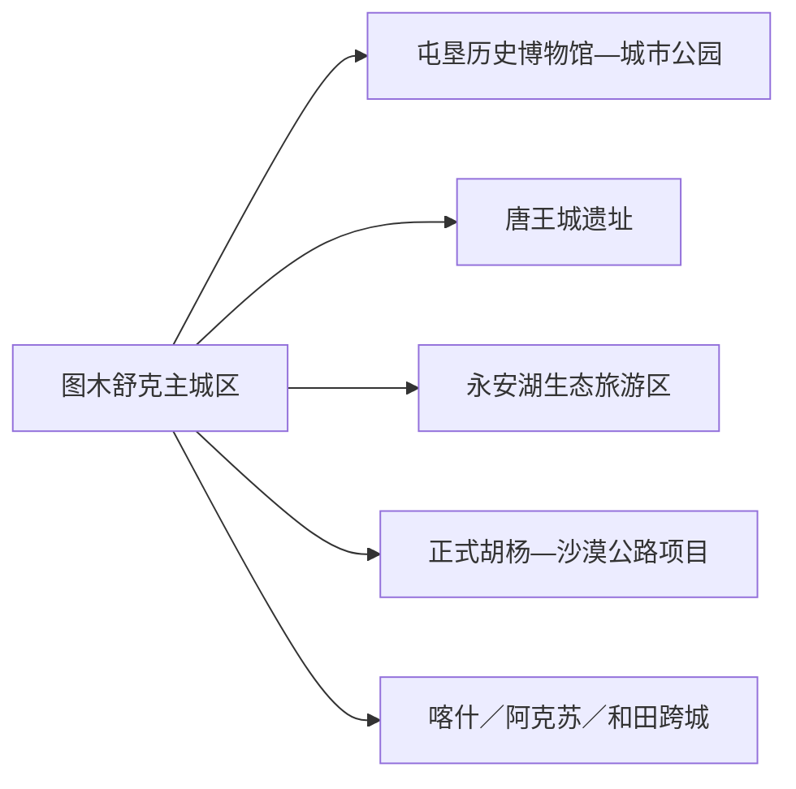
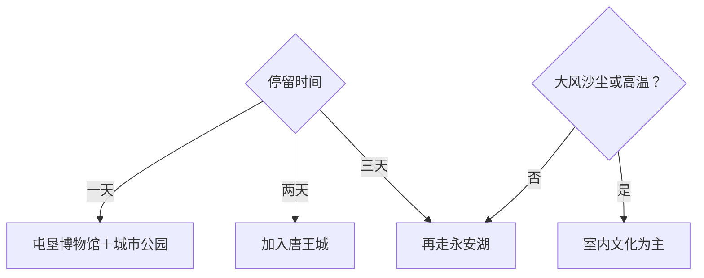

# 图木舒克旅行指南

图木舒克是一座把汉唐遗址、现代屯垦史、绿洲湖泊、胡杨与沙漠边缘放在同一旅行尺度中的兵团城市。主城区与新疆屯垦历史博物馆适合一日，唐王城遗址和永安湖可再分成两个完整方向；若继续前往喀什、阿克苏或和田，应按跨城交通另行规划。

> 建议停留：2–3 天；唐王城与永安湖各留半日至一日 
> 旅行关键词：唐王城、新疆屯垦历史博物馆、永安湖、土陶、胡杨、兵团城市 
> 主要体力：城区低；遗址、湖区与沙漠边缘中等 
> 最近研究：2026-08-13

## 城市速览

| 项目 | 旅行信息 |
|---|---|
| 主要旅行价值 | 在古代屯垦遗址、现代兵团史、绿洲水体和沙漠景观中理解南疆新城 |
| 建议停留 | 1 天主城区；2 天加入唐王城；3 天再走永安湖与正式胡杨线 |
| 较舒适季节 | 春秋适合户外；夏季高温干燥；冬季关注寒潮和风雪 |
| 预算特点 | 城区平实，机场铁路到离、远线车辆和景区项目是主要变量 |
| 步行强度 | 场馆低，遗址与湖区中等；沙地和风天会增加体力 |
| 主要天气风险 | 高温、强紫外线、沙尘、大风、雷雨、寒潮和道路低能见度 |
| 独行旅行 | 铁公机门户齐全，远线仍需先锁车辆和返程 |
| 亲子旅行 | 博物馆、土陶和城市公园适合分段体验 |
| 长者与低体力旅行 | 一馆加锦绣公园或车辆到永安湖短线 |
| 无障碍信息 | 机场、铁路与新场馆可先申请协助；遗址、沙地、湖岸和团场设施连续性需向官方确认 |

## 城市格局与游览区域

图木舒克市是新疆维吾尔自治区直辖县级市，与新疆生产建设兵团第三师实行师市合一管理，法定代码 `659003`。固定 GeoNames `12022102` 是 `PPLA2` 城市点；法定实体 Wikidata `Q989606` 当前以 `P1566=1529116` 连接另一条行政记录，因此页面用固定点定位主城、以 QID 和法定代码组织师市边界。

| 区域 | 主要内容 | 游览特点 | 与其他区域的关系 |
|---|---|---|---|
| 主城区 | 新疆屯垦历史博物馆、城市规划与公园、住宿餐饮 | 室内外可组合，服务最稳定 | 是机场、铁路和远线基地 |
| 唐王城方向 | 唐王城遗址、考古展示与相关历史研究 | 文保与考古优先，开放范围会调整 | 单独半日至一日 |
| 永安湖方向 | 湖区、沙海、胡杨和当期观光项目 | 景区尺度大，季节与水情明显 | 可作完整一日 |
| 土陶与非遗方向 | 正式土陶技艺馆及活动 | 适合与城区或唐王城组合 | 先确认展示和体验时段 |
| 团场、胡杨与沙漠公路 | 农业、生态和正式旅游线路 | 距离长、生产边界清晰 | 每次只选一个正式项目 |
| 南疆联程 | 喀什、阿克苏、和田等 | 航空、铁路和公路均需重新核对 | 不是图木舒克市内景点 |

第三师团场、农业基地、灌溉设施、风沙治理区和口岸通道具有生产或管理功能。旅客使用景区、正式道路、博物馆、公开工坊和运营方组织的项目；文物遗址考古区、胡杨保护区和农田作业区按照属地规则进入。

## 主要景点

### 主城区与历史

| 景点 | 区域 | 类型 | 主要看点 | 建议用时 | 室内外 | 体力 | 预约风险 | 天气影响 | 优先级 |
|---|---|---|---|---:|---|---|---|---|---|
| 新疆屯垦历史博物馆 | 主城区 | 历史博物馆 | 古代屯垦、兵团建设史和当期专题展 | 2–3 小时 | 室内 | 低 | 中 | 低 | A |
| 锦绣公园与城市公共空间 | 主城区 | 城市公园 | 绿洲新城景观、休闲步道和城市建设 | 1–3 小时 | 室外 | 低 | 低 | 高 | B |
| 图木舒克城市规划馆等正式展馆 | 主城区 | 城市展陈 | 师市发展、绿洲规划和公共文化 | 1–2 小时 | 室内 | 低 | 高 | 低 | B |
| 土陶技艺馆 | 主城区或当期接待点 | 非遗、工艺 | 模制法土陶烧制技艺与正式展示 | 1.5–3 小时 | 室内为主 | 低 | 很高 | 低 | B |

### 遗址、湖区与远线

| 景点 | 区域 | 类型 | 主要看点 | 建议用时 | 室内外 | 体力 | 预约风险 | 天气影响 | 优先级 |
|---|---|---|---|---:|---|---|---|---|---|
| 唐王城遗址公开参观单元 | 城北方向 | 全国重点文保、考古遗址 | 尉头州城遗址、考古成果和丝路屯垦历史 | 4–7 小时 | 室外为主 | 中 | 极高 | 很高 | A |
| 永安湖生态旅游区 | 市域 | 湖区、沙海、胡杨 | 湖泊、胡杨、沙地与当期观光巴士／活动 | 6–9 小时 | 室外 | 中 | 很高 | 极高 | A |
| 正式胡杨林游览项目 | 师市公开入口 | 森林、季节景观 | 胡杨季相和绿洲生态 | 4–8 小时 | 室外 | 中 | 很高 | 很高 | B |
| 白沙山等当期开放沙漠项目 | 市域 | 沙地、地貌 | 沙漠边缘地貌和正式体验 | 4–8 小时 | 室外 | 中高 | 极高 | 极高 | C |

唐王城遗址仍有考古研究和保护任务，公开参观范围随项目进展调整。永安湖、胡杨林和沙地活动由不同入口和运营条件组成，选择一条完整路线比跨团场赶多个点更可靠。

## 美食与餐饮

| 菜品或餐饮类型 | 常见区域 | 一个人用餐与常见份量 | 风味、过敏原与饮食限制 | 排队风险与替代方法 |
|---|---|---|---|---|
| 抓饭、拌面与汤饭 | 主城区 | 一人份方便 | 小麦、羊肉、胡萝卜、油脂和盐分 | 选小份或清汤 |
| 烤肉与馕 | 主城区、正规餐馆 | 烤肉按串，馕适合分享 | 小麦、芝麻、肉类和孜然 | 先点少量再加 |
| 鸽子汤、牛羊肉家常菜 | 正规餐馆 | 汤品可一人，肉菜适合共享 | 肉类、盐分和香辛料 | 询问份量和清淡做法 |
| 瓜果与干果 | 市场、正规商店 | 按量购买 | 糖分、坚果过敏和保存 | 明码标价、少量试买 |

## 经典行程

### 一日经典路线

**路线**：新疆屯垦历史博物馆 → 午餐 → 土陶技艺馆或城市规划馆 → 锦绣公园短线

- **串联逻辑**：从古今屯垦与兵团史过渡到非遗和现代绿洲城市。
- **预约锚点**：博物馆、土陶展示和规划馆开放。
- **休息安排**：午餐长休，公园放到气温较低时段。
- **时间不足时**：保留屯垦历史博物馆。

### 两日城市路线

**路线**：第 1 天主城区文化线。 
**第 2 天**：唐王城遗址正式入口 → 公开参观范围 → 返回城区。

- **串联逻辑**：先建立屯垦历史框架，再到考古遗址理解更早层次。
- **预约锚点**：遗址开放、讲解、车辆和返程。
- **休息安排**：遗址服务点午休，避开正午高温与大风。
- **时间不足时**：第二天改遗址半日。

### 三日深度路线

**路线**：第 1 天主城区。 
**第 2 天**：唐王城。 
**第 3 天**：永安湖完整一日。

- **串联逻辑**：城市、遗址和绿洲生态分别成日，主题最清楚。
- **预约锚点**：永安湖入口、观光交通、活动和返程。
- **休息安排**：在游客服务点午休，夏季避开午后最热时段。
- **时间不足时**：删除第三天。

### 雨雪或沙尘天路线

**路线**：屯垦历史博物馆 → 午餐 → 城市规划馆或土陶技艺馆

- **适用条件**：城区交通正常；强沙尘、大风或极端天气时减少户外移动。
- **串联逻辑**：连续使用室内历史、城市与工艺内容。
- **预约锚点**：场馆开放与交通公告。
- **休息安排**：馆内和正规餐饮区。
- **时间不足时**：只留屯垦历史博物馆。

### 亲子或低体力路线

**亲子路线**：屯垦博物馆精选展厅 → 午餐 → 土陶当期体验或锦绣公园短线。 
**低体力路线**：车辆到博物馆 → 核心展厅 → 午餐长休 → 城市规划馆。

- **减负方式**：亲子线控制讲解长度；低体力线取消遗址沙地与湖区长线。
- **预约锚点**：儿童活动、工艺体验、轮椅、座椅和落客点。
- **休息安排**：每个主点后坐休补水。
- **时间不足时**：两线均保留博物馆核心。

### 远郊一日路线

**路线**：主城区 → 永安湖正式入口 → 当日开放湖区与胡杨主线 → 原路返回

- **适用条件**：天气、道路、景区交通和返程明确。
- **串联逻辑**：以一个运营单元理解湖泊、沙海和胡杨景观。
- **预约锚点**：门票、观光车、停车、活动和末班。
- **休息安排**：正式服务点午休，驾驶者返程前坐休。
- **时间不足时**：改为锦绣公园与城市展馆半日。

## 住宿区域

| 区域 | 优点 | 缺点 | 适合人群 | 交通特点 |
|---|---|---|---|---|
| 图木舒克主城区 | 餐饮、补给、场馆和叫车更稳定 | 到遗址湖区仍需车辆 | 首访、公共交通、连续住宿 | 适合作统一基地 |
| 铁路站方向 | 到离方便 | 与成熟餐饮和场馆有接驳距离 | 铁路晚到早走 | 核对站前交通和接送 |
| 唐王城机场方向 | 适合早晚航班 | 夜间生活服务相对有限 | 航空联程 | 确认机场交通和航变 |
| 永安湖正规住宿／营地 | 便于湖区日出与活动 | 季节、供给和退改差异大 | 自驾、生态专题 | 只选正式运营产品 |

## 市内交通

| 场景 | 建议与取舍 | 行前需要重查的内容 |
|---|---|---|
| 航空抵达 | 唐王城机场继续用公交、出租或接送进入城区 | 航班、航站楼、机场交通和天气 |
| 铁路抵达 | 图木舒克站到城区需地面接驳 | 车次、出站口、公交和末班 |
| 城区移动 | 公交、出租或网约车连接场馆与公园 | 线路、支付、叫车范围和活动改道 |
| 唐王城与永安湖 | 自驾、正规包车或当期旅游直通车 | 入口、道路、停车、观光车和返程 |

## 不同旅行者须知

| 旅行维度 | 可行条件 | 主要取舍 | 需额外核对 |
|---|---|---|---|
| 独行旅行 | 铁公机到离和城区服务完整 | 远线晚返、风沙和通信容错低 | 正规车辆、末班与紧急联系人 |
| 亲子旅行 | 博物馆、土陶和公园易组合 | 遗址、湖岸和沙地持续看护 | 年龄、遮阳、饮水和活动规则 |
| 长者或低体力旅行 | 一馆加城市车辆短线可行 | 沙地、遗址和湖区步行减量 | 落客点、座椅和医疗 |
| 无障碍需求 | 机场、铁路和现代场馆优先咨询 | 遗址、沙地和湖岸连接易中断 | 设施连续性需向官方确认 |
| 摄影旅行 | 遗址、绿洲、胡杨与沙海题材鲜明 | 文保、生产和无人机规则优先 | 禁飞、拍摄许可和风沙防护 |
| 文保与生产空间 | 公开遗址、博物馆和正式农旅可行 | 考古、团场农业、水利和生态保护优先 | 准入、讲解、保险和拍摄 |

## 行前核对

| 核对事项 | 为什么需要重查 | 建议核对时间 | 官方入口 |
|---|---|---|---|
| 唐王城、博物馆和土陶 | 考古、展览、开放与体验时段会调整 | 排路线前及前一日 | [第三师图木舒克市](https://www.xjbtnss.gov.cn/) |
| 永安湖与远线项目 | 观光交通、活动、水情和季节变化明显 | 出发前三日及当天 | [师市文旅资料](https://xjbtnss.gov.cn/mobile/xwzx/ssyw/202505/t20250519_59985.html) |
| 航空与铁路 | 航线、车次和接驳变化 | 购票前及当天 | [中国铁路12306](https://www.12306.cn/) |
| 高温、沙尘与道路 | 户外和公路受天气影响明显 | 出发前三日及当天 | [新疆气象局](http://xj.cma.gov.cn/) |

## 来源与更新记录

### 主要来源

| 来源 | 类型 | 支持内容 | 核验日期 |
|---|---|---|---|
| [第三师图木舒克市概况](https://www.xjbtnss.gov.cn/ssgk/ssgk/) | 师市政府 | 师市关系、铁公机、唐王城、永安湖、胡杨和博物馆 | 2026-08-13 |
| [兵团：唐王城考古与文化](https://www.xjbt.gov.cn/c/2025-05-27/8409377.shtml) | 兵团政府 | 唐王城遗址、考古成果与屯垦历史 | 2026-08-13 |
| [师市文旅融合与交通](https://xjbtnss.gov.cn/mobile/xwzx/ssyw/202505/t20250519_59985.html) | 师市政府 | 土陶、旅游直通车、永安湖观光交通与风景道 | 2026-08-13 |
| [第三师图木舒克市国土空间总体规划](https://www.xjbtnss.gov.cn/mobile/xwzx/tzgg/202303/W020230303698310329995.pdf) | 师市政府、规划 | 旅游集散、全域空间和生态生产边界 | 2026-08-13 |
| [Wikidata Q989606](https://www.wikidata.org/wiki/Special:EntityData/Q989606.json) | 开放结构化数据 | 法定实体与行政记录粒度 | 2026-08-13 |
| [GeoNames 12022102](https://sws.geonames.org/12022102/about.rdf) | 开放地名数据 | 固定图木舒克城市记录 | 2026-08-13 |
| [民政部行政区划代码查询](https://dmfw.mca.gov.cn/xzqh/getList?code=659003&trimCode=false&maxLevel=3) | 国家行政区划数据 | 法定代码 659003 | 2026-08-13 |

### 更新记录

| 日期 | 更新内容 |
|---|---|
| 2026-08-13 | 首次完成图木舒克指南，核验唐王城、屯垦博物馆、永安湖、交通与师市边界 |
