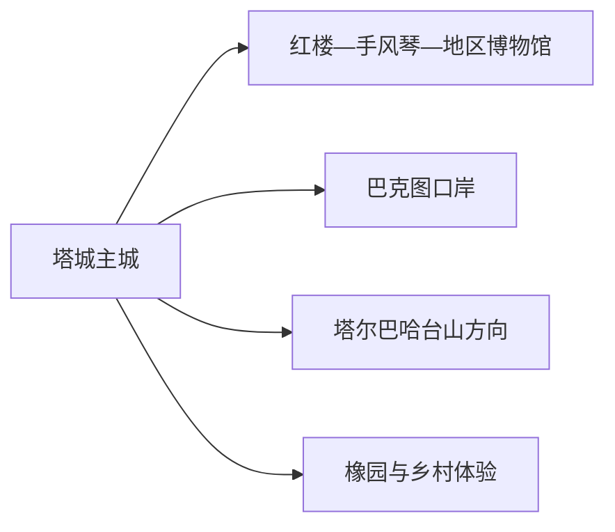
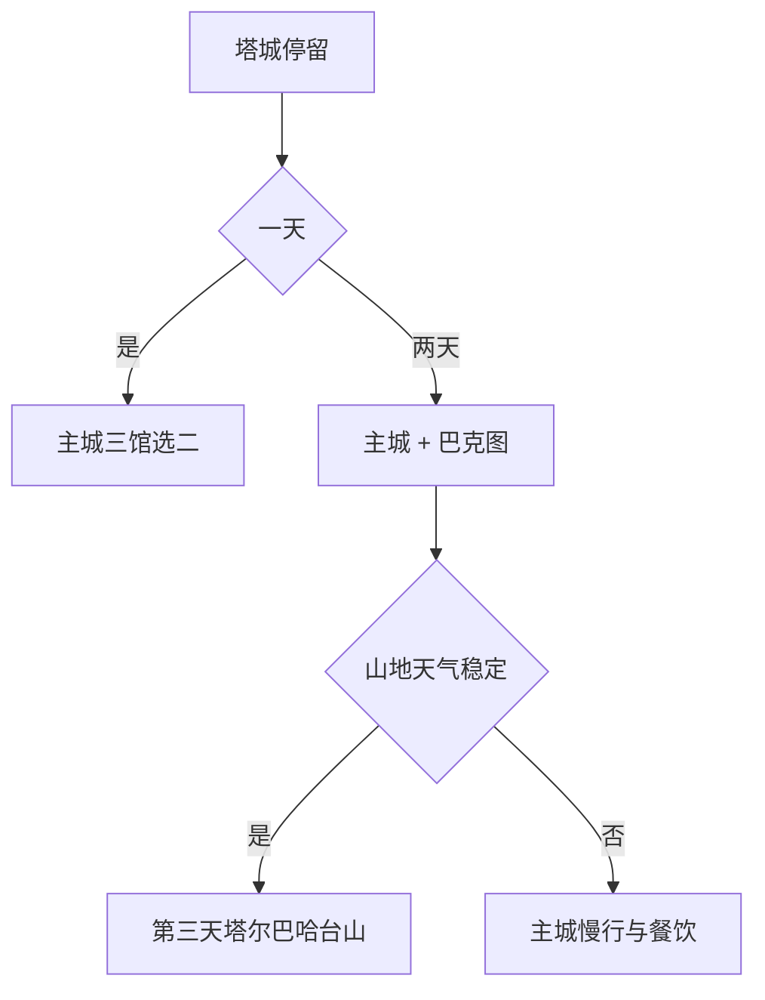

# 塔城旅行指南

塔城市是塔城地区驻地，适合从多民族城市文化、手风琴与俄式建筑、巴克图口岸三条线索展开。主城文博可以步行与短程乘车组合，口岸和塔尔巴哈台山方向则按边境远线安排；地区内乌苏、沙湾等县级市另作独立目的地。

> 建议停留：2–3 天 
> 旅行关键词：红楼、手风琴、巴克图口岸、多民族饮食、塔尔巴哈台山 
> 主要体力：低至中等；边境与山地远线依赖车辆 
> 最近研究：2026-08-12

## 城市速览

| 项目 | 旅行信息 |
|---|---|
| 主要旅行价值 | 在红楼和手风琴展馆认识边城历史与音乐文化，再以合规口岸参观理解中哈陆路联系。 |
| 建议停留 | 1 天主城文博；2 天增加巴克图；3 天再选塔尔巴哈台山或正式乡村线。 |
| 较舒适季节 | 夏季适合城市与山地但昼晒强，冬季冰雪有特色且严寒风雪显著。 |
| 预算特点 | 主城场馆和餐饮可控，口岸车辆、山地包车、冬季装备与跨境手续是主要增量。 |
| 步行强度 | 主城低至中等，口岸和山地需要车辆；冰雪会提高全部路段负担。 |
| 主要天气风险 | 大风、寒潮、暴雪、道路结冰、雷暴、山洪和森林草原火险。 |
| 独行旅行 | 主城方便独立安排，边境远线选择有明确资质和返程的服务。 |
| 亲子旅行 | 手风琴、地方文博和城市公园可组合，口岸按证件与现场秩序参观。 |
| 长者与低体力旅行 | 一天一馆一短段，用车辆连接主城与口岸。 |
| 无障碍信息 | 老建筑、口岸设施和山地之间的设施连续性需向官方确认。 |

### 城市身份与边界

塔城市是塔城地区所辖县级市 **654201**，也是地区行政公署驻地。固定 **GeoNames 1529167** 与法定实体 **Wikidata Q648696** 的 `P1566` 精确对应（同一实体还列有行政记录 `1529165`）。额敏、裕民、托里、和布克赛尔是县域，乌苏和沙湾是独立县级市，均不由塔城市页承接。

## 城市格局与游览区域

| 区域 | 主要内容 | 游览特点 | 与其他区域的关系 |
|---|---|---|---|
| 主城文博片区 | 红楼、手风琴展馆、地区博物馆与城市街区 | 场馆主题互补，可组成一整天 | 适合作为住宿基地 |
| 巴克图口岸方向 | 国门、口岸文化和边境通道 | 证件、开放边界、摄影和交通均需核对 | 距主城约十余公里，单独半天至一天 |
| 塔尔巴哈台山方向 | 山地、草原与季节景观 | 天气、道路、防火和边境管理优先 | 作为第三天整日远线 |
| 橡园与正式乡村点 | 林木、民俗和季节活动 | 项目开放与接待逐项确认 | 可作主城半日补充 |

## 主要景点

| 景点 | 区域 | 类型 | 主要看点 | 建议用时 | 室内外 | 体力 | 预约风险 | 天气影响 | 优先级 |
|---|---|---|---|---:|---|---|---|---|---|
| 红楼博物馆 | 主城 | 历史建筑与博物馆 | 百年建筑、塔城地方史和多民族交往 | 2–3 小时 | 室内 | 低 | 中 | 低 | A |
| 塔城市手风琴展馆 | 主城 | 音乐专题展馆 | 多国手风琴收藏、音乐文化与当期活动 | 1.5–2.5 小时 | 室内 | 低 | 中 | 低 | A |
| 塔城地区博物馆 | 主城 | 综合博物馆 | 地区考古、民族文化和边疆历史 | 2–3 小时 | 室内 | 低 | 中 | 低 | A |
| 巴克图口岸景区 | 城西 | 口岸与边境参观 | 国门、口岸历史和正式展示空间 | 3–5 小时 | 混合 | 低至中 | 高 | 高 | A |
| 橡园正式开放区 | 城郊 | 林木与民俗景区 | 古橡树、锡伯族文化与季节活动 | 2–4 小时 | 户外 | 低至中 | 中 | 高 | B |

巴克图口岸的旅游展示区、旅检区、货运区和边境管控带各有用途。跨境旅行另行核对证件、签证、口岸开放、承运和对方入境规则；在国内参观国门不等于已经办理出境。

## 美食与餐饮

| 菜品或餐饮类型 | 常见区域 | 一个人用餐与常见份量 | 风味、过敏原与饮食限制 | 排队风险与替代方法 |
|---|---|---|---|---|
| 风干肉、牛羊肉菜 | 主城 | 多人共享更合适 | 肉类、盐分和乳制品需确认 | 独食选小份汤饭或套餐 |
| 包尔萨克、面食 | 主城与市场 | 单人友好 | 含小麦、油脂，可能搭配乳制品 | 选现做且配料清楚的同类店 |
| 奶茶、奶疙瘩与乳品 | 主城 | 少量品尝 | 乳糖、盐糖和储存条件需注意 | 购买正规包装或当天制品 |
| 手抓饭、抓肉与家常菜 | 主城生活区 | 一人份较常见 | 羊肉、胡萝卜、油脂与坚果需询问 | 午餐错峰，选择明码标价餐馆 |

## 经典行程

### 一日经典路线

**路线**：红楼博物馆 → 午餐 → 手风琴展馆 → 地区博物馆或城市短段

- **串联逻辑**：三个场馆都在主城，以历史、音乐和地区文化递进。
- **预约锚点**：三馆开放与活动时段。
- **休息安排**：午餐后坐休，下午最多两馆。
- **时间不足时**：红楼和手风琴展馆二选一，再保留地区博物馆。

### 两日城市路线

**第 1 天**：主城文博  
**第 2 天**：巴克图口岸正式参观 → 主城晚餐

- **串联逻辑**：先理解城市背景，再认识口岸功能。
- **预约锚点**：口岸开放、证件、车辆与摄影规则。
- **休息安排**：口岸游客服务区或回城后午休。
- **时间不足时**：第二天缩短参观，不削减返程缓冲。

### 三日深度路线

**第 1 天**：主城文博  
**第 2 天**：巴克图口岸  
**第 3 天**：塔尔巴哈台山正式线路或橡园二选一

- **串联逻辑**：第三天按天气、体力和开放选择自然主题。
- **预约锚点**：山地道路、防火、边境管理和车辆。
- **休息安排**：随车准备饮水，在正式服务点午休。
- **时间不足时**：第三天改为橡园半日或主城慢行。

### 雨雪天路线

**路线**：地区博物馆 → 室内午餐 → 红楼或手风琴展馆

- **适用条件**：普通降雪降雨且主城交通正常；暴雪、结冰或大风预警时缩短移动。
- **串联逻辑**：全部使用主城室内场馆和短程车辆。
- **预约锚点**：场馆开放与临时停运。
- **休息安排**：每馆之间至少一次坐休。
- **时间不足时**：只保留地区博物馆。

### 亲子或低体力路线

**亲子路线**：手风琴展馆 → 午餐 → 地区博物馆适龄展陈  
**低体力路线**：车辆到红楼最近入口 → 核心展陈 → 午休 → 橡园平缓短段或返回

- **减负方式**：亲子控制展馆时长；低体力路线减少山坡与口岸长距离步行。
- **预约锚点**：儿童活动、落客点、座椅、电梯和卫生间。
- **休息安排**：午间完整休息，下午只选一项。
- **时间不足时**：保留一个场馆。

### 远郊一日路线

**路线**：主城 → 塔尔巴哈台山正式入口 → 开放观景主线 → 服务点午休 → 原路返回

- **适用条件**：天气、道路、防火、边境管理和通信均允许。
- **串联逻辑**：同一门户往返，避免跨越未开放山口寻找捷径。
- **预约锚点**：运营方、车辆、最晚返程和应急联络。
- **休息安排**：只在正式服务点停留并留提前下撤时间。
- **时间不足时**：整段改为橡园或主城文博。

## 住宿区域

| 区域 | 优点 | 代价 | 适合人群 | 交通提示 |
|---|---|---|---|---|
| 主城中心 | 场馆、餐饮和叫车集中 | 节庆时价格波动 | 首访、独行、文博主题 | 比较到塔城站、机场和口岸道路 |
| 塔城站周边 | 铁路抵离方便 | 与核心场馆仍需乘车 | 早晚列车 | 核对站前交通和冬季延误 |
| 正规山地或乡村住宿 | 接近自然体验 | 季节营业、供暖和通信差异大 | 自驾、摄影 | 确认资质、道路、餐饮和返程 |

## 市内交通

塔城站和塔城千泉机场承担主要到发。主城使用公交、出租和网约车；巴克图与山地以景区交通、正规包车或自驾为主。G219 等公路名称只说明道路体系，不代表沿线所有地点都适合停靠。

| 场景 | 建议与取舍 | 行前需要重查的内容 |
|---|---|---|
| 铁路与航空抵达 | 按到达时刻和住宿位置选择接驳 | 航班车次、机场车辆、末班与冰雪延误 |
| 主城场馆 | 公交与短程车辆结合 | 闭馆、活动封路和冬季步行 |
| 巴克图口岸 | 正规车辆往返，预留检查与返程 | 证件、开放、摄影、停车和最晚离开 |
| 山地自驾 | 只走公开道路和正式入口 | 路况、油料、防火、通信、边境规则和救援 |

## 不同旅行者须知

- **独行旅行**：主城住宿方便，口岸和山地先落实正规往返。
- **亲子旅行**：手风琴和地区文博优先，边境参观提前解释规则。
- **长者与低体力旅行**：每天一至两馆，以车辆和短段户外组织。
- **无障碍需求**：确认老楼门槛、展馆电梯、口岸落客与山地卫生间。
- **跨境旅行**：把证件、口岸、承运、保险和返程另建完整计划。

## 行前核对

| 核对事项 | 建议时间 | 官方入口 |
|---|---|---|
| 主城场馆与景区 | 排路线前及前一日 | [塔城地区行政公署](https://www.xjtc.gov.cn/) |
| 巴克图口岸与跨境规则 | 订票前及当天 | 塔城地区口岸、移民管理和承运方正式公告 |
| 铁路、机场与道路 | 购票时、前一日及当天 | [12306](https://www.12306.cn/) · [中国民航局机场名录](https://www.caac.gov.cn/GYMH/MHGK/MYJC/) |
| 天气、防火与边境山地 | 出发前三日及当天 | [新疆气象局](https://xj.cma.gov.cn/) · 属地应急公告 |

## 来源与更新记录

### 主要来源

| 来源 | 支持内容 | 核验日期 |
|---|---|---|
| [民政部行政区划代码查询](https://dmfw.mca.gov.cn/) | 塔城市 654201 与塔城地区关系 | 2026-08-12 |
| [Wikidata Q648696](https://www.wikidata.org/wiki/Q648696) | 法定实体与两个 GeoNames 记录 | 2026-08-12 |
| [GeoNames 1529167](https://www.geonames.org/1529167/tacheng.html) | 固定塔城城市点 | 2026-08-12 |
| [塔城地区概况](https://www.xjtc.gov.cn/zjtc/tcgk) | 塔城市景点、口岸和地区边界 | 2026-08-12 |
| [塔城文旅融合资料](https://www.xjtc.gov.cn/ywdt/jrtc/bmdt/content_48935) | 红楼、手风琴、地区博物馆与巴克图口岸 | 2026-08-12 |
| [塔城地区A级景区摸底表](https://www.xjtc.gov.cn/upload/main/infopublicity/publicinformation/file/2025/09/30/202509301624516265.pdf) | 红楼、橡园等景区属性 | 2026-08-12 |
| [塔城精品旅游线路](https://www.xjtc.gov.cn/bmfw/lyzx/content_56839) | 主城、手风琴、博物馆与口岸组合 | 2026-08-12 |

### 更新记录

| 日期 | 更新内容 |
|---|---|
| 2026-08-12 | 首次整理塔城实体、主城文博—巴克图—山地三线、边境边界、路线、住宿和交通。 |
