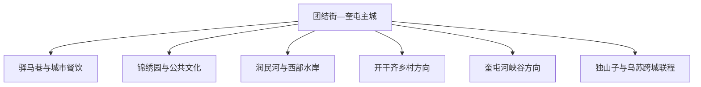
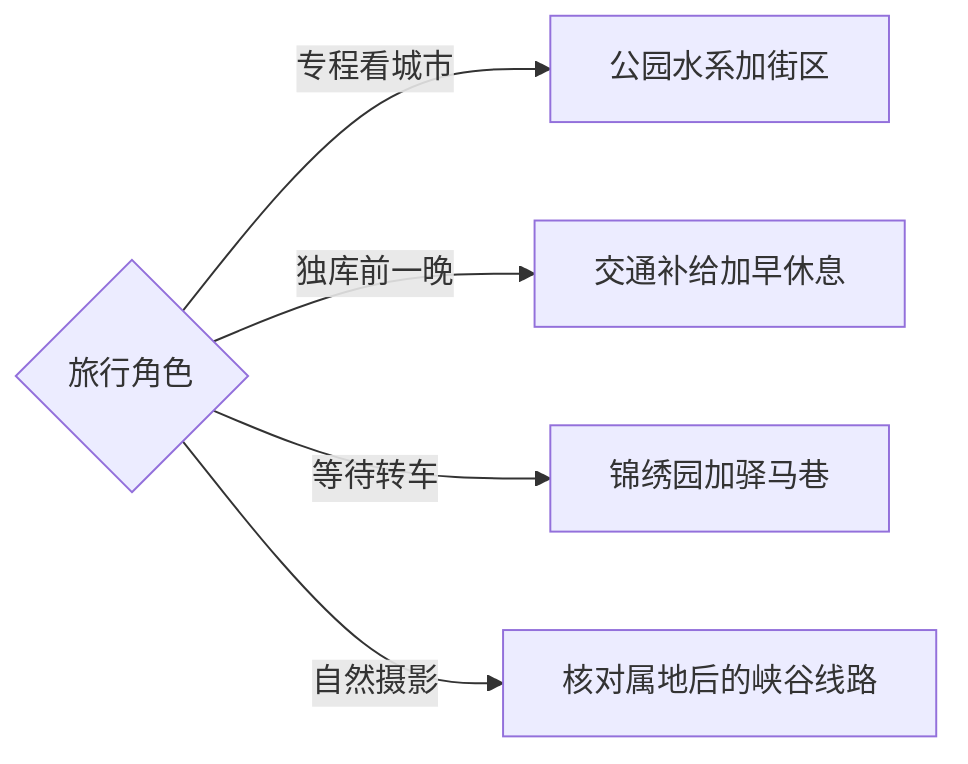

# 奎屯旅行指南

奎屯是伊犁哈萨克自治州直辖的县级市，也是天山北坡重要铁路、公路枢纽。它适合用一日至两日体验绿洲城市、公园水系、公共文化与夜间街区，再作为前往独库公路、乌苏、独山子和伊犁河谷的换乘基地。固定快照中的 **Ittipaq / GeoNames 1529355** 位于奎屯城区；伊犁州民政资料明确市政府驻团结街街道，地名与坐标可以相互闭合。

## 城市速览

| 项目 | 旅行信息 |
|---|---|
| 主要旅行价值 | 天山北坡枢纽城市、驿马巷、锦绣园、润民河水系与多地联程组织 |
| 建议停留 | 城区 1 天；加入乡村或奎屯河峡谷方向安排 2 天 |
| 较舒适季节 | 春秋适合城市漫步；夏季早晚活动更舒适；冬季可看雪景并关注道路结冰 |
| 预算特点 | 城区公共空间成本较低，远郊车辆和跨地联程是主要支出 |
| 步行强度 | 城区低至中；峡谷观景和乡村远点为中等 |
| 主要天气风险 | 大风、沙尘、冬季严寒和道路结冰，峡谷方向还需关注强降水与边坡安全 |
| 独行旅行 | 铁路与城区服务便利，远郊行程提前锁定往返车辆 |
| 亲子旅行 | 公园、文化馆和街区适合轻松组合，临水空间做好近距离看护 |
| 长者与低体力旅行 | 选择锦绣园、驿马巷和公共场馆，用车串联入口 |
| 无障碍信息 | 城市公园与新建公共空间可优先选择，连续通行条件需向场馆与景区确认 |

## 城市格局与游览区域

团结街、北京路和乌苏路一带构成主城服务核心，铁路站区位于城市南部。锦绣园、润民河生态园、驿马巷和公共文化场馆适合按东西方向组合。奎屯河峡谷、独库公路北段与周边山地涉及奎屯、乌苏、独山子等不同属地；行程以实际入口和主管部门公告确定行政归属，再安排车辆与住宿。

| 区域 | 主要内容 | 游览特点 | 与其他区域的关系 |
|---|---|---|---|
| 团结街—北京路 | 驿马巷、商圈、餐饮与住宿 | 步行和公交方便，夜间活跃 | 首访与交通日主线 |
| 锦绣园—公共文化区 | 锦绣园、文化艺术中心、图书馆等 | 室内外可切换 | 适合半日至一天 |
| 润民河水岸 | 生态园、水岸绿地与城市休闲 | 适合傍晚，临水注意看护 | 可接驿马巷夜间餐饮 |
| 开干齐乡村方向 | 花卉、乡村活动与绿洲农业 | 季节性和活动性较强 | 单独安排半日 |
| 奎屯河峡谷方向 | 峡谷地貌与远郊观景 | 入口属地、道路与天气决定可行性 | 预留半日至一天 |

## 主要景点

优先级用于分配时间：**A** 为城市首访核心，**B** 为按兴趣补充，**C** 为季节性或远郊项目。独山子大峡谷位于克拉玛依市独山子区，安集海大峡谷通常从沙湾方向组织，二者均按跨城目的地规划。

### 主城公园、街区与文化空间

| 景点 | 区域 | 类型 | 主要看点 | 建议用时 | 室内外 | 体力 | 预约风险 | 天气影响 | 优先级 |
|---|---|---|---|---:|---|---|---|---|---|
| 驿马巷旅游休闲街区 | 团结街周边 | 休闲街区 | 非遗文创、地方餐饮与夜间城市生活 | 2–3小时 | 混合 | 低 | 低 | 中 | A |
| 锦绣园风景区 | 城区 | 城市公园 | 解忧湖、林则徐主题与园林空间 | 2–3小时 | 室外为主 | 低 | 低 | 中 | A |
| 润民河生态园 | 城西水岸 | 城市生态 | 水系、绿地、步道与傍晚休闲 | 2–3小时 | 室外 | 低 | 低 | 高 | A |
| 奎屯市文化馆与图书馆 | 城区 | 公共文化 | 地方文化活动、阅读与公益展览 | 1–2小时 | 室内 | 低 | 中 | 低 | B |
| 雪莲广场及周边公共空间 | 城区 | 城市广场 | 市民活动、夜景与城市尺度 | 1小时 | 室外 | 低 | 低 | 中 | B |
| 乌苏路等餐饮街区 | 主城 | 城市生活 | 北疆餐饮、夜间消费与补给 | 2小时 | 混合 | 低 | 低 | 低 | B |

### 乡村与峡谷方向

| 景点 | 区域 | 类型 | 主要看点 | 建议用时 | 室内外 | 体力 | 预约风险 | 天气影响 | 优先级 |
|---|---|---|---|---:|---|---|---|---|---|
| 开干齐乡正式开放项目 | 城郊 | 乡村休闲 | 绿洲农业、花卉节庆与乡村生活 | 半天 | 室外为主 | 低中 | 中 | 高 | B |
| 奎屯河大峡谷官方开放观景方向 | 城外 | 峡谷地貌 | 河流切割、砾石层崖壁与天山北坡地貌 | 半天至1天 | 室外 | 中 | 高 | 高 | C |
| 独库公路北向联程节点 | 跨市交通线 | 风景公路 | 从绿洲平原进入天山山地的交通转换 | 1天以上 | 室外 | 中 | 高 | 很高 | 路线节点 |
| 奎独乌区域公共文化联动 | 跨城 | 区域联游 | 奎屯、独山子、乌苏三地不同城市主题 | 1–2天 | 混合 | 低中 | 中 | 中 | C |

峡谷行程使用正式道路、停车区和开放观景点，先确认入口所在行政区、运营主体和返程路线。铁路编组站、物流园、石化与能源设施承担生产功能，参访通过正式开放日或管理方预约进行。城市公园和水岸在大风、结冰或强降水时按现场管理调整。

## 美食与餐饮

奎屯汇集北疆多地风味，适合在乌苏路、团结街和驿马巷周边寻找抓饭、拌面、烤肉、大盘鸡、丸子汤、馕和奶制品。独库出发前一晚优先选择熟悉、不过量的正餐，并准备第二天的饮水和路餐。

| 菜品或餐饮类型 | 常见区域 | 一个人用餐与常见份量 | 风味、过敏原与饮食限制 | 排队风险与替代方法 |
|---|---|---|---|---|
| 抓饭与烤包子 | 主城餐馆与市场周边 | 单人点餐方便 | 常用羊肉和油脂，确认葡萄干、胡萝卜等配料 | 午餐高峰较忙，可错峰 |
| 拌面与炒面 | 全城 | 单人友好，可加菜 | 含小麦麸质，肉菜组合可提前沟通 | 同类店多，易找替代 |
| 烤肉与馕 | 驿马巷、乌苏路等 | 烤串便于控制份量 | 留意盐分、孜然和麸质 | 夜间热门街区较忙，往相邻街段分流 |
| 大盘鸡 | 城区聚餐餐馆 | 适合多人共享，单人询问小份 | 辣度、骨块和面食需留意 | 晚餐高峰可提前排号 |
| 奶茶与奶制品 | 城区及乡村活动 | 适合休息和尝味 | 乳糖不耐者先确认原料 | 节庆点位客流高，可在城区替代 |

清真餐饮场所按店内习惯用餐。峡谷或乡村日的服务点较分散，出发前确定午餐、饮水和返城时间；夏季车内食品选择耐高温包装，垃圾带回正规收集点。

## 经典行程

### 一日奎屯城市路线

**路线**：锦绣园 → 公共文化场馆 → 团结街城市生活 → 润民河生态园 → 驿马巷晚餐

- **串联逻辑**：白天以园林和场馆为主，傍晚转水岸与夜间街区，减少高温时段户外暴露。
- **预约锚点**：先核对文化馆、图书馆或临展开放时间。
- **休息安排**：午餐后在室内场馆休息，润民河步行按体力缩短。
- **时间不足时**：保留锦绣园、润民河和驿马巷，公共场馆按开放情况取舍。

### 两日城市与乡村路线

**第 1 天**：锦绣园—公共文化—润民河—驿马巷。  
**第 2 天**：开干齐乡正式开放项目—城区补给—交通枢纽观察。

- **串联逻辑**：第一天看紧凑主城，第二天理解绿洲农业和枢纽角色。
- **预约锚点**：乡村活动、花期和接待主体需要先确认。
- **休息安排**：乡村日把午餐和午休放在有稳定服务的点位。
- **时间不足时**：删除第二天乡村段，把交通补给合并到首日。

### 三日奎独乌联程

**第 1 天**：奎屯城区。  
**第 2 天**：乌苏市或奎屯河峡谷方向。  
**第 3 天**：独山子区与独库公路北端主题。

- **串联逻辑**：三天分别对应三个法定城市或明确远郊入口，住宿与车辆按实际目的地组织。
- **预约锚点**：第二、三日先核对属地、道路、景区与跨城车辆。
- **休息安排**：每天傍晚回到已确认住宿地，减少夜间陌生道路驾驶。
- **时间不足时**：保留奎屯城区和一个跨城主题，另一方向整体后移。

### 雨雪与大风路线

**路线**：文化馆或图书馆 → 室内餐饮 → 驿马巷可开放室内业态 → 住宿点休整

- **适用条件**：普通降水和大风采用短距离室内线；暴雪、沙尘或道路结冰预警时以减少移动为主。
- **预约锚点**：核对场馆、铁路和公路客运临时调整。
- **休息安排**：选择同一商圈用餐与停留，避免多次跨城。
- **时间不足时**：保留一个公共场馆和一段餐饮体验。

### 亲子或低体力路线

**亲子路线**：锦绣园 → 公共文化活动 → 午休 → 润民河短步道 → 驿马巷。  
**低体力路线**：车辆到锦绣园主入口 → 公共场馆 → 团结街餐饮 → 润民河就近观景。

- **减负方式**：亲子线在临水处保持近距离看护；低体力线用车缩短公园间步行并增加座休。
- **预约锚点**：儿童活动、无障碍入口和轮椅通行情况提前确认。
- **休息安排**：午后回住宿点或在公共场馆休息，傍晚再决定水岸段。
- **时间不足时**：保留锦绣园和驿马巷，润民河按天气与体力决定。

### 奎屯河峡谷方向路线

**路线**：奎屯城区 → 核对后的正式入口 → 开放观景点 → 原路返城

- **适用条件**：入口、属地和运营状态明确，天气稳定且车辆具备乡道行驶条件。
- **预约锚点**：确认导航终点、道路、停车、开放范围和返程车辆。
- **休息安排**：在城区完成补给，现场只在正式停车与休息区域停留。
- **时间不足时**：峡谷方向整段删除，改走锦绣园与润民河城市线。

### 独库出发前半日路线

**路线**：铁路或住宿点 → 城区车辆与物资检查 → 锦绣园短游 → 早晚餐 → 提前休息

- **串联逻辑**：把奎屯作为独库公路北向联程的准备基地，保留充足睡眠与车辆检查时间。
- **预约锚点**：核对独库公路开放、车型限制、施工管制、沿途住宿和加油点。
- **休息安排**：傍晚结束城市活动，第二天按官方建议时段出发。
- **时间不足时**：删除公园段，只保留补给、车况检查和休息。

## 住宿区域

| 区域 | 优点 | 缺点 | 适合人群 | 交通特点 |
|---|---|---|---|---|
| 团结街—北京路 | 餐饮、商圈和城市景点集中 | 夜间部分街段较热闹 | 首访、独行和城市慢游 | 到公园、水岸和站区均较均衡 |
| 奎屯站周边 | 铁路抵离和早晚车方便 | 城市游览氛围弱于中心商圈 | 晚到早走、长途联程 | 进团结街需短途接驳 |
| 城西与润民河周边 | 接近水岸、环境相对安静 | 到铁路站区距离较远 | 亲子、慢住和自驾 | 叫车或自驾更方便 |
| 独库联程型住宿 | 停车和车辆服务更实用 | 需仔细核对实际地址与经营资质 | 自驾与车队 | 重点确认停车、充电和早出路线 |

## 市内交通

| 场景 | 建议与取舍 | 行前需要重查的内容 |
|---|---|---|
| 从奎屯站抵达 | 公交、出租车或网约车进入团结街中心 | 列车时刻、夜间车辆与出站口 |
| 城区跨片区 | 公交和短途车连接锦绣园、润民河与商圈 | 线路调整、道路施工和活动管制 |
| 前往峡谷或乡村 | 自驾或预约车辆更便于往返 | 入口属地、路况、停车与返程 |
| 跨往独山子、乌苏 | 按独立城市行程核算交通和住宿 | 客运班次、道路施工与目的地开放 |

奎屯、乌苏和独山子距离较近，但分别属于伊犁州直县级市、塔城地区县级市和克拉玛依市辖区。名称中带“奎屯河”或从奎屯出发都不改变景点实际属地，导航前以官方入口地址完成核对。

## 不同旅行者须知

| 旅行维度 | 可行条件 | 主要取舍 | 需额外核对 |
|---|---|---|---|
| 独行旅行 | 城区服务密集、铁路方便 | 远郊拼车与返程确定性较低 | 合规车辆与返程时间 |
| 亲子旅行 | 公园、街区和公共文化可轻松组合 | 水岸与冬季低温增加照看要求 | 儿童活动和室内休息点 |
| 长者或低体力旅行 | 用车连接公园主入口 | 峡谷地面与长距离水岸步道更费体力 | 无障碍入口与停车位置 |
| 无障碍需求 | 新建公共空间可优先 | 公园内部连续通行资料有限 | 设施连续性需向官方确认 |
| 摄影旅行 | 水岸、雪景和城市夜景主题清晰 | 大风、低温和属地边界影响远郊拍摄 | 三脚架、航拍与停车规则 |
| 预算有限 | 城市公园和公共文化成本较低 | 远郊包车会明显增加预算 | 场馆免费政策与公交运营 |
| 晚出发或紧凑行程 | 锦绣园或驿马巷可做单点体验 | 峡谷与跨城线需要完整时段 | 最晚入场、列车与夜间交通 |
| 特殊天气 | 室内场馆和同商圈活动便于替换 | 大风、冰雪和沙尘会影响跨城路线 | 气象、路况与退改规则 |

## 行前核对

| 核对事项 | 为什么需要重查 | 建议核对时间 | 官方入口 |
|---|---|---|---|
| 公园、场馆与街区活动 | 节庆、展演和维护会改变开放状态 | 排入路线前及当天 | [奎屯市人民政府](https://www.xjkuitun.gov.cn/) |
| 峡谷入口与行政属地 | 同名地貌和不同导航点可能跨市县 | 预约车辆前 | [奎屯河大峡谷官方介绍](https://www.xjkuitun.gov.cn/xjkuitun/dmkt/201802/44d6aa292f724d9fba58df9785c05263.shtml) |
| 独库公路与跨城道路 | 季节开放、施工和天气管制变化快 | 出发前三日及当天 | [新疆交通运输厅](https://jtyst.xinjiang.gov.cn/) |
| 铁路交通 | 车次、到发站和票制持续变化 | 购票时及出发当天 | [中国铁路 12306](https://www.12306.cn/) |
| 天气与自然风险 | 大风、沙尘、严寒和结冰影响移动 | 出发前三日及当天 | [新疆气象局](https://xj.cma.gov.cn/) |

## 来源与更新记录

### 主要来源

| 来源 | 类型 | 支持内容 | 核验日期 |
|---|---|---|---|
| [奎屯市文体旅工作新闻发布会](https://www.xjkuitun.gov.cn/xjkuitun/xwfbh/202608/040edd8310144d34b07fc1d9ad8116e9.shtml) | 政府 | 驿马巷、润民生态园、锦绣园、公共场馆与乡村板块 | 2026-09-03 |
| [奎屯市人民政府：锦绣园](https://www.xjkuitun.gov.cn/xjkuitun/dmkt/201802/87f3b4271a1848d1adcdac58d67b3311.shtml) | 政府 | 锦绣园景区属性与主要空间 | 2026-09-03 |
| [奎屯市人民政府：奎屯河大峡谷](https://www.xjkuitun.gov.cn/xjkuitun/dmkt/201802/44d6aa292f724d9fba58df9785c05263.shtml) | 政府 | 峡谷旅行方向与官方命名 | 2026-09-03 |
| [伊犁州民政局：奎屯市行政区划](https://www.xjyl.gov.cn/xjylz/c112408/201909/53b114179fb64d4b888e76a3497a8766.shtml) | 政府 | 县级市范围与团结街驻地 | 2026-09-03 |
| [奎屯市城市公园体系规划](https://www.xjkuitun.gov.cn/xjkuitun/ghjh/202405/0d71628d3766484ba48e22df6566f9bd/files/82493eb986d144f38635be96161b67c7.pdf) | 政府 | 锦绣园、润民河公园与城市绿地体系 | 2026-09-03 |
| [GeoNames：Ittipaq](https://www.geonames.org/1529355/) | 地名数据库 | 固定城市点与坐标 | 2026-09-03 |

### 更新记录

| 日期 | 更新内容 |
|---|---|
| 2026-09-03 | 首次完成资料研究、行政边界核对与路线整理 |
