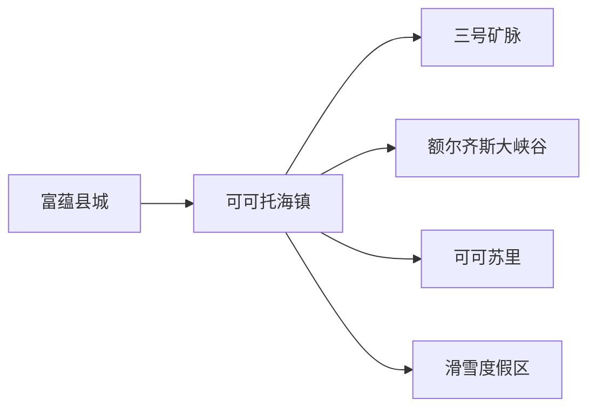
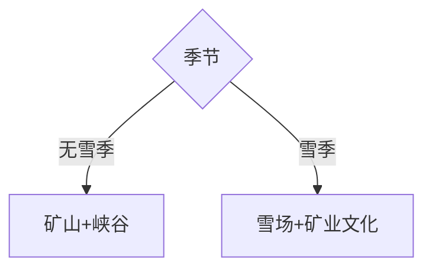

# 富蕴旅行指南

富蕴县的旅行核心不只在县城，更在东北方向的可可托海镇：三号矿脉与矿山公园讲工业史，额尔齐斯大峡谷与可可苏里展示地质生态，冬季滑雪场形成另一套住宿和交通逻辑。县城适合航空、公路补给，可可托海适合连续住两晚。

## 城市速览

| 项目 | 信息 |
|---|---|
| 主线 | 富蕴县城—可可托海镇—矿山公园—额尔齐斯大峡谷 |
| 停留 | 县城半日至1天；可可托海2–3天；滑雪另计 |
| 住宿 | 县城适合抵离；可可托海镇适合景区与雪场 |
| 交通 | 可可托海机场、公路与景区接驳 |
| 风险 | 山洪、落石、降雪、极寒、雪崩与矿山保护边界 |
| 取舍 | 夏秋选峡谷与矿山；冬季以雪场为核心 |

## 城市格局与游览区域

县城与机场是抵离模块；可可托海镇承担住宿与矿业历史；地质公园各景区入口分别核对。卡拉麦里保护区和仍在生产的矿区属于另一管理尺度。

## 主要景点

| 景点 | 区域 | 类型 | 核心体验 | 用时 | 环境 | 体力 | 研究价值 | 拥挤 | 优先级 |
|---|---|---|---|---:|---|---|---|---|---|
| 三号矿脉与国家矿山公园 | 可可托海 | 工业地质 | 稀有金属矿业史与矿坑地貌 | 3–5小时 | 混合 | 中 | 高 | 高 | A |
| 额尔齐斯大峡谷 | 可可托海 | 花岗岩峡谷 | 神钟山、河谷与森林步道 | 5–8小时 | 室外 | 高 | 高 | 高 | A |
| 可可苏里 | 可可托海方向 | 湿地湖泊 | 芦苇、水鸟与山地前景 | 2–3小时 | 室外 | 低 | 中高 | 中 | B |
| 伊雷木湖正式观景区 | 可可托海 | 湖泊 | 高寒湖泊与矿业小镇关系 | 1–2小时 | 室外 | 低 | 中 | 中 | B |
| 可可托海地质陈列与文化场馆 | 镇区 | 科普 | 矿物、地震与建设史 | 2–4小时 | 室内 | 低 | 高 | 中 | A |
| 可可托海国际滑雪度假区 | 山地 | 冰雪 | 长雪季与高山雪道 | 1–4天 | 室外 | 高 | 中高 | 高 | C |

三号矿坑、矿洞和展陈按矿山公园整体组织；峡谷内部峰石按一个景区计算。现役矿山、废弃坑道、地质灾害区、湿地非开放区和野生动物保护地使用管理边界。

## 美食与餐饮

县城与可可托海镇可选抓饭、拌面、烤肉、奶制品和冷水鱼；点鱼先问重量与来源。滑雪或峡谷日提前确认早餐、路餐、过敏原和晚间供餐。

## 经典行程

### 两日可可托海基础线
**路线**：矿山公园—峡谷。**逻辑**：人文与自然各一天。**预约锚点**：门票和接驳。**休息**：镇区。**删除条件**：恶劣天气先删峡谷。

### 三日地质全线
**路线**：可可苏里—矿山—峡谷。**逻辑**：从湿地到矿脉与花岗岩。**预约锚点**：三个入口。**休息**：每天只排一大项。**删除条件**：时间不足删可可苏里。

### 冬季滑雪线
**路线**：镇区—雪场连续滑雪。**逻辑**：住宿围绕雪场。**预约锚点**：雪票装备道路。**休息**：半日回暖。**删除条件**：雪场停运时改矿业文化。

### 县城抵离线
**路线**：机场或县城—补给—转住可可托海。**逻辑**：转场日保持轻量。**预约锚点**：航班与车辆。**休息**：县城午餐。**删除条件**：晚到时县城住一晚。

### 工业遗产线
**路线**：地质陈列—三号矿脉—镇区旧工业空间。**逻辑**：按生产史阅读。**预约锚点**：讲解与开放区。**休息**：室内外交替。**删除条件**：矿山公园关闭时只留场馆。

### 亲子科普线
**路线**：陈列馆—可可苏里—矿山近入口。**逻辑**：降低峡谷强度。**预约锚点**：儿童服务。**休息**：每两小时回镇。**删除条件**：低温或大风时保留室内。

### 低体力替代线
**路线**：可可苏里—伊雷木湖正式观景—镇区场馆。**逻辑**：车辆串联短步行。**预约锚点**：落客与卫生间。**休息**：午后长休。**删除条件**：道路不稳时只做镇区。

## 住宿区域

富蕴县城适合机场和公路中转；可可托海镇适合矿山、大峡谷与雪场。冬季确认供暖、装备存放、接驳与取消政策，旺季确认停车和餐饮。

## 市内交通

机场距县城和可可托海景区均需地面接驳；县城到可可托海落实完整车辆。景区内部按运营车辆和步道移动，冬季准备防滑与延误余量。

## 不同旅行者须知

徒步者按开放步道和天气选线；滑雪者按能力分级并购买适用保险；亲子长者以场馆、湿地和近入口为主；摄影者遵守矿区、保护地和无人机规则。

## 行前核对

- 核对大峡谷、矿山公园、可可苏里和雪场运营。
- 核对机场、县城—可可托海车辆与冬季道路。
- 矿山、坑道、地灾区、湿地和保护区按正式开放范围进入。

## 来源与更新记录

| 来源 | 支持内容 | 核验日期 |
|---|---|---|
| [新疆自然资源厅：可可托海地质公园](https://zrzyt.xinjiang.gov.cn/xjgtzy/kpjd/202010/0e2f6c918c3d4233951c1943adea24a3.shtml) | 三号矿脉、峡谷、可可苏里与地质科普 | 2026-09-01 |
| [新疆文旅厅：可可托海景区](https://wlt.xinjiang.gov.cn/wlt/c112782/202208/ff929404c3a247c7a98a9ca58e17a02b.shtml) | 景区组成与旅行尺度 | 2026-09-01 |
| [新疆自然资源厅：矿业遗迹保护](https://zrzyt.xinjiang.gov.cn/xjgtzy/gzdt/202508/7c160a7dcb364a51891250472910b958.shtml) | 矿业史、生态修复与风险边界 | 2026-09-01 |
| [GeoNames 1529504](https://www.geonames.org/1529504/) | 富蕴固定居民点 | 2026-09-01 |
| [Wikidata Q1023090](https://www.wikidata.org/wiki/Q1023090) | 富蕴县实体与代码 | 2026-09-01 |

| 日期 | 更新 |
|---|---|
| 2026-09-01 | 首次完成富蕴旅行研究；建立县城、可可托海矿山、峡谷与雪季结构 |
