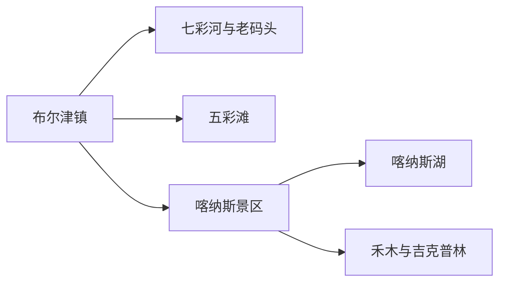
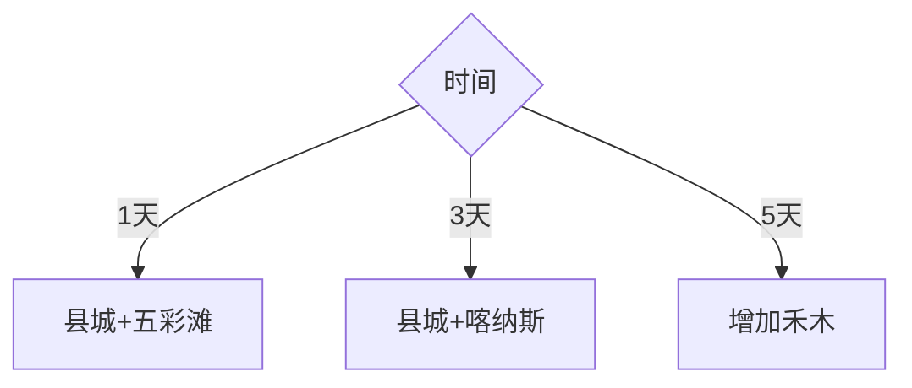

# 布尔津旅行指南

布尔津镇是额尔齐斯河畔的县城和北上喀纳斯的重要补给地，适合用七彩河、老码头记忆和地方饮食组成轻量城市日。五彩滩位于县城外，喀纳斯、禾木与吉克普林则是需要换乘、预约和住宿的山地景区；把县城、五彩滩和喀纳斯景区分成三个尺度，行程最清楚。

## 城市速览

| 项目 | 信息 |
|---|---|
| 主线 | 布尔津镇—五彩滩—喀纳斯或禾木多日线 |
| 停留 | 县城 1 天；五彩滩半日；喀纳斯—禾木 2–4 天 |
| 住宿 | 县城适合补给；景区内外住宿围绕入口与区间车选择 |
| 交通 | 公路、喀纳斯机场接驳、景区区间车；冬季另核对封路 |
| 风险 | 山洪、降雪、风吹雪、低温、林草防火与边境管理 |
| 边界 | 河岸、湿地、林区、牧场、边境村与自然保护区按开放范围进入 |

## 城市格局与游览区域

| 区域 | 适合内容 | 怎么选 |
|---|---|---|
| 县城 | 住宿、补给、滨河与城市文化 | 抵离日或完整 1 天 |
| 五彩滩 | 雅丹、额尔齐斯河与日落 | 半日，预留夜间返县城交通 |
| 喀纳斯景区 | 湖泊、森林、河湾与景区村落 | 至少 2 天并按入口换乘 |
| 禾木—吉克普林 | 村落、山谷与滑雪 | 独立住宿模块，按季节选择 |

## 主要景点

| 景点 | 区域 | 类型 | 核心体验 | 用时 | 环境 | 体力 | 研究价值 | 拥挤 | 优先级 |
|---|---|---|---|---:|---|---|---|---|---|
| 七彩河休闲区 | 县城 | 滨水城市 | 河岸、夜景与城市休息 | 1–3小时 | 室外 | 低 | 中 | 中 | A |
| 中苏航运与老码头相关展陈 | 县城 | 城市史 | 额尔齐斯河航运与边城记忆 | 1–2小时 | 混合 | 低 | 高 | 低 | B |
| 五彩滩景区 | 县城北向 | 雅丹地貌 | 彩色丘陵与河谷林带 | 3–5小时 | 室外 | 中 | 高 | 高 | A |
| 喀纳斯湖景区 | 喀纳斯 | 地质生态 | 冰川湖、森林与河湾 | 1–2天 | 室外 | 中高 | 高 | 极高 | A |
| 禾木村正式游览区 | 喀纳斯 | 村落山谷 | 聚落、白桦林与季节景观 | 1–2天 | 混合 | 中高 | 高 | 极高 | B |
| 吉克普林滑雪度假区 | 禾木方向 | 冰雪 | 高山滑雪与冬季山谷 | 1–3天 | 室外 | 高 | 中高 | 高 | C |

喀纳斯湖、河湾、观鱼台与景区交通按一个大型景区组织；禾木村与吉克普林按同一住宿方向统筹。河滩、林区、牧场和边境管理区使用正式入口与步道。

## 美食与餐饮

冷水鱼按鱼种、重量和来源点餐；烤肉、抓饭、拌面适合县城补给；奶制品、坚果和蜂蜜先问配料与保存。进入山地前准备饮水和易保存路餐，垃圾带回服务点。

## 经典行程

### 一日县城线
**路线**：七彩河—老码头展陈—晚餐。**逻辑**：轻量认识边城。**预约锚点**：场馆。**休息**：午后。**删除条件**：恶劣天气时保留室内。

### 一日五彩滩线
**路线**：县城—五彩滩—返城。**逻辑**：日落与返程绑定。**预约锚点**：门票和车辆。**休息**：景区服务区。**删除条件**：大风或道路管制时取消。

### 三日喀纳斯线
**路线**：县城—喀纳斯换乘—景区完整日—返程。**逻辑**：住一晚减少折返。**预约锚点**：门票、区间车、住宿。**休息**：河湾与村落间分段。**删除条件**：封路时保留县城。

### 五日喀纳斯禾木线
**路线**：县城—喀纳斯—禾木—县城。**逻辑**：两地分别住宿。**预约锚点**：跨景区交通和退改。**休息**：转场日少排景点。**删除条件**：时间不足先删禾木。

### 冬季滑雪线
**路线**：县城—禾木住宿—吉克普林。**逻辑**：围绕雪场运营。**预约锚点**：雪票、装备、道路。**休息**：每半日回暖。**删除条件**：风雪或雪场停运时取消。

### 亲子科普线
**路线**：县城展陈—五彩滩短段—喀纳斯河湾。**逻辑**：地貌与水系科普。**预约锚点**：儿童票和卫生间。**休息**：区间车站。**删除条件**：儿童疲劳时只留县城。

### 低体力替代线
**路线**：县城滨水短段—车辆到五彩滩近入口。**逻辑**：减少山地台阶。**预约锚点**：落客与内部交通。**休息**：酒店长休。**删除条件**：低温大风时改室内。

## 住宿区域

县城适合公路抵离、餐饮和补给；贾登峪、喀纳斯村、禾木分别对应不同入口与夜间环境。订房时同步确认区间车、行李转运、供暖、餐饮、退改和次日出发点。

## 市内交通

县城内短途用车较方便；五彩滩落实返城车辆。喀纳斯和禾木按景区交通规则换乘，喀纳斯机场只作为到达节点，航班与景区入口之间另算接驳。

## 不同旅行者须知

独行者优先官方区间车和明确住宿；自驾者把车辆停放、换乘和冬季防滑写进行程；亲子与长者减少连续河湾台阶；摄影者在正式观景台活动并遵守边境、无人机和林草防火规定。

## 行前核对

- 核对喀纳斯、禾木、吉克普林的门票、区间车、入口与住宿。
- 核对五彩滩日落后返程、县城场馆与机场接驳。
- 核对山洪、降雪、风吹雪、森林防火和边境证件。

## 来源与更新记录

| 来源 | 支持内容 | 核验日期 |
|---|---|---|
| [新疆政府：布尔津绿色城市](https://www.xinjiang.gov.cn/xinjiang/dzdt/202409/d568c51e7a304d88a6091ee24b67970f.shtml) | 县城、七彩河与城市服务 | 2026-09-01 |
| [新疆自然资源厅：喀纳斯地质公园](https://zrzyt.xinjiang.gov.cn/xjgtzy/kpjd/202010/22b9bef9e4fc47638e7eac92c2936e47.shtml) | 喀纳斯属地、地质与保护 | 2026-09-01 |
| [新疆政府：布喀公路](https://www.xinjiang.gov.cn/xinjiang/dzdt/202104/50678d97767a4619969663e1806b2f07.shtml) | 县城、五彩滩、机场和喀纳斯交通关系 | 2026-09-01 |
| [GeoNames 1529574](https://www.geonames.org/1529574/) | 布尔津固定居民点 | 2026-09-01 |
| [Wikidata Q1016896](https://www.wikidata.org/wiki/Q1016896) | 布尔津县实体与代码 | 2026-09-01 |

| 日期 | 更新 |
|---|---|
| 2026-09-01 | 首次完成布尔津旅行研究；拆分县城、五彩滩、喀纳斯与禾木尺度 |
