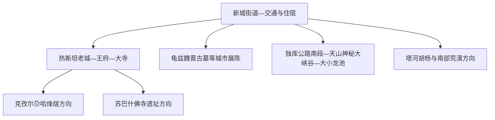
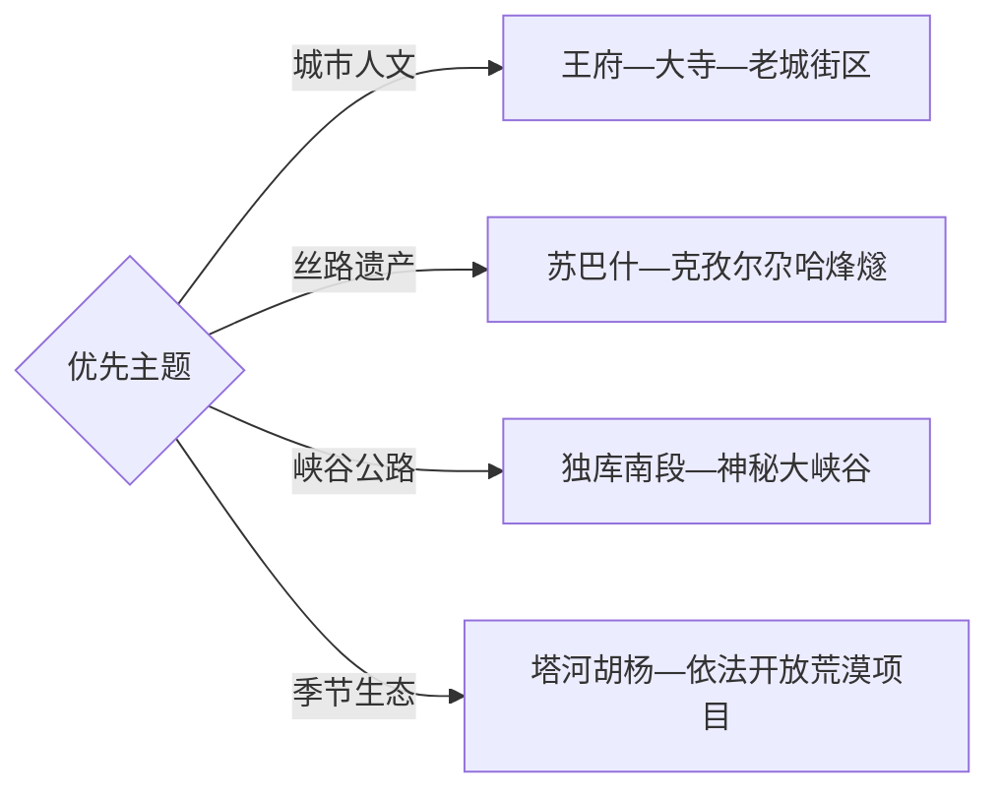

# 库车旅行指南

库车位于天山南麓、塔里木盆地北缘，是理解龟兹文明、丝路遗产和独库公路南端山地的关键县级市。固定快照中的 **Xincheng / GeoNames 1529363** 对应新城街道；自治区撤县设市文件明确库车市政府驻新城街道，因而可用该点锚定现行库车市范围。

## 城市速览

| 项目 | 信息 |
|---|---|
| 主线 | 库车老城—龟兹文化—苏巴什与烽燧—天山峡谷与独库公路南段 |
| 停留 | 城区 1 天；遗产远点和峡谷各需 1 天，完整体验建议 3–4 天 |
| 住宿 | 新城街道交通便利；老城周边适合夜间街区与饮食体验 |
| 交通 | 库车具备航空、铁路与公路枢纽；远郊遗产和峡谷更适合包车或自驾 |
| 季节 | 春秋适合遗址与峡谷；夏季早出避热并关注山洪；独库公路按季节开放 |
| 预算 | 远郊车辆、景区门票和讲解是主要成本，城区饮食与住宿梯度丰富 |

## 城市格局与游览区域

新城街道集中了行政、交通和现代城市服务，热斯坦及周边老城适合步行理解龟兹、清代城址与当代社区生活。苏巴什佛寺遗址、克孜尔尕哈烽燧和天山神秘大峡谷分处城外不同方向，宜按整日线路安排。克孜尔石窟位于拜城县，适合另日跨县联动，行程中明确行政边界和返程时间。

## 主要景点

| 景点 | 区域 | 类型 | 核心体验 | 用时 | 环境 | 体力 | 研究价值 | 拥挤 | 优先级 |
|---|---|---|---|---:|---|---|---|---|---|
| 库车王府 | 老城 | 博物馆与历史建筑 | 库车地方史、王府沿革与龟兹文化展陈 | 2–3小时 | 混合 | 低 | 高 | 旺季中高 | A |
| 库车大寺 | 老城 | 宗教建筑 | 建筑空间、社区生活与地方文化 | 1小时 | 混合 | 低 | 高 | 礼拜时中 | A |
| 热斯坦历史街区 | 老城 | 街区 | 彩色门窗、传统民居、市场与日常饮食 | 2–3小时 | 室外 | 低 | 高 | 傍晚高 | A |
| 苏巴什佛寺遗址 | 城北遗产区 | 世界遗产 | 龟兹佛教建筑群、河谷遗址与考古保护 | 半天 | 室外 | 中 | 很高 | 中 | A |
| 克孜尔尕哈烽燧 | 城西北 | 世界遗产 | 汉代烽燧、丝路交通与盐水沟地貌 | 2–3小时 | 室外 | 低中 | 很高 | 中 | A |
| 天山神秘大峡谷 | 独库公路南段 | 地质景观 | 红层峡谷、侵蚀地貌与山地光影 | 半天 | 室外 | 中高 | 很高 | 旺季高 | A |
| 龟兹魏晋古墓遗址相关展陈 | 城区 | 考古展陈 | 多元文化交流、墓葬形制与考古方法 | 1–2小时 | 室内 | 低 | 很高 | 中 | B |
| 库车老城民居与城市博物馆群 | 老城 | 城市文化 | 清代城址、民居保护与社区型展陈 | 2小时 | 混合 | 低 | 高 | 中 | B |
| 大小龙池开放观景点 | 独库公路山地 | 高山湖泊 | 天山湖泊、云杉与道路景观 | 半天 | 室外 | 中 | 高 | 旺季中高 | B |
| 塔河胡杨或南部开放生态项目 | 库车南部 | 荒漠生态 | 胡杨、河流与塔里木盆地环境 | 半天至1天 | 室外 | 中 | 中高 | 秋季中高 | C |

苏巴什佛寺遗址和克孜尔尕哈烽燧都是世界遗产点，各自按完整保护与运营单元计算。石窟、古城、墓葬和考古现场以正式开放范围为边界；壁画与文物拍摄遵守现场规定。天山峡谷遇到强降雨、落石或山洪预警时，按照景区疏散与道路管控安排调整路线。

## 美食与餐饮

库车饮食适合从馕、烤包子、抓饭、拌面、烤肉、鸽子汤和库车小白杏等线索进入。老城可安排早餐、茶点和傍晚街区餐饮，新城更适合交通日、多人聚餐和稳定补给。点大份肉食或抓饭前先确认份量，多人分食更容易尝到不同品类。

远郊遗产和峡谷日应在城区吃好早餐并携带足量饮水、盐分和便携食物。清真餐饮场所尊重店内习惯；过敏原、素食和儿童餐需求在点菜时直接说明。胡杨或荒漠方向服务点分散，司机与旅行者可在出发前共同确定午餐和返城时间。

## 经典行程

### 一日库车老城路线

- 路线：库车王府—库车大寺—热斯坦历史街区—城市展陈—老城晚餐。
- 逻辑：步行串联核心人文点，用一日理解龟兹传统、清代城址和当代生活。
- 预约：提前核对王府、博物馆和宗教场所开放时段。
- 休息：午后在室内展陈或茶馆避热，傍晚再走街区。
- 删除：时间紧时保留王府、热斯坦和一处公共展陈。

### 两日城市与丝路遗产路线

- 路线：第一天老城；第二天克孜尔尕哈烽燧—苏巴什佛寺遗址—返城。
- 逻辑：先建立城市历史框架，再到两处世界遗产点观察丝路交通与佛教建筑。
- 预约：确认两处遗产开放、讲解与车辆安排，并为检查站和道路留出缓冲。
- 休息：遗址之间在合规服务点补水，避免正午连续暴晒。
- 删除：大风或高温时二选一，并把城市室内展陈作为替代。

### 三日龟兹与峡谷路线

- 路线：第一天老城；第二天苏巴什与烽燧；第三天天山神秘大峡谷及独库南段开放观景点。
- 逻辑：把城市、遗产和自然地貌分为三个完整主题日。
- 预约：第三日核对独库公路、峡谷门票、区间交通和天气预警。
- 休息：峡谷内按体力控制深入距离，固定时间返回入口。
- 删除：道路关闭时把第三天改为城区考古展陈与民居博物馆群。

### 雨天或大风路线

- 路线：王府室内展陈—龟兹魏晋古墓相关展陈—城市博物馆群—老城餐饮。
- 逻辑：用室内文博替代峡谷、烽燧和裸露遗址，把天气窗口留给下一天。
- 预约：逐一核对场馆临时闭馆和入馆证件要求。
- 休息：场馆之间用车辆短接，减少风沙和积水路段暴露。
- 删除：仍受天气影响的户外街区放到傍晚再判断。

### 亲子或低体力路线

- 路线：王府—老城短步行—城市考古展陈—特色午餐。
- 逻辑：以可控的室内空间和短距离街区保留核心文化体验。
- 预约：确认讲解、无障碍设施、儿童票和休息区。
- 休息：每个场馆后安排坐休，午后回住宿点恢复体力。
- 删除：远郊遗址与峡谷留到具备车辆和体力条件的独立日。

### 世界遗产专题路线

- 路线：苏巴什佛寺遗址—克孜尔尕哈烽燧—库车城市遗产展陈。
- 逻辑：从佛教传播、军事交通和城市考古三个角度理解丝路网络。
- 预约：优先预约官方讲解或选择具有合规资质的文化线路。
- 休息：在两处遗产之间安排车内休息、午餐和补水。
- 删除：单日光照或风力过强时只保留一处遗址，增加室内展陈。

### 独库公路南段路线

- 路线：库车城区—盐水沟地貌—天山神秘大峡谷—大小龙池开放点—按管控原路或继续北行。
- 逻辑：以道路开放状态为前提，连续观察红层峡谷到高山湖泊的海拔变化。
- 预约：核对独库公路季节开放、车型限制、景区预约、油量与返程住宿。
- 休息：每两小时安排停车休息，使用正式停车区和服务点。
- 删除：山洪、降雪、落石或交通管制时整段取消，改走城市人文线。

## 住宿区域

| 区域 | 适合人群 | 优点 | 取舍 |
|---|---|---|---|
| 新城街道与交通枢纽周边 | 首访、铁路或航空抵离者 | 现代服务、打车和行李转运方便 | 去老城需短途交通 |
| 热斯坦老城周边 | 人文、摄影与夜间餐饮旅行者 | 步行接近王府、大寺和传统街区 | 选择住宿时关注停车、隔音和消防条件 |
| 独库南端或远郊合规住宿 | 自驾、峡谷和公路主题旅行者 | 便于早出发或分段行驶 | 服务点较少，须提前确认经营季节与补给 |

首次到访通常住新城更稳妥，再用出租车前往老城。自驾若次日走独库公路，选择带正规停车和清晰取消规则的住宿；高峰季节可把返程城市和备选线路一起预订，留出道路关闭时的调整空间。

## 市内交通

库车有铁路、机场和国道连接，订票时核对“库车”实际到发站与机场，不用城市名推测距离。新城与老城之间可用公交、出租车或网约车；老城内部更适合步行，但夏季午后把连续户外时间压短。

苏巴什、克孜尔尕哈烽燧、天山神秘大峡谷和大小龙池距离城区较远，公共交通衔接有限，包车或自驾更容易控制停留时间。克孜尔石窟属于拜城县，跨县联动需另算往返。进入油气田、矿区、铁路作业区和边远乡村时，线路始终沿公共道路与正式开放目的地组织。

## 不同旅行者须知

- 首次到访者：用老城一日加丝路遗产一日建立完整认识，峡谷作为第三天。
- 历史爱好者：为苏巴什、烽燧和城市考古展陈预约讲解，现场信息比打卡数量更重要。
- 摄影旅行者：老城拍摄先征得居民同意；遗址、宗教场所和考古展陈遵守拍摄标识。
- 亲子家庭：优先王府、城市展陈和短街区，峡谷日准备防晒、饮水和替换衣物。
- 老年旅行者：远郊日采用车辆点到点，减少正午遗址步行与峡谷深走。
- 自驾旅行者：独库公路以实时路况为行程开关，准备离线地图、饮水、保暖层和足量燃油。
- 户外旅行者：峡谷与荒漠活动关注山洪、落石、风沙、温差和通信，选择具备应急能力的线路。

## 行前核对

- 库车王府、博物馆、苏巴什、克孜尔尕哈烽燧和峡谷的开放时段与实名预约。
- 独库公路季节开放、车型限制、临时管制、降雪与山洪预警。
- 铁路、航班和远郊车辆的实际到发点及返程时间。
- 世界遗产、宗教场所、考古遗址和居民街区的参观与拍摄规则。
- 身份证件、防晒防风层、饮水、常用药、离线地图和车辆应急用品。
- 跨往拜城、阿克苏或巴音郭楞方向时的行政边界、里程与住宿安排。

## 来源与更新记录

| 来源 | 类型 | 用途 | 核验日期 |
|---|---|---|---|
| [新疆维吾尔自治区人民政府：库车市文物保护利用示范区](https://www.xinjiang.gov.cn/xinjiang/dzdt/202402/c394b199c6cf48279e38b6a25851b418.shtml) | 政府 | 文物数量、核心遗产与保护利用方向 | 2026-09-03 |
| [新疆维吾尔自治区人民政府：新疆库车旅游](https://www.xinjiang.gov.cn/xinjiang/dzdt/202205/d2b86cfa1dd04b5b98764fb7148b00b8.shtml) | 政府 | 老城、遗产、峡谷、独库与胡杨主题 | 2026-09-03 |
| [新疆维吾尔自治区自然资源厅：库车天山大峡谷地貌](https://zrzyt.xinjiang.gov.cn/xjgtzy/dzyjxq1/202301/99c37fe8e5964eaf811aa7f8f79cf43d.shtml) | 政府 | 神秘大峡谷地质属性 | 2026-09-03 |
| [新疆维吾尔自治区人民政府：撤销库车县设立县级库车市](https://www.xinjiang.gov.cn/xinjiang/zfgbxx/202006/e34d6f2e129f43089b11696dd2c3ae53/files/4fceb248dce74a7aae2e447d873470dc.pdf) | 政府 | 现行市域与新城街道驻地 | 2026-09-03 |
| [联合国教科文组织世界遗产中心：丝绸之路长安—天山廊道路网](https://whc.unesco.org/en/list/1442/) | 国际组织 | 苏巴什与克孜尔尕哈烽燧的世界遗产框架 | 2026-09-03 |
| [GeoNames：Xincheng](https://www.geonames.org/1529363/) | 地名数据库 | 固定人口点与坐标 | 2026-09-03 |

实时场馆、景区和道路信息以库车市、阿克苏地区及新疆交通部门当日公告为准；铁路信息可在[中国铁路 12306](https://www.12306.cn/)核对，天气预警可在[新疆气象局](https://xj.cma.gov.cn/)核对。
