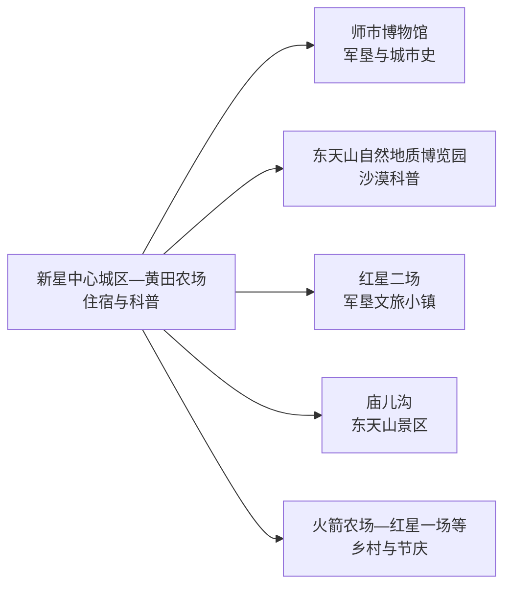
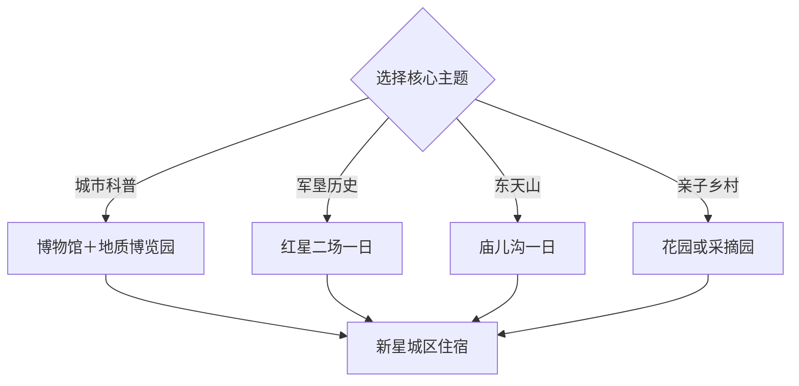

# 新星旅行指南

新星是第十三师师市合一城市，位于哈密绿洲与东天山之间。中心城区适合地质科普、城市博物馆和沙漠公园，红星二场集中军垦历史，庙儿沟与其他团场方向则按道路、季节和开放安排。建议停留 2–3 天。

本页使用 GeoNames **1538518**（黄田农场）定位新星市政府驻地一带的建市前真实地名，法定对象以代码 `659011` 和 Wikidata `Q105300298` 为准。该记录位于固定 `cities500` 快照外，只计入法定县级市覆盖。

## 城市速览

| 项目 | 信息 |
|---|---|
| 主线 | 新星城区—师市博物馆—东天山地质博览园—红星二场—庙儿沟 |
| 停留 | 城区 1 天；红星二场 1 天；庙儿沟或乡村体验另留 1 天 |
| 住宿 | 新星城区与哈密主城均可落脚，连续跨城需计入接驳时间 |
| 交通 | 哈密方向接入方便，红星二场、庙儿沟与团场以预约车辆为主 |
| 季节 | 春秋适合沙漠公园与遗址，夏季避开正午，冬季按冰雪道路安排 |
| 预算 | 城区公共场馆较节制，远线车辆、讲解和体验项目增加支出 |

## 城市格局与游览区域

新星中心城区紧邻哈密交通圈，但法定新星市与哈密市伊州区分别管理。红星二场、庙儿沟和各团场按实际道路分日；星星峡等哈密市辖点依属地另行规划。沙漠、山地、文物遗址、农田、水利、矿山和工业区域执行正式开放与生产边界。

## 主要景点

| 景点 | 区域 | 类型 | 核心体验 | 用时 | 环境 | 体力 | 预约风险 | 天气影响 | 优先级 |
|---|---|---|---|---:|---|---|---|---|---|
| 十三师新星市博物馆 | 中心城区 | 博物馆与军垦史 | 师市历史、军垦文物和红色记忆 | 2–3小时 | 室内 | 低 | 高 | 低 | A |
| 东天山自然地质博览园 | 中心城区 | 沙漠公园与科普 | 胡杨、陨石、模拟地质和亲子研学 | 2–4小时 | 室外为主 | 低中 | 高 | 很高 | A |
| 地质科技博物馆当期开放区 | 中心城区 | 科技馆 | 东天山地质、矿物与自然科普 | 1.5–2小时 | 室内 | 低 | 很高 | 低 | B |
| 红星军垦博物馆 | 红星二场 | 军垦与红色历史 | 红星部、屯垦文物和团场历史 | 2小时 | 室内 | 低 | 高 | 低 | A |
| 军垦地窝子遗址公开区 | 红星二场 | 遗址与研学 | 早期屯垦居住环境和现场教学 | 1–2小时 | 室外为主 | 低 | 高 | 高 | B |
| 红星二场老机关旧址 | 红星二场 | 历史建筑 | 团场治理、生活史和修复展示 | 1–2小时 | 混合 | 低 | 高 | 中 | B |
| 八大石古村落遗址景区 | 师市团场方向 | 村落遗址 | 古村遗存、地方历史和乡村更新 | 2–3小时 | 室外为主 | 中 | 很高 | 高 | B |
| 东疆夏宫·庙儿沟景区 | 东天山方向 | 山地与历史 | 山谷、避暑与历史遗存 | 半天至1天 | 室外 | 中高 | 很高 | 很高 | A |
| 火箭农场百花园当期项目 | 火箭农场 | 花园与乡村 | 花卉、节庆和近郊休闲 | 2–3小时 | 室外 | 低 | 很高 | 高 | C |
| 红星一场正式采摘园 | 红星一场 | 农业与乡村 | 葡萄、红枣或时令采摘 | 2–3小时 | 室外 | 低 | 很高 | 高 | C |

## 美食与餐饮

新星可选择哈密瓜、红枣、葡萄、抓饭、烤肉、拌面和大盘鸡。城区餐饮更稳定，团场与庙儿沟方向提前确认午餐和饮水；牛羊肉、坚果、乳制品、辣度与清真餐需求在点餐时说明。

## 经典行程

### 城区科普线
**路线**：十三师新星市博物馆—午餐—地质科技博物馆—东天山自然地质博览园。**逻辑**：军垦历史与自然科普连成城市首日。**预约锚点**：两馆与园区开放。**休息**：博物馆或园区服务点。**删除条件**：高温时把沙漠公园移到傍晚。

### 红星二场线
**路线**：城区—红星军垦博物馆—老机关旧址—地窝子遗址—军垦文旅小镇。**逻辑**：按团场历史形成完整红色主题日。**预约锚点**：讲解、场馆和车辆。**休息**：文旅小镇。**删除条件**：场馆或遗址维护时缩短为公开展陈。

### 庙儿沟山地线
**路线**：城区—东疆夏宫·庙儿沟正式入口—核心游线—返城。**逻辑**：东天山远线单独安排。**预约锚点**：景区开放、车辆和天气。**休息**：游客中心。**删除条件**：降雪、山洪、落石或道路管制时取消。

### 八大石遗址线
**路线**：城区—八大石古村落遗址景区—团场午餐—返城。**逻辑**：古村遗存与乡村更新集中体验。**预约锚点**：景区营业和车辆。**休息**：正式服务点。**删除条件**：景区暂停时改师市博物馆深度参观。

### 亲子沙漠线
**路线**：地质科技博物馆—午餐—东天山自然地质博览园短线。**逻辑**：室内科普与低强度户外结合。**预约锚点**：儿童项目、服务费和开放区。**休息**：馆内及园区。**删除条件**：沙尘、高温或大风时保留室内馆。

### 花果节庆线
**路线**：火箭农场百花园或红星一场采摘园—团场午餐—当期节庆。**逻辑**：按花期、果期只选一个团场。**预约锚点**：日期、接待和采摘价格。**休息**：正式农庄。**删除条件**：错过季节时改城区公园。

### 三日完整线
**路线**：首日城区科普，次日红星二场，第三日庙儿沟或乡村活动。**逻辑**：城市、军垦与山地分日。**预约锚点**：远线车辆、讲解和退改。**休息**：连续住新星城区。**删除条件**：压缩为两天时按天气删除第三日。

## 住宿区域

新星中心城区适合博物馆、地质园与团场换乘。哈密主城住宿选择更多，适合区域联程，往返时把跨行政区接驳计入每日时间；红星二场或庙儿沟周边住宿按当季接待选择，并核对供暖、餐饮、网络和退改。

## 市内交通

哈密机场、铁路站与新星城区之间按实际属地和当天交通衔接。城区点位较集中，红星二场、庙儿沟、八大石和其他团场以预约车辆更稳妥。沙漠与东天山道路受高温、沙尘、降雪、山洪和结冰影响；遗址、农田、水渠、矿山和工业区按开放与生产规则进入。

## 不同旅行者须知

首次到访者优先师市博物馆与地质博览园，军垦主题旅行者用完整一天走红星二场，亲子家庭选择地质科普加低强度园区。山地旅行者按庙儿沟正式游线行动；采摘和节庆体验尊重社区生产节奏，并在拍摄人物前征得同意。

## 行前核对

- 通过第十三师新星市渠道核对博物馆、地质园、红星二场和庙儿沟开放。
- 核对哈密—新星接驳、远线车辆、场馆讲解和团场返程时间。
- 查看高温、沙尘、大风、降雪、结冰、山洪和道路管制。
- 乡村采摘、节庆与研学按日期、接待、价格和保险预约。

## 来源与更新记录

| 来源 | 支持内容 | 核验日期 |
|---|---|---|
| [第十三师新星市文旅政策解读](https://www.btnsss.gov.cn/gk/fdzdgknr/zcjd/88755.htm) | 师市博物馆、地质园、庙儿沟、红星二场和遗址布局 | 2026-09-04 |
| [第十三师新星市：文旅产业提质升级](https://www.btnsss.gov.cn/ywdt/zwyw/112917.htm) | 东天山地质博览园、八大石遗址和文旅空间 | 2026-09-04 |
| [GeoNames 1538518](https://www.geonames.org/1538518/) | 黄田农场城市核心历史地名点 | 2026-09-04 |
