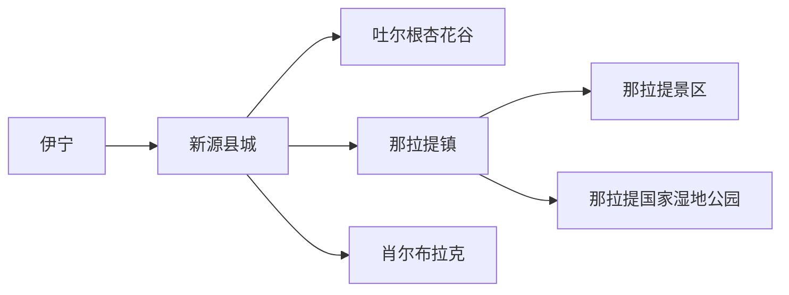
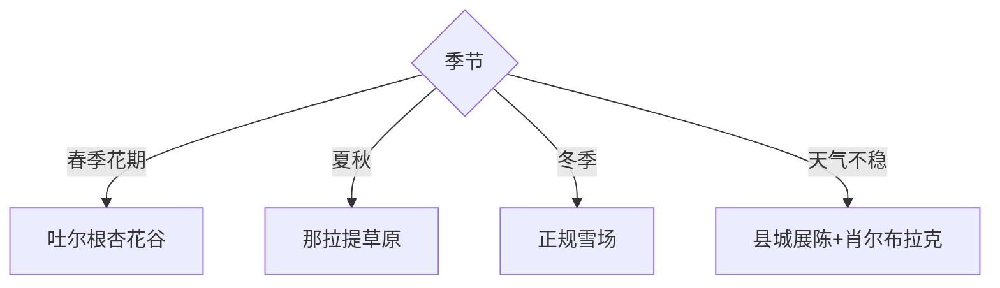

# 新源旅行指南

新源位于伊犁河谷东端，那拉提是核心，但县城、吐尔根杏花谷、那拉提湿地和肖尔布拉克也形成完整旅行结构。春季追花、夏秋草原和冬季滑雪各是不同产品，先按季节选择主线，再决定是否在那拉提换宿。

## 城市速览

| 项目 | 信息 |
|---|---|
| 主线 | 新源县城—吐尔根—那拉提镇—那拉提景区—湿地—肖尔布拉克 |
| 停留 | 那拉提至少1天；县域完整3—4天 |
| 住宿 | 县城适合补给；那拉提镇适合景区；吐尔根适合杏花季早出 |
| 交通 | 从伊宁或独库公路方向进入，县内用班车、景交、合规包车或自驾 |
| 风险 | 山区天气、高海拔温差、草原火险、独库公路季节管控与旺季车流 |
| 边界 | 草场、牧业生产区、湿地保育区、林区、冬季雪场和独库公路按开放规则进入 |

## 城市格局与游览区域

固定 **Xinyuan / GeoNames 1529046** 对应伊犁哈萨克自治州新源县，本页以实体 `Q575600` 确定县域。那拉提镇距县城仍有公路行程，独库公路入口与景区自驾规则也会季节变化；把县城视作交通基地、那拉提视作自然基地更容易排程。

## 主要景点

| 景点 | 区域 | 类型 | 核心体验 | 用时 | 环境 | 体力 | 研究价值 | 拥挤 | 优先级 |
|---|---|---|---|---:|---|---|---|---|---|
| 那拉提旅游风景区 | 那拉提镇 | 草原山地 | 河谷、空中草原、森林与牧业景观 | 1—2天 | 室外 | 中高 | 很高 | 旺季很高 | A |
| 那拉提国家湿地公园公开区 | 那拉提 | 湿地生态 | 河谷湿地、植物与候鸟 | 半日 | 室外 | 中 | 高 | 季节高 | B |
| 吐尔根杏花谷正规游览区 | 吐尔根乡 | 山谷花景 | 野杏林、坡地与春季花期 | 半日至1天 | 室外 | 中高 | 很高 | 花季很高 | A |
| 肖尔布拉克酒文化小镇 | 肖尔布拉克 | 产业文化 | 酿造、镇区与伊犁酒文化 | 半日 | 混合 | 低中 | 高 | 中 | B |
| 那拉泉旅游风景区 | 县域 | 泉水景区 | 河谷水景与休闲空间 | 2–4小时 | 室外 | 低中 | 中 | 周末中 | C |
| 伊犁植物园 | 县域 | 植物科普 | 河谷植物与科研展示 | 2–4小时 | 室外 | 低中 | 高 | 低 | B |
| 红军团博物馆 | 县域 | 历史展陈 | 屯垦与地方历史 | 1.5–3小时 | 室内 | 低 | 高 | 低 | B |
| 正规滑雪场 | 那拉提区域 | 冬季运动 | 雪场、山景与分级雪道 | 半日至1天 | 室外 | 高 | 中 | 雪季高 | C |

## 美食与餐饮

县城和那拉提镇可选抓饭、拌面、烤肉、手抓肉、馕、奶茶和奶制品。草原日程先确认景区内用餐点与收餐时间，自带饮水；乳制品、肉食与酒类按身体状况选择，酒文化体验安排不饮酒驾驶的返程方案。

## 经典行程

### 三日基础线
**路线**：县城—那拉提景区—湿地或植物园—肖尔布拉克。**逻辑**：先主景，再补生态与产业。**预约锚点**：景区、景交、住宿与车辆。**休息**：那拉提镇。**删除条件**：山地天气不稳时增加县城室内线。

### 那拉提整日线
**路线**：游客中心—选定景交线路—开放步道—返镇。**逻辑**：一天只完成一个主游线。**预约锚点**：门票、景交、自驾名额与末班。**休息**：各线路服务站。**删除条件**：雷雨、大风、降雪或景区管控时缩短。

### 杏花谷花期线
**路线**：吐尔根正式入口—开放坡地—村镇返程。**逻辑**：早出并顺光观察野杏林。**预约锚点**：实时花情、车辆与停车。**休息**：游客服务点。**删除条件**：花期未到、已谢或泥泞封控时改植物园。

### 湿地生态线
**路线**：那拉提湿地公园—公开观察点—短段步道。**逻辑**：用半日理解河谷水系。**预约锚点**：开放、观鸟季与讲解。**休息**：游客中心。**删除条件**：繁殖期或水情管控时改景区展陈。

### 肖尔布拉克产业线
**路线**：文化小镇—正规展陈—镇区餐饮—返县城。**逻辑**：以产业史替代单纯购物。**预约锚点**：展陈、讲解与返程司机。**休息**：镇区。**删除条件**：场馆闭馆时缩为镇区半日。

### 冬季冰雪线
**路线**：那拉提镇—正规雪场—适级雪道—返程。**逻辑**：按技能和天气选择项目。**预约锚点**：雪场、装备、教练、保险与道路。**休息**：雪场室内。**删除条件**：暴雪、大风、道路封闭或雪况不足时取消。

### 低体力线
**路线**：县级展陈—景交游那拉提主线—肖尔布拉克。**逻辑**：以车辆、展陈和短步行为主。**预约锚点**：景交座位、无障碍与落客点。**休息**：每站服务区。**删除条件**：山地温差过大时留县城。

## 住宿区域

新源县城适合客运、餐饮、药品和多方向补给；那拉提镇适合景区早出与连续两日游；吐尔根周边住宿只在杏花季有明显优势。订房时核对供暖或空调、热水、早餐、停车、消防、手机信号和旺季退改。

## 市内交通

从伊宁到新源通常走公路，航空或其他线路按当季运营核对。县城到那拉提距离较长，景区内继续依赖景交或预约自驾；独库公路开放日期、车型与天气管控以官方发布为准。包车明确合法运营、等待、行李和返程费用。

## 不同旅行者须知

初访者优先那拉提；花卉兴趣者按实时花情选吐尔根；亲子家庭选景交、植物园和博物馆；长者减少长坡和高温时段；滑雪者按等级选雪道。牧民生产草场、湿地核心、非开放林地、独库封控路段和雪场边界保留明确限制，拍摄牧业活动先征得同意。

## 行前核对

- 核对那拉提各游线、自驾名额、湿地、杏花谷、植物园、展馆和雪场的当日开放。
- 核对伊宁往返、独库公路、县内班车、雷雨、大风、降雪、防火和实时花情。
- 草原只走开放道路与步道，牲畜保持距离，酒类体验安排清醒驾驶或合规车辆。

## 来源与更新记录

| 来源 | 支持内容 | 核验日期 |
|---|---|---|
| [新源县政府：旅游产业基本情况](https://www.xinyuan.gov.cn/xinyuan/c113962/202505/74a8a8423c7b4f7c906aaa491900d96c.shtml) | 景区名录、住宿、停车、道路服务与县域定位 | 2026-09-01 |
| [新源县政府：新源概况](https://www.xinyuan.gov.cn/xinyuan/c113880/common_list.shtml) | 那拉提与县域文旅更新入口 | 2026-09-01 |
| [GeoNames 1529046](https://www.geonames.org/1529046/) | Xinyuan 固定人口点及坐标 | 2026-09-01 |
| [Wikidata Q575600](https://www.wikidata.org/wiki/Q575600) | 新源县实体与跨库标识 | 2026-09-01 |

| 日期 | 更新 |
|---|---|
| 2026-09-01 | 首次完成新源旅行研究，按那拉提、吐尔根、湿地与肖尔布拉克组织。 |
