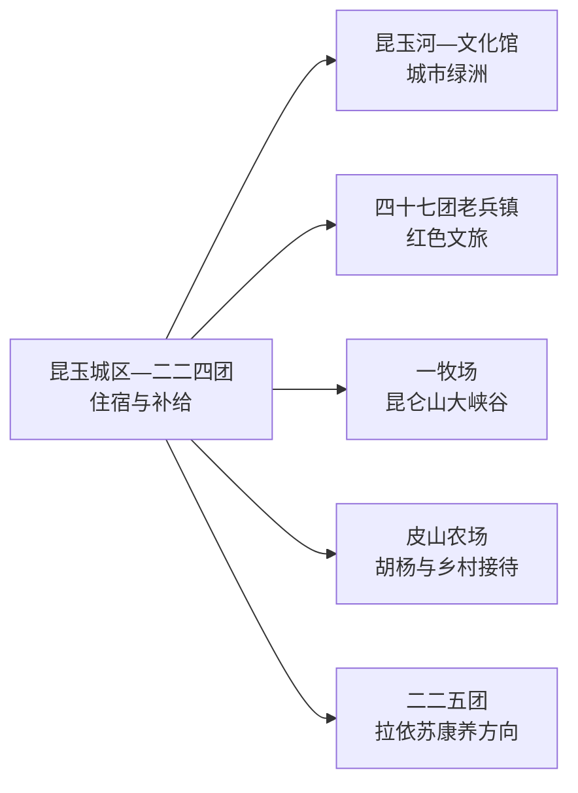
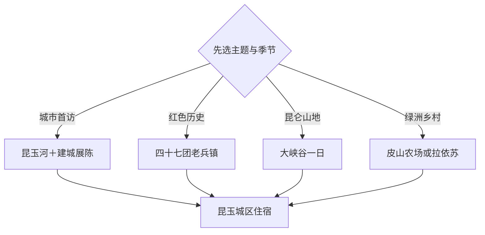

# 昆玉旅行指南

昆玉位于塔克拉玛干沙漠南缘、昆仑山北麓，第十四师各团场呈分散布局。旅行重点可概括为“沙漠之眼、昆仑之门、老兵之城”：中心城区与昆玉河适合一天，沙海老兵红色旅游区或昆仑山大峡谷各需一天。

本页绑定法定昆玉市 GeoNames 行政记录 **12258642**，记录与现行城市名称和行政层级直接对应。该记录位于固定 `cities500` 快照外，只计入法定县级市覆盖。

## 城市速览

| 项目 | 信息 |
|---|---|
| 主线 | 昆玉城区—昆玉河—沙海老兵—昆仑山大峡谷—皮山农场 |
| 停留 | 城区 1 天；老兵镇 1 天；峡谷或皮山农场另留 1 天 |
| 住宿 | 昆玉城区适合综合换乘；四十七团、皮山农场和一牧场按接待选宿 |
| 交通 | 和田、昆玉铁路与公路节点接入，分散团场以预约车辆为主 |
| 季节 | 春秋适合沙漠与团场，夏季避开正午高温，峡谷按开山季节进入 |
| 预算 | 城区成本较低，远线车辆、景区交通、讲解和住宿增加支出 |

## 城市格局与游览区域

各团场之间距离显著，城区、老兵镇、峡谷和皮山农场分日安排。和田市、墨玉县、皮山县、策勒县等地方行政区与昆玉存在交通和景区共建联系，仍按实际属地和入口切换指南。沙漠、昆仑山保护地、农牧场、水利设施、光伏与矿业生产区执行正式游线和生产边界。

## 主要景点

| 景点 | 区域 | 类型 | 核心体验 | 用时 | 环境 | 体力 | 预约风险 | 天气影响 | 优先级 |
|---|---|---|---|---:|---|---|---|---|---|
| 昆仑山大峡谷景区 | 一牧场 | 山岳与峡谷 | 昆仑山地、草场和峡谷地貌 | 1天 | 室外 | 中高 | 很高 | 很高 | A |
| 沙海老兵红色旅游区 | 四十七团老兵镇 | 红色与军垦 | 老兵精神、纪念空间和团场历史 | 半天至1天 | 混合 | 低中 | 高 | 高 | A |
| 中国人民解放军进军和田纪念馆 | 四十七团 | 纪念馆 | 进军和田与屯垦戍边历史 | 1.5–2小时 | 室内 | 低 | 高 | 低 | A |
| 进军和田纪念碑广场 | 四十七团 | 纪念空间 | 纪念碑、城市记忆和公共仪式空间 | 1小时 | 室外 | 低 | 低 | 高 | B |
| 三八线老兵纪念园 | 四十七团 | 纪念园 | 老兵陵园与历史追思 | 1–2小时 | 室外 | 低 | 高 | 高 | B |
| 昆玉河景区公开段 | 昆玉城区 | 河流与公园 | 绿洲水系、城市慢行和日落 | 1.5–3小时 | 室外 | 低 | 低 | 高 | A |
| 二二四团陈列室 | 城区团场 | 军垦与建城史 | 建团、治沙和昆玉建城历程 | 1–2小时 | 室内 | 低 | 很高 | 低 | B |
| 初心枣园当期接待区 | 二二四团 | 农业与治沙 | 枣园、绿洲建设和农业体验 | 2–3小时 | 室外 | 低 | 很高 | 高 | B |
| 皮山农场吐尔迪庄园与正式乡村点 | 皮山农场 | 乡村与建筑 | 木构民居、果园和团场生活 | 半天 | 混合 | 低 | 很高 | 高 | B |
| 拉依苏长寿村正式接待点 | 二二五团 | 康养与乡村 | 绿洲村落、地方饮食和康养主题 | 半天 | 混合 | 低 | 很高 | 高 | C |

## 美食与餐饮

昆玉可选择抓饭、烤肉、拌面、馕、烤包子、玉枣和时令瓜果。城区餐饮更稳定，峡谷、老兵镇和皮山农场提前确认午餐与饮水；牛羊肉、乳制品、坚果、辣度和清真餐需求在点餐时说明。

## 经典行程

### 昆玉城区线
**路线**：昆玉河公开段—城区午餐—二二四团陈列室—城市公共空间。**逻辑**：从绿洲水系理解年轻城市的形成。**预约锚点**：陈列室。**休息**：昆玉河公园。**删除条件**：高温时把户外段移到早晚。

### 沙海老兵线
**路线**：城区—进军和田纪念馆—纪念碑广场—三八线老兵纪念园—老兵镇。**逻辑**：按历史顺序集中理解军垦主题。**预约锚点**：场馆、讲解和车辆。**休息**：老兵镇。**删除条件**：场馆闭馆时保留公开纪念空间并缩短行程。

### 昆仑峡谷线
**路线**：城区—一牧场—昆仑山大峡谷正式入口—核心游线—返城或当地住宿。**逻辑**：山地远线独立一天。**预约锚点**：开山公告、门票、车辆和住宿。**休息**：游客中心。**删除条件**：降雪、洪水、落石或道路管制时取消。

### 皮山农场线
**路线**：城区—皮山农场—吐尔迪庄园或正式乡村点—胡杨或果园接待区。**逻辑**：把乡村建筑、绿洲农业与团场生活组合。**预约锚点**：接待、午餐和车辆。**休息**：正式农庄。**删除条件**：接待暂停或风沙较强时改城区。

### 拉依苏康养线
**路线**：城区—二二五团—拉依苏长寿村正式接待点—地方午餐—返城。**逻辑**：用低体力乡村体验补充山地行程。**预约锚点**：接待、餐饮和车辆。**休息**：村内服务点。**删除条件**：道路或接待条件不明时改昆玉河慢游。

### 枣园治沙线
**路线**：二二四团陈列室—初心枣园当期接待区—治沙公开展示—城区晚餐。**逻辑**：从建团历史进入绿洲农业实践。**预约锚点**：农时、讲解和生产接待。**休息**：团场服务区。**删除条件**：农忙封闭或高温时只保留室内展陈。

### 三日完整线
**路线**：首日昆玉城区，次日沙海老兵，第三日昆仑山大峡谷或皮山农场。**逻辑**：城市、历史与自然分日。**预约锚点**：两条远线车辆、讲解和退改。**休息**：连续住昆玉城区。**删除条件**：压缩为两天时按天气删除峡谷或乡村线。

## 住宿区域

昆玉城区适合铁路到达、餐饮与多方向换乘。四十七团适合老兵文化慢游，一牧场适合峡谷开山季，皮山农场适合乡村主题；远线住宿选择时核对季节营业、供暖或降温、热水、餐饮、网络和退改。

## 市内交通

昆玉与和田地区共享区域交通网络，但团场分散，地图距离需换算为公路时间。城区到四十七团、一牧场、皮山农场和二二五团以预约车辆更稳妥。沙漠公路、山地道路、农业与水利生产路、光伏场站和矿区执行通行边界；高温、沙尘、降雪与山洪会改变远线条件。

## 不同旅行者须知

历史旅行者优先四十七团，山地旅行者把昆仑山大峡谷作为唯一全天重点，亲子与低体力旅行者选择昆玉河、纪念馆和团场展陈。摄影者按枣园、胡杨、雪山能见度与沙尘情况选时段；沙漠徒步只参加正式活动并使用专业保障。

## 行前核对

- 通过第十四师昆玉市和景区渠道核对昆仑山大峡谷开山、老兵镇场馆与团场接待。
- 核对昆玉、和田到达交通，分散团场车辆、单程时间和住宿退改。
- 山地与沙漠线路查看高温、沙尘、降雪、山洪、落石和道路管制。
- 农业、康养与徒步项目按农时、运营资质、保险和补给条件预约。

## 来源与更新记录

| 来源 | 支持内容 | 核验日期 |
|---|---|---|
| [第十四师昆玉市旅游线路与景点](https://www.btdsss.gov.cn/c/2023-05-20/859559.shtml) | 昆仑山大峡谷、沙海老兵、昆玉河、皮山农场和拉依苏线路 | 2026-09-04 |
| [兵团：昆玉文旅产业发展](https://www.xjbt.gov.cn/c/2024-12-31/8375839.shtml) | 一红一绿品牌、场馆、景区等级与节庆方向 | 2026-09-04 |
| [GeoNames 12258642](https://www.geonames.org/12258642/) | 昆玉市行政记录 | 2026-09-04 |
