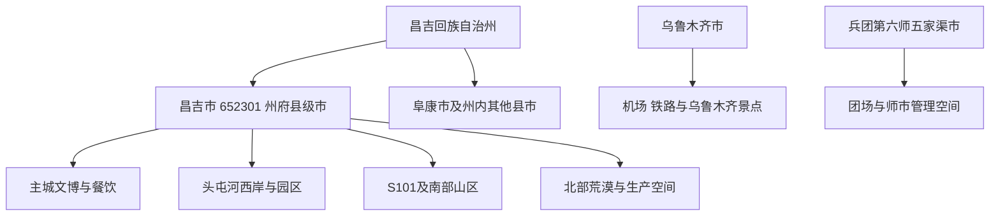
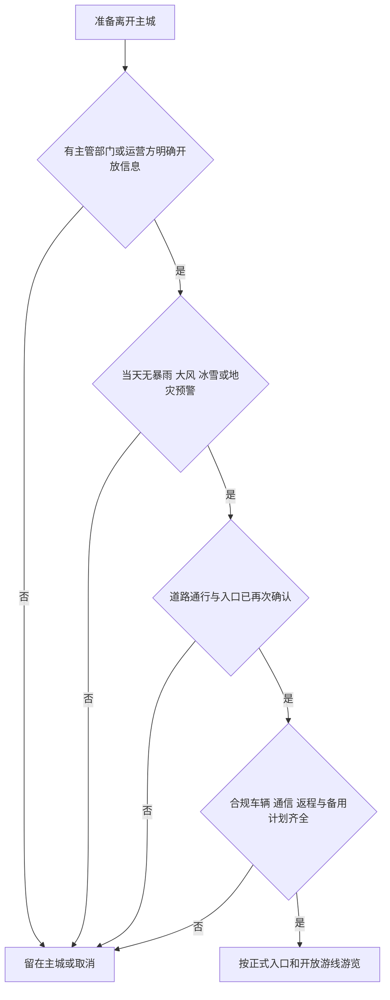

# 昌吉旅行指南

昌吉市是行政区划代码 **652301** 的县级市，也是昌吉回族自治州州府。它东邻乌鲁木齐，机场、铁路和公路接驳常与乌鲁木齐组合，但法定城市、住宿地和景点归属都彼此独立。首访可用昌吉州博物馆、昌吉恐龙馆、清代粮仓、庭州生态绿谷、新疆农业博览园和昌吉小吃街认识州府历史、绿洲农业与当代城市生活；新疆大剧院、杜氏旅游景区、工业旅游和 S101 山区线则须按演出、预约、道路与天气另行确认。

> 建议停留：主城 1–2 天；S101 或预约型近郊另留整日 
> 旅行关键词：昌吉州文博、恐龙化石、现代农业、绿洲公园、回族风味、乌昌接驳 
> 主要体力：主城低至中等；园区与河谷公园步行较长，山区自驾叠加长车程与灾害风险 
> 最近研究：2026-08-12

## 城市速览

| 项目 | 旅行信息 |
|---|---|
| 主要旅行价值 | 用州博物馆建立昌吉州历史背景，以恐龙馆和农业博览园连接古生物与现代农业，再在庭州生态绿谷、滨湖河和小吃街体验州府日常。 |
| 建议停留 | 1 天选择文博加一处城市公园；2 天增加农博园、恐龙馆和演艺；S101、杜氏或预约型工农业点另占半日至一日。 |
| 较舒适季节 | 春秋通常适合城市步行；夏季日照和高温明显，山区还可能出现短时强降雨；冬季寒冷、积雪、结冰和大风会影响道路与户外项目。 |
| 预算特点 | 公共文化场馆与城市公园较易控制成本；演出、主题游乐、预约车辆、机场接驳和山区包车或自驾是主要增量。 |
| 步行强度 | 场馆可慢速参观，庭州生态绿谷和滨湖河适合截取短段；农博园、主题景区与大型园区不能仅凭“有车”推断全程少步行。 |
| 主要天气风险 | 高温、暴雨、雷电、大风、冰雹、沙尘、寒潮、暴雪和大雾均有官方应急预案；阿什里、庙尔沟、硫磺沟、努尔加及 S101 尤需防山洪、泥石流、滑坡和水毁。 |
| 独行旅行 | 主城文博、餐饮和公园适合独立组合；山区、偏远乡村和生产园区必须锁定开放入口、合规车辆、通信与返程，不跟随非官方轨迹进沟。 |
| 亲子旅行 | 恐龙馆、州博物馆、农博园和公园容易组成科普线；大型游乐设施、临水空间、农机、温室、厂区与山区道路需要持续看护。 |
| 长者与低体力旅行 | 以一座场馆、车辆分段和一处公园短线为主；先询问落客点、座椅、卫生间、轮椅借用和演出席位，再决定是否增加园区。 |
| 无障碍信息 | 现有一手公开资料不足以证明机场或车站接驳、城市人行道、场馆、园区交通和观演席位构成连续无障碍链；必须逐点电话确认。 |

固定清单中的 **GeoNames 1529569** 记录名为 **Changji**、类型为 **PPLA2** 的州府居民点，坐标是主城地名点，不是 652301 全市行政边界。法定县级市实体为 **Wikidata Q994523**，其类型明确为县级市，但截至本次核验没有 GeoNames 属性 P1566；编号 1529569 反而挂在 **Q28794358** 上，该点实体没有中文标签、行政层级或隶属声明，仅保留同一坐标和 P1566。指南因此以 Q994523 表示法定昌吉市，以 1529569 定位主城居民点，不把两个粒度强行合并。

昌吉市人民政府现行概况列出 8 镇、2 乡、6 个街道和两个国家级园区，并明确昌吉市是昌吉州州府。政府行政区划页所列总面积注明“含兵团”，也列举境内兵团单位；这是一种区域统计和空间交错说明，不代表新疆生产建设兵团第六师五家渠市及团场成为昌吉市下辖乡镇。去往五家渠或团场接待点时，应按兵团和第六师五家渠市渠道另查。

昌吉与[乌鲁木齐](./乌鲁木齐市.md)在交通、产业和城市服务上联系紧密，却是两个独立城市。乌鲁木齐天山国际机场、乌鲁木齐站及乌鲁木齐市内景点不写成昌吉市设施；反过来，庭州生态绿谷、新疆大剧院和昌吉州博物馆也不因靠近城市边界而写进乌鲁木齐页。全区组合关系可回到[新疆维吾尔自治区旅行目的地](./README.md)核对。

## 城市格局与游览区域

昌吉市域南北狭长，从天山山区、山前绿洲和平原城市延伸到北部荒漠。旅行上应拆成“主城文博—头屯河西岸—近郊园区—六工乡村—南部山区—北部保护与生产空间”六种尺度。前四类可在开放和预约明确时组合，后两类不能因为地图上属于昌吉市就视为普通景区。

| 区域 | 主要内容 | 游览特点 | 与其他区域的关系 |
|---|---|---|---|
| 主城文博与生活核心 | 昌吉州博物馆、昌吉恐龙馆、清代粮仓、滨湖河、人民公园周边和昌吉小吃街 | 室内场馆、城市公园和餐饮可用车辆分段，适合一日基础线 | 州级展陈涉及全州，不等于把天山天池、北庭故城、江布拉克等跨县景点并入主城 |
| 头屯河西岸与庭州生态绿谷 | 庭州生态绿谷、新疆大剧院、州级公共文化空间及沿河正式开放公园 | 城市东缘范围较大，傍晚与观演可组合；只走照明和维护开放段 | 头屯河是城市联系带也是水系边界，过河进入乌鲁木齐管理空间后按实际属地核对 |
| 农业科技与会展片区 | 新疆农业博览园、农业科技展示和当期展会 | 温室、展馆、户外园区和活动档期并存，内容随季节与会展变化 | 农博园是游客设施，周边试验田、加工区、实验室和内部道路不是自动开放的延伸景点 |
| 六工镇与近郊乡村 | 杜氏旅游景区、正式接待的休闲农业和乡村活动 | 主题游乐、亲子和乡村休闲为主，营业项目受季节、检修和活动影响 | 六工镇属于昌吉市；邻近五家渠不改变归属，也不能顺路进入团场或生产道路 |
| 昌吉高新区与工业旅游点 | 特变电工总部科技研发基地、笑厨寻鲜之旅等明确列入官方旅游资源的点位 | 可能有企业安保、团体接待、工作日和生产安全限制，必须先预约 | 企业展厅或核准游线开放，不等于车间、仓储、能源设施、试验区和园区道路向散客开放 |
| 硫磺沟与 S101 山区方向 | 昌吉段丹霞地貌、公路观景与山前景观 | 急弯、临崖、重载货车、强对流、冻融、水毁和地灾风险叠加，只适合条件稳定时的整日自驾 | S101 连续跨越乌鲁木齐、昌吉州多县市等区域；“昌吉境内”不表示整条公路属于昌吉市 |
| 阿什里、庙尔沟与南部山地 | 乡村季节活动、草场与山地景观 | 只有主管部门或运营方明确公布的活动点和道路可进入；不以社交平台坐标替代入口 | 天山一号冰川保护区跨乌鲁木齐县、和静县和昌吉市，昌吉市辖段仍是保护空间，不是冰川观光景区 |
| 北部荒漠与农牧生产空间 | 防沙治沙区、林带、光伏及能源设施、牧场和分散管理空间 | 距主城远、通信和救援条件不均，且有防火、生态和生产安全要求 | 生态修复报道、卫星图或项目道路都不构成旅游开放公告 |

阜康市是昌吉州内另一个独立县级市，天山天池位于阜康市境内；吉木萨尔县的北庭故城、奇台县的江布拉克、玛纳斯县和呼图壁县的景点也各有属地。它们可以从昌吉住宿后跨县联游，却不能出现在“昌吉市内一日游”里。新疆大剧院位于昌吉市头屯河西岸，和隔河相望的乌鲁木齐城市空间也不能只靠营销名称判断归属。

天山一号冰川保护区的官方生态检查明确说明，它跨乌鲁木齐县、和静县和昌吉市。保护区内还涉及生态红线、矿产整治和地质灾害检查。公开报道证明“保护对象存在”，不证明有面向游客的入口、步道、停车或救援体系；本指南不提供冰川接近路线，也不把努尔加沟谷、采矿遗迹、未开发峡谷和牧道作为替代入口。

农田、温室、牧场和工厂是昌吉重要的生产空间。新疆农业博览园、杜氏、特变电工和笑厨等只有官方列出的游客设施或当期确认游线可进入。看见作物、设备或企业标识，不代表可以进入试验田、采摘区、冷库、装卸区、车间、实验室、变电设施或内部道路；航拍、攀爬、跨围栏和临时停车也可能影响生产与安全。

山区或跨园区路线可用以下门槛快速判断；任一关键项不成立，就改走主城文博线。

## 主要景点

### 州府文博与城市历史

| 景点 | 区域 | 类型 | 主要看点 | 建议用时 | 室内外 | 体力 | 预约风险 | 天气影响 | 优先级 |
|---|---|---|---|---:|---|---|---|---|---|
| 昌吉回族自治州博物馆 | 主城公共文化片区 | 州级综合博物馆 | “丝绸之路天山廊道”等历史展陈，先建立全州空间和历史背景 | 2–3 小时 | 室内 | 低 | 中：闭馆日、临展、团队和安检规则需查 | 低 | 高 |
| 昌吉恐龙馆 | 主城建国西路方向 | 古生物专题馆 | 新疆出土恐龙化石、骨架与古生物科普 | 1.5–2.5 小时 | 室内为主 | 低至中 | 中：开放、预约、讲解和亲子活动动态 | 低 | 高 |
| 昌吉市清代粮仓遗址博物馆 | 主城 | 遗址博物馆 | 清代粮仓建筑、屯垦与绿洲粮食历史 | 1–1.5 小时 | 室内外结合 | 低 | 中高：规模较小，开放日与团队接待需确认 | 中 | 中高 |
| 新疆新辉红色记忆博物馆 | 昌吉市内，按当期入口 | 特色博物馆 | 红色历史主题收藏与社会教育 | 1–1.5 小时 | 室内 | 低 | 高：一手资料证明馆别，当前开放和散客接待仍需问 | 低 | 备选 |
| 昌吉州图书馆及公共文化场馆 | 主城南公园西路等公共文化片区 | 公共文化 | 阅读、地方文献、当期展览或公益活动 | 1–2 小时 | 室内 | 低 | 中：周闭馆日、活动占用和入馆证件需重查 | 低 | 雨雪备选 |

昌吉州博物馆是理解“昌吉州”而不是把全州景点塞进“昌吉市”的起点。展览可能出现天山天池、北庭故城、江布拉克或州内考古材料，这只说明馆藏和叙事范围覆盖全州。参观后仍应按阜康、吉木萨尔、奇台等实际属地规划交通和住宿。

昌吉恐龙馆、州博物馆和清代粮仓是三种不同主题：自然史、全州综合史和城市粮仓遗址。它们可以同日分段，但不建议把恐龙馆的全部亲子活动、州博物馆常设展和小馆开放时间都当成全年固定。节假日、临展布撤展、设备维护、团体研学和安检都可能改变实际体验。

### 城市生态、演艺与日常生活

| 景点 | 区域 | 类型 | 主要看点 | 建议用时 | 室内外 | 体力 | 预约风险 | 天气影响 | 优先级 |
|---|---|---|---|---:|---|---|---|---|---|
| 庭州生态绿谷 | 头屯河西岸 | 城市生态景区 | 头屯河沿岸五类主题公园、城市生态修复与开阔公共空间 | 2–4 小时，可截短 | 户外 | 中 | 低至中：活动、施工和局部管控需查 | 高 | 高 |
| 昌吉市滨湖河景观带 | 主城纵向水系 | 城市公园与水岸 | 多段公园、城市绿地与居民休闲 | 1–2 小时，宜选一段 | 户外 | 低至中 | 低：重点查维护段和水情 | 高 | 中高 |
| 新疆大剧院 | 头屯河西岸 | 剧院与旅游演艺 | 雪莲造型建筑及当期舞台演出 | 外观 30 分钟；观演另计 | 室内外结合 | 低至中 | 高：剧目、日期、座位、退改和入场规则动态 | 中 | 有票时高 |
| 昌吉小吃街 | 主城建设北路 | 餐饮街区 | 集中体验昌吉和新疆常见餐食，适合作为路线终点 | 1.5–2.5 小时 | 室内外结合 | 低 | 低：节庆客流与个别商户营业动态 | 中 | 中高 |
| 昌吉市人民公园周边 | 主城北部生活片区 | 城市公园 | 居民休闲、树荫与小吃街邻近关系 | 0.5–1.5 小时 | 户外 | 低 | 低 | 中高 | 休息点 |

庭州生态绿谷官方资料给出沿头屯河西岸展开的长距离公园系统。旅行时不必追求走完全线，可围绕一个正式入口、一个主题公园和一处休息点折返。水岸、施工围挡、活动搭建、结冰和夜间照明都会改变可走范围；没有照明或维护痕迹的河道、滩地、桥下和工业遗址内部不进入。

新疆大剧院已在 2025 年重新推进文商旅运营，2026 年官方活动信息也出现《千回西域》等剧目，但这不能推导出全年每日演出。只有能在官方或授权渠道查到具体日期、场次、座位和退改条件时，才把观演放进行程；仅看建筑外观则不需要为“可能有演出”空等一晚。

### 农业、亲子与预约型工农业体验

| 景点 | 区域 | 类型 | 主要看点 | 建议用时 | 室内外 | 体力 | 预约风险 | 天气影响 | 优先级 |
|---|---|---|---|---:|---|---|---|---|---|
| 新疆农业博览园 | 农业科技园区 | 现代农业与会展 | 温室园艺、农业科技展示、当期花卉或农旅内容 | 2–4 小时 | 室内外结合 | 中 | 中高：展馆、花期、会展和票务会变化 | 中 | 高 |
| 杜氏旅游景区 | 六工镇十三户村 | 主题休闲与乡村旅游 | 亲子游乐、水上或季节项目和乡村休闲 | 半日至整日 | 室内外结合 | 中 | 高：项目开放、年龄身高、检修和季节限制需查 | 高 | 条件适合时中高 |
| 特变电工总部科技研发基地 | 北京南路方向 | 企业科技与工业旅游 | 企业科技展示和正式开放景观 | 1–2 小时 | 室内外结合 | 低至中 | 高：散客、团体、证件、安保与工作日规则需预约 | 低至中 | 预约成功后 |
| 新疆笑厨寻鲜之旅景区 | 大西渠镇闽昌工业园 | 食品工业旅游 | 调味品文化和核准生产展示游线 | 1–2 小时 | 室内为主 | 低 | 高：生产安排、卫生和团体接待限制 | 低 | 预约成功后 |
| 朗青休闲观光牧场等官方乡村线路点 | 昌吉市近郊 | 休闲农业 | 牧业、乡村和季节性体验 | 2–3 小时 | 户外为主 | 中 | 高：官方线路不等于当前每日散客营业 | 高 | 季节备选 |

新疆农业博览园近年仍有官方农旅报道，但园内内容会随季节、布展和会展调整。出发前应问清具体开放展馆、室内温室、户外花卉、票务、停车和餐饮，而不是只问“园区开不开”。展会日可能内容更丰富，也可能有交通管制、团队预约或部分展馆专用。

工业旅游的核心是“运营方设计并承担安全责任的参观路线”。特变电工、笑厨等被官方列为旅游资源，不表示游客可临时到厂门口要求进入。若预约没有确认，就删除该点；不能用企业园区外围、物流门口、工人通道或无人值守道路替代正式体验。

### 只作边界说明的自然点

- **S101 昌吉段与硫磺沟丹霞**是公路风景走廊，不是一座围合景区。2026 年 7 月官方仍报道强降雨造成多处水毁，出发当天必须重查交通管控和抢修状态。
- **努尔加大峡谷、索尔巴斯陶等名称**在较早官方旅游发展报道中出现过，但本次没有找到足以证明 2026 年稳定散客入口、持续运营、救援和完整服务链的一手资料，不列为默认路线。
- **天山一号冰川保护区**是跨行政区的生态保护空间，不提供自由接近、徒步、越野、露营或无人机路线。
- **北部荒漠、胡杨、防沙治沙、矿业、光伏和输变电项目区**只在明确开放的公共道路、景区或科普活动内参观，不根据卫星图和自驾轨迹进入。
- **天山天池、江布拉克、北庭故城**分别按阜康市、奇台县、吉木萨尔县等实际属地规划，不是昌吉市景点。

## 美食与餐饮

昌吉的餐饮价值在于回族风味、全疆常见面食与肉食、绿洲农产品和多民族城市饮食的并置。最稳妥的方式不是追逐单一“网红店”，而是选择证照齐全、明码标价、客流正常的餐饮集中区，再按人数共享几种风味。

| 餐饮区域 | 适合体验 | 适合时段 | 选择方法 | 主要提醒 |
|---|---|---|---|---|
| 昌吉小吃街 | 丸子汤、油糕、凉皮、烤肉、抓饭、面食及多种新疆小吃 | 午餐、晚餐 | 先走一圈比较菜单、分量、等位和支付方式，再决定组合 | 节庆与赛事期间客流大；同名菜分量和做法不同 |
| 主城生活商业区 | 家常菜、拌面、抓饭、牛羊肉、早餐和简餐 | 全天 | 优先看本地持续客流、价目表和食品安全公示 | 不因装修或短视频热度判断品质 |
| 庭州生态绿谷与大剧院周边 | 观演前后简餐、夜间餐饮与商业配套 | 傍晚、演出前后 | 先以演出入场时间倒排，用餐至少留出交通和安检余量 | 演出散场时车辆与餐位可能紧张 |
| 六工镇与近郊乡村 | 鱼、乡村餐、季节农产品及预订餐 | 午餐为主 | 与景区或接待点同时确认用餐、座位、菜单和返程 | 不进入无接待确认的村院、鱼塘和生产厨房 |
| 农博园与会展片区 | 园区简餐、农产品展示和会展餐饮 | 白天 | 把餐饮视为动态配套，必要时自备合规简餐和饮水 | 展会、闭馆和淡季可能显著改变供给 |

可按以下类别点餐：

- **回族宴席与汤菜**：九碗三行子、丸子汤、粉汤、夹沙等常见做法适合多人分享，但是否供应、起订人数和预订时间应先问。
- **面食与主食**：拌面、抓饭、馕、油糕、馓子、凉皮等容易按食量组合。抓饭和面食常含较多油脂或盐，低盐、低脂需求宜在点单时说明。
- **牛羊肉与烧烤**：烤肉、手抓肉及各类牛羊肉菜分量可能较大，先点少量再加；不熟悉部位、重量或计价单位时先确认。
- **绿洲农产品**：时令蔬菜、水果、奶制品和农产品加工品具有季节性。采摘、试吃、冷链购买和邮寄只在经营方明确提供时进行。
- **夜间餐饮**：小吃街、商业街和活动夜市适合作为行程终点，但摊位、舞台、营业时段和交通管制都属于动态信息。

“清真”应以场所当期标识和经营者说明为准，不凭店名、菜名或城市印象推断。尊重不同餐饮空间的食材和饮酒规则，不把外带食品带进明确禁止的场所。对坚果、芝麻、奶制品、麸质、鸡蛋或香辛料过敏者，应逐项询问汤底、馅料、复合调味料和共用器具；只说“不要辣”不能覆盖全部过敏风险。

## 经典行程

以下路线都是可删减的组合框架。每条都把路线、组合逻辑、预约锚点、休息节点和时间不足时删减写在一起；实际开放、交通和天气不成立时，以删除为正常结果。

### 路线一：州府文博与城市生活一日

- **路线**：昌吉州博物馆 → 午餐 → 昌吉恐龙馆 → 滨湖河正式开放短段 → 昌吉小吃街。
- **组合逻辑**：上午用州级综合展陈建立历史背景，下午转向古生物科普，傍晚以平缓公园和餐饮收尾；场馆与户外可以互为天气备选。
- **预约锚点**：先确认州博物馆和恐龙馆的闭馆日、入馆证件、讲解与预约，再决定上午、下午顺序；小吃街不作为场馆预约替代。
- **休息节点**：州博物馆出口、午餐座席、恐龙馆公共休息区及滨湖河就近有座椅的维护段；不把长距离沿河步行当作必须完成。
- **时间不足时删减**：先删滨湖河，再把两座馆减为一座；不要压缩场馆安检、正餐和返程时间。

### 路线二：两日州府文博与现代农业

- **路线**：第 1 天昌吉州博物馆 → 午餐 → 昌吉恐龙馆 → 昌吉小吃街；第 2 天新疆农业博览园当期开放展馆 → 午餐 → 滨湖河正式开放短段或返回主城休息。
- **组合逻辑**：第一天先用综合历史和古生物展陈建立城市背景，第二天再看绿洲农业与当代生产；把两个大型主题分日，可为儿童、长者和临时闭馆保留调整空间。
- **预约锚点**：先锁定州博物馆、恐龙馆的闭馆日和入馆要求，再确认农博园当日究竟开放温室、展馆还是户外区，并逐项询问票务、停车、亲子活动和天气退改。
- **休息节点**：两天都保留完整午餐；每座馆只走一个主展线，农博园入场后先找卫生间、室内休息区和最短出口，滨湖河只选有座椅的维护段。
- **时间不足时删减**：第一天先删小吃街前的额外散步，第二天先删滨湖河；若只剩一天，按路线一执行，不把两天内容压成连续赶场。

### 路线三：三日城市、农业与生态观演

- **路线**：第 1 天昌吉州博物馆 → 昌吉恐龙馆；第 2 天新疆农业博览园一个已确认开放的主题区 → 主城休息；第 3 天庭州生态绿谷正式开放短段 → 提前晚餐 → 新疆大剧院外观或已购票演出。
- **组合逻辑**：三天分别回答州府历史、绿洲农业和现代城市文化三个主题，避免跨城东缘与近郊反复折返；第三天的户外和演出还能按天气、场次独立取舍。
- **预约锚点**：第一天核两馆预约，第二天核农博园具体展馆与接待内容，第三天只有查到演出日期、入场时间、座位和退改规则才锁票，同时确认绿谷活动、施工和照明情况。
- **休息节点**：每天中午都安排坐下用餐，第二天下午可直接回酒店；第三天绿谷只走靠近正式入口、卫生间和座椅的一段，演出前至少留一段室内休息。
- **时间不足时删减**：少一天时先取消第三天，保留文博与农业；演出不成立时只看剧院外观或整段删除，不用临时企业参观填空。

### 路线四：雨雪天城市替代

- **路线**：昌吉州博物馆 → 室内午餐 → 昌吉恐龙馆或州图书馆二选一 → 已确认正常演出的新疆大剧院。
- **适用条件**：适合普通降雨、降雪或大风使滨水、山地和园区户外段不舒适，但城市道路、场馆和返程交通仍正常时；暴雪、道路结冰或停运时应留在住宿地。
- **串联逻辑**：全程以主城室内场所为主，用午餐分隔两座场馆，只在晚间交通和演出均已确认时再去大剧院，避免把“有屋顶”误当成无条件可达。
- **预约锚点**：当天早晨复核两馆闭馆、图书馆开放、演出和城市交通；若农博园只开放户外区，不把它列作雨雪替代。
- **休息节点**：场馆之间只乘正式交通工具，午餐至少留一小时；每到一处先确认寄存、卫生间、电梯和落客点，不在结冰广场长时间等车。
- **时间不足时删减**：保留一座场馆和正餐，先删晚间演出；天气或道路继续恶化时整条缩成住宿地附近的单一室内点。

### 路线五：亲子与低体力两种减负方案

**亲子路线**

- **路线**：昌吉恐龙馆 → 午餐 → 新疆农业博览园一个已确认开放的亲子展馆，或六工镇杜氏旅游景区一个家庭项目二选一 → 主城。
- **组合逻辑**：上午集中在自然史，下午只选农业科普或主题休闲中的一个方向，以单一主任务维持注意力，并避开农机、生产、水体和高刺激项目叠加。
- **预约锚点**：同时确认恐龙馆入馆要求与下午点位的营业日期、具体项目、年龄身高、设备检修、餐饮、停车和恶劣天气退改；只确认园区大门营业不够。
- **休息节点**：中午完整坐下用餐，下午入场先确定卫生间、饮水、室内休息和家庭集合点；每完成一个户外或刺激项目就休息。
- **时间不足时删减**：只保留恐龙馆，或把下午缩成一个室内展馆；天气不稳时取消六工镇，不在临近闭园时追赶项目。

**低体力路线**

- **路线**：昌吉州博物馆一个主展线 → 午餐 → 新疆大剧院落客区外观或已确认的短场演出 → 返回住宿地。
- **减负方式**：全程使用正式车辆衔接，只走一座馆的一条主展线；提前核对落客、轮椅借用、无障碍入口、电梯、卫生间和演出座位，庭州生态绿谷不作为必经点。
- **预约锚点**：向州博物馆与剧院分别确认连续通行条件、闭馆或场次、证件、陪同和退改，不能用“有无障碍设施”概括整条动线。
- **休息节点**：午餐和酒店作为两次长休息，场馆内每完成一个展区即坐下；返程车在约定落客点等候，不把步行接驳留到现场解决。
- **时间不足时删减**：先删剧院，仅保留州博物馆主展线与正餐；身体状态变化时随时返回住宿地，不增加滨水或园区步行。

### 路线六：S101 昌吉段条件式自驾一日

- **路线**：昌吉主城 → 经官方确认可通行的 S101 昌吉段 → 硫磺沟方向正式停车或观景点 → 原路或按交通管控指引返程。
- **组合逻辑**：把公路本身视为风险较高的山地风景走廊，不以“打卡数量”为目标；路线只在天气、道路、车辆和白昼同时满足时成立。
- **预约锚点**：出发前一天和当天早晨分别查询气象预警、交通主管部门路况、施工与水毁信息，并确认租车合同允许该路段；不依赖缓存导航。
- **休息节点**：只在正式停车区、养护或服务节点休息，提前补满燃油、饮水和保暖层；不在急弯、桥涵、沟口、边坡或大车盲区停车。
- **时间不足时删减**：在第一个安全折返点返回，不追赶日落；出现降雨、雷电、大风、落石、积水、封控或低能见度时整条删除。

## 住宿区域

昌吉适合按“主城文博”“东缘生态与观演”“公路接驳”“近郊主题景区”选择住宿，不宜只比较房价。预订页面写“乌鲁木齐机场附近”“乌昌新区”或“昌吉州”时，仍要核对门牌所属城市、到昌吉州博物馆的道路距离和夜间返程。

| 住宿区域 | 适合人群 | 优点 | 主要代价 | 预订前核对 |
|---|---|---|---|---|
| 主城文博与餐饮核心 | 初访者、无车旅行者、亲子与低体力者 | 场馆、餐饮、药店和城市服务相对集中，路线易删减 | 去农博园、六工镇和 S101 仍需车辆 | 具体门牌、早餐、夜间安静、停车和电梯 |
| 滨湖河与主城南北生活片区 | 想兼顾公园和本地生活者 | 便于选取河岸短段，生活配套较稳 | 河岸并非处处可直达，部分客房可能临路 | 从酒店到正式入口的过街与夜间照明 |
| 庭州生态绿谷与大剧院周边 | 有演出票、商务会展或自驾者 | 靠近城市东缘、演艺和部分园区 | 距传统主城餐饮与馆群可能更远，散场用车紧张 | 演出散场交通、停车、实际城市归属和早餐时段 |
| 主城西部或高速公路接驳方向 | 自驾、次日向西或上 S101 者 | 便于减少穿城，停车选择可能较多 | 步行旅行价值较弱，晚餐需要另找 | 高速出入口、施工、货车噪声和安全落客 |
| 六工镇或近郊合规接待点 | 以杜氏、乡村休闲为主的家庭 | 可减少主题景区当天往返 | 供给、餐饮、医疗与夜间交通少于主城 | 经营资质、独立卫浴、供暖空调、消防、退改和返城车辆 |

若只在昌吉停留一晚，优先住主城并把远点删掉；若已锁定新疆大剧院晚场，可考虑东缘住宿，但仍要核对酒店是否真正位于昌吉市。机场早班不应仅凭地图直线距离选择昌吉住宿，应按航站楼、夜间道路、车辆预约和预留时间倒排。

不推荐单凭“景区房”“农家乐”“民宿”标签下单。近郊住宿还需确认供暖或制冷、热水、消防、食品经营、网络、手机信号、夜间值守、儿童加床、无障碍入口和恶劣天气退改。旺季、赛事和大型展会期间，先锁定可取消住宿，再购买演出票或安排远线车辆。

## 市内交通

### 飞机、铁路与公路到达

昌吉市不在中国民航局现行运输机场清单中拥有独立运输机场。航空到达通常使用 **乌鲁木齐天山国际机场**；该机场是原乌鲁木齐地窝堡国际机场更名后的同一机场，北航站区已于 2025 年 4 月启用。航站楼、到达层接车点、机场巴士、出租车和网约车规则仍会变化，不能沿用旧攻略中的航站楼和上车位置。

地图和铁路货运服务资料中可见“昌吉站”，但这不等于任意日期都有可售客运列车。长途铁路旅客应先在 12306 用具体日期查询；查不到昌吉客票时，以乌鲁木齐站等实际有票客运站到达，再用合规公路交通转入昌吉。不要让地图上的铁路线替代客票和车站公告。

乌鲁木齐与昌吉之间有高速公路、国省道和公路客运联系，具体客运站、滚动班次、票务和上下客点必须出发前重查。自驾也要把城市高峰、机场航站区、收费道路、冬季结冰、施工和大型活动交通管制计入，不以“相邻城市”推断固定车程。

| 到达方式 | 推荐做法 | 不应假设 | 出发前核对 |
|---|---|---|---|
| 航空 | 乌鲁木齐天山国际机场落地后，用机场认可或证照齐全车辆前往昌吉 | 旧称“地窝堡”的攻略仍适用于现航站楼；昌吉有独立民航客运机场 | 航站楼、接车点、行李等待、夜间车费、堵车与返程 |
| 铁路 | 12306 查询实际有票客运站；常见做法是乌鲁木齐客运站转公路 | 地图上的昌吉站必然办理散客上下车 | 车站全名、到达时间、站外接驳、末班公路交通 |
| 公路客运 | 通过正规客运站或官方电子客票渠道购票 | 旧文章中的站名、发车间隔和中途停靠永久有效 | 出发站、到达站、身份证件、行李、退改和末班 |
| 自驾或租车 | G30、G312 等主通道按导航与交管当期信息行驶 | 城市相邻就不会堵车，租车默认允许山区和非铺装路 | 合同、保险、限行、停车、天气、燃油与救援 |

### 主城移动

- **公交**：适合主城生活区与部分场馆，但线路、站名、末班和临时绕行要用当期公交渠道核对；不要用数年前攻略规划换乘。
- **出租车与合规网约车**：适合博物馆、恐龙馆、农博园、庭州生态绿谷之间的分段移动。上车前确认目的地全名，尤其区分州博物馆、恐龙馆、大剧院和农业博览园。
- **步行**：只在单一场馆群、公园正式步道或餐饮街区内使用。昌吉主城并非所有景点可连续步行，夏季日晒、冬季结冰和宽路口会显著增加负担。
- **骑行**：仅在规则允许、路况清楚的城市道路和公园段考虑；不骑入 S101、重载货运路、工业园、桥涵和无照明河道。
- **包车**：S101、近郊乡村或跨县市路线应使用具备相应资质和保险的车辆，写清等待、绕行、取消、司机工时与当晚住宿；“拼车群”不等于合规营运。

### S101 与山区驾驶

S101 昌吉管辖路段既有急弯、平交路口和地质灾害点，也承担矿产运输，重载货车占比可能较高。2026 年春季官方仍处理冻融坑槽和积水，7 月又发生强降雨水毁。即使前一周有人通行，也不能代表当天路况正常。

山区驾驶至少准备两条退出路径：一是尚未进入山区时改走主城；二是在正式停车或养护节点折返。遇到封路、强降雨、雷电、泥水、落石、路基裂缝、路面积雪、低能见度或工作人员劝返时立即停止。不要驶入河道、冲沟、矿业支路、牧道和未铺装“近路”，也不要在丹霞边坡上攀爬取景。

## 不同旅行者须知

| 旅行者 | 更适合的安排 | 重点核对 | 主动避开 |
|---|---|---|---|
| 独行者 | 州博物馆、恐龙馆、清代粮仓、公园短段和小吃街 | 场馆闭馆、夜间返程、司机信息和住宿前台 | 无返程保障的山区拼车、沟谷徒步和临时厂区参观 |
| 亲子家庭 | 恐龙馆、州博物馆、农博园一座主馆和公园短段 | 儿童预约、年龄身高、推车、电梯、卫生间和食品过敏 | 把杜氏、农博园和晚场演出压进同一天；靠近水体、农机和物流线 |
| 长者与低体力者 | 一座场馆加一顿正餐，车辆点到点，公园只走有座椅短段 | 落客距离、电梯、轮椅、座椅、卫生间、观演席位和返程 | 全线走完绿谷或滨湖河；默认园区交通可装轮椅 |
| 轮椅使用者 | 先电话确认州博物馆、恐龙馆、大剧院与酒店单点条件 | 无台阶入口、坡道坡度、电梯尺寸、无障碍卫生间、轮椅席和车辆装载 | 把单点坡道理解为停车至展厅或座席的连续无障碍链 |
| 视听障碍旅行者 | 优先选择可预约人工讲解、字幕或辅助服务的室内场馆 | 导览形式、字幕、助听、导盲犬、陪同与紧急疏散规则 | 依赖无护栏水岸、临时活动和只有广播通知的远线 |
| 自驾者 | 主城停车后分段步行；S101 仅在全部门槛满足时安排 | 保险、停车、路况、天气、油量、轮胎、通信和救援 | 急弯停车、越野离路、追日落和进入矿业或生产支路 |
| 商务与研学团队 | 州级场馆、农博园和预约成功的企业或科研展示 | 接待函、名单、证件、摄影、保密、安全培训和团体保险 | 把公务调研、媒体报道或研学案例当成面向散客的常态开放 |
| 外籍旅行者 | 主城公共场馆和正规景区，住宿与车辆提前确认 | 护照原件、住宿登记、票务实名、语言服务和特定区域规则 | 假设所有网络平台、郊区住宿和企业园区都能接待外籍散客 |

### 无障碍与照护

昌吉市政府网站提供无障碍和长者版入口，但网站可访问不等于线下旅行全链无障碍。本次未找到能同时证明“机场或车站接驳—酒店—人行道—场馆—卫生间—返程车辆”连续可用的一手资料。需要轮椅、助行器、导盲、助听、护理床或无障碍车辆时，应逐点记录答复人、日期和备用方案。

电话询问时可拆成具体问题：车辆能否装载不可折叠轮椅；落客点到入口是否有台阶；电梯和门宽是否足够；是否有无障碍卫生间和轮椅席；演出中途能否离场；馆内是否能借轮椅；陪同人员是否需另票。得到“可以参观”并不等于以上问题都成立。

### 文化礼仪与生产安全

昌吉是多民族共同生活的州府。拍摄居民、儿童、宗教活动、演出后台、市场经营者和乡村生产前先征得同意；不把日常生活当作摆拍布景。进入清真餐饮空间尊重店内食材与饮酒规则，进入公共文化场馆遵守安检、讲解和文物保护要求。

工农业体验中，接待方划定的路线就是边界。不要触摸运转设备、跨越黄线、打开仓门、进入冷库或试验田，也不要拍摄明确禁止的设备、屏幕和文件。遇到播种、施药、收获、装卸、设备检修或安全演练时，生产安排优先，行程应直接取消或改期。

## 行前核对

| 核对事项 | 最晚时间 | 主要渠道 | 达不到条件时 |
|---|---|---|---|
| 法定目的地与实际入口 | 订交通和住宿前 | 民政部代码、昌吉市与实际县市政府 | 拆分乌鲁木齐、昌吉、阜康、五家渠和其他县市，不用产品名代替归属 |
| 州博物馆、恐龙馆、清代粮仓 | 前一日，节假日更早 | 场馆或昌吉州、市文旅主管部门 | 只保留确认开放的一馆，其他改公园或休息 |
| 农业博览园 | 前一日 | 园区、昌吉市或自治区文旅渠道 | 未确认具体展馆和内容则删除 |
| 新疆大剧院与节庆演出 | 购票前和演出当日 | 剧院官方或授权票务、州文旅公告 | 无具体场次、座位或退改说明就不锁行程 |
| 杜氏及主题项目 | 购票前和到达前 | 景区正式渠道 | 项目检修、天气不稳或年龄身高不符时改主城 |
| 企业与休闲农业参观 | 至少提前数日 | 运营方或组织单位 | 没有明确接待确认就整段删除 |
| 航班与航站楼 | 起飞前一日和当天 | 航司、机场、民航渠道 | 按新航站区调整接车与缓冲，不沿用旧攻略 |
| 铁路与公路客运 | 购票时和出发当日 | 12306、正规客运站和交通主管部门 | 以实际有票车站和班次重排，不去地图站点碰运气 |
| S101 通行、施工与水毁 | 前一日和出发当天早晨 | 新疆交通运输厅、交警、公路养护与属地公告 | 任一信息不清即取消山区线 |
| 暴雨、山洪、地灾、大风和冰雪 | 每日早晚；山区出发前再查 | 气象、应急、自然资源、交通和属地预警 | 阿什里、庙尔沟、硫磺沟、努尔加及沟谷路线全部删除 |
| 保护区与生态边界 | 规划路线时 | 生态环境、林草、自然资源和属地政府 | 没有游客开放公告就不进入、不航拍、不露营 |
| 无障碍与照护 | 订票、订房、叫车前 | 场馆、酒店、交通和运营方人工答复 | 缩成单点访问，安排陪同和可取消方案 |
| 餐饮与过敏 | 点餐前 | 餐厅菜单、经营者和食品标识 | 成分或共用器具说不清时换菜或换店 |
| 住宿与夜间返程 | 免费取消期结束前 | 酒店、正规平台、接驳方 | 门牌、接待、消防、供暖制冷或返程不清时更换 |

节庆、赛事、群众演出、花期、采摘和夜市都不是稳定景点。2026 年官方资料证明昌吉州和昌吉市会持续组织演出、体育和公共文化活动，也证明新疆大剧院在特定节日安排剧目；它们只支持“活动可能发生”，不支持把某一场次写成全年常态。出发前以具体日期公告为准。

山区预警不应只看主城天气图标。昌吉市 2026 年 7 月 30 日暴雨橙色预警曾直接点名阿什里乡、庙尔沟乡、硫磺沟镇和努尔加，并提示山洪、泥石流和滑坡高风险。主城晴朗、酒店前台说“应该没事”或社交平台当天有人发图，都不能覆盖气象和交通部门的正式预警。

遇到道路封控、生产事故、火灾、洪水、山洪或人员受伤时，先服从现场管理并使用 110、119、120 等紧急服务；旅行投诉与一般公共服务可通过政府公布的 12345 渠道咨询。偏远路线在出发前把车牌、司机、路线、预计返程和住宿信息留给可信联系人。

## 来源与更新记录

以下来源以政府、主管部门和开放数据库为主。景点数量、等级、场次、票价、开放时间、道路和交通均可能动态变化；正文只保留能帮助读者判断边界与行动的稳定事实。

| 来源 | 用途 | 核验日期 |
|---|---|---|
| [民政部行政区划代码查询](https://dmfw.mca.gov.cn/xzqh/getList?code=65&trimCode=true&maxLevel=3) | 核对昌吉市代码 652301、县级市与昌吉州隶属 | 2026-08-12 |
| [昌吉市基本情况](https://www.cjs.gov.cn/info/iList.jsp?cat_id=28024) | 核对州府身份、基层建制、两个国家级园区和现行概况 | 2026-08-12 |
| [昌吉市行政区划](https://www.cjs.gov.cn/info/iList.jsp?cat_id=28025) | 核对相邻行政区、南北尺度及“含兵团”统计说明 | 2026-08-12 |
| [昌吉市自然地理](https://www.cjs.gov.cn/info/iList.jsp?cat_id=28026) | 核对山地、平原、沙漠三类地貌与南高北低格局 | 2026-08-12 |
| [昌吉市旅游资源](https://www.cjs.gov.cn/info/iList.jsp?cat_id=28029) | 逐项核对杜氏、庭州生态绿谷、滨湖河、特变电工、笑厨、小吃街和恐龙馆 | 2026-08-12 |
| [昌吉州博物馆新馆开馆](https://www.xinjiang.gov.cn/xinjiang/dzdt/202305/347b34d8517b4e439037c32124cd9f29.shtml) | 核对新馆开放及主要历史展览 | 2026-08-12 |
| [自治区文旅厅调研昌吉州博物馆、恐龙馆和红色记忆博物馆](https://wlt.xinjiang.gov.cn/wlt/wltyw/202204/9314a4d7829047e397b37efaa3cad006.shtml) | 核对三馆主题、预约错峰与博物馆安全边界 | 2026-08-12 |
| [清代粮仓遗址博物馆列入爱国主义教育基地](https://wlt.xinjiang.gov.cn/wlt/hydt/202109/65c6e85fe350417ba11a45db872a790f.shtml) | 核对馆名和设施性质 | 2026-08-12 |
| [自治区特色博物馆名单公示](https://wlt.xinjiang.gov.cn/wlt/tzgg/202204/a8f8544725654f2fab1c4e78b0903e44.shtml) | 核对昌吉恐龙馆与新疆新辉红色记忆博物馆 | 2026-08-12 |
| [新疆农业博览园农旅报道](https://wlt.xinjiang.gov.cn/wlt/hydt/202504/b94e044d210f4718b87036741c97dbf6.shtml) | 核对农博园仍有农旅内容及其动态展陈属性 | 2026-08-12 |
| [昌吉市乡村旅游发展资料](https://wlt.xinjiang.gov.cn/wlt/dzdt/201908/a8f99380e83649ba8545bda48439025e.shtml) | 核对杜氏、乡村季节点与“开发中资源不等于稳定开放”的边界 | 2026-08-12 |
| [新疆大剧院盘活运营报道](https://wlt.xinjiang.gov.cn/wlt/mtbd/202503/9fe84cae8d734577a428f1c29113f522.shtml) | 核对剧院位置、建筑与演艺运营方向 | 2026-08-12 |
| [昌吉州 2026 年新春活动](https://www.xinjiang.gov.cn/xinjiang/dzdt/202602/8d35dfabae1d4127b89cc6c73bcfa6cf.shtml) | 证明演出和节庆按具体档期发布，不作为全年场次 | 2026-08-12 |
| [昌吉市气象灾害应急预案](https://www.cjs.gov.cn/gk/zbwj/944984.htm) | 核对暴雨、暴雪、寒潮、大风、沙尘、高温等主要气象风险 | 2026-08-12 |
| [昌吉市 2026 年 7 月暴雨橙色预警](https://www.cjs.gov.cn/xwzx/tzgg/958798.htm) | 核对阿什里、庙尔沟、硫磺沟、努尔加的山洪地灾风险 | 2026-08-12 |
| [天山一号冰川保护区生态检查](https://sthjt.xinjiang.gov.cn/xjepd/xwzxtndt/202504/1d6a02af2c2440dd89a0aeed74d9dc59.shtml) | 核对保护区跨乌鲁木齐县、和静县和昌吉市及保护属性 | 2026-08-12 |
| [S101 昌吉管辖段安全整治](https://jtyst.xinjiang.gov.cn/xjjtysj/yxfc/202407/267ad14483b14ff1b32c8e4368d4d597.shtml) | 核对急弯、平交路口和地质灾害等驾驶风险 | 2026-08-12 |
| [S101 线 2026 年水毁抢险](https://jtyst.xinjiang.gov.cn/xjjtysj/yxfc/202607/cc31c8b1fd114d84bdd4bbe4f7face12.shtml) | 核对近期强降雨水毁与动态交通管控 | 2026-08-12 |
| [乌鲁木齐天山国际机场北航站区投运](https://xj.caac.gov.cn/XJ_DQYW/202504/t20250417_227240.html) | 核对现机场名称和北航站区启用 | 2026-08-12 |
| [中国民航局新疆运输机场清单](https://www.caac.gov.cn/GYMH/MHGK/MYJC/XJDQ/XJ/) | 核对昌吉市没有单列运输机场 | 2026-08-12 |
| [中国铁路 12306](https://www.12306.cn/) | 动态核对实际客运站、车次、票务与实名规则 | 2026-08-12 |
| [第六师五家渠市政务信息公开指南](https://www.wjq.gov.cn/zwgk/zfxxgk/zfxxgkzn/art/2023/art_145a0bac74cb41efb8c9341d25a80985.html) | 核对第六师五家渠市使用独立师市政府渠道，不属于昌吉市下辖层级 | 2026-08-12 |
| [GeoNames 1529569](https://www.geonames.org/1529569/changji.html) | 核对 Changji 主城居民点编号与坐标粒度 | 2026-08-12 |
| [Wikidata Q994523](https://www.wikidata.org/wiki/Q994523) | 核对昌吉市法定实体、县级市类型及当前缺少 P1566 | 2026-08-12 |
| [Wikidata Q28794358](https://www.wikidata.org/wiki/Q28794358) | 核对 P1566 1529569 当前挂在无行政层级声明的点实体 | 2026-08-12 |

官方“昌吉市旅游资源”页在同一页面中出现不同的 A 级景区总数，并有重复名称；本指南没有据此宣称总数，只采用页面逐项列出的名称、地址、类型和明确归属。景区等级本身不替代开放、预约、检修、天气、生产安全与无障碍核验。

更新记录：

- **2026-08-12**：首次建立完整指南；固定 GeoNames 1529569、法定代码 652301 与 Wikidata 法定实体 Q994523，记录 P1566 分离到点实体 Q28794358 的粒度问题；核清昌吉州州府、乌鲁木齐、阜康和第六师五家渠市边界；补入文博、农博、演艺、生产空间、天山保护地、S101 水毁、机场与无障碍动态核验。
