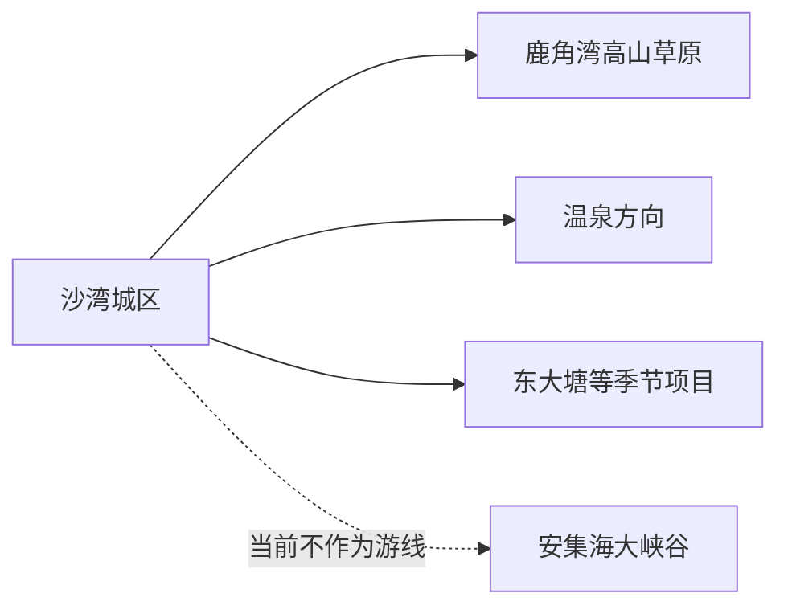
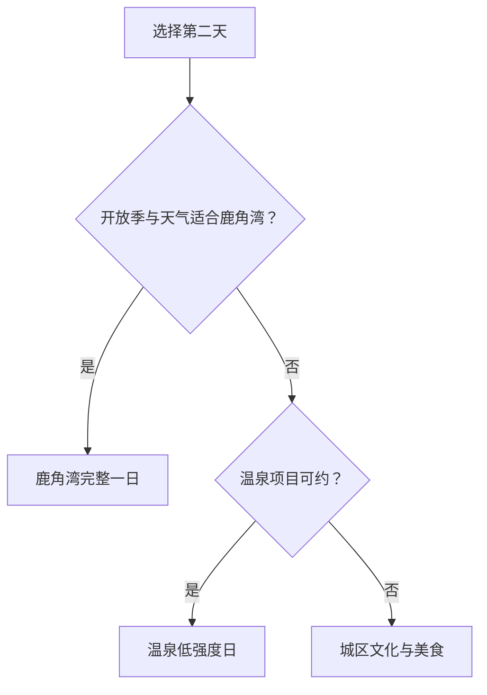

# 沙湾旅行指南

沙湾位于天山北坡，是把绿洲城区、沙湾大盘鸡、鹿角湾草原和温泉度假组合在一起的县级市。远线横跨山前公路与高山草原，适合以城区为基地，每天选择鹿角湾或温泉一个方向；安集海大峡谷当前未开放，旅行计划以官方开放项目为准。

## 城市速览

| 项目 | 信息 |
|---|---|
| 旅行主线 | 沙湾城区与美食、鹿角湾、温泉方向、季节性乡村项目 |
| 建议停留 | 城区半日至 1 天；加入鹿角湾或温泉共 2–3 天 |
| 住宿基地 | 城区适合交通与餐饮；温泉住宿适合已锁定的度假日 |
| 步行强度 | 城区低；草原中等，高海拔与日晒会放大体力消耗 |
| 主要天气 | 大风、强日照、昼夜温差、山地降温、雷暴雨雪和冬季道路结冰 |
| 预约核心 | 景区季节、道路、区间车、温泉运营、返程车辆与证件 |
| 边界重点 | 安集海大峡谷未开放；草场、牧道、矿区、水源地和边界管理区域按公告活动 |
| 无障碍 | 城区较易安排；草原与温泉逐点核对落客、坡道、卫生间和客房 |

## 城市格局与游览区域

沙湾市是塔城地区所辖县级市，法定代码 `654203`。本页绑定固定城市点 GeoNames `1529239 Sandaohezi`；Wikidata `Q1023098` 的 `P1566=1529209` 更接近行政记录，两个标识粒度不同。乌苏、石河子和塔城均是独立目的地。

| 区域 | 旅行价值 | 怎么安排 |
|---|---|---|
| 沙湾城区 | 到达、住宿、大盘鸡与城市补给 | 抵达日或半日 |
| 鹿角湾 | 天山北坡高山草原与季节景观 | 5—10 月优先，留完整一天 |
| 温泉方向 | 温泉休闲与山地度假 | 依据运营项目留半日至一日 |
| 东大塘等方向 | 季节性草原、山地与乡村项目 | 只选官方当期开放单元 |
| 安集海大峡谷 | 峡谷地貌 | 官方名录标注未开放，等待主管部门公布开放信息 |

## 主要景点

| 景点 | 所在区域 | 类型 | 核心看点 | 建议用时 | 室内/室外 | 体力 | 预约难度 | 天气敏感度 | 适合旅程 |
|---|---|---|---|---|---|---|---|---|---|
| 沙湾城区与公共文化 | 城区 | 城市与地方文化 | 绿洲城市、地方展览与生活街区 | 2–4 小时 | 混合 | 低 | 中 | 低 | A |
| 鹿角湾景区 | 天山北坡 | 高山草原 | 草原、云杉与山地视野 | 5–8 小时 | 室外 | 中至高 | 高 | 极高 | A |
| 沙湾温泉旅游区 | 温泉方向 | 温泉与度假 | 温泉体验、山地环境与休息 | 半日至 1 天 | 混合 | 低至中 | 高 | 高 | A |
| 东大塘等正式开放景区 | 山前方向 | 草原与山地 | 季节景观与当期运营项目 | 4–7 小时 | 室外 | 中至高 | 高 | 极高 | B |

鹿角湾按游客入口、开放道路和景区服务体系活动，牧场、草场生产道路与林草防火封控继续执行原有管理。温泉项目先确认经营资质和健康提示。安集海大峡谷列入官方未开放名单，当前行程选择鹿角湾、温泉或其他明确开放景区。

## 美食与餐饮

| 类型 | 适合场景 | 份量 | 过敏与饮食提示 | 怎么选 |
|---|---|---|---|---|
| 沙湾大盘鸡 | 城区正餐 | 常为 2–4 人份 | 鸡肉、土豆、辣椒；面条含小麦 | 独行问小份，先确认配面、份量与价格 |
| 拉条子与拌面 | 城区简餐 | 一人份 | 小麦、肉类、辣椒与大豆调味 | 询问少油少辣和配菜 |
| 烤肉与抓饭 | 城区正餐 | 可单人 | 羊肉、米饭、孜然；关注清真经营与油脂 | 选择明码标价、现制和配料可说明的店 |
| 奶茶与乳制品 | 城区或正规牧区餐饮 | 小份试饮 | 乳糖、奶蛋白、盐与糖 | 先问奶源、甜咸和储存条件 |

## 经典行程

### 一日经典路线

**路线**：城区早餐与公共文化 → 午餐品尝大盘鸡 → 城市生活短段

- **串联逻辑**：用一天理解绿洲城市与代表饮食。
- **预约锚点**：场馆开放与餐厅份量。
- **休息安排**：正午完整休息，户外放在早晚。
- **时间不足时**：保留一处公共文化和一餐。

### 两日首次到访路线

**第 1 天**：沙湾城区 
**第 2 天**：鹿角湾完整一日

- **串联逻辑**：城市与高山草原分日。
- **预约锚点**：鹿角湾开放季、道路和车辆。
- **休息安排**：游客服务点补水，减少高海拔快走。
- **时间不足时**：删除第二日外围步道。

### 温泉度假路线

**路线**：城区 → 正规温泉项目 → 午休 → 低强度体验 → 住宿或返回

- **适用条件**：项目运营、健康条件和返程已确认。
- **预约锚点**：房型、泡池、儿童规则与退改。
- **休息安排**：分段入池并及时补水。
- **时间不足时**：只保留一次主要体验。

### 雨雪与大风路线

**路线**：城区公共文化 → 午餐 → 室内休息

- **适用条件**：城市交通正常；山地预警或道路管制时留在城区。
- **预约锚点**：天气、道路与场馆开放。
- **休息安排**：室内为主。
- **时间不足时**：只留一处场馆。

### 亲子路线

**路线**：城区公共文化 → 午休 → 温泉或服务明确的草原短线二选一

- **串联逻辑**：按孩子耐力选择低强度自然体验。
- **预约锚点**：儿童票、安全设施与医疗条件。
- **休息安排**：每小时补水和防晒。
- **时间不足时**：保留城区。

### 低体力路线

**路线**：车辆到达城区核心点 → 午餐长休 → 正规温泉项目

- **串联逻辑**：用门到门交通减少久站与坡地。
- **预约锚点**：落客、电梯、泡池扶手与健康禁忌。
- **休息安排**：体验之间留足恢复时间。
- **时间不足时**：只留城区或温泉一项。

### 山地草原路线

**路线**：城区早出发 → 鹿角湾游客入口 → 开放短线 → 服务区午休 → 原路返回

- **适用条件**：5—10 月开放期且天气、道路稳定。
- **预约锚点**：开放区域、车辆、最晚返程与防火要求。
- **休息安排**：高海拔慢走，补水、防晒和保暖同步准备。
- **时间不足时**：保留入口附近核心景观。

## 住宿区域

| 区域 | 优点 | 取舍 | 适合人群 | 核对项 |
|---|---|---|---|---|
| 沙湾城区 | 餐饮、补给与多方向接驳方便 | 山地往返仍长 | 首访、无车、饮食旅行 | 交通、早餐、停车和夜间入住 |
| 温泉正规住宿 | 便于休息和分段体验 | 对城区与鹿角湾未必顺路 | 度假、低强度旅行 | 资质、泡池、供暖、退改与接驳 |
| 鹿角湾周边正规住宿 | 接近草原行程 | 季节强、选择少、夜温低 | 摄影、自驾 | 营业期、供暖、餐食、道路和消防 |

## 市内交通

沙湾城区通过铁路与公路连接乌鲁木齐、石河子、乌苏等方向。鹿角湾、温泉和山前项目相距较远，按整日车辆行程准备。

| 场景 | 怎么做 | 行前核对 |
|---|---|---|
| 铁路到达 | 看清沙湾市站等票面完整站名，再转城区 | 车次、站前交通与夜间到达 |
| 前往鹿角湾 | 自驾或正规包车，早出晚回 | 路况、开放、燃油、返程和信号 |
| 前往温泉 | 预订住宿或项目时同步确认接驳 | 实际地址、车辆与退改 |
| 跨城联游 | 沙湾、乌苏、石河子分开安排住宿与交通 | 车次、行政边界和最后一段接驳 |

## 不同旅行者须知

| 旅行者 | 推荐做法 | 重点核对 |
|---|---|---|
| 独行 | 住城区，远线使用可追溯的正规车辆 | 资质、返程和通信 |
| 亲子 | 城区加草原入口短线或温泉 | 防晒、温差、护栏和儿童规则 |
| 长者与低体力 | 城区或温泉，草原只走近入口段 | 海拔反应、医疗、座椅与卫生间 |
| 摄影 | 鹿角湾单独一天 | 开放、防火、天气、三脚架与无人机 |
| 自驾 | 满油出发，每天一个远线 | 山路、结冰、牲畜通行与疲劳驾驶 |

## 行前核对

- 沙湾市政府文旅信息：景区开放季、活动与临时管理。
- 鹿角湾和温泉运营方：入口、票务、道路、住宿和退改。
- 新疆气象、交通、林草与应急信息：大风、雨雪、火险和道路。
- 中国铁路 12306：动态车次、站名与退改。
- 边界限制：安集海大峡谷以官方未开放状态为准。

## 来源与更新记录

| 来源 | 支持内容 | 核验日期 |
|---|---|---|
| [沙湾市 A 级旅游景区服务信息](https://www.xjsw.gov.cn/xxgk/fdzdgknr/zdly/lyly/content_37935) | 鹿角湾、温泉、东大塘的季节与联系方式；安集海大峡谷未开放 | 2026-09-01 |
| [沙湾市政府：鹿角湾](https://www.xjsw.gov.cn/jxswmsmc/lysw/yzsw/content_21945) | 鹿角湾位置与高山草原特征 | 2026-09-01 |
| [沙湾市政府工作报告](https://www.xjsw.gov.cn/xxgk/fdzdgknr/zfgzbg/content_37533) | 文旅方向与沙湾大盘鸡城市品牌 | 2026-09-01 |
| [Wikidata Q1023098](https://www.wikidata.org/wiki/Q1023098) | 沙湾市法定实体及行政记录粒度 | 2026-09-01 |
| [GeoNames 1529239](https://www.geonames.org/1529239/) | 固定 Sandaohezi 城市点 | 2026-09-01 |
| [中国铁路 12306](https://www.12306.cn/) | 动态车次与购票 | 2026-09-01 |
| [新疆维吾尔自治区气象局](http://xj.cma.gov.cn/) | 气象预警 | 2026-09-01 |

| 日期 | 更新 |
|---|---|
| 2026-09-01 | 首次完成城区、鹿角湾、温泉与山地开放边界研究。 |
