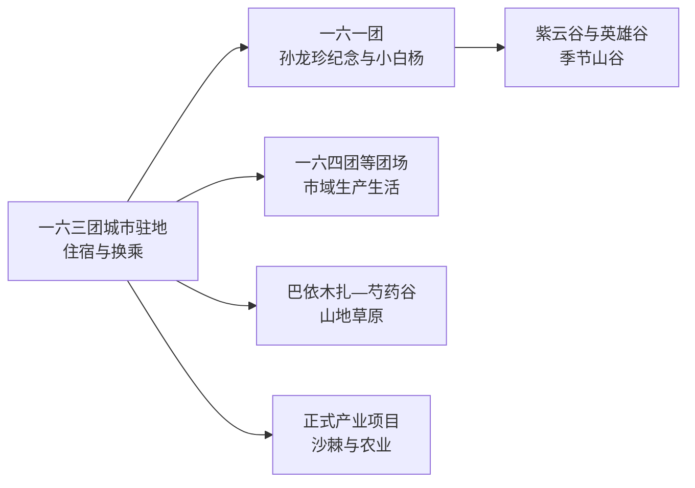
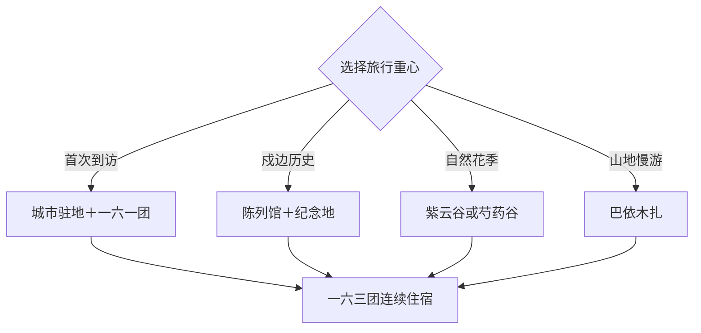

# 白杨旅行指南

白杨是第九师师市合一城市，市政府驻一六三团光明路一带，旅行资源沿边境团场展开。首访适合 2–3 天：先在城市驻地辨认师市格局，再把一六一团戍边文化与紫云谷排成一天，第三天按季节选择巴依木扎、芍药谷或正式产业体验。

本页使用 GeoNames **12006877**（一六四团场一营）定位白杨法定市域内的真实地名点；它是市域锚点，并非白杨市法定实体或市政府驻地。旅行对象以白杨市代码 `659012` 和 Wikidata `Q116265658` 为准，市政府驻一六三团光明路 1 号。该点位于固定 `cities500` 快照外，只计入法定县级市覆盖。

## 城市速览

| 项目 | 信息 |
|---|---|
| 主线 | 一六三团城市驻地—一六一团戍边文化—紫云谷—巴依木扎山地草原 |
| 停留 | 城市辨识半天；一六一团主题线 1 天；山地或产业体验另留 1 天 |
| 住宿 | 一六三团城市驻地适合换乘；团场和景区住宿按营业季预约 |
| 交通 | 塔城方向接入后以预约车辆串联分散团场，边境和山地方向预留检查时间 |
| 季节 | 春末至秋初适合花谷、草原与户外；红色场馆适合全年候选 |
| 预算 | 场馆与公共空间成本较低，远线包车、住宿和体验项目增加支出 |

## 城市格局与游览区域

白杨市域由多个团场片区构成，景点之间的车程比城区地图更有决定性。一六一团适合集中理解戍边历史，巴依木扎与山谷路线按天气、道路和运营季另排。塔城市、额敏县、裕民县及兵团团场之间边界交错，行程按景点正式地址和实际入口归属核对。国界、边防执勤区、军事管理区、农牧业生产地和自然保护空间执行明确准入边界。

## 主要景点

| 景点 | 区域 | 类型 | 核心体验 | 用时 | 环境 | 体力 | 预约风险 | 天气影响 | 优先级 |
|---|---|---|---|---:|---|---|---|---|---|
| 小白杨哨所主题参观点 | 一六一团方向 | 戍边文化 | 《小白杨》意象、边境历史和正式参观线 | 1–2小时 | 室外为主 | 低 | 很高 | 高 | A |
| 孙龙珍屯垦戍边陈列馆 | 一六一团 | 红色场馆 | 孙龙珍事迹、屯垦戍边与团场历史 | 1.5–2小时 | 室内 | 低 | 很高 | 低 | A |
| 孙龙珍军垦烈士陵园 | 一六一团 | 纪念空间 | 纪念设施与主题教育 | 1小时 | 室外 | 低 | 高 | 高 | A |
| 一六一团自然资源馆 | 一六一团 | 自然展陈 | 区域地貌、生物与资源认知 | 1–1.5小时 | 室内 | 低 | 很高 | 低 | B |
| 紫云谷正式游线 | 一六一团方向 | 山谷与花季 | 山谷景观、季节花海和轻徒步 | 2–4小时 | 室外 | 中 | 很高 | 很高 | A |
| 英雄谷正式游线 | 一六一团方向 | 峡谷与红色主题 | 山谷景观、戍边主题与户外步道 | 2–4小时 | 室外 | 中 | 很高 | 很高 | B |
| 魏德友戍边事迹展览馆 | 团场方向 | 人物与戍边史 | 魏德友事迹和边境团场生活 | 1–1.5小时 | 室内 | 低 | 很高 | 低 | B |
| 巴依木扎景区当期开放区 | 一六五团方向 | 山地草原 | 森林、草场与山地休闲 | 半天至1天 | 室外 | 中 | 很高 | 很高 | A |
| 芍药谷正式观赏区 | 一六五团方向 | 花谷与自然 | 野生芍药花期、谷地和摄影 | 2–4小时 | 室外 | 中 | 很高 | 很高 | B |
| 金沙棘小镇或老水磨正式项目 | 团场方向 | 产业与乡村 | 沙棘产业、团场乡村和水磨记忆 | 2–3小时 | 混合 | 低 | 很高 | 中高 | C |

## 美食与餐饮

白杨可选择抓饭、拌面、烤肉、手抓肉、奶茶和团场时令果蔬。城市驻地适合解决日常餐饮，山地与团场远线提前确认午餐和饮水；牛羊肉、乳制品、坚果、辣度及清真餐需求在点餐时说明。

## 经典行程

### 城市驻地认识线
**路线**：一六三团城市驻地—公共服务区—团场生活街区—城市夜景。**逻辑**：先辨认新城市驻地与师市格局。**预约锚点**：公共场馆和当期活动。**休息**：城市商业区。**删除条件**：公共场馆闭馆时保留街区慢行。

### 一六一团戍边线
**路线**：自然资源馆—孙龙珍屯垦戍边陈列馆—烈士陵园—小白杨正式参观点。**逻辑**：由自然环境进入人物与戍边历史。**预约锚点**：场馆、参观点、证件和车辆。**休息**：一六一团公共服务区。**删除条件**：边境参观点暂停接待时在场馆与纪念地内完成主题线。

### 紫云谷季节线
**路线**：城市驻地—紫云谷正式入口—主游线—返城。**逻辑**：把花期与谷地步行集中在光线较好的半天。**预约锚点**：花期、道路和运营接待。**休息**：游客服务点。**删除条件**：强降雨、雷暴、大风或山洪预警时改室内展陈。

### 巴依木扎草原线
**路线**：城市驻地—巴依木扎当期开放区—草原午餐—观景点—返程。**逻辑**：用完整一天消化山地路程。**预约锚点**：景区开放、车辆、餐饮和返程。**休息**：正式接待点。**删除条件**：道路管制、降雪或火险管控时改城市线。

### 魏德友事迹线
**路线**：正式展览馆—团场生活区—主题交流活动。**逻辑**：以人物故事理解长期守边生活。**预约锚点**：展馆接待与讲解。**休息**：团场公共服务点。**删除条件**：展馆当日无接待时改孙龙珍陈列馆。

### 亲子自然线
**路线**：自然资源馆—午餐—紫云谷短线或正式农业体验。**逻辑**：室内认知与低强度户外互相平衡。**预约锚点**：场馆、花期和体验年龄。**休息**：团场餐饮点。**删除条件**：天气不稳时缩为自然资源馆加城市公共空间。

### 三日完整线
**路线**：首日城市驻地，次日一六一团戍边文化，第三日巴依木扎或芍药谷。**逻辑**：新城、历史和自然分日。**预约锚点**：远线车辆、边境参观、景区与退改。**休息**：连续住一六三团城市驻地。**删除条件**：压缩为两天时删除季节性自然支线。

## 住宿区域

一六三团城市驻地适合作为统一住宿点，方便补给和向各团场发车。一六一团或巴依木扎周边正式接待适合主题慢游，预订时核对营业季、供暖、餐饮、夜间道路与取消规则。塔城住宿适合区域联程，每日往返白杨远点时应把边境检查和山地车程计入总时长。

## 市内交通

进入白杨通常先衔接塔城地区公路或航空节点，再换预约车辆。市域片区分散，城市驻地、一六一团和一六五团适合分日安排。G219 及边境支线按当天路况、证件和检查要求通行；边防执勤区、军事设施、草场生产区、林地防火区和自然保护地执行正式开放范围。

## 不同旅行者须知

首次到访者选择城市驻地加一六一团，亲子家庭可用自然资源馆、纪念展陈和短线花谷组合，摄影旅行者按芍药、薰衣草、草原和秋色花期选日。行动不便者逐点确认坡度、台阶和无障碍条件；边境主题旅行携带有效证件，并按预约单位指引完成参观。

## 行前核对

- 通过第九师白杨市和兵团文旅渠道核对场馆、哨所主题参观点及山地景区开放。
- 核对塔城方向接驳、团场间车辆、边境证件和当日检查安排。
- 紫云谷、芍药谷、巴依木扎及农业项目按花期、营业季和正式入口预约。
- 查看大风、雷暴、降雪、山洪、森林草原火险和道路管制。

## 来源与更新记录

| 来源 | 支持内容 | 核验日期 |
|---|---|---|
| [新疆生产建设兵团：第九师白杨市文旅资源](https://www.xjbt.gov.cn/c/2025-03-25/8390980.shtml) | 小白杨哨所、孙龙珍与魏德友展陈、金沙棘小镇 | 2026-09-04 |
| [文化和旅游部：一六一团红色与自然线路](https://zhuanti.mct.gov.cn/xcsshfghlxj/jpxl/detail/9135.html) | 紫云谷、自然资源馆、孙龙珍纪念地、小白杨主题参观点 | 2026-09-04 |
| [文化和旅游部：巴依木扎与芍药谷线路](https://zhuanti.mct.gov.cn/rxhmxjgn2022/beijing/detail_g7yU_504/3448.html) | 巴依木扎、芍药谷和山地游线 | 2026-09-04 |
| [GeoNames 12006877](https://www.geonames.org/12006877/) | 白杨法定市域内一六四团场一营地名点 | 2026-09-04 |
