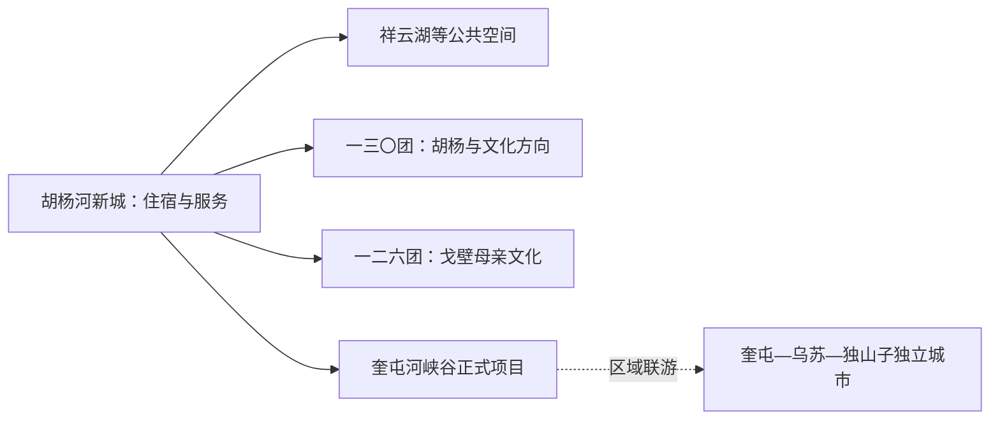
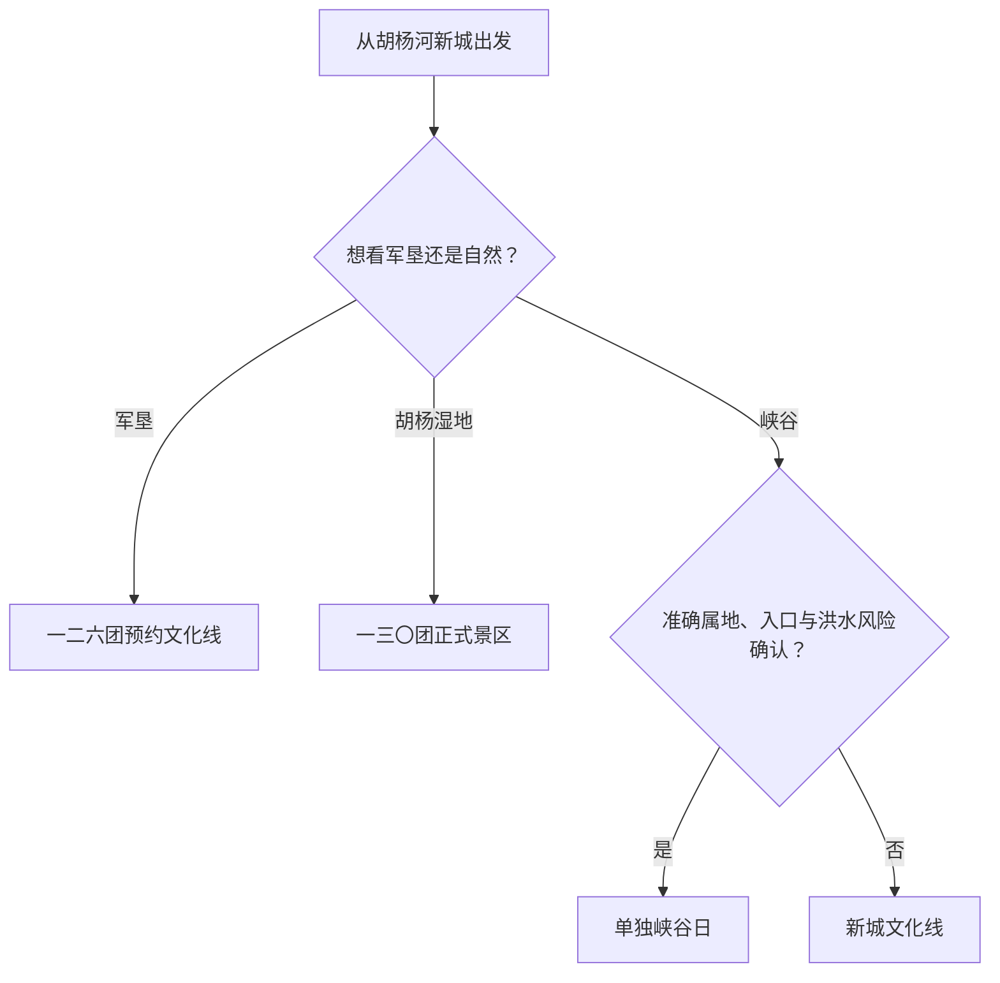

# 胡杨河旅行指南

胡杨河是一座以军垦文化、绿洲新城和第七师团场生活为线索的兵团城市。第七师胡杨河市实行师市合一，但团场和景点跨越很大的非连续空间；城市核心、戈壁母亲文化点、胡杨湿地与奎屯河峡谷方向需要按准确地址分别规划。

## 城市速览

| 项目 | 信息 |
|---|---|
| 旅行主线 | 胡杨河新城公共空间、军垦文化、一二六团戈壁母亲旧居、胡杨水韵及正式峡谷项目 |
| 建议停留 | 新城与文化 1 天；一处团场或自然项目再加 1 天 |
| 住宿基地 | 胡杨河新城适合市级服务；奎屯可作为区域交通补给点但属于独立城市 |
| 步行强度 | 新城低；文化场馆低至中；湿地与峡谷中至高 |
| 主要天气 | 暑热、严寒、大风、沙尘、暴雨、洪水、草原火险和冬季结冰 |
| 预约核心 | 场馆、团场接待、车辆、景区准确入口与返程 |
| 边界重点 | 农田、灌渠、水利工程、工业园、油气管线、保护地和边境区域分别管理 |
| 无障碍 | 新城较易减步行；团场与自然点的设施连续性需逐项确认 |

## 城市格局与游览区域

胡杨河市是新疆维吾尔自治区直辖、由新疆生产建设兵团第七师管理的县级市，法定代码 `659010`；GeoNames `13561750` 与 Wikidata `Q9435117` 对应城市实体。第七师胡杨河市辖多个团场，官网文旅信息也采用师市整体口径；旅行者应以景点具体团场、道路和经营主体作为导航依据。

| 区域 | 旅行价值 | 怎么安排 |
|---|---|---|
| 胡杨河新城 | 城市公共空间、文化活动与市级服务 | 到达日或半日 |
| 一三〇团方向 | 胡杨水韵、文化馆与绿洲团场景观 | 运营确认后半日至一日 |
| 一二六团等军垦文化点 | 戈壁母亲旧居与军垦研学 | 预约后独立半日以上 |
| 奎屯河与外围自然方向 | 峡谷、湿地、沙漠等正式项目 | 每次只选一处并确认属地 |

## 主要景点

| 景点 | 所在区域 | 类型 | 核心看点 | 建议用时 | 室内/室外 | 体力 | 预约难度 | 天气敏感度 | 适合旅程 |
|---|---|---|---|---|---|---|---|---|---|
| 胡杨河新城公共空间 | 城市核心 | 新城与公共文化 | 兵团新城规划、城市生活与当期文化活动 | 2–4 小时 | 混合 | 低 | 低 | 中 | A |
| 师市文化馆或当期开放展陈 | 新城 | 文化场馆 | 军垦、非遗、文学与地方文化活动 | 2–3 小时 | 室内 | 低 | 中高 | 低 | A |
| 一二六团戈壁母亲旧居 | 团场方向 | 旧址与研学 | 军垦生活史、老物件与垦荒记忆 | 2–4 小时 | 混合 | 低至中 | 高 | 中 | A |
| 胡杨水韵景区 | 一三〇团 | 湿地与胡杨 | 奎屯河、天然次生胡杨林与绿洲生态 | 半日至 1 天 | 室外 | 中 | 高 | 极高 | B |
| 胡杨荷韵文化馆 | 一三〇团 | 团场文化 | 胡杨、团场生活和地方文化展示 | 1–2 小时 | 室内 | 低 | 高 | 低 | B |
| 奎屯河大峡谷正式开放项目 | 师市及区域方向 | 峡谷与地质 | 河流切割地貌与荒漠峡谷景观 | 半日至 1 天 | 室外 | 中至高 | 极高 | 极高 | B |

师市范围内农业、水利、能源与工业设施密集。农田与连队是生产生活空间，参观通过公开活动或接待安排；渠道闸站、矿区、工业园、铁路专用线和油气管线区域保持作业用途。峡谷只走正式入口、护栏和游线，崖缘、谷底及洪水通道按安全管理范围活动。

## 美食与餐饮

| 类型 | 适合场景 | 份量 | 过敏与饮食提示 | 怎么选 |
|---|---|---|---|---|
| 戈壁母亲大包子 | 团场或城区简餐 | 单个偏大 | 麸质、肉类、洋葱和油脂 | 先点一个并确认馅料 |
| 高泉豆腐菜 | 正餐 | 一人或共享 | 大豆、菌类和调味酱 | 问清做法、配料和辣度 |
| 田园酸菜鸡 | 多人正餐 | 共享为主 | 禽肉、腌制品、辣椒和共锅 | 两人先问小份与盐度 |
| 新疆抓饭、拌面与烤肉 | 城区日常用餐 | 一人份或共享 | 牛羊肉、麸质、洋葱和油脂 | 选明厨、现制并可调整份量的店 |

## 经典行程

### 一日新城与文化路线

**路线**：胡杨河新城公共空间 → 午餐 → 师市文化场馆或当期展览 → 祥云湖周边短段

- **串联逻辑**：用新城建设与文化展陈建立师市框架。
- **预约锚点**：场馆开放、活动和准确入口。
- **休息安排**：正午在城区室内用餐。
- **时间不足时**：保留场馆与一段公共空间。

### 两日军垦与绿洲路线

**第 1 天**：新城—文化场馆—城区住宿 
**第 2 天**：一二六团戈壁母亲旧居或一三〇团胡杨水韵二选一

- **串联逻辑**：城市建设与团场历史或生态分日。
- **预约锚点**：团场接待、景区开放、车辆和返程。
- **休息安排**：第二天只走一个团场方向。
- **时间不足时**：保留新城文化线。

### 戈壁母亲文化路线

**路线**：新城早出发 → 一二六团正式接待点 → 戈壁母亲旧居 → 午餐 → 原路返回

- **适用条件**：接待、讲解和公路交通已确认。
- **预约锚点**：旧居开放、团场联系人和车辆。
- **休息安排**：在团场正规经营点用餐。
- **时间不足时**：整段顺延，不压缩为晚间往返。

### 风沙或高温路线

**路线**：近距离文化场馆 → 午餐长休 → 傍晚新城公共空间短段

- **适用条件**：城市交通正常；沙尘、极端高温或大风预警时留在室内。
- **预约锚点**：场馆开放、空调供暖与叫车。
- **休息安排**：正午和风沙最强时段在室内。
- **时间不足时**：只保留场馆。

### 亲子路线

**路线**：军垦文化展陈 → 午休 → 新城平缓公共空间

- **串联逻辑**：历史学习与户外观察各一个短段。
- **预约锚点**：儿童讲解、推车、卫生间和室内休息。
- **休息安排**：户外段避开正午。
- **时间不足时**：保留文化展陈。

### 低体力路线

**路线**：车辆门到门到达一座场馆 → 午餐长休 → 祥云湖近入口短段

- **适用条件**：落客、轮椅和道路平整度已确认。
- **预约锚点**：无障碍入口、座椅、卫生间和返程。
- **休息安排**：全日只有一处主要参观点。
- **时间不足时**：删除湖边短段。

### 峡谷或胡杨延伸路线

**路线**：住宿地早出发 → 奎屯河大峡谷正式开放项目或胡杨水韵二选一 → 服务点午休 → 白天返回

- **适用条件**：准确属地、入口、运营、天气和洪水风险全部落实。
- **预约锚点**：车辆、景区、护栏游线、最晚离开与返程。
- **休息安排**：使用正式游客设施，携带饮水与防晒。
- **时间不足时**：整段删除，改走新城线。

## 住宿区域

| 区域 | 优点 | 取舍 | 适合人群 | 核对项 |
|---|---|---|---|---|
| 胡杨河新城 | 市级服务、文化活动与新城体验 | 去分散团场需车辆 | 首访、师市主题旅行 | 准确地址、停车、早餐和夜间入住 |
| 团场正规住宿 | 接近单一文化或生态点 | 服务选择和距离差异大 | 自驾、研学 | 合法经营、供餐、通信、消防和退改 |
| 奎屯城区 | 区域铁路、餐饮与车辆资源较多 | 属独立城市，往返胡杨河仍需公路 | 区域联游、铁路到达 | 车站、跨城车辆、返程与行政地址 |

## 市内交通

| 场景 | 怎么做 | 行前核对 |
|---|---|---|
| 铁路或航空到达 | 多数行程经奎屯等区域枢纽转公路到胡杨河 | 票面站名、机场、跨城车辆与夜间到达 |
| 新城内部 | 步行、出租或当地公交处理短距离 | 运营时间、叫车和活动封路 |
| 团场之间 | 自驾或正规包车，每日只选一个方向 | 路况、加油、通信、准确地址和返程 |
| 冬季与沙尘天气 | 缩短路线并留备用时间 | 道路结冰、能见度、大风和车辆装备 |

## 不同旅行者须知

| 旅行者 | 推荐做法 | 重点核对 |
|---|---|---|
| 独行 | 住新城并提前锁定团场往返 | 司机资质、通信、夜间到店和返程 |
| 亲子 | 文化场馆加新城短段 | 儿童座椅、防晒、饮水和卫生间 |
| 长者与低体力 | 新城一日，团场选择门到门接待 | 轮椅、落客、座椅和医疗点 |
| 摄影 | 胡杨、峡谷与军垦点分日 | 无人机、生产边界、日落返程和大风 |
| 自驾 | 按具体团场导航，白天完成长路 | 燃油、轮胎、农机车辆、洪水和疲劳 |

## 行前核对

- 第七师胡杨河市政府与兵团文旅：文化活动、景区、团场接待与路线。
- 景区和团场：准确行政地址、开放入口、讲解、停车与返程。
- 新疆气象、水利、林草和应急信息：高温、沙尘、洪水、火险与道路。
- 中国铁路 12306 与区域机场：到发站、航班和最后一段接驳。

## 来源与更新记录

| 来源 | 支持内容 | 核验日期 |
|---|---|---|
| [第七师胡杨河市政府：七师概况](https://www.nqs.gov.cn/zjqs/qsgk/content_54378) | 师市格局、军垦文化、团场与主要旅游资源 | 2026-09-01 |
| [新疆生产建设兵团：七师胡杨河文旅综述](https://www.xjbt.gov.cn/c/2025-12-16/8463855.shtml) | 戈壁母亲、军垦文化、湿地与峡谷项目 | 2026-09-01 |
| [新疆生产建设兵团：胡杨水韵](https://www.xjbt.gov.cn/c/2025-05-19/8407343.shtml) | 一三〇团胡杨水韵景区与胡杨林生态 | 2026-09-01 |
| [Wikidata Q9435117](https://www.wikidata.org/wiki/Q9435117) | 胡杨河市实体对齐 | 2026-09-01 |
| [GeoNames 13561750](https://www.geonames.org/13561750/) | 固定胡杨河城市点 | 2026-09-01 |
| [新疆维吾尔自治区气象局](http://xj.cma.gov.cn/) | 气象预警 | 2026-09-01 |

| 日期 | 更新 |
|---|---|
| 2026-09-01 | 首次完成新城、军垦文化、团场与自然方向研究，并区分师市口径、独立城市、农业水利和工业生产边界。 |
