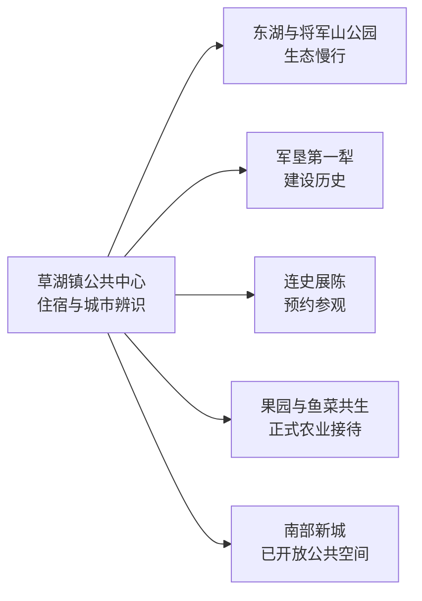
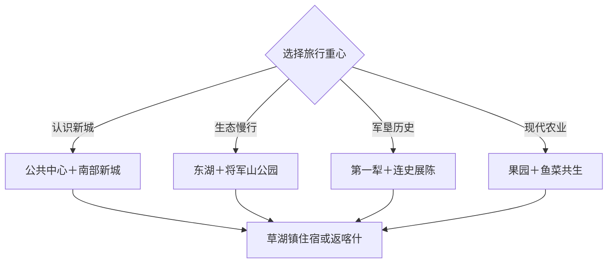

# 草湖旅行指南

草湖于 2026 年设市，是第三师师市合一体系中的新城市，市政府驻草湖镇。当前适合把它当作“认识一座新城”的 1–2 日目的地：东湖与公共空间看生态底色，军垦第一犁理解建设起点，再从正式开放的农业、连史展陈或南部新城公共项目中选一条支线。

本页使用 GeoNames **12454087**（Dacaohu／大草湖）定位四十一团草湖镇范围内的真实设施点；它是法定市域锚点，并非草湖市法定实体或市政府门面。旅行对象以草湖市代码 `659013` 和正式设市文件为准。该点位于固定 `cities500` 快照外，只计入法定县级市覆盖。

## 城市速览

| 项目 | 信息 |
|---|---|
| 主线 | 草湖镇公共中心—东湖—军垦第一犁—正式农业与新城项目 |
| 停留 | 新城与东湖半日至 1 天；军垦或生态农业支线另留半天 |
| 住宿 | 草湖镇适合近距离观察新城；喀什可作区域联程枢纽并核算往返车程 |
| 交通 | 以公路接入为主，公共点位集中游览，农业和连队项目提前预约车辆 |
| 季节 | 春秋适合步行，夏季看荷花与农业，冬季重点确认风雪和接待 |
| 预算 | 公共空间成本较低，预约车辆、讲解和农业体验构成主要增量 |

## 城市格局与游览区域

草湖仍处在行政建制和城市功能持续完善阶段，公开可游资源以草湖镇、东湖、军垦历史点和正式生态农业接待为主。喀什市、疏勒县、伽师县、岳普湖县、巴楚县及图木舒克市是各自独立目的地，近距离联程按实际行政归属、入口和道路核对。河道、水利设施、农田、果园、养殖区、连队生产空间和建设工地执行运营与生产边界。

## 主要景点

| 景点 | 区域 | 类型 | 核心体验 | 用时 | 环境 | 体力 | 预约风险 | 天气影响 | 优先级 |
|---|---|---|---|---:|---|---|---|---|---|
| 草湖镇公共中心 | 草湖镇 | 新城观察 | 行政驻地、公共服务和新城尺度 | 1–2小时 | 混合 | 低 | 低 | 中 | A |
| 东湖公共开放段 | 草湖镇 | 湖泊与公园 | 荷花、水岸慢行和城市生态 | 1.5–2小时 | 室外 | 低 | 中 | 很高 | A |
| 将军山公园当期开放区 | 草湖镇 | 城市公园 | 山体景观、公共绿地和城市视角 | 1–2小时 | 室外 | 低中 | 中 | 高 | B |
| 军垦第一犁纪念点 | 四十一团草湖镇 | 军垦历史 | 开垦起点、雕塑和师市建设叙事 | 1小时 | 室外为主 | 低 | 高 | 高 | A |
| 四十一团连史馆正式接待点 | 四十一团 | 团场史 | 连队建设、生产生活与口述历史 | 1–1.5小时 | 室内 | 低 | 很高 | 低 | B |
| 马家花园历史展示候选点 | 草湖镇方向 | 地方史 | 历史建筑或相关展陈的当期开放内容 | 1小时 | 混合 | 低 | 很高 | 中 | C |
| 正式果园体验点 | 四十一团 | 生态农业 | 林果种植、采摘季与团场农业 | 1.5–2小时 | 室外 | 低 | 很高 | 高 | B |
| 鱼菜共生正式接待项目 | 四十一团 | 现代农业 | 循环养殖、温室和农业技术 | 1–1.5小时 | 室内为主 | 低 | 很高 | 低 | B |
| 盖孜河公共生态观察段 | 草湖镇周边 | 河流与生态 | 河岸环境、水系与绿洲格局 | 1–2小时 | 室外 | 低中 | 很高 | 很高 | C |
| 南部新城已开放公共空间 | 草湖镇 | 城市建设 | 新道路、公共景观和城市成长 | 1–2小时 | 室外 | 低 | 高 | 高 | B |

## 美食与餐饮

草湖可选择抓饭、拌面、烤肉、手抓肉、馕和团场时令果蔬。草湖镇解决正餐和补给更稳妥，农业或连队支线提前确认接待餐；牛羊肉、乳制品、坚果、辣度及清真餐需求在点餐时说明。

## 经典行程

### 新城认识线
**路线**：草湖镇公共中心—公共服务街区—南部新城已开放空间—城市夜景。**逻辑**：从行政驻地理解新设城市的建设尺度。**预约锚点**：当期公共场馆与开放路段。**休息**：草湖镇商业服务点。**删除条件**：建设调整时保留公共中心与成熟街区。

### 东湖生态线
**路线**：东湖公共开放段—午餐—将军山公园当期开放区。**逻辑**：水岸与城市绿地连续慢游。**预约锚点**：公园开放、荷花期和步道维护。**休息**：东湖公共服务点。**删除条件**：高温、大风、雷暴或结冰时改短线城市观察。

### 军垦历史线
**路线**：军垦第一犁纪念点—连史馆正式接待点—团场公共生活区。**逻辑**：从开垦符号走向具体连队历史。**预约锚点**：展陈接待、讲解和车辆。**休息**：四十一团公共服务区。**删除条件**：连史馆当日无接待时保留第一犁与公开城市史资料。

### 生态农业线
**路线**：正式果园—团场午餐—鱼菜共生接待项目。**逻辑**：把传统林果与循环农业放在同一天。**预约锚点**：生产安排、卫生要求、采摘季和价格。**休息**：正式接待中心。**删除条件**：农忙或项目停接待时改东湖生态线。

### 城市发展观察线
**路线**：公共中心—东湖—南部新城已开放道路与公园—日落。**逻辑**：用公共空间观察生态与建设如何衔接。**预约锚点**：施工绕行和公共区域开放。**休息**：草湖镇。**删除条件**：扬尘、大风或道路调整时缩为东湖短线。

### 低体力半日线
**路线**：草湖镇公共中心—东湖短步道—午餐。**逻辑**：减少跨片区车辆与步行。**预约锚点**：东湖步道和无障碍条件。**休息**：公共服务点。**删除条件**：户外天气不佳时只保留室内公共空间候选。

### 两日完整线
**路线**：首日新城、东湖与将军山，次日军垦第一犁加正式农业体验。**逻辑**：城市生态与建设生产分日。**预约锚点**：住宿、展陈、农业项目与车辆退改。**休息**：草湖镇连续住宿。**删除条件**：压缩为一天时选择东湖加军垦第一犁。

## 住宿区域

草湖镇适合观察清晨和夜间的新城生活，也方便前往东湖与团场预约点；预订时核对新开住宿的定位、餐饮、供暖与取消规则。喀什住宿选择更多，适合把草湖作为公路一日支线，但往返时间、检查与晚间车辆应提前锁定。

## 市内交通

草湖以公路接入为主，公共中心、东湖和新城空间可组合步行与短途车辆，农业、连队和河流观察点以预约车辆更稳妥。公路名称、公交班次和行政边界仍可能随新城建设更新，以第三师草湖市当期公告为准。建设工地、农田、温室、养殖池、水利渠系和河道管理区执行现场生产与安全规定。

## 不同旅行者须知

首次到访者选择公共中心、东湖和军垦第一犁，亲子家庭可把鱼菜共生或果园列为预约候选，摄影旅行者按荷花、绿洲林带和新城日落选时。行动不便者逐点确认铺装路面、卫生间和车辆落客条件；农业体验按照接待方的消毒、穿戴与采摘规则进入生产区。

## 行前核对

- 通过第三师草湖市和兵团渠道核对新城公共空间、东湖、场馆与道路开放。
- 核对喀什方向往返车辆、草湖镇住宿和晚间返程安排。
- 连史展陈、果园、鱼菜共生和其他生产项目按正式接待单位预约。
- 查看大风、沙尘、高温、雷暴、结冰、河道水情和施工绕行。

## 来源与更新记录

| 来源 | 支持内容 | 核验日期 |
|---|---|---|
| [新疆维吾尔自治区人民政府：草湖市设立公告](https://www.xinjiang.gov.cn/xinjiang/tzgg/202604/3691350b13064945947d8f78933ccb3e.shtml) | 设市时间、行政名称和市政府驻地 | 2026-09-04 |
| [生态环境部：四十一团草湖镇生态文明建设](https://big5.mee.gov.cn/gate/big5/www.mee.gov.cn/ywgz/zrstbh/stwmsfcj/202207/t20220714_988630.shtml) | 军垦第一犁、生态农业与城镇空间格局 | 2026-09-04 |
| [第三师：草湖东湖荷花与新城](https://xjbtnss.gov.cn/mobile/xwzx/jcdt/202508/t20250829_61987.html) | 东湖、军垦第一犁和南部新城 | 2026-09-04 |
| [GeoNames 12454087](https://www.geonames.org/12454087/) | 四十一团草湖镇范围内大草湖设施点 | 2026-09-04 |
