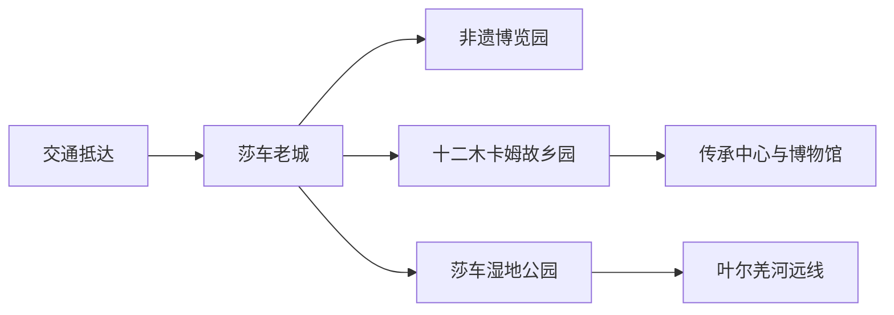
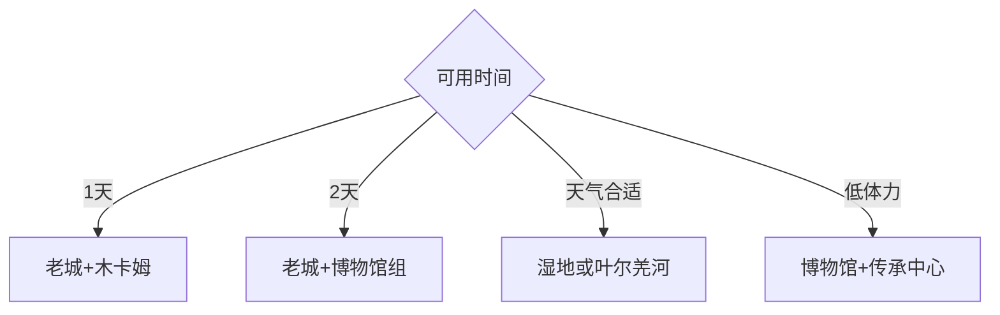

# 莎车旅行指南

莎车位于喀什地区东南部、叶尔羌河绿洲，是十二木卡姆、老城非遗和南疆绿洲生活的重要目的地。县城适合安排两天，湿地、胡杨、乡村或塔莎古道方向按独立远线增加时间；喀什市、泽普、叶城和塔什库尔干都需要另算跨县交通与住宿。

## 城市速览

| 项目 | 信息 |
|---|---|
| 主线 | 莎车老城—非遗博览园—十二木卡姆故乡园—传承中心—莎车博物馆 |
| 停留 | 县城 2 天；湿地、胡杨或跨县远线另加 1 天以上 |
| 住宿 | 老城周边适合夜间生活；新城与交通站点便于抵离；远线按返程另选 |
| 交通 | 莎车机场、铁路和公路接入，县城内用公交与短途车辆，远线先落实往返 |
| 风险 | 干热、风沙、昼夜温差、冬季寒冷、长距离道路与湿地水域 |
| 边界 | 宗教场所、居民院落、文保修缮区、湿地栖息地、灌渠和边境方向遵循明确管理规则 |

## 城市格局与游览区域

固定 **Shache / GeoNames 1280037** 定位莎车县城，Wikidata `Q857618` 对应莎车县实体。老城与非遗街区是步行核心，十二木卡姆故乡园、传承中心和博物馆集中成文化场馆组；湿地公园位于县城外，叶尔羌河、胡杨与塔莎古道属于更长公路方向。莎车机场、莎车站和老城不是同一落脚点，抵离日按具体站点计算。

## 主要景点

| 景点 | 区域 | 类型 | 核心体验 | 用时 | 环境 | 体力 | 研究价值 | 拥挤 | 优先级 |
|---|---|---|---|---:|---|---|---|---|---|
| 莎车老城公开街区 | 县城 | 历史街区 | 绿洲城市肌理、非遗与日常生活 | 3–5小时 | 混合 | 中 | 很高 | 节庆高 | A |
| 莎车老城非遗博览园 | 老城 | 非遗体验 | 手工艺、展演与地方饮食 | 2–3小时 | 混合 | 低中 | 很高 | 演出时高 | A |
| 十二木卡姆故乡园 | 县城文化区 | 文化公园 | 木卡姆主题、公共活动与城市休闲 | 1–2小时 | 混合 | 低 | 高 | 活动时高 | A |
| 十二木卡姆文化传承中心 | 故乡园旁 | 非遗场馆 | 乐器、展陈、传承与当期演出 | 1.5–3小时 | 室内 | 低 | 很高 | 演出时高 | A |
| 丝绸之路·莎车博物馆 | 故乡园旁 | 综合博物馆 | 莎车历史、地理、人文与习俗 | 2–3小时 | 室内 | 低 | 很高 | 中 | A |
| 莎车湿地公园景区 | 县城外 | 湿地 | 古河道、水库湿地、候鸟与沙漠绿洲过渡 | 半日至1天 | 室外 | 中 | 高 | 季节高 | B |
| 米夏镇公开乡村体验点 | 县城近郊 | 乡村农业 | 果园、村庄与季节农事 | 半日 | 室外 | 中 | 中 | 采摘季高 | C |
| 叶尔羌河公开生态线路 | 县域远线 | 河流生态 | 绿洲、胡杨与流域地理 | 1天以上 | 室外 | 中高 | 高 | 胡杨季高 | B |

## 美食与餐饮

老城与县城生活区可从烤包子、抓饭、烤肉、馕、拉面、酸奶和季节瓜果中选择。先观察明码标价、食材保存和现做熟度；清真餐饮尊重店内规则，素食者询问汤底、油脂和共用炊具。巴旦木、核桃、芝麻、乳制品和小麦较常见，过敏者逐项确认。

## 经典行程

### 两日基础线
**路线**：第一天老城—非遗博览园；第二天木卡姆故乡园—传承中心—莎车博物馆。**逻辑**：先看生活空间，再用场馆建立历史与艺术背景。**预约锚点**：演出、博物馆和住宿。**休息**：午间回住宿。**删除条件**：场馆闭馆时增加老城公共街区。

### 老城非遗线
**路线**：老城正式入口—公开街巷—非遗博览园—餐饮休息。**逻辑**：在生活街区中选择公开展陈和经营点。**预约锚点**：活动与修缮路段。**休息**：正规餐饮。**删除条件**：大客流时缩短巷道，保留博览园。

### 木卡姆文化线
**路线**：故乡园—文化传承中心—当期展演。**逻辑**：从公共主题空间进入活态传承。**预约锚点**：演出、讲解和馆舍开放。**休息**：故乡园服务区。**删除条件**：无演出时以展陈和博物馆替代。

### 博物馆研究线
**路线**：莎车博物馆—木卡姆传承中心—老城短段。**逻辑**：先建立历史框架，再观察城市生活。**预约锚点**：闭馆日、证件和讲解。**休息**：馆内与县城。**删除条件**：单馆闭馆时保留另一馆。

### 湿地半日或一日线
**路线**：县城—莎车湿地公园正式入口—指定步道与观景点—返城。**逻辑**：集中理解古河道和绿洲湿地。**预约锚点**：开放、交通和返程。**休息**：游客服务点。**删除条件**：大风、沙尘、冰雪或生态封闭时取消。

### 叶尔羌河季节线
**路线**：县城—官方开放生态点—胡杨或河流观景—原路返城。**逻辑**：围绕一个有管理的目的地，不沿灌渠和农路自由穿行。**预约锚点**：季节、道路、车辆与油料。**休息**：正式服务区。**删除条件**：道路、天气或保护管理条件不足时保留县城日。

### 低体力线
**路线**：车辆到莎车博物馆—木卡姆传承中心—老城近入口短段。**逻辑**：室内场馆为主并安排连续坐休。**预约锚点**：无障碍入口、下客和卫生间。**休息**：每站场馆。**删除条件**：高温、风沙或馆舍条件不足时缩短为单馆。

## 住宿区域

老城周边适合非遗、夜间餐饮和清晨街区；新城和交通干道适合停车、较新设施与机场铁路抵离；莎车站或机场方向只在航班、车次和接驳匹配时优先。前往湿地、叶尔羌河或塔莎古道时，先确认当晚是否回县城；远线住宿选择持证经营并核对供暖、热水、网络、夜间前台和退改。

## 市内交通

莎车机场、莎车站和公路客运共同承担外部到达，具体班次以运营方为准。县城核心用公交、出租车或网约车加步行；湿地、乡村和叶尔羌河方向先落实往返车辆、司机资质、油料与通信。塔莎古道及边境方向属于长距离公路旅行，按证件、道路、天气和当地管理要求另行规划。

## 不同旅行者须知

非遗旅行者优先木卡姆传承中心和老城；历史兴趣者先看博物馆；摄影者把老城生活、演出和湿地分开安排；亲子与长者选择两馆加老城短段。尊重不同民族和宗教习惯，人物摄影先征得同意，宗教活动与居民院落按现场边界参观。

## 行前核对

- 核对莎车博物馆、木卡姆传承中心、老城非遗活动和湿地公园开放。
- 核对航班、铁路、长途公路、风沙寒潮及远线车辆和返程。
- 湿地栖息地、灌渠、水库、农田、宗教场所和边境管理区域遵循明确限制。

## 来源与更新记录

| 来源 | 支持内容 | 核验日期 |
|---|---|---|
| [喀什地区行政公署：十二木卡姆故乡园](https://www.kashi.gov.cn/ksdqxzgs/c106707/202009/904ffd18be144ce9b743aaf513e2c516.shtml) | 故乡园、传承中心、莎车博物馆与空间关系 | 2026-09-01 |
| [喀什地区行政公署：莎车湿地公园](https://www.kashi.gov.cn/ksdqxzgs/c106707/202009/fd87d3787e4747f28dde2f84de3fef16.shtml) | 湿地位置、古河道、水库湿地与候鸟栖息地 | 2026-09-01 |
| [喀什地区行政公署：非遗融入莎车老城](https://www.kashi.gov.cn/ksdqxzgs/c106706/202307/0214ae0bd8a24a32b43af8eb0ea32233.shtml) | 老城非遗、展演、饮食和旅行要素 | 2026-09-01 |
| [喀什地区概况](https://www.kashi.gov.cn/ksdqxzgs/c106704/202106/a4206596fd0b40b69f4cae4cd8b51578.shtml) | 莎车机场、区域交通与叶尔羌河旅行格局 | 2026-09-01 |
| [GeoNames 1280037](https://www.geonames.org/1280037/) | Shache 固定人口点 | 2026-09-01 |
| [Wikidata Q857618](https://www.wikidata.org/wiki/Q857618) | 莎车县实体与跨库标识 | 2026-09-01 |

| 日期 | 更新 |
|---|---|
| 2026-09-01 | 首次完成莎车旅行研究；建立老城、木卡姆、博物馆、湿地、住宿与跨县交通结构。 |

