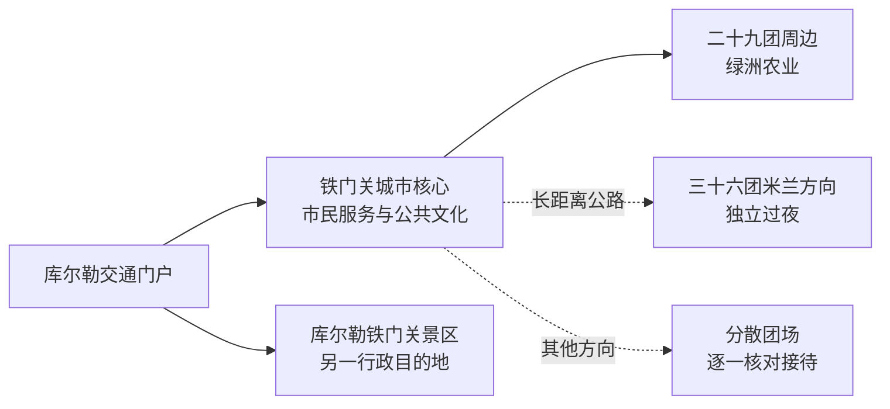
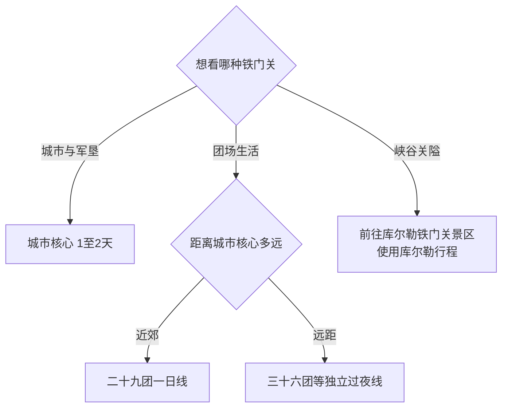

# 铁门关旅行指南

铁门关是新疆生产建设兵团第二师实行师市合一管理的县级市，城市核心位于库尔勒以西南的博古其一带，所辖团场则分散在巴州多处绿洲。旅行先选“新城与军垦文化”或“某一团场专题”，再按数百公里级距离分别安排；库尔勒北郊的铁门关景区属于库尔勒市，是名称相近的另一处目的地。固定快照中的 **Bingtuan Sanshiliu Tuan / GeoNames 12420886** 对应第二师三十六团，边界核对显示该团场属于铁门关市非连续辖域，法定城市代码为 `659006`。

> 建议停留：城市核心 1–2 天；每个远距团场另留 1–2 天  
> 旅行关键词：兵团新城、军垦文化、绿洲农业、孔雀河下游、米兰方向  
> 主要体力：城区较低，长距离团场线以乘车疲劳和户外暴露为主  
> 最近研究：2026-09-03

## 城市速览

| 项目 | 旅行信息 |
|---|---|
| 主要旅行价值 | 在新城公共文化空间理解第二师与铁门关建城，再从一个明确接待的团场认识绿洲农业、军垦聚落和荒漠交通 |
| 建议停留 | 1 天看城市核心；2 天加入近郊农业或军垦展陈；三十六团等远线按独立公路行程计算 |
| 较舒适季节 | 春秋适合城区与绿洲活动；夏季避开午后高温；冬季核对冰雪、风口和道路状态 |
| 预算特点 | 城区公共空间成本较低；包车、自驾、远距住宿与跨团场燃油是主要增量 |
| 步行强度 | 城市公园和公共文化区较平缓；远线负担主要来自长时乘车、风沙和高温 |
| 主要天气风险 | 大风、沙尘、高温、寒潮、道路结冰和荒漠路段能见度变化 |
| 独行旅行 | 城市核心较易安排；团场线宜提前确认车辆、住宿、加油和通信 |
| 亲子旅行 | 新城场馆、公园和正规农业体验容易组合；长途团场日控制连续乘车时间 |
| 长者与低体力旅行 | 采用“车辆观城＋一座场馆＋一段公园”的短线，远线增加过夜 |
| 无障碍信息 | 新城公共设施可先确认坡道、电梯和卫生间；团场接待点的连续通行需逐处询问 |

## 城市格局与游览区域

铁门关的行政结构不是一片连续建成区。博古其—二十九团方向形成城市核心，与库尔勒联系紧密；其他团场分散在焉耆盆地、塔里木盆地东部等不同绿洲。行政同属铁门关市，不代表可以同日往返。

| 区域 | 主要内容 | 游览特点 | 与其他区域的关系 |
|---|---|---|---|
| 城市核心 | 市民中心、公共文化场馆、将军河等城市公共空间 | 服务与住宿相对集中，适合首次到访 | 可由库尔勒接驳，也适合作为近郊农业线基地 |
| 二十九团及近郊 | 绿洲农业、团场聚落、正规产业接待 | 以预约项目和公开道路为主 | 可与城市核心组成一日 |
| 三十六团米兰方向 | 军垦聚落、荒漠绿洲、米兰历史背景 | 距城市核心很远，补给与住宿需前置 | 作为独立公路旅行，常需在若羌方向组织 |
| 其他团场 | 农业、水利与军垦文化 | 距离和接待条件差异很大 | 一次只选一个方向 |
| 库尔勒北郊 | 铁门关景区 | 属库尔勒市的峡谷关隘景区 | 查阅库尔勒指南，不计入铁门关市景点 |

## 主要景点

铁门关的旅行资源更多体现为新城、军垦文化与团场生活。场馆名称和开放安排仍在完善，优先使用师市政府公布的当期接待点。

| 景点 | 区域 | 类型 | 主要看点 | 建议用时 | 室内外 | 体力 | 预约风险 | 天气影响 | 优先级 |
|---|---|---|---|---:|---|---|---|---|---|
| 铁门关市公共文化与城市展示场馆 | 城市核心 | 文博、城市史 | 第二师历史、师市合一和新城建设；按当期正式开放场馆选择 | 1.5–3 小时 | 室内 | 低 | 高 | 低 | A |
| 将军河及城市公园开放段 | 城市核心 | 城市公共空间 | 新城水系、绿化与居民生活 | 1–2.5 小时 | 室外 | 低 | 低 | 高 | A |
| 城市核心规划轴与公共建筑群 | 城市核心 | 城市观察 | 兵团新城空间、广场与公共服务设施 | 1–2 小时 | 混合 | 低 | 低 | 高 | B |
| 二十九团正规农业体验 | 近郊 | 农业、团场 | 香梨、棉田或设施农业的生产背景；选择官方活动或经营主体接待 | 2–4 小时 | 室外为主 | 低至中 | 高 | 高 | B |
| 三十六团军垦文化公共展陈 | 米兰方向 | 军垦史、团场 | 荒漠绿洲开发、团场建设和当代生活 | 2–3 小时 | 混合 | 高在交通 | 高 | 高 | C |
| 米兰遗址相关公共展示 | 三十六团附近 | 考古、丝路 | 米兰古城与丝路历史；遗址保护和考古工作区以主管部门开放范围为准 | 半天 | 室外为主 | 中 | 很高 | 很高 | C |

农业、水利、工业、军事管理和团场生产区域只在正式接待范围内参观。荒漠便道、输水设施、渠首、作业区和遗址保护区均按现场管理线活动。

## 美食与餐饮

城市核心和团场饮食融合新疆面食、牛羊肉与绿洲农产品。点餐可先说明份量、辣度和过敏原；远线优先在县城或团场驻地完成补水与正餐。

| 菜品或餐饮类型 | 常见区域 | 一个人用餐与常见份量 | 风味、过敏原与饮食限制 | 排队风险与替代方法 |
|---|---|---|---|---|
| 拌面、汤饭与抓饭 | 城市核心、团场驻地 | 一人一份方便，抓饭可问小份 | 小麦麸质、牛羊肉与油脂；素食需确认汤底和炒制 | 午餐高峰错峰，备选居民区常规餐馆 |
| 烤肉与羊肉菜 | 城区正餐区 | 独行按串数或小份点单 | 羊肉、孜然和辣椒，关注炭火与交叉接触 | 晚餐先问份量与出餐时间，备选面食 |
| 馕、包子与早餐 | 居民区、市场周边 | 适合小份组合 | 小麦、肉馅、芝麻与乳制品需逐项确认 | 选现做门店，售罄后改用常规早餐铺 |
| 香梨与绿洲果品 | 近郊正规销售点 | 购买小份并关注成熟度 | 清洗、糖分与储运条件 | 产季预约采摘，其他季节选正规门店 |
| 团场家常菜 | 预约接待点 | 多人共享更合适 | 先问肉类、辣度、份量和清真用餐习惯 | 远线提前订餐，临时无接待则在驻地解决 |

## 经典行程

### 一日经典路线

**路线**：城市公共文化场馆 → 城区午餐 → 将军河与城市公园 → 城市规划轴。

- **串联逻辑**：先理解师市历史，再用公共空间观察新城生活。
- **预约锚点**：当日开放的博物馆、规划馆或文化馆。
- **休息安排**：场馆座席、午餐和公园遮阴点分三段休息。
- **时间不足时**：保留一座场馆和一段公园，删除外围城市观察。

### 两日城市路线

**第 1 天**：公共文化场馆 → 城市公园 → 城区餐饮  
**第 2 天**：二十九团预约农业项目 → 团场驻地午餐 → 返回城市核心

- **串联逻辑**：第一天看建城，第二天看绿洲生产与团场生活。
- **预约锚点**：第二天接待主体、参观范围和交通。
- **休息安排**：第二天只在正规接待点与驻地补给。
- **时间不足时**：第二天改为城区公共空间，不临时进入生产区。

### 三日深度路线

**第 1 天**：城市核心  
**第 2 天**：近郊团场专题  
**第 3 天**：增加一座正式开放场馆或安排库尔勒联程

- **串联逻辑**：三天仍围绕城市核心，远距团场另建过夜线路。
- **预约锚点**：团场接待和跨城车辆。
- **休息安排**：每天午后避开长时间户外暴露。
- **时间不足时**：先删第三天联程，保留城市与团场两条主线。

### 风沙、高温或冰雪路线

**路线**：开放的公共文化场馆 → 城区午餐 → 车辆短线观城 → 住宿处休息。

- **串联逻辑**：用室内场馆和短距离移动降低天气暴露。
- **预约锚点**：场馆开放、道路预警和返程。
- **休息安排**：固定在城区室内空间。
- **时间不足时**：只保留一座场馆；高等级预警期间取消荒漠、农业和长途团场线。

### 亲子或低体力路线

**亲子路线**：城市展示场馆 → 午休 → 将军河公园短段。  
**低体力路线**：车辆观城 → 公共文化场馆 → 城区正餐。

- **串联逻辑**：亲子线突出城市与军垦科普，低体力线减少久站和户外距离。
- **预约锚点**：儿童活动、场馆电梯、无障碍入口和卫生间。
- **休息安排**：午间固定休息，公园只走靠近落客点的短段。
- **时间不足时**：两线均保留场馆，删除公园延伸。

### 远郊一日或过夜路线

**路线**：若羌方向集散 → 三十六团正规军垦展陈 → 米兰遗址公共展示（确认开放时）→ 团场或若羌住宿。

- **串联逻辑**：三十六团与城市核心距离很远，按独立公路旅行组织。
- **预约锚点**：展陈、遗址开放、道路、加油、住宿和返程。
- **休息安排**：在若羌或团场驻地完成补给，荒漠段不临时离开公路。
- **时间不足时**：删除遗址加点，保留团场公共展陈；当日往返条件不足时改为过夜。

### 库尔勒联程辨名路线

**路线**：铁门关城市核心 → 库尔勒住宿 → 次日按库尔勒官方信息前往铁门关景区。

- **串联逻辑**：把县级市与同名景区分成两天，分别核对行政归属和入口。
- **预约锚点**：跨城交通、库尔勒住宿和景区开放。
- **休息安排**：第一天结束后在库尔勒完整休息。
- **时间不足时**：只选铁门关市或铁门关景区其中一项。

## 住宿区域

| 区域 | 优点 | 缺点 | 适合人群 | 交通特点 |
|---|---|---|---|---|
| 铁门关城市核心 | 接近市民服务、场馆和公园 | 住宿规模需按当期平台核验 | 城市首访、近郊团场线 | 与库尔勒和二十九团联系较方便 |
| 库尔勒 | 铁路、航空、住宿和租车选择更多 | 每天往返增加时间，且铁门关景区名称易混 | 以巴州为大基地者 | 订车时写清“铁门关市”完整目的地 |
| 三十六团或若羌方向 | 方便米兰方向远线 | 距城市核心很远，房量和服务有限 | 自驾、军垦或丝路专题 | 需提前确认加油、住宿和公路状态 |
| 其他团场驻地 | 贴近单一专题 | 接待、餐饮和夜间服务差异大 | 有明确预约者 | 一次只服务一个方向 |

## 市内交通

| 场景 | 建议与取舍 | 行前需要重查的内容 |
|---|---|---|
| 从库尔勒抵达城市核心 | 自驾、出租或当期客运均可，先核对完整目的地 | 上下车点、班次、车程和夜间抵达 |
| 城市核心移动 | 步行配合出租车适合场馆与公园 | 场馆入口、施工和叫车范围 |
| 近郊团场 | 预约项目配合合规车辆 | 接待地址、停车、返程和生产季 |
| 远距团场 | 以自驾或合规包车组织独立过夜线 | 路况、加油、补水、通信、住宿与天气 |
| 航空与铁路 | 主要使用库尔勒交通门户，米兰方向也可比较若羌交通 | 航班、车次、机场接驳和异地还车 |

## 不同旅行者须知

| 旅行维度 | 可行条件 | 主要取舍 | 需额外核对 |
|---|---|---|---|
| 独行旅行 | 城市核心住宿，每天一个方向 | 团场与荒漠路段公共交通少 | 车辆、住宿登记、通信和紧急联系 |
| 亲子旅行 | 场馆、公园和短时农业科普 | 长途乘车、高温与水边看护增加负担 | 儿童活动年龄、安全设施和卫生间 |
| 长者或低体力旅行 | 车辆观城加一座场馆 | 远线乘车与温差比步行更累 | 座椅、电梯、落客点和医疗条件 |
| 无障碍需求 | 优先选择新城公共设施 | 团场接待点的连续通行资料较少 | 坡道、电梯、无障碍卫生间和陪同 |
| 摄影旅行 | 新城轴线、绿洲和公开团场空间题材鲜明 | 风沙、强光和长途移动增加器材负担 | 无人机、商业拍摄、生产与管理区域规则 |
| 预算有限 | 以库尔勒或城市核心为基地看公共空间 | 远距包车和异地住宿成本高 | 客运班次、拼车资质与退改 |
| 晚出发或紧凑行程 | 保留城市公园与一个场馆 | 远距团场需要完整日程 | 最晚开放、夜间交通和住宿接待 |
| 特殊天气或自然条件 | 室内场馆作为替代 | 风沙、极端温度和结冰影响公路 | 气象、交通、应急与公路公告 |

## 行前核对

| 核对事项 | 为什么需要重查 | 建议核对时间 | 官方入口 |
|---|---|---|---|
| 师市场馆与团场接待 | 开放场馆、活动和预约对象会调整 | 排入路线前及前一日 | [第二师铁门关市人民政府](https://www.tmg.gov.cn/) |
| 铁门关市与铁门关景区辨名 | 两者行政归属、入口和交通完全不同 | 订车订房时 | [库尔勒市人民政府](https://www.xjkel.gov.cn/)；[第二师铁门关市人民政府](https://www.tmg.gov.cn/) |
| 远距公路与团场住宿 | 非连续辖域使车程、补给和住宿成为成行条件 | 出发前一周、前三日及当天 | [新疆交通运输厅](https://jtyst.xinjiang.gov.cn/) |
| 风沙、高温与冰雪 | 能见度和路面状态会改变长途路线 | 出发前三日及当天 | [新疆气象局](http://xj.cma.gov.cn/) |
| 遗址、农业与生产边界 | 考古、灌溉和农业生产决定可进入范围 | 到访前 | 师市政府及接待主体官方渠道 |

## 来源与更新记录

### 主要来源

| 来源 | 类型 | 支持内容 | 核验日期 |
|---|---|---|---|
| [民政部行政区划查询](https://dmfw.mca.gov.cn/xzqh/getList?code=65&trimCode=true&maxLevel=3) | 国家行政区划 | 铁门关市法定县级市身份与代码 `659006` | 2026-09-03 |
| [第二师铁门关市人民政府](https://www.tmg.gov.cn/) | 师市政府 | 师市结构、团场动态、公共服务与旅行公告入口 | 2026-09-03 |
| [新疆生产建设兵团](https://www.xjbt.gov.cn/) | 兵团政府 | 第二师及兵团城市管理关系 | 2026-09-03 |
| [新疆文化和旅游厅](https://wlt.xinjiang.gov.cn/) | 自治区文旅部门 | 景区、公共文化与旅游动态入口 | 2026-09-03 |
| [新疆交通运输厅](https://jtyst.xinjiang.gov.cn/) | 交通部门 | 跨绿洲公路、施工与交通信息 | 2026-09-03 |
| [GeoNames 12420886](https://www.geonames.org/12420886/) | 固定开放数据 | Bingtuan Sanshiliu Tuan 名称、坐标与人口点类型 | 2026-09-03 |

### 更新记录

| 日期 | 更新内容 |
|---|---|
| 2026-09-03 | 首次完成资料研究；明确铁门关市非连续辖域、远距团场与库尔勒同名景区的选择方法，并保留农业、水利、遗址和管理区域边界 |
