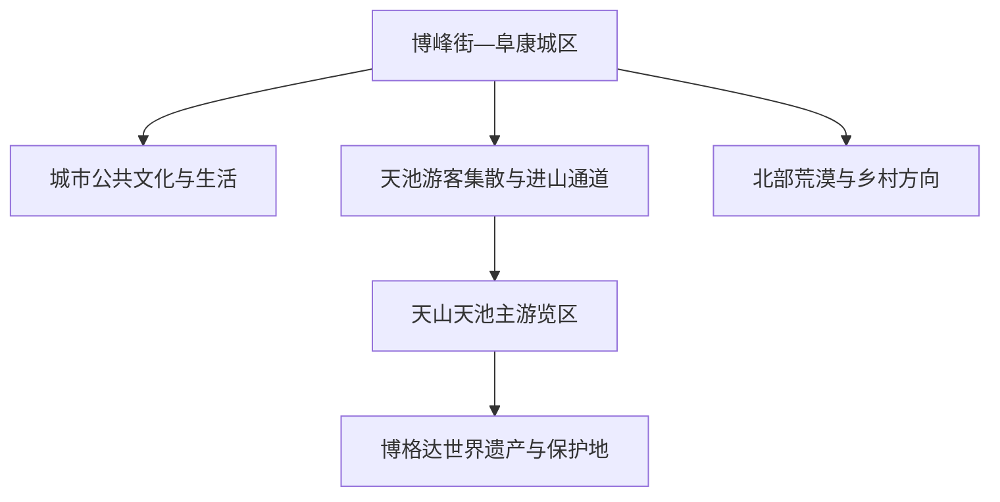
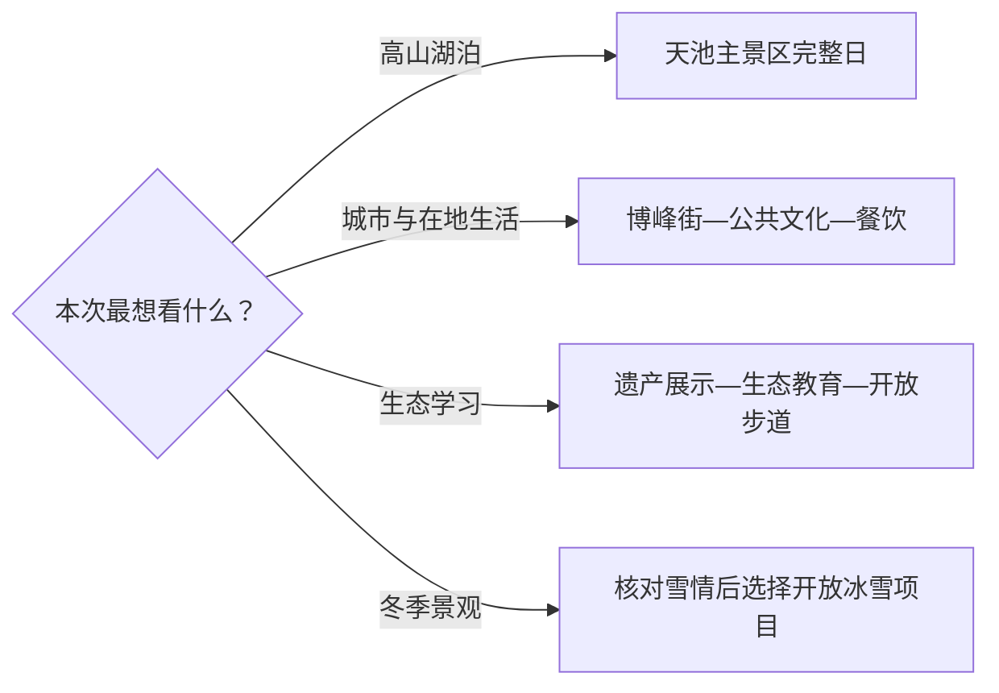

# 阜康旅行指南

阜康位于天山博格达峰北麓、准噶尔盆地南缘，最清晰的旅行方法是把阜康城区作为补给与住宿基地，把天山天池作为完整山地日。固定快照中的 **Bofeng / GeoNames 1529506** 对应博峰街一带；页面按现行阜康市范围组织城市、山地遗产与北部荒漠主题。

## 城市速览

| 项目 | 信息 |
|---|---|
| 主线 | 阜康城区—天山天池—博格达生态与西王母文化 |
| 停留 | 经典线 2 天；加入城市生活或北部荒漠观察安排 3 天 |
| 住宿 | 博峰街及城区主干道周边便于餐饮、补给和次日进山 |
| 交通 | 乌鲁木齐或昌吉方向先到阜康，再按景区当日公告衔接游客中心与区间交通 |
| 季节 | 夏秋适合山湖步行；冬季侧重冰雪景观，并按道路、气象和景区开放范围调整 |
| 预算 | 天池门票、景区交通与跨城接驳是主要支出，城区餐饮和住宿选择更有弹性 |

## 城市格局与游览区域

阜康城区承担住宿、餐饮、采购和交通转换，适合把抵离日留给城市散步。天山天池在城区以南的博格达山地，景区入口、区间交通与湖区步道构成一整套运营单元，宜预留完整一天。更高海拔的博格达遗产地和保护区域以批准开放线路为边界；北部荒漠、农业和能源产业空间则按正式景区、公共道路或预约项目进入。

## 主要景点

| 景点 | 区域 | 类型 | 核心体验 | 用时 | 环境 | 体力 | 研究价值 | 拥挤 | 优先级 |
|---|---|---|---|---:|---|---|---|---|---|
| 天山天池主景区 | 博格达山北坡 | 高山湖泊 | 冰碛湖、雪山、森林与垂直自然带 | 1天 | 室外 | 中 | 很高 | 旺季高 | A |
| 天池环湖开放步道 | 天池湖区 | 步道 | 从不同角度观察湖岸、云杉与山地天气 | 2–4小时 | 室外 | 中 | 高 | 旺季高 | A |
| 天池遗产地展示中心 | 天池景区 | 展陈 | 新疆天山世界遗产、地质与生态保护 | 1–2小时 | 室内 | 低 | 很高 | 中 | A |
| 博格达生态教育基地 | 天池景区 | 自然教育 | 山地生态系统、水源涵养与生物多样性 | 1–2小时 | 混合 | 低中 | 高 | 中 | B |
| 西小天池等开放节点 | 天池景区 | 山水节点 | 瀑流、森林与冰川地貌的近距离观察 | 1–2小时 | 室外 | 中 | 中高 | 中 | B |
| 西王母文化开放展陈 | 天池景区 | 人文景观 | 瑶池传说与地方文化表达 | 1小时 | 混合 | 低 | 中 | 中 | B |
| 阜康城区公共文化空间 | 博峰街周边 | 城市文化 | 地方历史、城市发展与公共生活 | 2–3小时 | 室内为主 | 低 | 中高 | 低 | B |
| 阜康城市街区 | 博峰街周边 | 城市漫步 | 采购补给、日常餐饮与县级市生活 | 2小时 | 混合 | 低 | 中 | 中 | B |
| 三工河开放乡村体验 | 天池门户方向 | 乡村休闲 | 哈萨克族乡村生活与山地旅游服务 | 半天 | 混合 | 低中 | 中 | 节庆中 | C |
| 北部依法开放荒漠项目 | 阜康北部 | 荒漠生态 | 准噶尔盆地边缘植被与荒漠环境 | 半天至1天 | 室外 | 中 | 中高 | 低 | C |

天池各观景台、游船、区间车站和环湖节点属于同一景区内部体验，行程按一个运营单元计算。世界遗产地、自然保护地和高山区域以公告游线为准；登山、穿越、露营等活动应选择具备许可与保障的产品，并根据气象和救援条件决定。

## 美食与餐饮

阜康城区适合集中解决正餐和进山补给。新疆常见的抓饭、拌面、烤肉、丸子汤与馕都容易找到；多人同行可选择大盘菜并提前确认份量。天池游览日把早餐安排得扎实，随身携带饮水和便于回收包装的能量食品，正餐放在游客服务区或返城后完成。

山区餐饮点位与营业时间会随季节变化。清真餐饮场所按店内习惯用餐；需要素食、过敏原控制或儿童餐时，点菜前直接说明食材和烹饪要求。自驾前往北部或乡村方向，可先在城区补足饮水并确认沿途服务点。

## 经典行程

### 一日天池经典路线

- 路线：阜康城区或乌鲁木齐出发—天池游客服务区—区间交通—天池主湖区—环湖开放步道—遗产展示—原路返回。
- 逻辑：把交通转换和高山湖区放进同一天，减少往返切割。
- 预约：出发前核对景区实名购票、区间交通、游船和当日开放信息。
- 休息：在湖区服务节点安排午餐或补给，下午按体力缩短环湖距离。
- 删除：大风、降雪或雷雨时保留主湖区和室内展陈，删去较远步道。

### 两日山湖与城市路线

- 路线：第一天阜康城区公共文化—博峰街生活与餐饮；第二天天山天池完整日。
- 逻辑：先熟悉城市并备齐用品，再把体力和天气窗口留给山地。
- 预约：第一晚确认次日交通、景区开放和返程衔接。
- 休息：城区日保持低强度，天池日下午安排固定休息点。
- 删除：只有一天时直接保留天池，城市段压缩为晚餐和住宿。

### 三日生态深度路线

- 路线：第一天阜康城区；第二天天池主湖区；第三天遗产展示、生态教育基地或依法开放的乡村生态项目。
- 逻辑：把观景、知识理解和在地生活拆开，避免在同一天追赶多个山地节点。
- 预约：第三日项目优先选择景区或属地公开发布的活动。
- 休息：连续高海拔活动之间留足睡眠，补水并做好防晒。
- 删除：第三日条件不足时改为城区公共文化与慢游。

### 冬季冰雪路线

- 路线：城区早餐—核对路况—天池当日开放区—冰雪景观—返城热餐。
- 逻辑：以短日照、低温和道路通行为核心控制节奏。
- 预约：核对冬季票制、区间交通、防滑装备要求与末班时间。
- 休息：每段户外活动后进入服务区保暖，及时更换潮湿手套或袜子。
- 删除：道路预警或景区限流时留在城区，改做公共文化和餐饮体验。

### 亲子或低体力路线

- 路线：景区区间交通—天池主观景区—遗产展示中心—短距离湖岸步道。
- 逻辑：用交通工具和室内展陈降低连续爬升，把最佳景观保留下来。
- 预约：确认无障碍设施、儿童票与婴儿车适用路段。
- 休息：主湖区先找服务点，再决定是否增加步道。
- 删除：体力下降时直接取消西小天池等延伸节点。

### 世界遗产学习路线

- 路线：遗产地展示中心—博格达生态教育基地—天池湖区开放步道—城区整理观察记录。
- 逻辑：先建立地质、生态和保护框架，再进入真实景观观察。
- 预约：团体研学提前联系景区教育或讲解服务。
- 休息：室内展陈与户外观察交替，减少长时间暴晒。
- 删除：天气变化时保留展示中心和短距离观察点。

### 城区与乡村慢游路线

- 路线：博峰街城市生活—公共文化空间—地方午餐—三工河方向正式开放项目或城区休闲。
- 逻辑：适合已经看过天池、等待交通或希望理解阜康日常的一天。
- 预约：乡村体验先确认接待主体、交通与当日内容。
- 休息：午后高温时留在室内，傍晚再进行街区漫步。
- 删除：交通不便时把乡村段换成城区餐饮与公共文化。

## 住宿区域

| 区域 | 适合人群 | 优点 | 取舍 |
|---|---|---|---|
| 博峰街与城区主干道周边 | 首访、自驾、公共交通旅行者 | 餐饮、采购和城市服务集中 | 进天池仍需另算接驳时间 |
| 天池门户或景区合规住宿 | 希望早进山、慢节奏度假者 | 靠近山地游览起点 | 季节性强，价格和餐饮选择需提前核对 |
| 乌鲁木齐住宿 | 只做天池一日游者 | 航空、铁路与城市服务丰富 | 当天往返时间长，须留足返程缓冲 |

若第二天需要继续向昌吉州东部移动，住阜康城区通常更便于整理行李和补给。景区或保护地周边住宿选择以取得合法经营资质的平台与官方公示为准，露营则进入指定区域并服从森林草原防火要求。

## 市内交通

阜康与乌鲁木齐、昌吉之间主要依靠公路交通；铁路到发站、客运班次和景区直通车都可能调整，出发前分别核对实际到发点。去天池时先确认购票入口对应的游客服务区，再衔接景区区间交通；自驾车辆按当日停车与换乘规则停放。

城区短途可用公交、出租车或网约车。北部荒漠、乡村和山地远点之间横向连接有限，更适合包车或自驾，并在出发前确认返程车辆、手机信号和补给点。冬季与强对流天气下，把道路预警作为是否出发的第一判断条件。

## 不同旅行者须知

- 首次到访者：优先安排天池完整日，城区作为住宿和机动日。
- 摄影旅行者：清晨与傍晚光线更柔和，但拍摄位置仍以景区开放时段和步道为准。
- 亲子家庭：用遗产展示和短步道组合自然教育，随时按儿童状态缩短路线。
- 老年旅行者：关注海拔变化、低温与区间交通排队，主湖区观景已经能获得核心体验。
- 自驾旅行者：提前下载离线地图，山地日重点核对停车、限行、降雪和返程时限。
- 户外旅行者：高山穿越、登山和露营选择具备许可、保险、通信和救援预案的组织方。
- 产业观察者：阜康北部有能源、矿业和农业生产空间，参访通过正式开放日或企业预约完成。

## 行前核对

- 天山天池门票、区间交通、游船、索道或步道开放状态。
- 阜康与乌鲁木齐、昌吉之间的实际到发站、客运班次和返程时间。
- 新疆气象、森林草原火险、雷暴大风、降雪和道路预警。
- 世界遗产地、自然保护地、生态教育项目的开放边界与预约要求。
- 身份证件、保暖防风层、防晒用品、饮水与常用药品。
- 北部荒漠或乡村项目的接待资质、车辆条件、通信和保险安排。

## 来源与更新记录

| 来源 | 类型 | 用途 | 核验日期 |
|---|---|---|---|
| [新疆维吾尔自治区人民政府：天山天池景区](https://www.xinjiang.gov.cn/xinjiang/lytj/201607/8c0506d675014e5ab4520e7bb3b522f0.shtml) | 政府 | 天池位置、自然景观与游览分区 | 2026-09-03 |
| [新疆维吾尔自治区人民政府：昌吉州旅游发展](https://www.xinjiang.gov.cn/xinjiang/dzdt/202307/ca1b12a0bb2f485191bbb8fd1e6a12c3.shtml) | 政府 | 遗产展示、生态教育与景区设施 | 2026-09-03 |
| [新疆维吾尔自治区财政厅：天池生态旅游](https://czt.xinjiang.gov.cn/xjczt/c115022/202509/7e8bd337d65d47c49a8312c7d9c31be6.shtml) | 政府 | 山地生态系统与保护边界 | 2026-09-03 |
| [联合国教科文组织世界遗产中心：新疆天山](https://whc.unesco.org/en/list/1414/) | 国际组织 | 博格达片区世界遗产属性 | 2026-09-03 |
| [阜康市人民政府博峰街办事处资料](https://www.fk.gov.cn/wcm.files/upload/CMSfk/201901/201901291217048.pdf) | 政府 | Bofeng 固定点与博峰街行政锚点 | 2026-09-03 |
| [GeoNames：Bofeng](https://www.geonames.org/1529506/) | 地名数据库 | 固定人口点与坐标 | 2026-09-03 |

实时购票、景区交通和开放范围以天山天池景区当日公告为准；铁路信息可在[中国铁路 12306](https://www.12306.cn/)核对，天气预警可在[新疆气象局](https://xj.cma.gov.cn/)核对。
