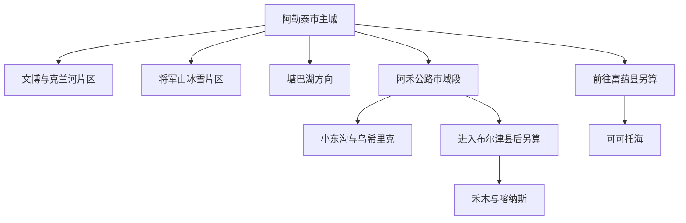
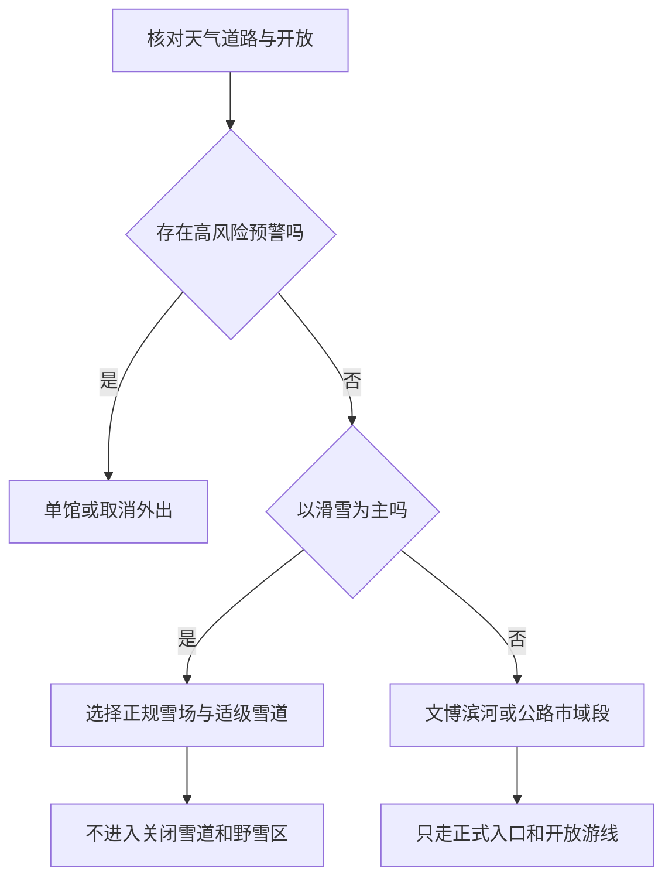

# 阿勒泰旅行指南

阿勒泰市位于阿尔泰山南麓，是阿勒泰地区行政公署驻地，也是一座把文博、克兰河城市水系、白桦林和高山滑雪压缩在较小主城尺度内的县级市。无雪季可用地区博物馆、克兰河滨河景区、桦林公园和五百里·风情街组成轻松的一至两日路线；雪季则以将军山国际滑雪度假区为核心，并把低温、雪崩、风吹雪、道路封闭和装备适配放在景点数量之前。阿勒泰市同时是整个阿勒泰地区的交通集散地；喀纳斯与禾木转入[布尔津县](./布尔津县.md)页面规划，可可托海转入[富蕴县](./富蕴县.md)页面规划。

> 建议停留：非雪季 2–3 天；以将军山滑雪为主时 3–5 天 
> 旅行关键词：地区文博、克兰河、桦林公园、城市滑雪、阿禾公路市域段 
> 主要体力：主城低至中等步行；滑雪和山谷远线为中高强度 
> 最近研究：2026-08-12

## 城市速览

| 项目 | 旅行信息 |
|---|---|
| 主要旅行价值 | 在阿勒泰地区博物馆理解阿尔泰山地区的历史与岩画，再沿克兰河、桦林公园和五百里·风情街观察城市与山水的关系；雪季可从主城短途抵达将军山，形成少见的“住城里、当天滑高山雪道”结构。 |
| 建议停留 | 1 天完成文博、滨河与风情街；2 天增加桦林公园或将军山非滑雪体验；3 天从完整滑雪日、塘巴湖或阿禾公路市域段中选一项。以滑雪为主时至少给装备领取、适应性练习和天气缓冲各留空间。 |
| 较舒适季节 | 春末至秋初适合文博、滨河和近郊山谷，但融雪期、强降雨、大风与明显昼夜温差仍会改变道路和户外条件；冬季是冰雪体验重点季节，同时也是严寒、暴雪、雪崩和航路公路延误风险最高的时段。 |
| 预算特点 | 城市公园、滨河短段和公共文博基础成本较低；雪票、雪具、课程、保险、雪场餐饮、包车和跨县交通是主要增量。旺季住宿与合规用车比普通城市更需提前锁定。 |
| 步行强度 | 主城可拆成若干平坦短段，桦林公园存在冰雪、土路或湿滑路面；将军山即使不滑雪也涉及雪地行走与装备搬运，阿禾公路市域段和塘巴湖按车辆接驳加短时户外处理。 |
| 主要天气风险 | 冬季严寒、暴雪、风吹雪、道路结冰、低能见度和山地雪崩；暖季需防强降雨、雷电、大风、山洪与落石。未开发、未开放冰雪区域还存在冰裂、迷路、失温和野生动物风险。 |
| 独行旅行 | 主城文博、滨河和正规雪场容易独立安排；越野滑雪、野雪、偏远湿地和公路远线不应以临时拼车或单人离开开放游线完成，必须预先落实返程和通信。 |
| 亲子旅行 | 博物馆、风情街、桦林公园短段和正规雪场初学区可按年龄组合；雪圈、滑雪、冰面、水边和索道均需持续看护，并逐项确认年龄、身高、教练、头盔与保险规则。 |
| 长者与低体力旅行 | 单馆慢看、车辆落客、克兰河铺装短段和风情街室内休息点可减负；严寒会显著放大心肺与关节负担，不把将军山、桦林公园长线和远郊放在同一天。 |
| 无障碍信息 | 现代场馆和部分公共空间可能具备无障碍设施，但冰雪覆盖会中断坡道、路缘、停车点、卫生间和馆内通行；设施连续性需向官方确认，轮椅借用及雪场观景动线也需逐点核对。 |

### 地名记录与法定城市边界

本页处理的是行政区划代码 **654301** 的县级阿勒泰市。阿勒泰市属于阿勒泰地区并承担地区驻地功能，但不是“阿勒泰地区”的同义词，也不管理地区内其余六县。地区级机构或地区博物馆位于阿勒泰市，只说明其驻地和实际位置，不把布尔津、富蕴、福海、哈巴河、青河或吉木乃的景点转为阿勒泰市景点。

固定导入记录使用 **GeoNames 1529651**，主名称为 `Jinshanlu`，要素类型为承担县级行政驻地功能的城市点；该记录的别名包含阿勒泰、Aletai 和 Altay。**Wikidata Q434924** 是法定阿勒泰市实体，精确挂接同一 GeoNames ID，并记录代码 654301。这里的 `Jinshanlu` 是数据集中的中心点标签，不是阿勒泰市行政面的边界，也不表示本页只写金山路街道。金山路街道另有乡级实体 **Wikidata Q14147886**，没有对应本固定记录的 P1566；因此路线按县级阿勒泰市边界核定，定位仍保留原始 GeoNames 点位，不用街道名称替换城市实体。

## 城市格局与游览区域

阿勒泰市的旅行尺度可先分成“主城滨河—北侧将军山—南向塘巴湖—北向阿禾公路市域段”四层。主城的地区博物馆、克兰河、桦林公园和风情街可用短途车辆与分段步行组合；将军山离城市很近，但雪具、索道和天气使它仍应作为独立半日或整日项目；塘巴湖及阿禾公路沿线都需要稳定车辆和返程计划。公路继续向禾木、喀纳斯或东转可可托海时，旅行已经跨入其他县域，应重新核算门票、住宿、道路和安全规则。

| 区域 | 主要内容 | 游览特点 | 与其他区域的关系 |
|---|---|---|---|
| 解放路—团结路与地区文博片区 | 阿勒泰地区博物馆、人类滑雪起源地博物馆及城市公共文化空间 | 室内为主，适合抵达日、严寒日和对地方历史先建立认识；两馆并非必然每天同时开放 | 可接克兰河短段或风情街；去将军山、桦林公园仍建议乘车 |
| 克兰河—桦林公园—五百里·风情街 | 克兰河滨河景区、桦林公园、街区餐饮与夜间活动 | 可按河岸分段游览，桦林和滨水在冰雪、融雪、落叶季的路况差异很大 | 适合作为主城一日主线；不要把整条克兰河都理解为城市铺装步道 |
| 将军山与北侧冰雪片区 | 将军山国际滑雪度假区、观景与雪季配套 | 离主城近但体力和装备门槛高；雪道等级、索道、夜场、赛事及关闭范围每天可能不同 | 与主城住宿联系紧密，可单独留整日；不因近城就把未开放山坡当作自由野雪区 |
| 萨尔阔布与训练赛事片区 | 萨尔阔布越野滑雪场及赛事训练设施 | 以专业训练和赛事功能见长，普通游客能否进入、租具或体验必须逐次确认 | 可与将军山同属冰雪主题，但不应默认两场通票、同日开放或互相接驳 |
| 塘巴湖南向片区 | 塘巴湖湿地、水库与季节性游览 | 离主城约数十公里，受水位、生态保护、风雪和运营影响；只使用正式入口与接驳 | 适合独立半日至一日，不与阿禾公路北线同日硬拼 |
| 阿禾公路市域段 | 拉斯特方向、小东沟森林公园、乌希里克湿地公园及正式观景休息点 | 山谷、森林和湿地连续展开，车程、天气、山洪、雪崩和公路管制比城市景点更关键 | 只把阿勒泰市内已开放段计入本页；驶向禾木并进入布尔津县后另作跨县行程 |

“阿勒泰”在旅游宣传中常同时指城市、地区和阿尔泰山目的地群，实际规划时必须按入口拆开。喀纳斯国家地质公园明确位于**布尔津县喀纳斯景区**，禾木村和吉克普林滑雪场也按布尔津及喀纳斯景区规则核对；可可托海景区、国家矿山公园和可可托海国际滑雪度假区位于**富蕴县**。一张联票、一条专线或“阿勒泰三大雪场”的宣传组合，只表示产品联动，不改变景点归属。

阿勒泰市域还包含湿地、牧场、林场、边境管理区域、水利工程、机场净空、训练基地和季节性生产道路。公路能导航到附近，不代表可以离开公路进入草场、林区、雪坡、水库坝体或保护区核心地带；设置围栏、闸门、禁入牌或雪场边界时应立即止步。边境管理区通行、无人机和商业拍摄另按公安、移民管理、民航及属地公告确认，普通主城路线通常不需要以“探边”增加风险。

## 主要景点

优先级用于安排时间，不代表绝对排名：**A** 为首访核心，**B** 为按兴趣补充，**C** 为远郊、季节性、赛事型或通常需要独立半天以上的目的地。车站、机场、观景停车点和游客中心作为路线节点，不计作独立景点；同一景区及内部索道、雪道、步道或广场只记录一次。下列项目均已核属阿勒泰市，跨入布尔津、富蕴等县域的目的地不计入本表。

### 主城文博与滨河空间

| 景点 | 区域 | 类型 | 主要看点 | 建议用时 | 室内外 | 体力 | 预约风险 | 天气影响 | 优先级 |
|---|---|---|---|---:|---|---|---|---|---|
| 阿勒泰地区博物馆 | 主城 | 综合博物馆 | “金山史韵”“金山岩画”等地区历史与岩画线索、考古与多民族交往展陈；内容覆盖全地区，不等于景点都在本市 | 2–3 小时 | 室内 | 低至中 | 中 | 低；极端天气会影响开馆与到达 | A |
| 人类滑雪起源地博物馆 | 主城 | 冰雪文化专题馆 | 古老毛皮滑雪板、滑雪岩画线索和阿勒泰冰雪运动文化；展陈与活动状态需核实 | 1–2 小时 | 室内 | 低 | 高 | 低；到达受雪天交通影响 | B |
| 克兰河滨河景区 | 穿城河段 | 城市滨水景区 | 河流、桥梁、步道和城市生活构成的连续景观，可截取靠近住宿的一段 | 1–3 小时 | 室外 | 低至中 | 低 | 很高；融雪、结冰、水位和强降雨会改变游线 | A |
| 桦林公园景区 | 主城北部 | 白桦林与滨河公园 | 白桦林、克兰河沿岸生态和四季城市休闲，是国家 4A 级景区 | 1.5–3 小时 | 室外 | 低至中 | 低 | 高；雪后、融雪和雨后地面湿滑 | A |
| 五百里·风情街 | 克兰河城市段 | 旅游休闲街区 | 餐饮、文创、书店、活动与夜间公共生活，可作为文博和滨河之间的补给点 | 1.5–3 小时 | 混合 | 低 | 低；活动期中 | 中至高；严寒和降雪会压缩户外停留 | B |

### 城市冰雪与南向近郊

| 景点 | 区域 | 类型 | 主要看点 | 建议用时 | 室内外 | 体力 | 预约风险 | 天气影响 | 优先级 |
|---|---|---|---|---:|---|---|---|---|---|
| 将军山国际滑雪度假区 | 主城北侧山地 | 高山滑雪与观景 | 靠近城市中心的 5S 级滑雪场，多等级雪道、教学、索道和城市雪景；具体雪道数量与开放以当天图示为准 | 半天至 1 天 | 室外为主 | 中至高 | 很高 | 很高；风、雪崩处置、能见度和低温均会关停部分区域 | A（雪季）／B（无雪季） |
| 萨尔阔布越野滑雪场 | 城北冰雪片区 | 越野滑雪训练与赛事场地 | 专业越野滑雪赛道、训练和赛事氛围；并非默认开放的城市公园 | 2–4 小时 | 室外 | 高 | 很高 | 很高 | C |
| 塘巴湖景区 | 红墩镇方向 | 湖泊、湿地与水库景观 | 南向湖面、湿地和季节性水鸟观察；以正式景区入口、允许范围和运营项目为准 | 半天至 1 天 | 室外 | 中 | 高 | 很高；水位、风雪、结冰和生态管控影响大 | C |

### 阿禾公路市域段

| 景点 | 区域 | 类型 | 主要看点 | 建议用时 | 室内外 | 体力 | 预约风险 | 天气影响 | 优先级 |
|---|---|---|---|---:|---|---|---|---|---|
| 小东沟森林公园 | 阿勒泰市北部、克兰河上游 | 山谷森林公园 | 河谷、针阔混交林与季节色彩，是阿禾公路从主城进入山地后的重要市域节点 | 2–4 小时 | 室外 | 中 | 高 | 很高；强降雨、山洪、落石、积雪和封路均会取消行程 | C |
| 乌希里克湿地公园 | 阿禾公路市域段 | 高山湿地与观景点 | 湿地、草甸、河流和公路观景关系；只在正式停车、步道和开放范围观察 | 1.5–3 小时 | 室外 | 中 | 高 | 很高；大雪、雪崩、雷雨和低能见度影响显著 | C |

将军山、萨尔阔布、野卡峡和其他雪地在不同资料中可能共同组成“阿勒泰滑雪旅游度假地”，但游客准入并不相同。将军山是有明确运营体系的城市滑雪核心；萨尔阔布常承担专业训练和赛事；未发布公众产品的野雪坡、训练道和山谷不作为替代入口。看到他人滑行轨迹、社交平台坐标或旧赛事线路，也不能推定当日对普通游客开放。

## 美食与餐饮

阿勒泰市餐饮兼有奶茶、面食、牛羊肉、马肉制品、冷水鱼和新疆常见抓饭、拌面。五百里·风情街与中心城区便于集中比较，雪场餐饮更适合解决滑雪日补给，但价格、排队和选择通常不如城内稳定。以菜品和经营类型选择，不把某家网红店写成唯一答案；市域农牧产品丰富，也不意味着牧场、养殖场、冷库或加工车间可以随意参观。

| 菜品或餐饮类型 | 常见区域 | 一个人用餐与常见份量 | 风味、过敏原与饮食限制 | 排队风险与替代方法 |
|---|---|---|---|---|
| 奶茶与包尔萨克 | 早餐店、风味餐厅、街区与正规体验活动 | 奶茶可单人点，包尔萨克适合小份或分享；先问咸甜与是否续杯 | 可能含牛奶、盐、茶及油炸面食；涉及乳制品、小麦麸质和炸制共锅 | 早餐和雪后热门时段可能排队；选择同类型居民餐馆，不需追逐单店 |
| 那仁 | 哈萨克风味餐厅与牛羊肉餐馆 | 肉和面份量常偏大，一人先问小份 | 常用马肉或羊肉、面片和洋葱，含小麦麸质；严格不食马肉者需明确说明 | 晚餐高峰较忙；可改点清炖肉加单份主食 |
| 手抓肉、熏马肉与马肠子 | 正餐馆、市场熟食与风味餐厅 | 多按盘或重量计，适合共享；购买熟食先确认保存和加热 | 肉类、盐和脂肪较高；马肉并非所有旅行者接受，刀具和汤锅也可能共用 | 节庆和旺季供应波动；用清炖牛羊肉替代，不以稀缺为由购买来源不明产品 |
| 烤肉、馕坑肉与烤包子 | 中心城区、风情街和夜间餐饮区 | 烤肉可按串控制，馕坑肉和整盘肉适合多人；包子可少量尝试 | 常见牛羊肉、洋葱、孜然；烤包子含麸质，可能接触芝麻、蛋奶 | 夜间街区排队明显；错峰或选择普通正餐馆的同类菜 |
| 抓饭、拌面与汤饭 | 全城常见餐馆 | 抓饭和拌面通常可按份点，适合独食；加面与小份规则各店不同 | 常含羊肉或牛肉、小麦、洋葱和油脂；辣椒可询问另放 | 午餐时段可能售罄或拥挤；同街区通常有多家同类店可替代 |
| 额尔齐斯河流域冷水鱼 | 正规鱼餐馆 | 整鱼份量偏大，一人先问小份、鱼段或当日鱼种 | 鱼类是主要过敏原，做法可能含辣椒、面粉、蛋或大豆；不把“野生”当作安全与合法保证 | 先问明码标价、重量与来源；选择可出示正规进货信息的餐馆 |
| 奶制品与干酪类小食 | 正规商店、市场和风味餐厅 | 适合少量尝味，风干制品便于携带但盐分可能高 | 含乳制品，发酵程度和甜咸差异大；乳糖不耐受者逐项确认 | 旅游旺季礼盒溢价；在正规商超比较配料、日期和储存条件 |
| 沙棘、蜂蜜、坚果与干果 | 商超、正规特产店与市场 | 小包装便于携带，散装不宜一次购买过多 | 蜂蜜不适合一岁以下婴儿，坚果为常见过敏原；浓缩果制品糖分较高 | 不购买无标签、无生产信息产品；同类商品可在多家正规门店比价 |

严格素食、无麸质、低盐或严重过敏需求应拆成具体食材询问。共用油锅、烤炉、汤锅、砧板和夹具会造成交叉接触；“清真”“素菜”或“不辣”不自动等于符合其他过敏与饮食限制。滑雪日还应提前安排水和易消化主食，低温会降低口渴感，却不会减少补液需求。

## 经典行程

阿勒泰的路线先按季节和安全条件分流。已购买雪票或车辆，并不构成在预警、封路或关闭时继续出发的理由；城市室内路线应始终保留为恢复方案。

### 一日经典路线

**路线**：阿勒泰地区博物馆 → 主城午餐 → 克兰河滨河景区短段 → 桦林公园 → 五百里·风情街

- **串联逻辑**：上午先用地区博物馆建立历史和地理尺度，下午沿克兰河向桦林与城市公共生活过渡，傍晚在风情街完成餐饮；户外只取两段，不追求走完整条河岸。
- **预约锚点**：先确认地区博物馆开馆、实名与预约；如计划进入人类滑雪起源地博物馆或观看街区活动，再分别确认开放和场次。
- **休息安排**：博物馆结束后在中心城区完整午餐，桦林公园前后安排室内热饮或避暑；严寒、雨雪和大风时压缩河岸停留。
- **时间不足时**：先删桦林公园长段，再把克兰河缩成 30–60 分钟短走；保留地区博物馆和风情街用餐。

### 两日城市路线

**第 1 天**：阿勒泰地区博物馆 → 克兰河滨河短段 → 五百里·风情街

**第 2 天**：桦林公园 → 主城午餐 → 将军山观景或适级滑雪（二选一） → 返回住宿区

- **串联逻辑**：第一天处理历史、城市水系和餐饮，第二天才进入白桦林与山地；将军山按是否滑雪决定整日或半日，不与北向公路远线叠加。
- **预约锚点**：第一天锁定博物馆；第二天锁定将军山营业、雪票或观景产品、雪具、课程、保险和接驳。
- **休息安排**：第二天在进山前完成午餐与装备调整，滑雪者每一至两小时回到室内补水和保暖；非滑雪者不在索道站外长时间等待。
- **时间不足时**：第二天先删桦林公园，保留已预约的将军山；若雪场关闭，则整段改为人类滑雪起源地博物馆和风情街室内活动。

### 三日深度路线

**第 1 天**：地区博物馆 → 人类滑雪起源地博物馆 → 五百里·风情街

**第 2 天**：克兰河滨河景区 → 桦林公园 → 将军山半日体验

**第 3 天**：塘巴湖**或**阿禾公路市域段（二选一） → 按原路返回主城

- **串联逻辑**：先理解地区与冰雪文化，再把城市河流、白桦林和山地连起来；最后一天只选南向湖泊或北向山谷，不把相反方向的远点塞在同日。
- **预约锚点**：依次锁定两座场馆、将军山产品，以及第三天所选路线的道路、入口、车辆和返程；任何远点均不靠到达现场后临时拼车。
- **休息安排**：第一天以室内为主，第二天在主城和雪场各设一次室内休息，第三天只在正式游客服务点补给并携带应急保暖层。
- **时间不足时**：整段删除第三天，再从两座专题馆中保留地区博物馆；不压缩远点返程、日落前下山和天气缓冲。

### 冬季滑雪专线

**路线**：主城住宿 → 将军山游客服务与雪具领取 → 初学区或能力匹配雪道 → 室内午餐与恢复 → 同等级雪道复练或提前下山 → 返回主城

- **适用条件**：雪场官方确认开放、道路和索道正常，旅行者已根据水平选择雪道；第一次滑雪、儿童或长时间未滑者优先正规课程，不进入野雪、关闭雪道、竞赛训练区或无巡逻区域。
- **预约锚点**：雪票、实名规则、雪具尺码、头盔、教练、保险、接驳及退改；夜场另行确认，不能用旧雪季营业时间推算。
- **休息安排**：抵达后先适应低温和装备，午间完整休息；出现持续发抖、麻木、反应迟缓、眩晕或装备故障时立即停止并进入室内求助。
- **时间不足时**：删除下午复练和夜场，不跳过热身、装备检查或课程；天气转差时按雪场指令下撤，雪票成本不应左右安全判断。

### 强降雪、严寒或普通降雨路线

**路线**：已确认开放的阿勒泰地区博物馆 → 室内午餐 → 已确认开放的人类滑雪起源地博物馆或住宿区附近公共文化空间 → 提前返回

- **适用条件**：仅适用于主城道路、场馆和公共交通仍正常的普通降雨、降雪或低温日；暴雪、特强寒潮、高等级预警、低能见度或道路管制时减少移动或取消游览。
- **预约锚点**：两座场馆当日开放、入口与预约；备选公共文化活动必须有官方当日信息，不临时寻找无管理室内场所。
- **休息安排**：等车、用餐和换乘都放在室内，携带防滑鞋、手套、帽子和备用保暖层；不在机场、车站或闭馆门外长时间候车。
- **时间不足时**：只保留一座已确认开放的场馆；克兰河、桦林公园、将军山、塘巴湖和阿禾公路全部删除。

### 亲子或低体力路线

**亲子路线**：阿勒泰地区博物馆 → 室内午餐与午休 → 桦林公园平坦短段或五百里·风情街（二选一） → 提前返回

- **亲子串联逻辑与减负**：一座场馆加一个短时户外或街区，儿童能在午间恢复；推车只用于已确认清雪或铺装路段，雪圈、冰面和滑雪必须使用正式项目并由成人持续看护。
- **亲子预约锚点**：博物馆儿童预约、推车存放；如选择冰雪体验，另核年龄、身高、头盔、教练、保险和监护人规则。
- **亲子休息安排**：午休后再决定第二段，保暖、换湿手套和如厕都在室内完成。
- **亲子时间不足时**：删除第二段，只保留博物馆和就近用餐；不以缩短看护或装备流程换时间。

**低体力路线**：车辆送达阿勒泰地区博物馆 → 单馆慢看 → 车辆接驳至克兰河已确认落客点 → 平坦短段 → 五百里·风情街室内休息

- **低体力串联逻辑与减负**：全程只保留一馆一段河岸，使用点到点车辆减少站立和换乘；雪地、长坡、桦林深段及全部远郊删除。
- **低体力预约锚点**：博物馆电梯、轮椅、卫生间与落客点，克兰河路面的清雪、防滑和座椅条件；资料不足即视为需电话确认。
- **低体力休息安排**：馆内中途坐休，河岸短走后直接进入有供暖或空调的街区室内空间。
- **低体力时间不足时**：删除河岸，只保留博物馆和风情街室内用餐；严寒或结冰时直接执行单馆路线。

### 远郊一日路线

**阿禾公路市域段路线**：主城 → 拉斯特方向正式入口 → 小东沟森林公园 → 乌希里克正式观景点 → 原路返回主城

- **适用条件与串联逻辑**：只在阿禾公路阿勒泰市内路段开放、天气稳定且正式停车与游线可用时成行；沿克兰河上游从森林进入湿地，抵达本次预设折返点后返回，不以“再开一段”临时驶向禾木。
- **预约锚点**：公路通行、景区入口、停车、车辆、司机、保险和返程时间；冬季封闭、雪崩或强降雨风险出现时整段取消。
- **休息安排**：使用官方设置的游客休息区，车内备饮水、食品、保暖、防雨和通信电源；不在养护作业区、牧道、河床或无护栏路肩停留。
- **时间不足时**：先删乌希里克，只在小东沟完成短游后返程；若出发已晚，则整段改为桦林公园，不压缩返程和日落缓冲。

**塘巴湖路线**：主城 → 红墩镇方向正式景区入口 → 塘巴湖允许游览区 → 正式休息点 → 返回主城

- **适用条件与串联逻辑**：适合道路、水位、生态保护和景区运营均已确认的暖季或明确开放雪季；南向单点往返，不与阿禾公路、将军山或跨县景区组合。
- **预约锚点**：景区开放、定制客运或包车、允许活动、救生与冰面规则；看到结冰不代表冰面承重或允许进入。
- **休息安排**：仅在游客服务区和允许区域补给，保持与水边、薄冰和野生动物的安全距离；不使用水库坝体和生产道路作为观景台。
- **时间不足时**：整段删除，改为克兰河滨河短段；不在傍晚临时寻找湖岸小路或非公开入口。

## 住宿区域

| 区域 | 优点 | 缺点 | 适合人群 | 交通特点 |
|---|---|---|---|---|
| 解放路—团结路中心城区 | 公共文化、餐饮、商超与多方向车辆较集中，抵达后容易补给 | 旺季和雪季热门房型紧张，临街房可能受交通与活动噪声影响 | 首次到访、独行、文博路线和不只滑雪者 | 去地区博物馆、克兰河和风情街方便，前往将军山仍建议使用接驳 |
| 克兰河—五百里·风情街片区 | 滨河、夜间餐饮和城市散步便利，适合非雪季慢游 | 活动期较嘈杂，河岸结冰或施工时步行优势下降 | 喜欢餐饮、摄影、两晚以上城市体验者 | 可短途连接桦林公园和中心城区，去机场、车站及远郊需车辆 |
| 将军山接驳便利片区 | 雪季往返雪场省时，部分住宿可能提供雪具存放或专车 | 雪季价格、拥挤和噪声较高；“靠雪场”不等于可步行穿雪到达 | 以高山滑雪为主、携带雪具且已确认接驳者 | 订房前确认到具体雪场入口的车辆、雪具空间和末班接回，不按地图直线距离判断 |
| 阿勒泰站方向 | 早晚列车、携带大件行李和短停衔接较方便 | 与文博、风情街和将军山并非同一连续步行片区 | 次日早车、晚到或只停留一夜者 | 依赖公交、出租车或合规网约车进入主城；雪天需增加到站缓冲 |
| 雪都机场—城东交通走廊 | 航班衔接和晚到用车相对直接 | 主要景点与餐饮不一定集中，航班延误时住宿计划易变化 | 次日早班机、短暂停留和重视机场接送者 | 雪季可能有机场—酒店临时专线或酒店接送，但每个雪季均需重新确认 |

不列未经核验的具体酒店。预订时确认准确地址、供暖、热水、电梯、无障碍客房、雪具存放、烘干条件、夜间前台、机场或车站接送、外宾接待资格、证件登记和取消规则。所谓“雪场酒店”“阿勒泰酒店”或“喀纳斯方向住宿”可能位于不同县域，必须以行政地址和实际入口核对。

## 市内交通

阿勒泰雪都机场、阿勒泰站和公路客运构成对外到达体系。主城没有以轨道交通串联景点的结构，城市移动主要依靠公交、出租车、合规网约车、季节专线和短段步行。2025 年冬季交通保障资料曾开通将军山、冰雪大世界、塘巴湖等定制客运线路，并设置机场—酒店临时专线；这些信息只证明当地有按雪季组织运力的机制，不能直接当作下一雪季的固定时刻表。

| 场景 | 建议与取舍 | 行前需要重查的内容 |
|---|---|---|
| 从阿勒泰雪都机场抵达 | 使用机场公交、出租车、合规网约车或住宿方确认的接送进入主城；雪具等大件行李先核对托运与车辆空间 | 航班、航站楼、除冰延误、行李服务、上客区、机场专线和夜间住宿接待 |
| 从阿勒泰站抵达 | 公交或车辆进入中心城区，雪天、严寒和大件行李时不把站前到住宿处当作步行路线 | 车次、到发站、实名规则、公交、出租车上客区、道路结冰和夜间到达 |
| 主城文博、克兰河和风情街 | 公交或短途车辆加分段步行即可，不需要租车完成城市核心 | 场馆入口、道路施工、活动封控、河岸结冰、夜间照明和末班公交 |
| 前往桦林公园与将军山 | 桦林公园可车辆送达后短走；将军山优先雪场接驳、季节专线或合规车辆，避免携雪具长距离步行 | 雪场入口、专线、停车、雪具空间、索道和夜场结束后的返程 |
| 前往萨尔阔布 | 只有在公众开放或赛事观众规则明确时安排合规车辆；训练设施不视作日常景区 | 赛事、训练封闭、观众入口、接驳、安检、租具和返程 |
| 前往塘巴湖 | 以当季定制客运、自驾、包车或运营方接驳为主，先谈清等待与返程 | 水位、景区开放、专线、道路、停车、保险、冰面和水上项目规则 |
| 阿禾公路市域段 | 暖季和开放期可自驾或合规包车；冬季、暴雪和强降雨期服从封闭与劝返，不驶入养护和生产岔路 | G681 通行、天气、山洪、雪崩、施工、加油充电、通信、停车与日落时间 |
| 前往禾木、喀纳斯或可可托海 | 分别按[布尔津县](./布尔津县.md)、喀纳斯景区或[富蕴县](./富蕴县.md)核算车程、门票、住宿和道路 | 目的地政府及景区公告、跨县专线、冬季封路、异地还车、住宿和退改 |
| 自驾与停车 | 主城不必自驾，远点自驾弹性更高；冰雪路面、风吹雪和长距离会显著增加驾驶负担 | 租车合同、冬季轮胎或防滑设备、保险、限行停车、救援、油电补给和驾驶员能力 |

G681 阿禾公路及阿勒泰山区道路可能因冬季封闭、积雪、雪崩、强降雨或养护作业实施管制。导航显示“可达”、道路存在车辙或前车通过，都不能替代交通主管部门与现场人员的放行。遇封闭标志或劝返，应返回主城或改走已确认开放的城市路线，不绕行林道、牧道、河床和未养护便道。

## 不同旅行者须知

| 旅行维度 | 可行条件 | 主要取舍 | 需额外核对 |
|---|---|---|---|
| 独行旅行 | 主城文博、滨河短段、风情街和正规雪场可自主安排 | 远郊、越野滑雪、野雪与夜间山路风险高，不单人离开开放游线 | 返程车辆、住宿夜间接待、雪场巡逻范围、通信和紧急联系人 |
| 亲子旅行 | 博物馆、街区、桦林短段及正规初学产品可形成轻量路线 | 低温、水边、薄冰、索道、雪圈和雪道需要持续看护，儿童体温下降可能更快 | 年龄身高、头盔、教练、保险、推车、卫生间和室内取暖点 |
| 长者或低体力旅行 | 单馆、点到点车辆和克兰河铺装短段可以减负 | 严寒、冰雪、馆内久站、雪场海拔变化和远点车程会累积负担 | 电梯、轮椅、落客点、座椅、供暖、既往疾病和陪同规则 |
| 无障碍需求 | 优先现代场馆、可落客街区和经确认清雪的短段 | 冰雪会中断坡道、路缘、卫生间和停车衔接，桦林与湿地不保证连续铺装 | 场馆电梯、无障碍卫生间、轮椅借用、雪场观景动线和接驳车辆 |
| 初次滑雪 | 正规雪场、适级雪道、合格装备和教练能降低学习风险 | 课程、雪具、保险增加预算，低温和疲劳会让动作控制变差 | 雪票、课程、头盔、护具、雪道等级、救援和退改 |
| 熟练滑雪或野雪兴趣 | 仅在运营方明确开放、提供巡逻救援并与能力相符的区域活动 | “粉雪”不等于低风险，未开放区域存在雪崩、冰裂、迷路、失温和通信盲区 | 每日开放图、雪崩处置、向导资质、保险免责、救援边界和同伴计划 |
| 摄影旅行 | 城市滨河、桦林、正规观景点和场馆可覆盖自然与人文题材 | 严寒耗电、雪地反光、器材结露和道路风险明显；不追逐野生动物或翻越护栏 | 三脚架、闪光灯、商业拍摄、无人机、边境、机场净空及训练赛事限制 |
| 预算有限 | 公共文博、城市公园、公交和普通餐饮可控制基础成本 | 省略正规交通、头盔、课程、保险或保暖装备会把成本转为安全风险 | 免费预约、专线、雪票拆分、装备租赁押金、正规车辆和退改 |
| 晚出发或紧凑行程 | 地区博物馆或克兰河—风情街单一片区即可形成半日 | 不临时增加将军山、塘巴湖、阿禾公路或跨县景区 | 最晚入馆、日落、河岸照明、雪场接回和末班交通 |
| 严寒、暴雪与强降雨 | 单馆和住宿附近室内餐饮是恢复方案 | 高等级预警、道路结冰、能见度下降、山洪或雪崩风险时，取消户外优先于维持原计划 | 气象、交通、航班铁路、场馆、景区和住宿退改公告 |
| 边境与生产保护区域 | 主城常规路线不需要进入敏感区域，远线只走公开道路和正式景区 | 不能以拍摄、探险、寻找岩画或“本地人路线”为由进入边境、牧业、林业、水利和训练封闭区 | 边境管理区通行证、属地公安、保护区、林草、水利、赛事和无人机规则 |

“人类滑雪起源地”是城市重要文化线索，不是进入岩画点、山谷或传统生产空间的通行许可。敦德布拉克等岩画与考古地点应通过博物馆展陈和主管部门公开活动理解；没有正式开放、保护设施和接待安排时，不依据坐标自行徒步、越野驾驶或接触文物本体。

## 行前核对

| 核对事项 | 为什么需要重查 | 建议核对时间 | 官方入口 |
|---|---|---|---|
| 地区博物馆与冰雪文化场馆 | 闭馆日、实名、临展、团队活动、入口和专题馆开放会变化 | 确定日期后及到访前一日 | [阿勒泰地区博物馆开馆资料](https://wlt.xinjiang.gov.cn/wlt/dzdt/202105/c1ec7480d86f4d758e089bbb0adf8b82.shtml)、[冰雪文化场馆调研](https://tyj.xinjiang.gov.cn/xjtyj/xjtt/202512/eab8682fbe4342b29516e413ac355a69.shtml) |
| 将军山雪票、雪道、索道与课程 | 雪季、雪道、索道、赛事、教学、夜场和退改按天气及运营调整 | 订雪票前、前一日及当天 | [自治区文旅厅将军山滑雪场资料](https://wlt.xinjiang.gov.cn/wlt/5sjhxc/202104/af85431243384a7ca7f245fce718bda4.shtml)、雪场正式账号 |
| 萨尔阔布公众准入与赛事 | 场地以训练赛事功能为主，观众、体验、租具和安检不等于日常开放 | 排入路线前及当天 | [自治区体育局赛事信息](https://tyj.xinjiang.gov.cn/xjtyj/xjtt/202601/51e80f09a0e34432be5d22709ad70f00.shtml) |
| 克兰河、桦林公园、风情街与塘巴湖 | 水位、融雪、结冰、施工、活动、生态保护和夜间运营会改变游线 | 前一日及当天 | [克兰河滨河景区等级公告](https://wlt.xinjiang.gov.cn/wlt/tzgg/202109/a3e1a1771db74fef9ae4dbdcf9386fac.shtml)、[桦林公园等级公告](https://wlt.xinjiang.gov.cn/wlt/tzgg/201912/d37d42906e1843b0986f4b9569efa4aa.shtml)、[塘巴湖地质遗迹资料](https://zrzyt.xinjiang.gov.cn/xjgtzy/zydzyj/202512/de061bfb812144e995a84d0138d588cf.shtml) |
| 阿禾公路与山谷景点 | G681 可能季节封闭，强降雨、山洪、积雪、落石与雪崩会同时影响道路和景点 | 订车前、出发前三日及当天 | [自治区交通运输厅阿禾公路资料](https://jtyst.xinjiang.gov.cn/xjjtysj/mtkjt/202507/88c73e72d36f4aeeb3bf113169d75ab4.shtml)、[2026 年元旦公路指南](https://jtyst.xinjiang.gov.cn/xjjtysj/zwgg/202512/afc30e30230d495eb6b8647e91793d5d.shtml) |
| 雪崩、未开放冰雪区与特强寒潮 | 雪场可关闭部分雪道，未开放雪地存在雪崩、冰裂、迷路、冻伤和野生动物风险 | 雪季每天出门前及天气变化后 | [自治区应急管理厅冰雪风险分析](https://yjgl.xinjiang.gov.cn/xjyjgl/c112921/202605/5409e8ab389943cd9c67d3b7aa07d4a5.shtml)、[自治区政府寒潮应对信息](https://www.xinjiang.gov.cn/xinjiang/dzdt/202601/def89fc20af041619f7f22737c764ccc.shtml) |
| 航班、铁路、公交与雪季专线 | 航季、车次、临时专线、雪具托运、道路和末班车持续变化 | 购票前、出发前一周及当天 | [中国铁路 12306](https://www.12306.cn/)、[中国民航局运输机场名录](https://www.caac.gov.cn/GYMH/MHGK/MYJC/index_24.html)、[自治区交通运输厅雪季保障](https://jtyst.xinjiang.gov.cn/xjjtysj/yxfc/202512/b6d4d394b19c4641834a96d99b29cf7e.shtml) |
| 禾木、喀纳斯和可可托海跨县行程 | 三者有独立属地、入口、门票、住宿、道路和退改，不能套用阿勒泰市公告 | 订票订房前、前一日及当天 | [布尔津喀纳斯国家地质公园](https://zrzyt.xinjiang.gov.cn/xjgtzy/kpjd/202010/22b9bef9e4fc47638e7eac92c2936e47.shtml)、[富蕴可可托海景区](https://wlt.xinjiang.gov.cn/wlt/c112782/202208/ff929404c3a247c7a98a9ca58e17a02b.shtml) |
| 边境管理、证件与无人机 | 边境管理区、外国人证件、住宿登记、机场净空和商业拍摄规则具有时效性 | 设计远线、购票订房及起飞前 | [国家移民管理局电子边境管理区通行证指南](https://s.nia.gov.cn/mps/bszy/dzbjtxz/blzy/202604/t20260414_1001.html)、[民航新疆管理局](https://xj.caac.gov.cn/) |
| 餐厅、街区活动和季节产品 | 营业、演出、赛事、食材、夜间活动和价格变化频繁 | 排入路线前及当天 | [自治区旅游休闲街区公示](https://wlt.xinjiang.gov.cn/wlt/tzgg/202111/c28f950b5df6467a8a3ba8ebb752132e.shtml)、经营者正式渠道与现场公示 |

遇高等级气象预警、道路封闭、雪场关闭、雪崩处置、河岸封控或保护区禁入，应取消相关户外段。购买联票、预付课程、租车合同、他人轨迹或短视频中的“秘境入口”都不能覆盖现场规则；发现迷路、失温、伤病或车辆受困风险时，优先留在可定位的安全区域并联系运营方、交警或应急救援，不继续寻找捷径。

## 来源与更新记录

### 主要来源

| 来源 | 类型 | 支持内容 | 核验日期 |
|---|---|---|---|
| [新疆统计局县级以上行政区划](https://tjj.xinjiang.gov.cn/tjj/zhhvgh/202203/03e73732d530424d8b268030e3c88db4.shtml) | 自治区统计主管部门 | 阿勒泰地区由阿勒泰市及六县组成，县级市与地区边界区分 | 2026-08-12 |
| [民政部行政区划代码查询](https://dmfw.mca.gov.cn/) | 国家主管部门 | 阿勒泰市法定行政区划代码 654301 的核验入口 | 2026-08-12 |
| [Wikidata：Q434924](https://www.wikidata.org/wiki/Q434924) | 开放结构化数据 | 县级阿勒泰市实体、官方名称、代码及 P1566 精确连接 GeoNames 1529651 | 2026-08-12 |
| [GeoNames：1529651](https://www.geonames.org/1529651/jinshanlu.html) | 开放地名数据 | 固定记录 1529651 的主名 `Jinshanlu`、阿勒泰市别名与城市点位置 | 2026-08-12 |
| [阿勒泰地区博物馆开馆资料](https://wlt.xinjiang.gov.cn/wlt/dzdt/202105/c1ec7480d86f4d758e089bbb0adf8b82.shtml) | 自治区文旅主管部门／场馆 | 地区博物馆历史、免费开放、馆藏类型与展览规模 | 2026-08-12 |
| [阿勒泰地区博物馆调研资料](https://wlt.xinjiang.gov.cn/wlt/wqhg/202212/92aa1e53b67045bd9347199a2e903dd4.shtml) | 自治区文旅主管部门 | 地区历史与岩画展、五百里风情街、将军山、萨尔阔布和专题博物馆群 | 2026-08-12 |
| [冰雪文化专题场馆调研](https://tyj.xinjiang.gov.cn/xjtyj/xjtt/202512/eab8682fbe4342b29516e413ac355a69.shtml) | 自治区体育主管部门 | 人类滑雪起源地博物馆、毛皮滑雪板与冰雪文化研究线索 | 2026-08-12 |
| [将军山滑雪场资料](https://wlt.xinjiang.gov.cn/wlt/5sjhxc/202104/af85431243384a7ca7f245fce718bda4.shtml) | 自治区文旅主管部门 | 将军山位于阿勒泰市、近城结构、5S 等级与多等级雪道 | 2026-08-12 |
| [阿勒泰滑雪旅游度假地资料](https://wlt.xinjiang.gov.cn/wlt/hydt/202309/9d9b40035cbc40c5b9197b5514c8ad6d.shtml) | 自治区文旅主管部门 | 将军山、萨尔阔布、克兰河与桦林公园的城市冰雪空间关系 | 2026-08-12 |
| [萨尔阔布越野滑雪赛事](https://tyj.xinjiang.gov.cn/xjtyj/xjtt/202601/51e80f09a0e34432be5d22709ad70f00.shtml) | 自治区体育主管部门 | 场地位于阿勒泰市及其训练、赛事功能 | 2026-08-12 |
| [桦林公园 4A 级公告](https://wlt.xinjiang.gov.cn/wlt/tzgg/201912/d37d42906e1843b0986f4b9569efa4aa.shtml) | 自治区文旅主管部门 | 桦林公园景区位于阿勒泰市及等级 | 2026-08-12 |
| [克兰河滨河景区 4A 级公告](https://wlt.xinjiang.gov.cn/wlt/tzgg/202109/a3e1a1771db74fef9ae4dbdcf9386fac.shtml) | 自治区文旅主管部门 | 克兰河滨河景区位于阿勒泰市及等级 | 2026-08-12 |
| [五百里·风情街旅游休闲街区公示](https://wlt.xinjiang.gov.cn/wlt/tzgg/202111/c28f950b5df6467a8a3ba8ebb752132e.shtml) | 自治区文旅与发改主管部门 | 街区名称、阿勒泰市归属与旅游休闲功能 | 2026-08-12 |
| [塘巴湖与乌希里克地质遗迹资料](https://zrzyt.xinjiang.gov.cn/xjgtzy/zydzyj/202512/de061bfb812144e995a84d0138d588cf.shtml) | 自治区自然资源主管部门 | 两处湿地位于阿勒泰市、自然属性与保护利用边界 | 2026-08-12 |
| [小东沟森林公园名录资料](https://jtyst.xinjiang.gov.cn/xjjtysj/zwgg/202010/73657dc16f754abca957dabfbdaec752.shtml) | 自治区交通主管部门公开规划及附件 | 小东沟森林公园位于阿勒泰市及森林公园属性 | 2026-08-12 |
| [阿禾公路沿线与市域节点](https://jtyst.xinjiang.gov.cn/xjjtysj/mtkjt/202507/88c73e72d36f4aeeb3bf113169d75ab4.shtml) | 自治区交通主管部门 | 阿禾公路连接阿勒泰市与禾木，小东沟、乌希里克等沿线节点及跨县环线关系 | 2026-08-12 |
| [2026 年元旦公路交通指南](https://jtyst.xinjiang.gov.cn/xjjtysj/zwgg/202512/afc30e30230d495eb6b8647e91793d5d.shtml) | 自治区交通主管部门 | G681 季节封闭、阿勒泰山区积雪和雪崩风险 | 2026-08-12 |
| [冰雪旅游安全风险分析](https://yjgl.xinjiang.gov.cn/xjyjgl/c112921/202605/5409e8ab389943cd9c67d3b7aa07d4a5.shtml) | 自治区应急管理部门 | 未开发未开放冰雪区的雪崩、冰裂、迷路、冻伤和野生动物风险 | 2026-08-12 |
| [阿勒泰特强寒潮应对](https://www.xinjiang.gov.cn/xinjiang/dzdt/202601/def89fc20af041619f7f22737c764ccc.shtml) | 自治区政府／气象与文旅部门 | 极端低温范围、雪场雪崩排查与动态关闭 | 2026-08-12 |
| [雪季交通保障与定制专线](https://jtyst.xinjiang.gov.cn/xjjtysj/yxfc/202512/b6d4d394b19c4641834a96d99b29cf7e.shtml) | 自治区交通主管部门 | 将军山、塘巴湖、机场—酒店等冬季运力组织方式 | 2026-08-12 |
| [中国民航局运输机场名录](https://www.caac.gov.cn/GYMH/MHGK/MYJC/index_24.html) | 国家民航主管部门 | 阿勒泰雪都机场现行名称与运输机场身份 | 2026-08-12 |
| [中国铁路 12306](https://www.12306.cn/) | 铁路运营服务 | 阿勒泰站列车、票务、实名和到发动态核对 | 2026-08-12 |
| [新疆味道](https://wlt.xinjiang.gov.cn/wlt/wlgl/201911/d45cbf5fae3241bfa10544b276418ba7.shtml) | 自治区文旅主管部门 | 奶茶、包尔萨克、那仁、面食和冷水鱼等饮食背景 | 2026-08-12 |
| [喀纳斯国家地质公园](https://zrzyt.xinjiang.gov.cn/xjgtzy/kpjd/202010/22b9bef9e4fc47638e7eac92c2936e47.shtml) | 自治区自然资源主管部门 | 喀纳斯位于布尔津县喀纳斯景区的跨县边界 | 2026-08-12 |
| [富蕴可可托海景区](https://wlt.xinjiang.gov.cn/wlt/c112782/202208/ff929404c3a247c7a98a9ca58e17a02b.shtml) | 自治区文旅主管部门 | 可可托海位于富蕴县及其独立景区范围 | 2026-08-12 |
| [国家移民管理局电子边境管理区通行证指南](https://s.nia.gov.cn/mps/bszy/dzbjtxz/blzy/202604/t20260414_1001.html) | 国家主管部门 | 边境管理区通行证的申请与使用核对入口 | 2026-08-12 |

### 更新记录

| 日期 | 更新内容 |
|---|---|
| 2026-08-12 | 首次系统整理 GeoNames `Jinshanlu` 标签与县级阿勒泰市实体映射、地区与县市边界、市内景点、冬季滑雪专线、阿禾公路市域段、住宿交通、雪崩与未开放冰雪区、边境生产保护范围及一手来源 |
