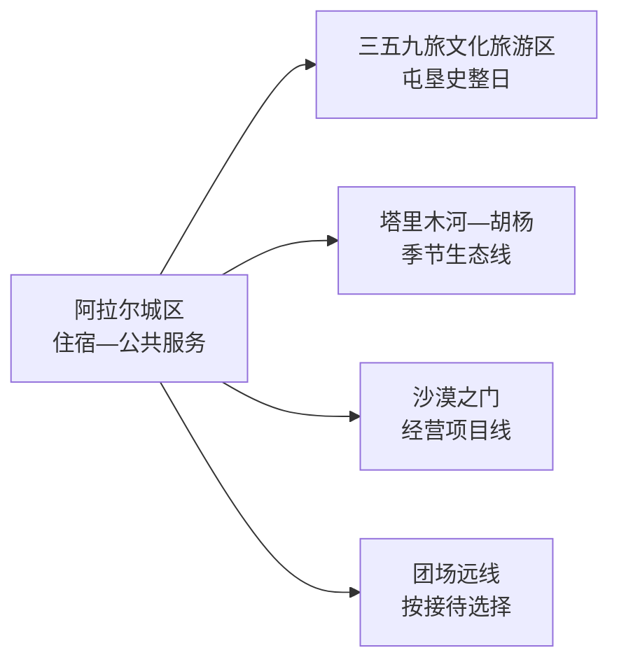
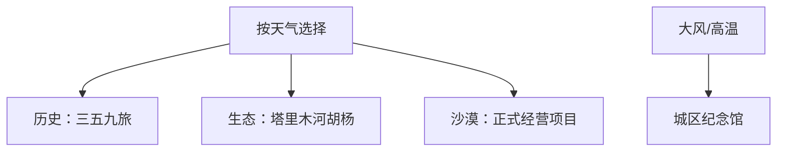

# 阿拉尔旅行指南

阿拉尔位于塔里木河上游与塔克拉玛干沙漠北缘，第一次来可用一天认识三五九旅屯垦史，再用一天选择塔里木河—胡杨或沙漠之门。团场、农田、水利工程和沙漠项目距离大，先确认运营和车辆，再决定是否加入远线。

> 建议停留：2–3 天  
> 关键词：三五九旅、屯垦、塔里木河、胡杨、沙漠、兵团城市  
> 主要体力：城区低至中等；沙漠与河岸中等且受气候影响大  
> 最近研究：2026-08-13

## 城市速览

| 项目 | 信息 |
|---|---|
| 主要价值 | 屯垦历史、兵团城市、塔里木河生态和沙漠体验 |
| 建议停留 | 1天历史线；2天加河岸或沙漠；3天增加正式团场线路 |
| 舒适季节 | 春秋较适合；夏季极热，冬季低温；胡杨色彩看当年物候 |
| 预算 | 城区较低；远线车辆、沙漠项目和季节住宿是变量 |
| 体力 | 步行不一定长，但暴晒、风沙和温差增加负担 |
| 天气风险 | 高温、沙尘、大风、强对流、低温和道路能见度 |
| 独行 | 城区可自行；远线使用正规服务并留返程 |
| 亲子 | 屯垦史和沙漠科普适合；严格管理水边与车辆 |
| 低体力 | 以纪念馆和车辆观景为主，减少沙地步行 |
| 无障碍 | 新建场馆可询问；沙地、河岸和团场设施连续性需向官方确认 |

## 城市格局与游览区域

GeoNames `1529641` 与 Wikidata `Q625554` 精确对应法定县级阿拉尔市，行政代码 `659002`。阿拉尔是新疆生产建设兵团第一师师市合一的城市，市区、团场、农垦生产区与自然空间尺度不同；本页按公开接待条件组织旅行，不把生产道路当作景区道路。

| 区域 | 体验 | 怎么安排 | 边界 |
|---|---|---|---|
| 阿拉尔城区 | 住宿、餐饮、城市公共空间 | 抵达日和基地 | 医疗补给集中 |
| 三五九旅文化旅游区 | 纪念馆、屯垦历史和主题景区 | 半日至一日 | 父景区内部点统一组织 |
| 塔里木河与胡杨方向 | 河流、湿地、胡杨和季节生态 | 物候匹配时完整一日 | 只用开放观景点和正式道路 |
| 沙漠之门方向 | 沙漠景观、营地与经营体验 | 按项目和天气选择 | 沙漠腹地、施工区与无救援野线有明确限制 |
| 团场与农垦生产区 | 棉田、水利、农业和团场文化 | 选择明确接待的研学或乡村项目 | 农田、渠系、泵站、厂区首先是生产设施 |

## 主要景点

| 景点 | 片区 | 类型 | 核心看点 | 用时 | 环境 | 体力 | 预约 | 天气 | 优先级 |
|---|---|---|---|---|---|---|---|---|---|
| 塔克拉玛干·三五九旅文化旅游区 | 城区及近城 | 历史文化景区 | 三五九旅屯垦史、纪念展示与城市发展 | 4–6小时 | 混合 | 低至中 | 高 | 低 | A |
| 三五九旅屯垦纪念馆 | 父景区内 | 纪念馆 | 文物、影像与屯垦建设史 | 2–3小时 | 室内 | 低 | 高 | 低 | A |
| 塔里木河公开观景线 | 市域河岸 | 河流与生态 | 河流、胡杨和荒漠绿洲关系 | 4–6小时 | 室外 | 中 | 高 | 很高 | A |
| 沙漠之门景区或当期运营项目 | 十一团方向 | 沙漠景区 | 沙丘景观、营地和受控体验 | 4–7小时 | 室外 | 中至高 | 高 | 很高 | B |
| 正式开放团场研学点 | 各团场 | 农垦与农业 | 棉花、果业、水利和团场生活 | 3–6小时 | 混合 | 中 | 高 | 高 | B |

三五九旅纪念馆属于完整文化旅游区的重要组成，不重复拆成多个景区计数。沙漠越野、露营、河岸穿越和无人机活动按运营方、应急部门及空域规则执行。

## 美食与餐饮

| 类型 | 场景 | 份量 | 注意 | 怎么选 |
|---|---|---|---|---|
| 抓饭 | 午餐 | 一份较扎实 | 羊肉、油脂、胡萝卜和米饭 | 先问小份与肥瘦 |
| 拌面 | 日常正餐 | 一人一份 | 小麦、肉类、辣椒和酱汁 | 菜码、辣度可分开确认 |
| 烤肉 | 晚餐或加餐 | 按串数控制 | 羊肉、孜然、辣椒和盐 | 与蔬菜、主食搭配 |
| 水果与干果 | 补给 | 少量分次 | 糖分、坚果过敏和储存 | 正规销售点购买并备饮水 |

## 经典行程

### 一日经典
- **路线**：三五九旅文化旅游区 → 午餐 → 城区公共空间。
- **串联逻辑**：先建立城市历史，再看当代兵团城市。
- **预约锚点**：纪念馆和父景区规则优先。
- **休息安排**：中午长休，避开高温。
- **时间不足时**：保留纪念馆核心展。

### 两日组合
- **路线**：第1天历史线；第2天塔里木河公开观景线或沙漠之门二选一。
- **串联逻辑**：文化与自然分日。
- **预约锚点**：先锁远线车辆、项目和天气。
- **休息安排**：正式服务区午休补水。
- **时间不足时**：走车辆可达核心点后返城。

### 三日深度
- **路线**：前两日按上；第3天选择一个正式团场研学项目。
- **适用条件**：接待单位、车辆和生产安排确认。
- **预约锚点**：至少提前联系运营或属地单位。
- **休息安排**：团场公共服务点用餐。
- **时间不足时**：改为城区慢游。

### 雨雪或风沙天
- **路线**：纪念馆核心展 → 午餐 → 城区室内文化空间。
- **适用条件**：道路正常且场馆开放。
- **预约锚点**：核临时闭馆和交通。
- **休息安排**：减少户外换乘。
- **时间不足时**：单馆慢游。

### 亲子与低体力
- **路线**：纪念馆讲解 → 午餐 → 车辆可达城市景观。
- **减负方式**：亲子用实物和故事学习；低体力删沙地步行。
- **预约锚点**：讲解、轮椅、卫生间和落客点。
- **休息安排**：每段后安排室内休息。
- **时间不足时**：只留纪念馆。

### 季节远线
- **路线**：塔里木河胡杨或沙漠项目单点整日。
- **适用条件**：物候、天气、道路和运营匹配。
- **预约锚点**：景区、车辆、保险和返程。
- **休息安排**：带足饮水，在服务区休息。
- **时间不足时**：取消日落后项目，提前返城。

## 住宿区域

| 区域 | 优点 | 取舍 | 适合 | 建议 |
|---|---|---|---|---|
| 阿拉尔城区 | 餐饮、补给、医疗和叫车集中 | 远线仍需长车程 | 首次到访 | 选有稳定前台与停车的位置 |
| 景区或团场经营住宿 | 靠近远线 | 供餐、通信和退改选择少 | 自驾、摄影 | 核资质、供暖制冷、供餐和救援 |

## 市内交通

阿拉尔以公路交通为主，长途抵达、机场联程和团场远线需分别核对。地图距离短也可能穿过生产道路、渠系或沙漠边缘，应使用公开道路和正式接驳。

| 场景 | 做法 | 核对 |
|---|---|---|
| 长途抵达 | 以当期铁路、公路或机场联运安排 | 班次、站点、夜间接驳 |
| 城区 | 出租车、公交或步行 | 高温、叫车覆盖 |
| 河岸/沙漠/团场 | 自驾、正规包车或景区车辆 | 油量、信号、道路、返程、保险 |

## 不同旅行者须知

| 人群 | 推荐 | 留意 | 核对 |
|---|---|---|---|
| 独行 | 城区基地+正规远线 | 信号与夜间返程 | 车辆、联系人、定位 |
| 亲子 | 纪念馆和受控沙漠科普 | 水边、沙丘和车辆 | 年龄、护栏、保险 |
| 长者低体力 | 场馆和车辆观景 | 高温、干燥、长车程 | 医疗、轮椅、休息点 |
| 户外摄影 | 胡杨或沙漠正式点位 | 风沙、禁飞、迷路 | 日落返程、通信、空域 |
| 农业研学 | 预约接待项目 | 机械、农药、渠系和厂区 | 接待范围、装备、卫生 |

## 行前核对

| 事项 | 原因 | 时间 | 入口 |
|---|---|---|---|
| 三五九旅景区 | 开放和预约变化 | 前一日 | [新疆文旅厅资料](https://wlt.xinjiang.gov.cn/wlt/c112782/202208/4ce1a097d2014872bfc7a1aeec24dad6.shtml) |
| 沙漠与团场项目 | 运营、保险和道路动态 | 订房前 | [第一师阿拉尔市政府](https://www.ale.gov.cn/) |
| 天气与沙尘 | 影响全部远线 | 前三日及当天 | [新疆气象局](http://xj.cma.gov.cn/) |

## 来源与更新记录

### 主要来源

| 来源 | 类型 | 支持内容 | 日期 |
|---|---|---|---|
| [新疆文旅厅：三五九旅文化旅游区](https://wlt.xinjiang.gov.cn/wlt/c112782/202208/4ce1a097d2014872bfc7a1aeec24dad6.shtml) | 省级文旅部门 | 5A景区身份与主题 | 2026-08-13 |
| [国家民委：三五九旅屯垦纪念馆](https://www.neac.gov.cn/seac/c103547/201403/1012280.shtml) | 国家部门 | 纪念馆历史和展陈 | 2026-08-13 |
| [文化和旅游部：兵团主题线路](https://zhuanti.mct.gov.cn/xjbt_detail/469.html) | 国家文旅部门 | 纪念馆、塔里木河、胡杨与团场线路 | 2026-08-13 |
| [第一师阿拉尔市政府](https://www.ale.gov.cn/) | 师市政府 | 当期交通、应急与运营入口 | 2026-08-13 |
| [GeoNames 1529641](https://www.geonames.org/1529641/) | 开放数据 | 固定城市点 | 2026-08-13 |
| [Wikidata Q625554](https://www.wikidata.org/wiki/Q625554) | 开放数据 | 法定阿拉尔市精确映射 | 2026-08-13 |

### 更新记录

| 日期 | 更新内容 |
|---|---|
| 2026-08-13 | 首次完成阿拉尔独立研究；按屯垦历史、塔里木河胡杨、沙漠与团场接待路线组织，补充生产区、水利、风沙、交通和无障碍边界。 |
