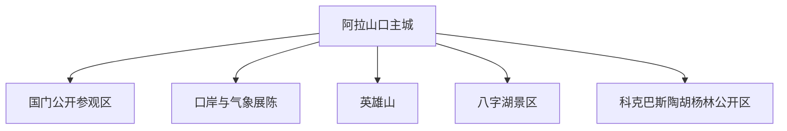
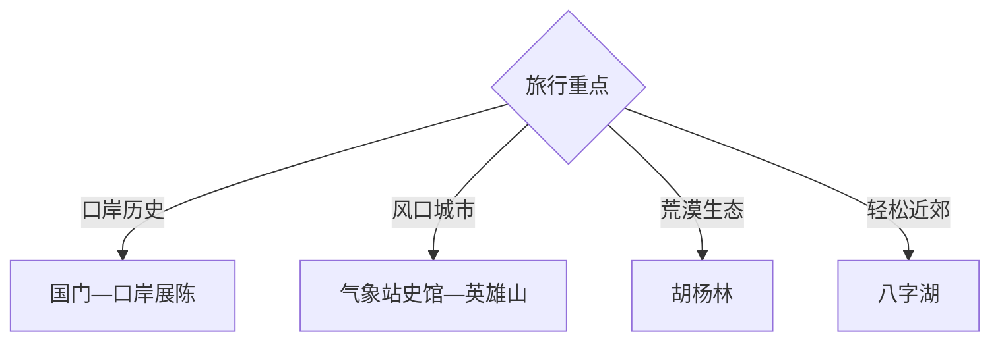

# 阿拉山口旅行指南

阿拉山口是博尔塔拉州的边境口岸城市，旅行价值集中在国门口岸史、城市展陈、英雄山、八字湖与艾比湖北岸胡杨景观。固定快照中的 **Alashankou / GeoNames 8521719** 对应阿拉山口主城；口岸监管、国境线、铁路换装与自然保护范围均按明确开放边界参观。

## 城市速览

| 项目 | 信息 |
|---|---|
| 主线 | 国门公开区—口岸史—英雄山—八字湖—胡杨林 |
| 停留 | 主城1天；艾比湖北岸方向另留1天 |
| 住宿 | 主城便于口岸文化与车辆补给 |
| 交通 | 铁路、公路进入，郊外方向需合规车辆 |
| 季节 | 春秋适合；全年关注大风、低温和沙尘 |
| 预算 | 远线车辆、讲解与天气冗余是主要增量 |

## 城市格局与游览区域

主城、国门游客区与口岸文化展陈构成城市线；艾比湖北岸、八字湖和胡杨林按道路与景区开放单独接驳。海关监管区、铁路编组换装区、货场、边防设施、国境线和湿地保护范围各有独立管理规则。

## 主要景点

| 景点 | 区域 | 类型 | 核心体验 | 用时 | 环境 | 体力 | 研究价值 | 拥挤 | 优先级 |
|---|---|---|---|---:|---|---|---|---|---|
| 国门景区公开区 | 口岸 | 边关与交通 | 国门、口岸史与亚欧通道 | 半天 | 混合 | 低 | 很高 | 节假日中 | A |
| 口岸公共展陈 | 主城 | 城市史与贸易 | 铁路口岸、联运与城市形成 | 2小时 | 室内 | 低 | 很高 | 低 | A |
| 阿拉山口气象站史馆 | 主城 | 气象与边关 | 风口气候、观测史与建设记忆 | 2小时 | 室内 | 低 | 高 | 低 | B |
| 英雄山公开区 | 主城周边 | 纪念与眺望 | 城市建设记忆与口岸地理 | 2小时 | 室外 | 中 | 高 | 周末中 | B |
| 八字湖景区 | 近郊 | 湖泊与荒漠 | 荒漠湖泊、风口和边城景观 | 半天 | 室外 | 低中 | 高 | 旺季中 | B |
| 科克巴斯陶胡杨林公开区 | 艾比湖北岸 | 荒漠生态 | 胡杨、荒漠与湖盆生态 | 1天 | 室外 | 中 | 很高 | 秋季中 | A |
| 城市风口景观带 | 主城 | 城市与气候 | 防风建设、口岸城市空间 | 2小时 | 室外 | 低 | 中高 | 低 | B |

## 美食与餐饮

主城可体验抓饭、烤肉、拌面、馕、奶制品和博州风味。远线准备饮水、热食与防风保温用品，边境和保护区方向以正规服务点完成补给。

## 经典行程

### 国门口岸线
**路线**：主城—国门正式游客入口—公开参观区—口岸展陈。**逻辑**：从国门到联运理解城市功能。**预约锚点**：开放、证件与安检。**休息**：游客中心。**删除条件**：临时管制时保留城市展陈。

### 风口城市线
**路线**：气象站史馆—英雄山—城市风口景观带。**逻辑**：理解风环境与城市建设。**预约锚点**：场馆和大风预警。**休息**：主城。**删除条件**：大风沙尘时只保留室内展陈。

### 八字湖半日线
**路线**：主城—八字湖正式入口—开放岸线—返城。**逻辑**：用半天补充荒漠湖泊景观。**预约锚点**：景区、道路与风力。**休息**：正规服务点。**删除条件**：大风、低温或岸线维护时改主城。

### 胡杨生态线
**路线**：主城—艾比湖北岸—科克巴斯陶公开区—返程。**逻辑**：独立一天观察胡杨与湖盆生态。**预约锚点**：道路、保护区与防火。**休息**：正规服务点。**删除条件**：封控、沙尘或道路受限时顺延。

### 铁路口岸研学线
**路线**：口岸展陈—国门公开区—城市铁路观察点。**逻辑**：从展板和合法观察点认识宽轨准轨换装。**预约锚点**：团体预约与安检。**休息**：主城。**删除条件**：口岸参观暂停时完成展陈。

### 轻松一日线
**路线**：口岸展陈—英雄山低强度段—地方餐饮。**逻辑**：适配到离日和低体力需求。**预约锚点**：天气与场馆。**休息**：主城多次安排。**删除条件**：大风时改室内活动。

### 两日组合线
**路线**：首日国门与风口城市；次日胡杨林或八字湖。**逻辑**：口岸人文和荒漠自然分日。**预约锚点**：边境管理、道路和天气。**休息**：主城连续住宿。**删除条件**：一天时保留首日。

## 住宿区域

主城适合住宿、餐饮和铁路到发，选择消防、供暖、停车与证件登记流程清晰的正规酒店。郊外线路以当天往返为主，只有正规接待和返程条件明确时安排外宿。

## 市内交通

阿拉山口站和公路连接博乐等节点，车次以出发日信息为准。口岸区按访客路线进入，八字湖与胡杨林分别核对车辆、油量、通信和白天返程；大风、沙尘、积雪会改变公路节奏。

## 不同旅行者须知

交通史旅行者组合国门与口岸展陈；亲子与长者选择室内展陈和英雄山低强度段；摄影者按秋色选择胡杨林；研学团队提前预约。海关监管区、货场、铁路线路、边防设施、国境线、湿地核心区和非开放荒漠保留明确限制。

## 行前核对

- 核对国门、展馆、英雄山、八字湖和胡杨林开放。
- 核对证件、安检、摄影、无人机与边境管理要求。
- 核对大风、沙尘、低温、积雪和森林防火。
- 核对铁路班次、正规车辆、通信与返程余量。

## 来源与更新记录

| 来源 | 支持内容 | 核验日期 |
|---|---|---|
| [新疆维吾尔自治区人民政府：休闲观光线路](https://www.xinjiang.gov.cn/xinjiang/bmdt/202101/93da26945c1d45f89a1cc925f6242637.shtml) | 阿拉山口国门、艾比湖与博州线路关系 | 2026-09-03 |
| [新疆林草局：艾比湖保护区生态观鸟屋](https://lcj.xinjiang.gov.cn/lcj/mtbd/202311/66f274fcdbb84a65a3ad564734c731c5.shtml) | 科克巴斯陶、湿地保护与低干扰观察 | 2026-09-03 |
| [GeoNames 8521719](https://www.geonames.org/8521719/) | Alashankou 固定人口点与阿拉山口主城位置 | 2026-09-03 |
