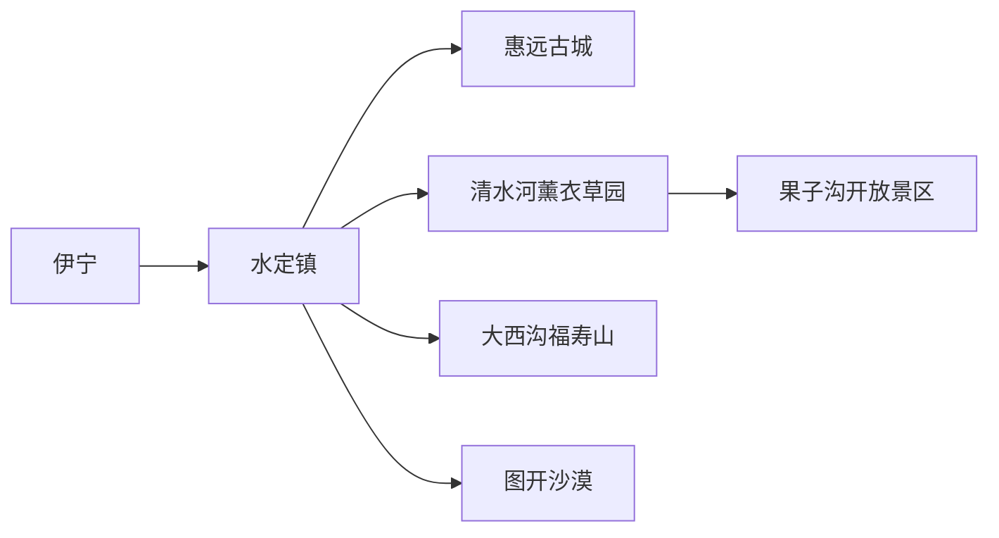
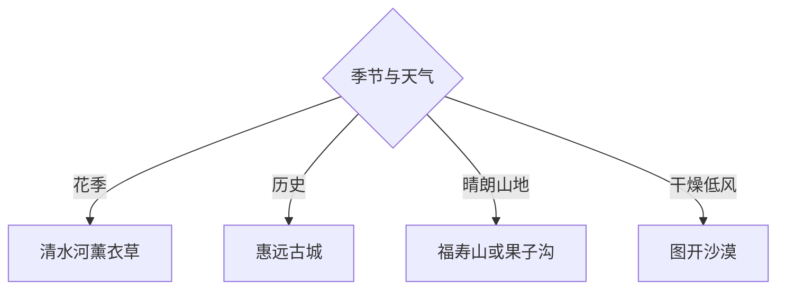

# 霍城旅行指南

霍城位于伊犁河谷西部，旅行主线由惠远古城、薰衣草园、大西沟福寿山、图开沙漠和果子沟组成。花季并不是唯一窗口：历史与河谷全年可读，山地、花田和沙漠则分别受天气与季节控制。

## 城市速览

| 项目 | 信息 |
|---|---|
| 主线 | 水定镇—惠远古城—清水河薰衣草—果子沟—福寿山—图开沙漠 |
| 停留 | 县城与惠远1天；增加一条自然线共2—3天 |
| 住宿 | 水定镇适合县域线路；清水河适合交通与花田；惠远适合历史体验 |
| 交通 | 从伊宁经公路进入，县内远点用班车、合规包车或自驾 |
| 风险 | 山区天气、草原火险、沙漠高温与大风、花季车流、边境县证件核查 |
| 边界 | 口岸、边境前沿、军事设施、自然保护地、农田和薰衣草生产区按管理边界进入 |

## 城市格局与游览区域

固定 **Huocheng / GeoNames 11694038** 对应伊犁哈萨克自治州霍城县，本页以实体 `Q1023079` 确定县域范围。县城、清水河与惠远构成服务三角，果子沟、大西沟和图开分属不同方向；连续赶点会把时间消耗在公路上，宜每天选择一个远端主题。

## 主要景点

| 景点 | 区域 | 类型 | 核心体验 | 用时 | 环境 | 体力 | 研究价值 | 拥挤 | 优先级 |
|---|---|---|---|---:|---|---|---|---|---|
| 惠远古城景区 | 惠远镇 | 历史城镇 | 伊犁将军府遗址、街巷与边疆史 | 半日至1天 | 混合 | 中 | 很高 | 旺季高 | A |
| 解忧公主薰衣草园 | 清水河 | 农业景区 | 薰衣草产业、花田与加工展示 | 2–4小时 | 室外 | 低中 | 高 | 花季很高 | A |
| 慢心忘忧谷薰衣草园 | 芦草沟 | 农旅景区 | 花田、乡村与季节体验 | 2–4小时 | 室外 | 低中 | 中 | 花季高 | B |
| 中华福寿山景区 | 大西沟 | 山地景区 | 山谷森林、花木与登高 | 半日至1天 | 室外 | 中高 | 高 | 旺季高 | A |
| 果—赛景区开放点位 | 果子沟 | 山地交通景观 | 峡谷、公路工程与河谷视野 | 半日 | 室外 | 中 | 高 | 旺季很高 | B |
| 图开沙漠景区 | 三道河方向 | 沙漠景区 | 沙丘地貌与正规运营项目 | 半日 | 室外 | 中高 | 高 | 节假日高 | B |
| 霍城县博物馆或县级展陈 | 水定镇 | 地方文博 | 县史、民族与丝路线索 | 1.5–3小时 | 室内 | 低 | 很高 | 低 | B |
| 伊河谷国家湿地公园公开区 | 县域河谷 | 湿地生态 | 河谷生态与候鸟观察 | 2–4小时 | 室外 | 中 | 高 | 季节高 | C |

## 美食与餐饮

水定镇和清水河适合抓饭、拌面、烤肉、丸子汤、馕与奶制品，惠远可寻找伊犁家常风味。点餐先说明份量与肉类偏好，乳制品按耐受选择；花田和山地日程自带饮水，正规渠道购买薰衣草精油与食品并查看用途和标签。

## 经典行程

### 两日基础线
**路线**：水定镇—惠远古城—次日清水河薰衣草—果子沟。**逻辑**：先历史，再自然与产业。**预约锚点**：景区、车辆和住宿。**休息**：惠远或清水河。**删除条件**：非花季将花园换县级展陈。

### 惠远历史线
**路线**：古城入口—将军府相关开放点—街巷—展陈。**逻辑**：以边疆治理和城市空间为主线。**预约锚点**：场馆开放与讲解。**休息**：古城服务区。**删除条件**：室内闭馆时保留公共街区。

### 薰衣草产业线
**路线**：正规花园—加工展示—清水河镇。**逻辑**：把花田拍摄与产业知识连起来。**预约锚点**：花期、开放、体验与价格。**休息**：园区。**删除条件**：花期未到或收割结束时改惠远。

### 福寿山线
**路线**：大西沟入口—开放步道—山谷观景—原路返程。**逻辑**：完整留给山地自然。**预约锚点**：门票、景交与天气。**休息**：游客中心。**删除条件**：雷雨、大风、冰雪或火险时取消。

### 果子沟景观线
**路线**：清水河—果—赛景区正式点位—返程。**逻辑**：观察河谷地貌与现代交通工程。**预约锚点**：道路、停车与开放区域。**休息**：服务区。**删除条件**：拥堵、降雪或交通管控时缩短。

### 图开沙漠线
**路线**：水定镇—图开正式景区—日落前返程。**逻辑**：用半日认识河谷边缘沙地。**预约锚点**：车辆、项目保险与返程。**休息**：游客中心。**删除条件**：高温、大风或沙尘时取消。

### 低体力线
**路线**：县级展陈—车辆游惠远—清水河正规花园。**逻辑**：以室内、平路和车辆观景为主。**预约锚点**：无障碍与落客点。**休息**：每站服务区。**删除条件**：花田泥泞时只留县城与惠远。

## 住宿区域

水定镇适合县城补给和多方向出发；清水河镇靠近交通主轴、薰衣草和果子沟；惠远适合历史主题慢住。订房时核对空调或供暖、热水、早餐、停车、夜间餐饮和旺季退改，远端山地当日往返需提前确认司机等待。

## 市内交通

伊宁是常见门户，公路进入霍城后再按水定、惠远、清水河分区。远端景区班次会随季节调整，当次向客运站与景区核对；包车明确合法运营、等候、停车、保险与返程费用。边境县出行随身携带有效证件，并服从当日交通与边境管理提示。

## 不同旅行者须知

历史兴趣者选惠远；花卉与产业兴趣者住清水河；徒步者选福寿山开放步道；亲子家庭选古城展陈和正规花园；摄影者按花期、晨昏与风况安排。口岸、边境前沿、军事设施、农田作业区、湿地保育区和非开放山谷保留明确限制，拍摄居民与生产活动先征得同意。

## 行前核对

- 核对六处4A级景区、县级场馆、花期、山地景交和沙漠项目的开放与价格。
- 核对伊宁往返、县内班车、道路施工、花季拥堵、雷雨、冰雪、大风和火险。
- 携带有效证件，边境与保护区域按现场标识通行，花田从正式入口进入。

## 来源与更新记录

| 来源 | 支持内容 | 核验日期 |
|---|---|---|
| [霍城县政府：4A级景区名录](https://www.xjhc.gov.cn/xjhc/c113483/202601/23768f4f71944064ad15b209aed87a67.shtml) | 惠远、图开、福寿山、薰衣草园与果—赛景区 | 2026-09-01 |
| [霍城县政府：旅游资源概况](https://www.xjhc.gov.cn/xjhc/c113362/202202/81f6753a99d34aa19f2ef8d922c018d9/files/851A54B6B95306D27B8D212AA20_15EC77D0_C9F4C.pdf) | 县域旅游资源、接待与区域关系 | 2026-09-01 |
| [霍城县文旅局信息公开](https://www.xjhc.gov.cn/xjhc/c113481/bmxxgklist_2.shtml) | 景区名录、管理与行前核验入口 | 2026-09-01 |
| [GeoNames 11694038](https://www.geonames.org/11694038/) | Huocheng 固定人口点及坐标 | 2026-09-01 |
| [Wikidata Q1023079](https://www.wikidata.org/wiki/Q1023079) | 霍城县实体与跨库标识 | 2026-09-01 |

| 日期 | 更新 |
|---|---|
| 2026-09-01 | 首次完成霍城旅行研究，按惠远、薰衣草、山谷、沙漠和果子沟组织。 |
