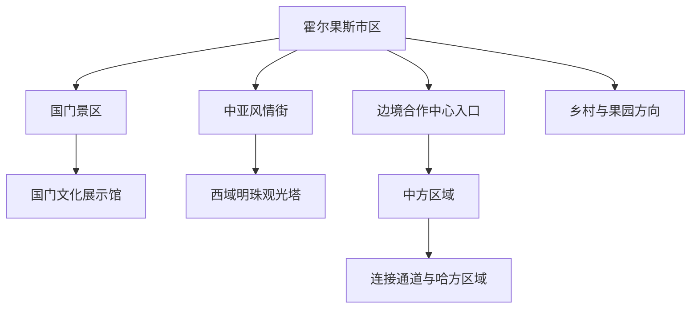
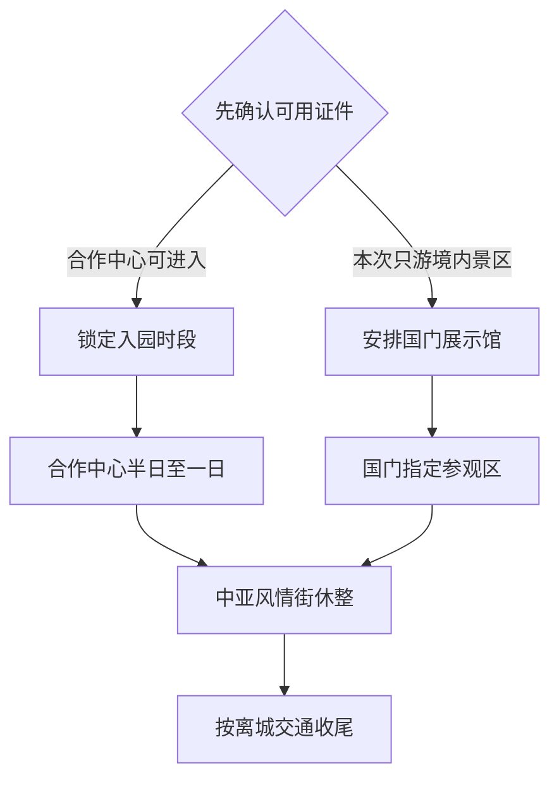

# 霍尔果斯旅行指南

霍尔果斯位于伊犁河谷西端，是以国门、口岸史、跨境合作和多语商业景观为核心体验的县级市。首访可把国门文化展示馆与中亚风情街放在同一天，再按证件和监管规则选择中哈霍尔果斯国际边境合作中心；乡村、果园和山地方向适合留给第二天。固定快照中的 **Qarasu / GeoNames 1529377** 别名直接包含霍尔果斯，人口点位于现行市区，页面按法定县级霍尔果斯市组织旅行范围。

> 建议停留：1–2 天  
> 旅行关键词：百年口岸、国门文化、跨境合作  
> 主要体力：低至中等步行  
> 最近研究：2026-09-03

## 城市速览

| 项目 | 旅行信息 |
|---|---|
| 主要旅行价值 | 从国门展陈、合作中心和口岸街区理解霍尔果斯的历史、边境管理与当代贸易 |
| 建议停留 | 1 天覆盖国门和城市街区；2 天可加入合作中心深度游或确认开放的乡村方向 |
| 较舒适季节 | 春秋适合城市步行；夏季日照时间长，需应对强光、高温和突发大风；冬季适合口岸城市与室内展陈 |
| 预算特点 | 中等；合作中心消费、跨城交通和旺季住宿是主要增量 |
| 步行强度 | 低至中；国门、街区和合作中心内部范围较大，安排分段休息更舒适 |
| 主要天气风险 | 大风、强对流、高温、寒潮、积雪结冰和山区火险 |
| 独行旅行 | 市区路线清晰，进入监管区域前准备本人有效证件并确认返程交通 |
| 亲子旅行 | 国门文化展示馆和中国文化馆适合研学，合作中心内用固定集合点降低走散风险 |
| 长者与低体力旅行 | 选择展示馆、观光塔和短段街区，合作中心按接驳与休息点拆分 |
| 无障碍信息 | 新建场馆与街区具备较好基础，安检通道、观光塔和合作中心连续通行需向运营方确认 |

## 城市格局与游览区域

霍尔果斯市区围绕口岸、国门景区、中亚风情街和配套城区展开。中哈霍尔果斯国际边境合作中心横跨中哈两侧，实行专门监管模式，进入、购物、携带物品和返回境内分别遵循当期证件与海关规则。国门景区和合作中心邻近但入口、票务与安检流程不同，按两个预约锚点安排更稳妥。

| 区域 | 主要内容 | 游览特点 | 与其他区域的关系 |
|---|---|---|---|
| 国门景区 | 国门文化展示馆、界碑与口岸史 | 以展陈和指定观景位置为主 | 可与中亚风情街组成一日核心线 |
| 中亚风情街 | 餐饮、商业、城市夜游 | 步行友好，适合午餐与晚间休整 | 邻近国门景区和观光塔 |
| 边境合作中心 | 中国文化馆、跨国大道、商业与跨境空间 | 需要证件、安检和完整半日 | 适合单独锁定入园与离园时间 |
| 友谊路等城市街区 | 城市生活、补给与公共空间 | 低强度，适合抵达日 | 可作为合作中心前后的弹性段 |
| 伊车嘎善—莫乎尔方向 | 乡村、农牧与季节景观 | 以正规道路和确认接待点为主 | 适合作为第二日兴趣线 |
| 铁路、公路口岸作业区 | 货运、物流和查验设施 | 以获批参观或公开观景区为活动范围 | 与普通旅游景点采用不同准入规则 |

## 主要景点

优先级用于安排时间：**A** 为首访核心，**B** 为按兴趣补充，**C** 为季节性或需确认接待的远点。合作中心内部场馆标记为“路线节点”，与合作中心共同计算一个大型游览单元。

### 国门、合作中心与城市街区

| 景点 | 区域 | 类型 | 主要看点 | 建议用时 | 室内外 | 体力 | 预约风险 | 天气影响 | 优先级 |
|---|---|---|---|---:|---|---|---|---|---|
| 霍尔果斯中哈国际文化旅游区 | 口岸核心 | 边境文化与城市 | 国门、合作中心和口岸城市整体格局 | 1 天 | 混合 | 中 | 高 | 中 | A |
| 国门文化展示馆 | 国门景区 | 博物馆与口岸史 | 千年驿站、正式通关和百年口岸展陈 | 2–3 小时 | 室内 | 低 | 中 | 低 | A |
| 国门景区指定参观区 | 国门景区 | 国门与历史地标 | 公开界碑、历史石碑和历代国门叙事 | 1–2 小时 | 混合 | 低 | 中 | 中 | A |
| 中哈霍尔果斯国际边境合作中心 | 合作中心 | 跨境合作与商业 | 专门监管区、跨国大道和中哈商业空间 | 4–7 小时 | 混合 | 中 | 高 | 中 | A |
| 中国文化馆 | 合作中心中方区域 | 文化展陈 | 中国历史文化、丝绸之路与交流主题 | 1–2 小时 | 室内 | 低 | 中 | 低 | 路线节点 |
| 中哈连接通道公开区 | 合作中心 | 建筑与边境空间 | 两侧空间关系和合作中心标志建筑 | 1 小时 | 混合 | 低 | 高 | 中 | 路线节点 |
| 中亚风情街 | 国门旁 | 商业街区 | 多样建筑、餐饮、购物和城市夜游 | 1.5–3 小时 | 混合 | 低 | 低 | 中 | B |
| 西域明珠观光塔 | 中亚风情街 | 城市观景 | 口岸城市、伊犁河谷西端与边境方向视野 | 1–1.5 小时 | 室内 | 低 | 中 | 高 | B |
| 第六代国门公共参观区 | 口岸方向 | 当代建筑 | 新国门建筑与口岸发展观察 | 1–2 小时 | 混合 | 低 | 中高 | 中 | B |
| 友谊路城市生活段 | 市区 | 街区与餐饮 | 本地生活、补给和晚间散步 | 1–2 小时 | 室外 | 低 | 低 | 中 | B |

国界设施、边防执勤区、海关查验区、铁路与公路口岸生产作业区保留明确限制；摄影、无人机、测绘设备和商业拍摄按现场标识及主管部门规则执行。2026 年 8 月市政府旅游入口曾发布全市山区徒步、露营限制，计划山地活动时先核对最新公告。

## 美食与餐饮

霍尔果斯适合在中亚风情街、市区生活街和合作中心内比较新疆、哈萨克斯坦及中亚风味。合作中心内购物与餐饮适用专门监管规则，先确认支付、携带物品和返回中方区域的要求；城市正餐可选择抓饭、拌面、烤肉和奶茶等常见伊犁风味。

| 菜品或餐饮类型 | 常见区域 | 一个人用餐与常见份量 | 风味、过敏原与饮食限制 | 排队风险与替代方法 |
|---|---|---|---|---|
| 抓饭 | 市区、中亚风情街 | 一人份友好 | 常见羊肉、胡萝卜和较多油脂 | 午餐高峰后选择同类餐馆 |
| 拌面与汤饭 | 市区生活街 | 一人份友好，可加菜 | 面筋、牛羊肉和辣度可先确认 | 适合作为快捷正餐替代 |
| 烤肉与烤包子 | 市区、风情街 | 烤肉按串点，烤包子适合加餐 | 牛羊肉、孜然和面筋较常见 | 选择明档、标价清晰的店 |
| 奶茶与乳制品 | 市区、合作中心 | 小份易尝试 | 乳糖、盐度和坚果配料需询问 | 用茶饮或无乳饮品替代 |
| 中亚风味餐 | 合作中心、风情街 | 多人分享更丰富 | 肉类、乳制品、坚果和语言沟通是点单重点 | 查看菜单标价并保留支付凭证 |

## 经典行程

### 一日经典路线

**路线**：国门文化展示馆 → 国门景区指定参观区 → 中亚风情街 → 西域明珠观光塔。

- **串联逻辑**：用口岸史开场，再到公开国门空间理解城市位置，下午和晚间在相邻街区完成餐饮与观景。
- **预约锚点**：国门景区开放、实名要求和观光塔运营。
- **休息安排**：展示馆、中亚风情街和观光塔室内空间。
- **时间不足时**：保留展示馆和国门指定参观区，删除观光塔。

### 两日城市路线

**第 1 天**：国门文化展示馆 → 国门景区 → 中亚风情街。  
**第 2 天**：边境合作中心 → 中国文化馆 → 连接通道公开区 → 市区晚餐。

- **串联逻辑**：第一天理解境内口岸史，第二天用完整时段体验合作中心的监管、文化和商业空间。
- **预约锚点**：合作中心接受的证件、入园时段、离园规则和携带物品限制。
- **休息安排**：合作中心内正式营业的休息区和餐饮点。
- **时间不足时**：第二天保留中国文化馆与跨国大道主段，商业购物按离园时间压缩。

### 三日深度路线

**第 1 天**：国门景区与城市街区。  
**第 2 天**：边境合作中心全天。  
**第 3 天**：确认开放的伊车嘎善或莫乎尔乡村方向 → 返回市区。

- **串联逻辑**：口岸史、跨境合作与市域乡村分日，避免监管区和远线行程互相挤压。
- **预约锚点**：第三日接待点、正规车辆和季节天气。
- **休息安排**：前两晚住市区，第三日使用确认营业的乡村服务点。
- **时间不足时**：两天时删除第三日乡村线。

### 大风或严寒路线

**路线**：国门文化展示馆 → 中国文化馆或城市室内展陈 → 中亚风情街室内餐饮。

- **适用条件**：道路和场馆正常开放时采用；强风、寒潮或结冰预警下减少室外停留。
- **预约锚点**：场馆、合作中心和观光塔当日运行。
- **休息安排**：连续使用有供暖或空调的室内空间。
- **时间不足时**：保留国门文化展示馆，其他项目按安检与交通时间删除。

### 亲子或低体力路线

**亲子路线**：国门文化展示馆 → 国门指定观景区 → 中亚风情街早晚餐。  
**低体力路线**：车辆落客 → 展示馆 → 观光塔 → 街区短段。

- **减负方式**：亲子线以展陈和固定集合点组织，进入合作中心时为儿童准备有效证件；低体力线缩短街区步行并确认电梯、座椅和落客位置。
- **预约锚点**：儿童证件、安检、观光塔电梯和无障碍入口。
- **休息安排**：展示馆大厅、观光塔与风情街餐饮。
- **时间不足时**：两条路线都保留展示馆，观光塔按排队时间取舍。

### 合作中心深度路线

**路线**：指定入口安检 → 中国文化馆 → 跨国大道 → 连接通道公开区 → 商业空间 → 按规定离园。

- **适用条件**：本人证件符合当日准入条件，并已理解海关、购物和离园规则。
- **预约锚点**：证件清单、开放时间、哈方区域可达性与携带物品限额。
- **休息安排**：中心内官方指引的餐饮和休息区。
- **时间不足时**：保留文化馆与跨国大道，购物放在最后并预留监管检查时间。

### 伊犁河谷联程路线

**路线**：霍尔果斯城市核心 → 清水河或伊宁方向正规交通 → 下一住宿地。

- **适用条件**：适合把霍尔果斯作为伊犁西部一站，并已确认下一站班次、属地和住宿。
- **预约锚点**：铁路、公路客运和行李携带规则。
- **休息安排**：离城前在市区完成正餐和补给。
- **时间不足时**：保留国门展示馆，把合作中心留给下一次专程。

## 住宿区域

| 区域 | 优点 | 缺点 | 适合人群 | 交通特点 |
|---|---|---|---|---|
| 口岸核心区 | 接近国门、风情街和合作中心 | 旺季价格、安检和交通管制影响较大 | 首访、短住、口岸主题旅行者 | 多个核心点可用短途车辆或分段步行连接 |
| 城市生活区 | 餐饮、超市和日常服务选择较多 | 到合作中心入口仍需交通 | 多日旅行、独行和预算型旅行者 | 适合协调车站、景区和夜间用餐 |
| 铁路抵离方向 | 适合晚到早走和伊犁联程 | 夜间活动与核心景点距离需比较 | 铁路联程旅行者 | 订房时确认实际车站、接送和末班交通 |
| 乡村正规住宿 | 靠近季节景观和农牧体验 | 接待季节、道路和夜间服务有限 | 慢旅行与乡村主题旅行者 | 以正式营业、消防和可取消预订为选择条件 |

## 市内交通

| 场景 | 建议与取舍 | 行前需要重查的内容 |
|---|---|---|
| 从铁路或公路枢纽抵达 | 选择公交、出租车或正规网约车进入住宿区 | 到站点、末班时间、正规上车区和施工 |
| 国门与街区移动 | 短途车辆加分段步行最灵活 | 景区落客点、临时管控和安检入口 |
| 进入合作中心 | 使用指定入口并预留证件核验和离园检查时间 | 准入证件、开放、哈方区域状态和携带物品规则 |
| 伊犁州内联程 | 根据下一住宿地选择铁路、公路客运或正规包车 | 班次、实名购票、道路天气和行李 |
| 自驾 | 市区停车后步行游览，远线按开放道路行驶 | 停车、口岸车辆限制、山区禁令与边境道路 |

## 不同旅行者须知

| 旅行维度 | 可行条件 | 主要取舍 | 需额外核对 |
|---|---|---|---|
| 独行旅行 | 住市区并把证件、安检和返程设为三个时间锚点 | 合作中心范围大，临时改路线成本较高 | 末班交通、支付和通讯 |
| 亲子旅行 | 展示馆、公开国门区和合作中心文化场馆适合研学 | 人流密集区需要固定集合点 | 儿童证件、票务和安检 |
| 长者或低体力旅行 | 以展示馆、观光塔和短段街区组合 | 合作中心长距离步行增加负担 | 接驳、电梯、座椅和卫生间 |
| 无障碍需求 | 优先新建展馆和商业设施 | 不同监管通道的连续通行资料有限 | 无障碍安检、升降设施和陪同规则 |
| 摄影旅行 | 公开城市街区和获准观景位题材集中 | 国界、口岸作业和执勤空间限制明确 | 摄影标识、无人机、三脚架和商业拍摄 |
| 预算有限 | 城区住宿加国门核心线即可建立城市认识 | 合作中心消费和跨城交通提高预算 | 门票、交通与购物退税或监管规则 |
| 晚出发或紧凑行程 | 选择展示馆加中亚风情街 | 合作中心需要完整半日以上 | 最晚入园与离园时间 |
| 特殊天气或自然条件 | 大风严寒日转为室内展馆，山区活动先查禁令 | 极端天气会影响道路、塔体和户外开放 | 气象、交通和市政府旅游公告 |

## 行前核对

| 核对事项 | 为什么需要重查 | 建议核对时间 | 官方入口 |
|---|---|---|---|
| A 级景区与国门开放 | 分区、票务、实名和活动会调整 | 预约前及到访前一日 | [霍尔果斯市 A 级旅游景区基本情况](https://www.xjhegs.gov.cn/xjhegs/c114441/202505/6d189c24836b4e7ba279d7f9c9c659c3.shtml) |
| 合作中心准入 | 证件、哈方区域、购物和携带物品规则具有时效性 | 订行程前及入园当天 | [合作中心旅游攻略](https://www.xjhegs.gov.cn/xjhegs/c114339/202305/cad74f1177214dfab1ac89aff9c5c16f.shtml) |
| 山区与户外活动 | 火险、天气和临时禁令会改变可行路线 | 出发前三日及当天 | [霍尔果斯市旅游公告入口](https://www.xjhegs.gov.cn/xjhegs/c114336/list.shtml) |
| 铁路与州内交通 | 班次、道路、口岸管控和末班交通会变化 | 出发前一周及当天 | [中国铁路 12306](https://www.12306.cn/)、[新疆交通运输厅](https://jtyst.xinjiang.gov.cn/) |
| 出入境与海关规则 | 跨境资格取决于证件、国籍、目的地与当期政策 | 订票前及出境前 | [国家移民管理局](https://www.nia.gov.cn/)、[海关总署](http://www.customs.gov.cn/) |

## 来源与更新记录

### 主要来源

| 来源 | 类型 | 支持内容 | 核验日期 |
|---|---|---|---|
| [霍尔果斯市 A 级旅游景区基本情况](https://www.xjhegs.gov.cn/xjhegs/c114441/202505/6d189c24836b4e7ba279d7f9c9c659c3.shtml) | 市政府 | 国际文化旅游区、国门、合作中心、风情街与观光塔 | 2026-09-03 |
| [中哈霍尔果斯国际边境合作中心旅游攻略](https://www.xjhegs.gov.cn/xjhegs/c114339/202305/cad74f1177214dfab1ac89aff9c5c16f.shtml) | 市政府文旅部门 | 合作中心空间、证件类型与游览顺序 | 2026-09-03 |
| [霍尔果斯市旅游入口](https://www.xjhegs.gov.cn/xjhegs/c114336/list.shtml) | 市政府 | 当前景区、交通、活动和山区限制公告 | 2026-09-03 |
| [国家移民管理局：霍尔果斯口岸观察](https://www.nia.gov.cn/dbsource/836563/836564.pdf) | 国家主管部门 | 口岸历史与出入境管理背景 | 2026-09-03 |
| [GeoNames 1529377](https://www.geonames.org/1529377/) | 固定开放数据 | Qarasu／霍尔果斯人口点与本页定位锚点 | 2026-09-03 |

### 更新记录

| 日期 | 更新内容 |
|---|---|
| 2026-09-03 | 首次完成霍尔果斯县级市映射、资料研究与路线整理 |
