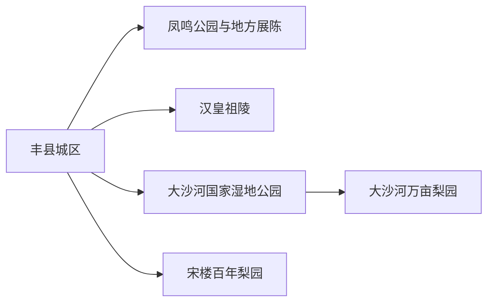
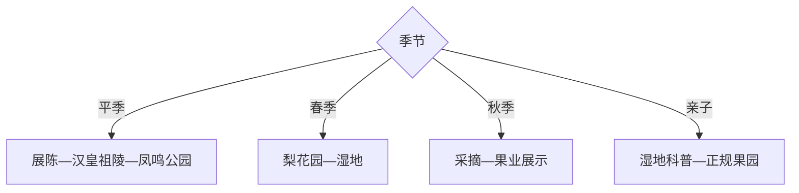

# 丰县旅行指南

丰县适合做徐州西北部的汉文化、黄河故道湿地与果园季节旅行：县城以凤鸣公园、博物馆和老城记忆为入口，汉皇祖陵承担汉文化主题，大沙河湿地与万亩梨园适合春花、秋果和观鸟。

## 城市速览

| 项目 | 信息 |
|---|---|
| 主线 | 丰县城区—凤鸣公园—汉皇祖陵—大沙河湿地—宋楼与大沙河果园 |
| 停留 | 县城与汉文化1天；增加湿地果园共2天 |
| 住宿 | 县城交通餐饮方便，大沙河方向适合花果季早游 |
| 交通 | 从徐州乘公路进入，县内用公交、预约车或自驾 |
| 风险 | 花果季拥堵、湿地水情、夏季高温雷雨、采摘与农业机械 |
| 边界 | 湿地保育区、河道、果园生产区、文物本体和施工区域按开放范围进入 |

## 城市格局与游览区域

固定 `Fengcheng / GeoNames 1811200` 对应丰县主城，本页以法定丰县 `Q384278` 组织。汉皇祖陵在赵庄方向，湿地与梨果产业集中大沙河和宋楼一带，适合按人文、生态两日拆分。

## 主要景点

| 景点 | 区域 | 类型 | 核心体验 | 用时 | 环境 | 体力 | 预约风险 | 天气影响 | 优先级 |
|---|---|---|---|---:|---|---|---|---|---|
| 丰县博物馆或地方展陈 | 县城 | 地方文博 | 县史、汉文化与黄河故道 | 1.5–3小时 | 室内 | 低 | 很高 | 低 | A |
| 凤鸣公园与凤鸣塔 | 县城 | 城市公园 | 城市地标、湖景与休闲 | 2–4小时 | 室外 | 低中 | 低 | 高 | B |
| 汉皇祖陵公开景区 | 赵庄镇 | 汉文化 | 刘氏祖陵传说、汉文化展陈与园区 | 3–5小时 | 室内外 | 中 | 很高 | 高 | A |
| 大沙河国家湿地公园公开区 | 大沙河镇 | 湿地生态 | 黄河故道、观鸟与生态修复 | 半日至1天 | 室外 | 中 | 高 | 极高 | A |
| 大沙河万亩梨园正规接待点 | 大沙河镇 | 果园农旅 | 梨花、果园与季节采摘 | 3–6小时 | 室外 | 中 | 很高 | 很高 | A |
| 宋楼百年梨园正规接待区 | 宋楼镇 | 农业文化 | 老梨树、花期与果业传统 | 2–5小时 | 室外 | 低中 | 很高 | 很高 | B |
| 果都大观园当期开放区 | 大沙河方向 | 农旅园区 | 果业展示、亲子与采摘 | 3–5小时 | 室外 | 低中 | 很高 | 很高 | B |
| 丰县文庙或老城公开文化点 | 县城 | 历史文化 | 地方教育、街区与古建线索 | 1–3小时 | 室内外 | 低 | 高 | 中 | B |

## 美食与餐饮

县城可尝丰县羊肉汤、烧饼、地锅、把子肉与苏北家常菜，花果季可选苹果、梨和果品加工品。采摘先问品种、成熟度、入园费和称重价，湿地日自备饮水并减少一次性垃圾。

## 经典行程

### 一日经典线
**路线**：地方展陈—汉皇祖陵—凤鸣公园。**逻辑**：用县史串起汉文化主题和城市空间。**预约锚点**：展馆、景区和讲解。**休息**：县城。**删除条件**：闭馆时增加公园与老城。

### 两日人文生态线
**路线**：首日县城—汉皇祖陵；次日大沙河湿地—正规果园。**逻辑**：人文和黄河故道生态分日。**预约锚点**：湿地、观鸟与采摘。**休息**：大沙河镇。**删除条件**：水情异常时取消湿地。

### 花期梨园线
**路线**：宋楼或大沙河梨园二选一—乡镇午餐—湿地短段。**逻辑**：按实时花情选成熟接待点。**预约锚点**：花情、交通和停车。**休息**：园区。**删除条件**：花期偏差或大风降雨时改县城。

### 秋收采摘线
**路线**：正规果园—果业展陈—农产品门店。**逻辑**：把采摘、产业认知与购买连成一线。**预约锚点**：品种、价格、可采范围和供餐。**休息**：果园。**删除条件**：成熟期不符时改湿地。

### 湿地观鸟线
**路线**：游客中心—公开观鸟设施—规定步道—原路返程。**逻辑**：低干扰观察黄河故道生态。**预约锚点**：开放、水情、鸟情与讲解。**休息**：游客中心。**删除条件**：强风雷雨或保育封控时取消。

### 亲子线
**路线**：地方展陈—湿地科普—正规果园短体验。**逻辑**：历史、生态和农业三段各留短时。**预约锚点**：儿童活动和采摘。**休息**：湿地服务点。**删除条件**：高温时只留室内与短采摘。

### 低体力线
**路线**：地方展陈—车辆到汉皇祖陵核心—凤鸣公园短段。**逻辑**：以落客点和平路控制步行。**预约锚点**：无障碍与座椅。**休息**：县城。**删除条件**：高温时只留展陈。

## 住宿区域

丰县城区适合长途交通、餐饮与人文线；大沙河镇适合湿地、梨园和清晨观鸟；宋楼住宿只为特定花果行程。乡村住宿确认经营、消防、供餐、停车和花期退改。

## 市内交通

徐州到丰县以公路为主，抵达后按赵庄汉文化和大沙河生态两个方向换线。花果季自驾参考分流与停车，预约车锁定返程；湿地和果园之间的生产道路只按经营方指引通行。

## 不同旅行者须知

历史爱好者选展陈与汉皇祖陵；观鸟者清晨进入公开设施；亲子家庭选湿地科普与采摘；低体力者留在县城。湿地核心保育区、河道、果园机械作业区、果品仓储区和文物非开放空间保留明确限制。

## 行前核对

- 核对展馆、汉皇祖陵、湿地与果园开放，梨花和果实成熟期。
- 核对水情、雷雨高温、观鸟设施、乡村道路、停车与返程。
- 采摘按划定区域和计价，观鸟保持距离，农产品购买保留称重与付款凭证。

## 来源与更新记录

| 来源 | 支持内容 | 核验日期 |
|---|---|---|
| [徐州公共资源：大沙河湿地](https://ggzy.zwb.xz.gov.cn/jyxx/003001/003001001/20181012/3738f8c7-e47e-49ec-aab7-4d225c0116fb.html) | 国家湿地公园、观鸟设施与大沙河位置 | 2026-09-01 |
| [GeoNames 1811200](https://www.geonames.org/1811200/) | Fengcheng 固定县城点 | 2026-09-01 |
| [Wikidata Q384278](https://www.wikidata.org/wiki/Q384278) | 丰县实体与跨库标识 | 2026-09-01 |

| 日期 | 更新 |
|---|---|
| 2026-09-01 | 首次完成丰县旅行研究，按汉文化、黄河故道湿地与花果农业组织。 |
