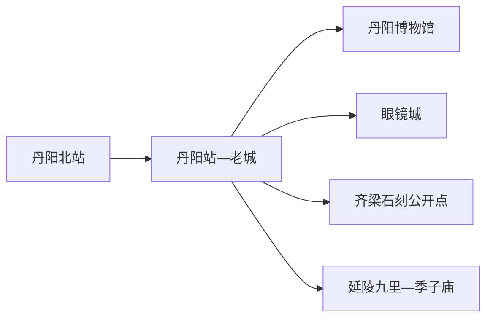
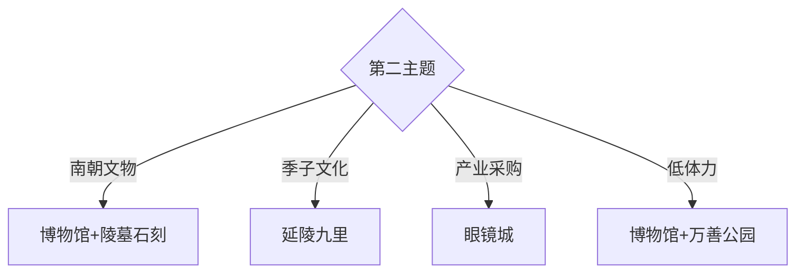

# 丹阳旅行指南

丹阳位于镇江与常州之间，旅行价值集中在齐梁陵墓石刻、延陵季子文化、地方博物馆和眼镜产业。固定 **Yunyang / GeoNames 8394482** 对应丹阳主城云阳一带，本页用丹阳市级页面承接其城市、住宿、交通和近郊主题。

## 城市速览

| 项目 | 信息 |
|---|---|
| 主线 | 丹阳博物馆—齐梁石刻公开点—眼镜城—九里季子庙 |
| 停留 | 主城1天；延陵与石刻专题另加1天 |
| 住宿 | 丹阳站—老城便于铁路和餐饮；丹阳北站适合高铁抵离 |
| 交通 | 两座铁路站服务不同车次，郊外石刻与延陵方向需公交或预约车辆 |
| 风险 | 文物保护边界、乡村道路、雷雨高温、眼镜采购售后与生产园区管理 |

## 城市格局与游览区域

丹阳站靠近传统主城，丹阳北站承担部分高铁抵离，两者需要城市交通衔接。南朝陵墓石刻分散于乡野和保护区，延陵九里又在西南方向；首次到访可先用主城一天建立框架，第二天只选石刻或季子文化一条线。

## 主要景点

| 景点 | 区域 | 类型 | 核心体验 | 用时 | 环境 | 体力 | 研究价值 | 拥挤 | 优先级 |
|---|---|---|---|---:|---|---|---|---|---|
| 丹阳市博物馆 | 主城 | 博物馆 | 丹阳地方史、齐梁文化与文物 | 2小时 | 室内 | 低 | 很高 | 团体时中 | A |
| 丹阳南朝陵墓石刻公开点 | 主城近郊 | 文物遗址 | 石兽、神道与南朝陵寝空间 | 半天 | 室外 | 中 | 很高 | 低 | A |
| 九里季子庙景区 | 延陵镇 | 历史文化 | 季札文化、墓碑、季河桥与沸井 | 2–3小时 | 混合 | 低中 | 很高 | 节庆时高 | A |
| 九里传统村落公开区 | 延陵镇 | 传统村落 | 村落变迁、街巷遗痕与当代重建 | 1–2小时 | 室外 | 低 | 高 | 中 | B |
| 丹阳眼镜城 | 车站片区 | 产业商业 | 验光、镜架与产业观察 | 2–4小时 | 室内 | 低 | 高 | 周末高 | A |
| 天地石刻园 | 开发区方向 | 石刻园区 | 历代石刻陈列与齐梁主题景观 | 2–3小时 | 混合 | 中 | 中高 | 节假日中 | B |
| 总前委旧址纪念馆公开区 | 主城近郊 | 纪念馆 | 渡江战役相关史迹 | 1–2小时 | 室内 | 低 | 高 | 团体时中 | B |
| 万善公园 | 主城 | 城市公园 | 塔、公园绿地与市民生活 | 1–2小时 | 室外 | 低 | 中 | 周末中 | C |
| 水晶山与乡村公开步道 | 西部丘陵 | 山林 | 低山、村落与季节景观 | 2–3小时 | 室外 | 中 | 中 | 周末中 | C |

## 美食与餐饮

丹阳黄酒、延陵鸭饺、肴肉、锅盖面和江南家常菜适合按主城与延陵分开品尝。购买酒类和眼镜都先确认规格、价格、发票与售后；驾车者安排无酒精选择。鸭、猪肉、虾皮、芝麻和小麦过敏者逐项询问馅料、汤底与共用厨具。

## 经典行程

### 一日基础线
**路线**：丹阳市博物馆—主城午餐—眼镜城—万善公园。**逻辑**：地方史、产业和城市生活依次展开。**预约锚点**：博物馆。**休息**：眼镜城或老城商业。**删除条件**：时间不足时删公园。

### 齐梁石刻线
**路线**：博物馆—一至两处正式开放石刻点—返城。**逻辑**：先在馆内建立年代与类型，再看原址。**预约锚点**：保护点开放和车辆。**休息**：主城或镇区。**删除条件**：暴雨、施工或保护管制时只留馆内。

### 延陵季子线
**路线**：九里季子庙—季河桥与公开遗存—镇区午餐。**逻辑**：围绕季札与村落变迁完成半日。**预约锚点**：景区和馆舍开放。**休息**：游客服务区。**删除条件**：节庆限流时缩短村落段。

### 眼镜产业线
**路线**：正规验光—镜架比较—下单与取件确认。**逻辑**：把采购拆成专业验光和商品选择。**预约锚点**：验光、加工与取件时间。**休息**：商场。**删除条件**：复杂处方需医疗机构复核时暂停配镜。

### 红色史迹线
**路线**：总前委旧址纪念馆—主城博物馆相关展陈。**逻辑**：用原址与综合馆互证。**预约锚点**：馆舍开放。**休息**：主城。**删除条件**：团体包场时调整顺序。

### 亲子低体力线
**路线**：博物馆—午休—万善公园近入口。**逻辑**：室内展陈配短公园。**预约锚点**：亲子活动。**休息**：每站坐休。**删除条件**：高温时保留室内。

### 雨天线
**路线**：博物馆—眼镜城—正规商业空间。**逻辑**：把石刻和乡村改为室内。**预约锚点**：馆舍与验光。**休息**：眼镜城。**删除条件**：强对流时提前返宿。

## 住宿区域

丹阳站—老城适合普速铁路、博物馆和餐饮；丹阳北站周边适合早晚高铁，但夜间选择相对依具体商圈；延陵方向适合季子文化专题。多数首次到访者住老城，在两个郊外主题中只选一条。

## 市内交通

订票时区分丹阳站与丹阳北站。主城用公交、出租车和网约车，石刻、延陵和西部丘陵提前落实返程。陵墓神道、考古区和石刻保护范围内按标识步行，生产厂区、仓库和未开放墓区执行明确限制。

## 不同旅行者须知

文物旅行者优先博物馆、南朝石刻和季子庙；产业旅行者安排眼镜城并为加工留时间；亲子家庭选择博物馆和公园；轮椅使用者重点确认乡野石刻点的路面、停车与连续无障碍条件。

## 行前核对

- 核对博物馆、纪念馆、季子庙和石刻园区开放。
- 核对丹阳站、丹阳北站车次与郊外返程。
- 南朝陵墓石刻属于重点文物，按开放路径观看，保护区和墓区遵守明确限制。

## 来源与更新记录

| 来源 | 支持内容 | 核验日期 |
|---|---|---|
| [江苏省民政厅：丹阳九里景区](https://mzt.jiangsu.gov.cn/art/2026/7/27/art_55087_11812900.html) | 九里景区、季子文化与当前公共使用 | 2026-09-01 |
| [江苏省生态空间管控区域规划](https://www.jiangsu.gov.cn/module/download/downfile.jsp?classid=0&filename=41d4406973644c03b562924cf59cd693.pdf) | 齐梁石刻、吴文化遗址与季子庙保护范围 | 2026-09-01 |
| [GeoNames 8394482](https://www.geonames.org/8394482/) | Yunyang 固定人口点与位置 | 2026-09-01 |

| 日期 | 更新 |
|---|---|
| 2026-09-01 | 首次完成丹阳旅行研究；明确云阳驻地记录与丹阳县级市页面关系。 |
