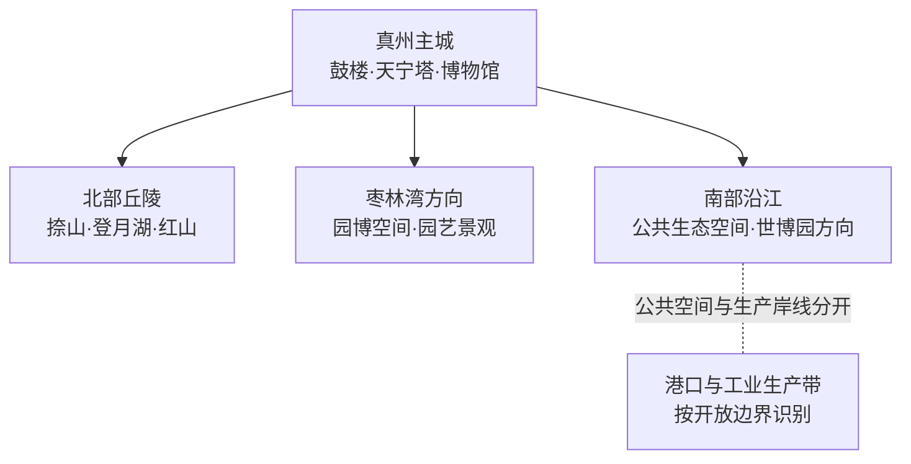
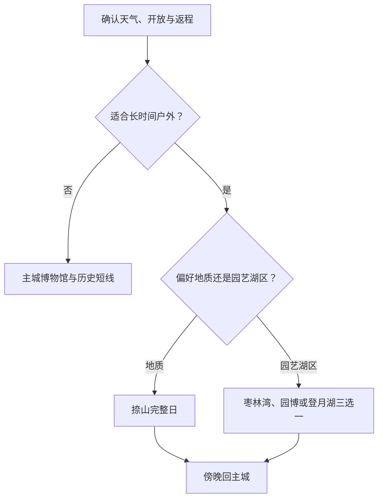

# 仪征旅行指南

仪征是扬州市代管的县级市，古称真州。旅行空间以真州主城的鼓楼、天宁塔和博物馆为人文核心，向北连接捺山地质公园、登月湖和枣林湾，向南到长江岸线的世博园、滨江生态与工业港区边界。首次到访宜住主城，以一日文化线建立尺度，再把北部丘陵或南部园博方向各留一日。

> 建议停留：1–3 天；主城 1 天，北部丘陵或园博方向各增加半日至 1 天  
> 旅行关键词：真州古城、鼓楼、天宁塔、捺山、枣林湾、长江岸线  
> 主要体力：低至中等；主城较轻松，山地、公园和园博空间需要更多步行  
> 最近研究：2026-08-12

## 城市速览

| 项目 | 旅行信息 |
|---|---|
| 主要旅行价值 | 在真州主城认识运河—长江交汇背景与地方文物，在捺山观察火山地质，在枣林湾和园博空间体验丘陵园艺与生态修复 |
| 建议停留 | 1 天主城；2 天加捺山或枣林湾；3 天再选登月湖、红山体育度假或当期开放园博单元 |
| 较舒适季节 | 春秋更适合户外；梅雨、盛夏高温、台风影响期和冬季湿冷需压缩长线 |
| 预算特点 | 主城低至中等；主要变量是经营景区票务、远郊车辆和大型园区内部交通 |
| 步行强度 | 主城可分段步行；捺山、园博和湖区适合按入口选择短线，不追求全园覆盖 |
| 主要天气风险 | 暴雨、雷电大风、高温、台风外围影响、江边大风与低能见度；冬季可能结冰 |
| 独行旅行 | 主城与铁路联程较易安排；远郊先锁定入口、末班和合规车辆 |
| 亲子旅行 | 博物馆、地质科普和正式园博活动可按年龄选择；临水、坡道和大型园区需持续看护 |
| 长者与低体力旅行 | 以博物馆、主城短线和车辆直达园区核心为主，每半天一个主题 |
| 无障碍信息 | 设施连续性需向官方确认；古建门槛、山地步道、园博接驳和卫生间逐点核对 |

## 城市格局与游览区域

仪征法定行政代码为 `321081`，由扬州市代管，是独立县级市。真州街道承担主城服务；新集、马集、月塘、枣林湾等北部方向以丘陵、湖泊与园艺农业为主；南部沿江兼有公共生态空间、港口、化工与制造业。旅行安排以明确开放景区、公共文化场馆和正式道路为准。

| 区域 | 主要内容 | 游览特点 | 规划方式 |
|---|---|---|---|
| 真州主城 | 鼓楼、天宁塔、博物馆、地方饮食 | 人文密度最高，适合到达日和雨天 | 场馆和古建按开放情况组合，跨街区用短途车 |
| 捺山—月塘方向 | 捺山地质公园、丘陵与乡村景观 | 户外完整半日至一日，受高温和雨后路况影响 | 先确认园区入口、票务、步道和返程 |
| 枣林湾—园博方向 | 枣林湾、园艺博览和当期开放活动 | 园区尺度大，运营单元和活动时间会调整 | 只选当日明确开放的核心片区 |
| 登月湖—红山方向 | 湖区、森林与正式运营度假项目 | 适合季节性休闲与亲子活动 | 湖区、水源保护和经营项目分别核对 |
| 南部沿江 | 世博园方向、公共滨江生态空间 | 江风、日晒、活动和交通影响明显 | 公共开放岸线与港区、码头、厂区分开安排 |

## 主要景点

### 主城人文

| 景点 | 区域 | 类型 | 主要看点 | 建议用时 | 室内外 | 体力 | 预约风险 | 天气影响 | 优先级 |
|---|---|---|---|---:|---|---|---|---|---|
| 仪征市博物馆 | 真州主城 | 综合博物馆 | 仪征历史、地方考古、运河与长江文化背景 | 1.5–3 小时 | 室内 | 低 | 中 | 低 | A |
| 仪征鼓楼 | 真州主城 | 历史建筑、城市地标 | 真州古城格局与城市记忆；内部开放和登临规则以现场为准 | 1–2 小时 | 室内外混合 | 低至中 | 中 | 中 | A |
| 天宁塔及周边历史文化空间 | 真州主城 | 古塔、历史空间 | 古城天际线与地方宗教文化；修缮、礼仪和开放范围动态核对 | 1–2 小时 | 室外为主 | 低 | 中 | 中 | B |
| 仪征城市展览馆或当期公共文化展览 | 主城 | 城市展示、公共文化 | 城市发展、规划与公益展览，适合作为天气备选 | 1–2 小时 | 室内 | 低 | 中 | 低 | B |

### 丘陵、湖区与园博方向

| 景点 | 区域 | 类型 | 主要看点 | 建议用时 | 室内外 | 体力 | 预约风险 | 天气影响 | 优先级 |
|---|---|---|---|---:|---|---|---|---|---|
| 捺山地质公园 | 月塘方向 | 地质公园、山地科普 | 火山岩地貌与地质科普；按正式游线和安全提示选择坡度 | 4–6 小时，另计往返 | 室外 | 中至高 | 高 | 高 | A |
| 枣林湾旅游度假区当期开放单元 | 枣林湾方向 | 园艺、乡村度假 | 丘陵园艺、花木与当期文旅活动；生产苗圃与游客区分开 | 4–6 小时，另计往返 | 室外为主 | 中 | 高 | 高 | B |
| 江苏省园艺博览会博览园当期开放区 | 枣林湾方向 | 园博、生态景观 | 园林展示与生态修复空间；按现行运营入口选核心段 | 4–7 小时，另计往返 | 室内外混合 | 中 | 高 | 高 | B |
| 扬州世园会园区当期开放项目 | 南部或枣林湾相关运营方向 | 园博、主题活动 | 园艺展示与季节活动；历史展会范围不等于当前全域开放 | 4–7 小时，另计往返 | 室内外混合 | 中 | 高 | 高 | B |
| 登月湖正式开放游览区 | 月塘方向 | 湖泊、生态休闲 | 湖区景观与正式休闲设施；饮用水源、林地和非运营岸线按管理边界识别 | 3–5 小时，另计往返 | 室外 | 中 | 高 | 高 | C |
| 红山体育度假相关正式项目 | 枣林湾方向 | 户外运动、度假 | 当期运营的运动与度假项目，适合按年龄和体力选择 | 3–6 小时，另计往返 | 室外为主 | 中至高 | 高 | 高 | C |

## 美食与餐饮

仪征饮食承接扬州早茶、淮扬菜与江鲜水产，也有茶干、糕点、酱卤和乡镇农家风味。主城适合解决早餐和正餐；远郊活动餐饮按营业日期确认。长江禁捕和水产安全规则下，优先选择来源、计价和加工环境清楚的正规经营者。

| 餐饮类型 | 适合场景 | 份量与点单 | 过敏原与取舍 |
|---|---|---|---|
| 扬州早茶与包点 | 主城早餐 | 独行可选一笼加一碗，避免一次点满整套 | 小麦、猪肉、虾、蟹、蛋、芝麻和大豆常见 |
| 淮扬家常菜 | 主城正餐 | 多为共享份，先问小份、半份和清淡做法 | 鱼虾蟹、酒料、糖、淀粉及复合高汤需确认 |
| 水产与江鲜风味 | 多人晚餐 | 按时价或重量点单，先确认来源、净重和加工费 | 鱼类、甲壳类和共用锅具；按合法来源选择 |
| 茶干、糕点与酱卤 | 加餐、伴手礼 | 看包装、生产信息和保质期 | 大豆、小麦、芝麻、花生、坚果和高盐高糖 |
| 乡镇农家菜 | 北部远郊日 | 提前确认营业、份量和返程时间 | 菜单与供应季节性较强，饮食限制宜提前书面沟通 |

## 经典行程

### 一日经典路线

**路线**：仪征市博物馆 → 主城午餐与坐休 → 鼓楼 → 天宁塔周边短线

- **适用条件**：两处核心场馆和古建开放，城市交通正常。
- **串联逻辑**：先在博物馆理解城市，再用鼓楼与天宁塔对应真州古城空间。
- **预约锚点**：博物馆开放日、古建内部开放和最晚入场。
- **休息安排**：午间完整坐休，下午两点位择一深看。
- **时间不足时**：保留博物馆与鼓楼，天宁塔改为外观短停。

### 两日城市路线

**第 1 天**：真州主城文化线 
**第 2 天**：主城 → 捺山地质公园 → 游客服务区休息 → 主城

- **适用条件**：捺山开放、天气和步道条件适宜。
- **串联逻辑**：人文与地质分日，第二天完整留给一个山地园区。
- **预约锚点**：票务、入口、停车或接驳、步道关闭和返程。
- **休息安排**：在正式服务区午休，按坡度主动缩短游线。
- **时间不足时**：选择一条核心科普短线，保留下山和返程余量。

### 三日深度路线

**第 1 天**：主城 
**第 2 天**：捺山 
**第 3 天**：枣林湾、园博核心或登月湖三选一

- **适用条件**：第三天目标有明确开放、接驳和返程。
- **串联逻辑**：古城、地质、园艺/湖区三类主题各占一日。
- **预约锚点**：第三天只锁一个运营单元，不沿用历史展会开放范围。
- **休息安排**：远郊日午间使用正式游客设施，下午保留返程缓冲。
- **时间不足时**：删除第三天，不把两个大型园区压成半日组合。

### 雨天路线

**路线**：仪征市博物馆 → 室内午餐 → 城市展览或公共文化活动二选一

- **适用条件**：普通降雨且城市道路正常；强对流或积水时减少移动。
- **串联逻辑**：以主城现代场馆替代山地、湖区、园博和沿江空间。
- **预约锚点**：先确认一座主馆，第二项保留弹性。
- **休息安排**：使用正规室内空间，移动前复查预警。
- **时间不足时**：只保留市博物馆。

### 亲子或低体力路线

**亲子路线**：市博物馆 → 午休 → 捺山低坡度科普短线或园博当期亲子项目二选一 
**低体力路线**：车辆抵达市博物馆 → 核心展厅 → 长休 → 鼓楼外观或城市展览短段

- **适用条件**：亲子确认活动年龄和天气，低体力旅行确认下客、坡道、电梯与卫生间。
- **串联逻辑**：亲子只增加一个正式运营户外单元；低体力保持主城并以车辆接驳。
- **预约锚点**：儿童票、互动年龄、推车、轮椅、座椅和无障碍卫生间。
- **休息安排**：午间完整休息，户外段保持可随时退出。
- **时间不足时**：两条路线都只保留市博物馆。

### 远郊一日路线

**路线**：真州主城 → 枣林湾或登月湖二选一 → 正式服务区午休 → 主城

- **适用条件**：目标运营、天气、道路和返程均确认。
- **串联逻辑**：每次只处理一个北部方向，减少大型园区之间的折返。
- **预约锚点**：入口、票务、停车、接驳、活动与最晚返程。
- **休息安排**：在游客中心或成熟乡镇餐饮完整坐休。
- **时间不足时**：缩成主城文化线。

## 住宿区域

| 区域 | 优点 | 取舍 | 适合人群 | 交通特点 |
|---|---|---|---|---|
| 真州主城成熟生活区 | 餐饮、商业、场馆和叫车集中 | 去北部景区仍需车辆 | 首访、独行、多方向旅行 | 按酒店真实地址核算到鼓楼、车站与公路入口距离 |
| 铁路或公路客运节点周边 | 减少早晚到发压力 | 夜间餐饮和古城氛围因片区而异 | 晚到早走、携带大件行李 | 按 12306 票面站名和实际站口核对 |
| 枣林湾或园博周边合规住宿 | 便于园区慢游和清晨活动 | 供餐、医疗、夜间交通与退改差异大 | 自驾、亲子度假、已锁定单一园区者 | 订房前确认与当前开放入口的真实关系 |
| 登月湖或北部乡镇合规住宿 | 减少湖区和丘陵方向往返 | 服务密度较低，天气变化时替代选择少 | 慢游、自驾或合规包车者 | 核实证照、消防、道路、供餐和返程 |

## 市内交通

| 场景 | 怎么选 | 行前核对 |
|---|---|---|
| 铁路抵达 | 以 12306 当日可售车次和票面站名为准；南京、扬州等联程需分别计算换乘 | 车次、站口、末班、重点旅客服务和夜间接驳 |
| 扬州或南京联程 | 铁路、城际公路或合规车辆按当日时刻比较 | 出发站、到达点、堵车、末班、行李和退改 |
| 主城移动 | 公交适合预算优先，叫车适合古城与场馆间短接 | 线路、站位、首末班、施工和正规上客点 |
| 捺山、枣林湾与登月湖 | 自驾、正规城乡公交或合规预约车更易锁定返程 | 入口、停车、末班、道路、天气和园内接驳 |
| 园博与沿江方向 | 按当前开放入口导航，不按历史展会大门推定 | 运营公告、活动封路、停车、江风和返程 |
| 自驾 | 对分散市域更灵活 | 老城停车、乡村窄路、港区货车、充电和驾驶员休息 |

## 不同旅行者须知

| 旅行维度 | 可行选择 | 主要取舍 | 需额外核对 |
|---|---|---|---|
| 独行 | 主城单馆和一人餐容易安排 | 远郊末班和夜间叫车较弱 | 返程、合规车辆、住宿前台和离线地图 |
| 亲子 | 博物馆、地质科普和正式园博活动主题清楚 | 临水、山地和大型园区增加照护 | 年龄、推车、救生、卫生间和陪同 |
| 长者或低体力 | 现代场馆与车辆接驳最易控制 | 古建门槛、坡道和园区长线消耗体力 | 落客、坡道、电梯、轮椅、座椅和退出路线 |
| 无障碍需求 | 可逐点向场馆、景区与住宿确认 | 单项设施不代表车站—车辆—景区连续可达 | 轮椅尺寸、车辆装载、卫生间、陪同和疏散 |
| 地质与户外 | 捺山正式游线便于理解地貌 | 雨后湿滑、高温和雷电会改变可选路线 | 步道、封闭、装备、补水和最晚下山时间 |
| 湖区与沿江 | 正式开放公共空间适合短段休闲 | 水源保护、港口生产、江风和水情需要分区 | 开放岸线、天气、水位、救生和摄影规则 |

## 行前核对

| 核对事项 | 为什么重查 | 时间 | 官方入口 |
|---|---|---|---|
| 市博物馆、鼓楼与天宁塔 | 开放、修缮、活动和最晚入场不同步 | 排线时及前一日 | [仪征市人民政府](https://www.yizheng.gov.cn/)及文旅部门公告 |
| 捺山、枣林湾与园博项目 | 运营入口、票务、活动和内部交通会变化 | 订票订车前及当天 | 仪征市政府与各运营主体公告 |
| 登月湖、森林和水源边界 | 生态、饮用水源与游客开放空间用途不同 | 选点时及到场后 | 自然资源、生态环境、水利和现场管理公告 |
| 铁路与城乡交通 | 车次、线路、站位和末班具有时效性 | 购票时及当天 | [中国铁路 12306](https://www.12306.cn/)；仪征交通运输部门公告 |
| 梅雨、暴雨、高温、雷电与台风 | 影响山地、园博、湖区和沿江道路 | 出发前三日起每日查看 | [江苏省气象局](http://js.cma.gov.cn/) |
| 无障碍与重点旅客服务 | 单点设施不能证明全程连续 | 订票、订房和预约前 | 场馆、景区、酒店与[12306重点旅客预约](https://kyfw.12306.cn/otn/view/icentre_qxyyInfo.html) |

## 来源与更新记录

### 标识符与范围说明

| 来源 | 结论 | 本页处理 | 核验日期 |
|---|---|---|---|
| [GeoNames 1784580 RDF](https://sws.geonames.org/1784580/about.rdf) | Zhenzhou/真州主城点 | 作为固定覆盖键，说明主城驻地点粒度 | 2026-08-12 |
| [Wikidata Q13964388](https://www.wikidata.org/wiki/Q13964388) | 真州街道点实体，P1566 指向 `1784580` | 解释固定点与街道驻地关系 | 2026-08-12 |
| [Wikidata Q1375588](https://www.wikidata.org/wiki/Q1375588) | 仪征市法定实体，P1566 指向行政记录 `1786410` | 作为法定县级市实体；与固定主城点区分 | 2026-08-12 |
| [民政部行政区划查询](https://dmfw.mca.gov.cn/) | `321081 仪征市` | 控制县级市代码与扬州代管关系 | 2026-08-12 |

### 主要来源

| 来源 | 类型 | 支持内容 | 核验日期 |
|---|---|---|---|
| [江苏省政府：仪征市文旅与城市发展资料](https://www.jiangsu.gov.cn/art/2024/10/28/art_33718_11403649.html) | 省政府资料 | 仪征城市定位、文旅资源和市域发展背景 | 2026-08-12 |
| [江苏省生态空间管控区域规划](https://www.jiangsu.gov.cn/module/download/downfile.jsp?classid=0&filename=41d4406973644c03b562924cf59cd693.pdf) | 省政府规划 | 捺山、森林、登月湖、水源与沿江生态保护边界 | 2026-08-12 |
| [仪征市人民政府](https://www.yizheng.gov.cn/) | 市政府门户 | 场馆、景区、交通、活动和属地管理动态核对 | 2026-08-12 |
| [中国铁路 12306](https://www.12306.cn/) | 铁路运营方 | 车次、票务、站名与重点旅客服务 | 2026-08-12 |
| [江苏省气象局](http://js.cma.gov.cn/) | 气象主管部门 | 暴雨、高温、雷电大风、台风及预警 | 2026-08-12 |

### 更新记录

- 2026-08-12：完成首版研究；建立真州主城—北部丘陵—枣林湾—沿江分区、六类路线与动态核对框架。
