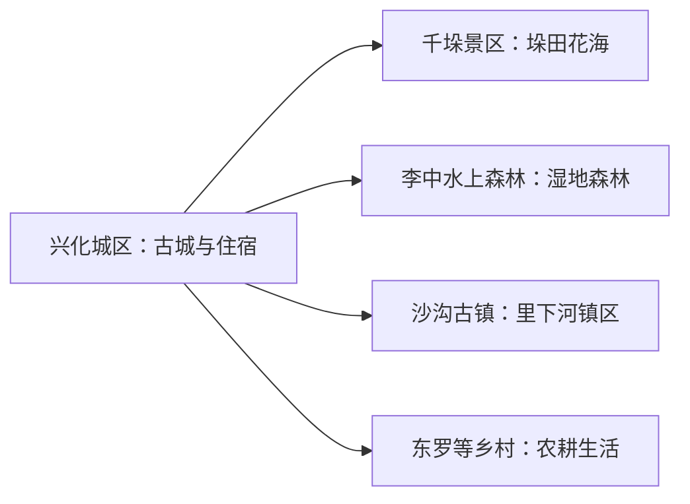
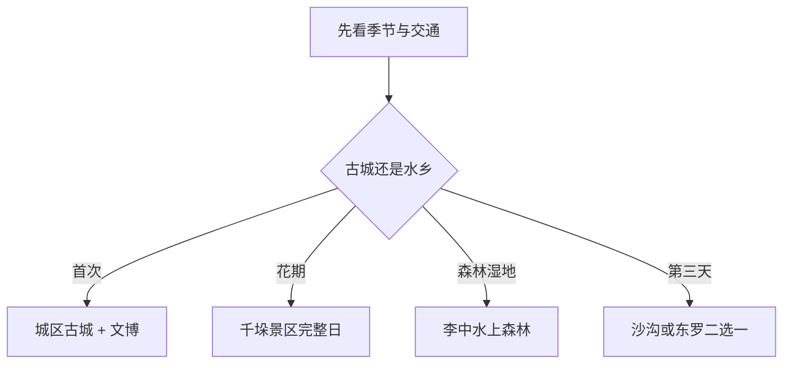

# 兴化旅行指南

兴化的核心体验是“古城与垛田水乡”：城区看金东门、地方文博与早茶，千垛景区和李中水上森林各自需要完整时段，沙沟古镇、东罗村等适合作为第二条远线。花期很醒目，但四季都可以按历史、水网、湿地和乡村生活重新组合。

> 建议停留：2–3 天 
> 旅行关键词：千垛、李中水上森林、金东门、早茶、农业文化遗产、里下河 
> 主要体力：中等；花田和湿地步道较长 
> 最近研究：2026-08-13

## 城市速览

| 项目 | 旅行信息 |
|---|---|
| 主要旅行价值 | 古城文脉、垛田农业、水上森林和里下河水乡共同构成完整城市体验 |
| 建议停留 | 2 天覆盖城区与一条核心水乡线；3 天增加沙沟或乡村 |
| 较舒适季节 | 春季看菜花，秋季看丰收与花海，冬季可看芦花和水乡 |
| 预算特点 | 城区中低；景区票务、游船和县域车辆增加成本 |
| 步行强度 | 城区低至中，景区中等 |
| 主要天气风险 | 强降雨、雷暴、高温、雾、寒潮与水位变化 |
| 独行旅行 | 城区方便；景区日先定返程 |
| 亲子旅行 | 文博、双遗产科普与正规船游较适合 |
| 长者与低体力旅行 | 城区慢游，远线每次只选一个景区 |
| 无障碍信息 | 现代游客中心可咨询；老街、垛田、栈道和古镇设施连续性需向官方确认 |

## 城市格局与游览区域

兴化市是泰州市代管的县级市，法定代码 `321281`。固定 GeoNames `1784820` 为兴化主城居民点；Wikidata `Q1028116` 代表法定兴化市，`P1566` 连接另一条地点记录 `1789017`。城区以昭阳、垛田等街道为主，千垛景区和李中水上森林均在千垛镇方向但拥有独立入口，沙沟古镇和大纵湖等继续向西北展开。

| 区域 | 主要内容 | 怎么安排 | 与其他区域的关系 |
|---|---|---|---|
| 兴化城区 | 金东门、文博、早茶与城市水网 | 一天 | 住宿和交通基地 |
| 千垛景区 | 垛田农业、季节花海与游船 | 半日至一天 | 与水上森林同向但入口独立 |
| 李中水上森林 | 池杉水杉、水网、鸟类与栈道 | 半日至一天 | 可与千垛同日二选一或串联 |
| 沙沟古镇 | 古镇、水网和渔文化 | 独立半日至一天 | 适合作为第三天 |
| 东罗及乡村 | 农耕展陈、村落与民宿 | 有接待时半日至一天 | 与生产田地边界并存 |

## 主要景点

### 城区历史与公共文化

| 景点 | 区域 | 类型 | 主要看点 | 建议用时 | 室内外 | 体力 | 预约风险 | 天气影响 | 优先级 |
|---|---|---|---|---:|---|---|---|---|---|
| 金东门历史文化街区 | 昭阳街道 | 老街与历史建筑 | 城河、传统街巷和古城生活 | 2–3 小时 | 混合 | 中 | 中 | 中 | A |
| 兴化市博物馆及公共文化场馆 | 城区 | 博物馆 | 地方史、板桥文化、垛田与当期展览 | 2–3 小时 | 室内 | 低 | 高 | 低 | A |
| 乌巾荡湿地公园开放区 | 城北 | 城市湿地 | 水网、公共绿地和城市休闲 | 1–2 小时 | 室外 | 低 | 低 | 高 | B |

### 垛田、森林与古镇

| 景点 | 区域 | 类型 | 主要看点 | 建议用时 | 室内外 | 体力 | 预约风险 | 天气影响 | 优先级 |
|---|---|---|---|---:|---|---|---|---|---|
| 千垛景区 | 千垛镇 | 农业文化景观 | 垛田、水网、花海与双遗产科普 | 4–6 小时 | 室外 | 中 | 高 | 很高 | A |
| 李中水上森林景区 | 千垛镇 | 湿地森林 | 池杉水杉、鸟类、栈道与船筏 | 3–5 小时 | 室外为主 | 中 | 高 | 很高 | A |
| 沙沟古镇 | 沙沟镇 | 水乡古镇 | 镇区街巷、渔文化和里下河生活 | 3–5 小时 | 混合 | 中 | 高 | 高 | B |
| 东罗村正式游览与展陈 | 千垛镇 | 乡村与农业 | 垛田耕作、村史和当期民宿活动 | 半日 | 混合 | 中 | 很高 | 高 | B |
| 徐马湿地等季节开放点 | 千垛镇周边 | 湿地与观鸟 | 芦花、鸟类和季节摄影 | 半日 | 室外 | 中 | 很高 | 很高 | C |

千垛景区与李中水上森林是两个独立景区，同日串联时也各自核对票务和船艇。垛田是持续生产的农业文化遗产，游览以景区步道、船线和公开村道为主；湿地、灌排设施、农田和养殖水面遵循保护及作业安排。

## 美食与餐饮

| 菜品或餐饮类型 | 常见区域 | 一个人用餐与常见份量 | 风味、过敏原与饮食限制 | 排队风险与替代方法 |
|---|---|---|---|---|
| 兴化早茶 | 城区 | 干丝、面点和面食可按小份组合 | 小麦、蛋、猪肉、虾蟹和豆制品常见 | 热门店排队时找普通早茶店 |
| 鱼汤面与水乡面点 | 城区、古镇 | 一碗一人份 | 鱼汤、猪油、小麦和葱姜需确认 | 早餐时段错峰 |
| 河蟹、鱼虾与里下河水产 | 城区、景区 | 多为共享份量 | 甲壳类、鱼类和酒类风险高 | 先问时价、重量和加工费 |
| 芋头、藕与水乡时蔬 | 城区、乡村 | 小份或拼盘较易尝试 | 酱料可能含豆类、芝麻和花生 | 选择明码标价的家常菜馆 |

## 经典行程

### 一日经典路线

**路线**：兴化早茶 → 市博物馆 → 金东门 → 午休 → 乌巾荡短段

- **串联逻辑**：城区历史、饮食和公共文化集中，适合首次建立全貌。
- **预约锚点**：先确认博物馆开放。
- **休息安排**：午间在金东门或城区餐饮区长休。
- **时间不足时**：保留早茶、博物馆和金东门。

### 两日城市路线

**第 1 天**：城区早茶、文博与金东门 
**第 2 天**：千垛景区或李中水上森林完整日

- **串联逻辑**：古城与大型景区分日，第二天按季节选一处。
- **预约锚点**：景区票务、船艇和返程。
- **休息安排**：连续住城区，景区内安排午餐与长休。
- **时间不足时**：第二天只保留一个核心景区。

### 三日深度路线

**第 1 天**：兴化城区 
**第 2 天**：千垛景区 → 李中水上森林二选一或条件允许时串联 
**第 3 天**：沙沟古镇或东罗村

- **串联逻辑**：城市、核心水乡和乡村古镇各自成日。
- **预约锚点**：后两天分别核对接驳、开放和接待。
- **休息安排**：以城区为住宿基地，远线午休放在游客中心。
- **时间不足时**：删第三天，再把第二天收敛为一个景区。

### 雨天路线

**路线**：兴化早茶 → 博物馆及公共文化场馆 → 午餐 → 金东门有遮蔽短段

- **适用条件**：普通降雨可行；暴雨、雷暴和积水时以室内为主。
- **预约锚点**：场馆临时开放和街区活动。
- **休息安排**：午间与下午均在城区室内休息。
- **时间不足时**：保留早茶与一个场馆。

### 亲子或低体力路线

**亲子路线**：博物馆双遗产科普 → 午餐 → 李中水上森林适龄短线 
**低体力路线**：早茶 → 博物馆 → 车辆到金东门近端 → 长休

- **减负方式**：亲子线只选一个远郊景区；低体力线减少船艇、长栈道和连续石板路。
- **预约锚点**：儿童船艇规则、电梯、轮椅和入口距离。
- **休息安排**：游客中心或城区室内承担长休。
- **时间不足时**：两类路线都保留城区文博。

### 远郊一日路线

**路线**：兴化城区 → 千垛景区 → 午餐与休息 → 李中水上森林或东罗村二选一 → 返回

- **适用条件**：自驾或接驳明确，景区开放时间足以覆盖两段。
- **预约锚点**：票务、游船、停车和返程。
- **休息安排**：在两个景区之间安排完整午休。
- **时间不足时**：删后半段，只完整游览千垛。

## 住宿区域

| 区域 | 优点 | 缺点 | 适合人群 | 交通特点 |
|---|---|---|---|---|
| 兴化城区 | 早茶、餐饮、住宿和客运方便 | 与千垛仍需车辆 | 首访、无车与多日旅行 | 适合作所有远线基地 |
| 千垛镇与景区周边 | 靠近花田、水上森林和乡村 | 季节价格与供应波动 | 摄影、自驾和早晚景观 | 先确认景区入口与接驳 |
| 沙沟或乡村民宿 | 可慢游古镇乡村 | 夜间交通选择少 | 已落实接待的深度旅行者 | 适合单方向住宿，不兼顾全市 |

## 市内交通

兴化城区承担公路客运与住宿，千垛、水上森林、沙沟等方向需要公交、旅游接驳、自驾或合规预约车。景区之间地图距离不大，也要按实际入口、乡村道路和返程时间安排。

| 场景 | 建议与取舍 | 行前需要重查的内容 |
|---|---|---|
| 从泰州等地抵达 | 先到兴化城区落脚 | 客运站、上下车点和末班 |
| 城区游览 | 步行加公交或短途车辆 | 街区施工与活动管制 |
| 千垛与水上森林 | 接驳、自驾或预约车 | 花期拥堵、停车、船艇与返程 |
| 沙沟及乡村 | 每天只选一个方向 | 班次、接待和夜间返城 |

## 不同旅行者须知

| 旅行维度 | 可行条件 | 主要取舍 | 需额外核对 |
|---|---|---|---|
| 独行旅行 | 住城区并预定远线交通 | 每天只走一条县域线 | 末班和夜间上客点 |
| 亲子旅行 | 文博和正规船游规则明确 | 景区日控制项目数量 | 救生装备、身高和卫生间 |
| 长者或低体力旅行 | 城区加一个景区短线 | 花田和森林长步道取舍 | 观光车、轮椅和座椅 |
| 无障碍需求 | 现代游客中心可咨询 | 老街、栈道和船艇转换较多 | 设施连续性需向官方确认 |
| 摄影旅行 | 花田、水杉、芦花和古镇题材丰富 | 服从农事和保护安排 | 无人机、三脚架和商业拍摄 |
| 特殊天气 | 城区室内可替换 | 强对流和高水位时减少船游 | 预警、闭园、停航和道路积水 |

## 行前核对

| 核对事项 | 为什么需要重查 | 建议核对时间 | 官方入口 |
|---|---|---|---|
| 千垛花期、票务与游船 | 花期、水位和客流逐年变化 | 订住宿前及当天 | [兴化市人民政府](https://www.xinghua.gov.cn/) |
| 李中水上森林 | 船筏、栈道和维护会调整 | 出发前一周及当天 | [兴化市文旅资讯](https://www.xinghua.gov.cn/) |
| 公共文化与古镇 | 场馆、活动和节假日时段会变 | 到访前一日 | [兴化市政府开放景点问答](https://www.taizhou.gov.cn/zmhd/dwzsk/wtly/art/2024/art_a479f9ba76374a23960613bc1e597059.html) |
| 公路与景区接驳 | 班次、拥堵和停车会变 | 出发前一周及当天 | [泰州市交通运输局](https://jtj.taizhou.gov.cn/) |
| 天气与水情 | 强降雨、雾和高水位影响户外 | 出发前三日及当天 | [江苏省气象局](http://js.cma.gov.cn/) |

## 来源与更新记录

### 主要来源

| 来源 | 类型 | 支持内容 | 核验日期 |
|---|---|---|---|
| [兴化市2026年政府工作报告](https://www.xinghua.gov.cn/fdzdgknr/zyhy/zfgzbg/art/2026/art_29faa68072a441f1a80317f6b4996231.html) | 市政府 | 核心景区、四季旅游和乡村方向 | 2026-08-13 |
| [兴化市开放旅游景点问答](https://www.taizhou.gov.cn/zmhd/dwzsk/wtly/art/2024/art_a479f9ba76374a23960613bc1e597059.html) | 政府公开答复 | 金东门、千垛、李中、沙沟等独立地点 | 2026-08-13 |
| [兴化水乡农文旅资料](https://www.xinghua.gov.cn/xwzx/xhxc/art/2024/art_4c25a83d5d274b578eebc50b1647781d.html) | 市政府 | 李中水上森林与一号水路 | 2026-08-13 |
| [兴化春季文旅调研](https://www.xinghua.gov.cn/xwzx/jrxh/art/2026/art_e9cad860d0bb4005a2b563f9924cf390.html) | 市政府 | 千垛、水上森林、沙沟、东罗和城区组合 | 2026-08-13 |
| [江苏省政府：千垛菜花旅游季](https://www.jiangsu.gov.cn/art/2024/3/27/art_84324_11205336.html) | 省政府 | 千垛花海和农业文化遗产 | 2026-08-13 |
| [江苏省司法厅：兴化法治文化路线](https://sft.jiangsu.gov.cn/art/2025/3/26/art_48514_11525336.html) | 省司法厅 | 水上森林、千垛、东罗与水路线索 | 2026-08-13 |
| [联合国粮农组织：兴化垛田](https://www.fao.org/giahs/giahs-around-the-world/china-xinghua/en) | 国际组织 | 全球重要农业文化遗产与生产属性 | 2026-08-13 |
| [GeoNames 1784820](https://www.geonames.org/1784820/xinghua.html) | 开放地名数据 | 固定主城点 | 2026-08-13 |
| [Wikidata Q1028116](https://www.wikidata.org/wiki/Q1028116) | 开放结构化数据 | 法定兴化市实体与P1566粒度 | 2026-08-13 |

### 更新记录

| 日期 | 更新内容 |
|---|---|
| 2026-08-13 | 首次完成兴化古城、垛田、水上森林、乡村路线与农业保护边界研究 |
