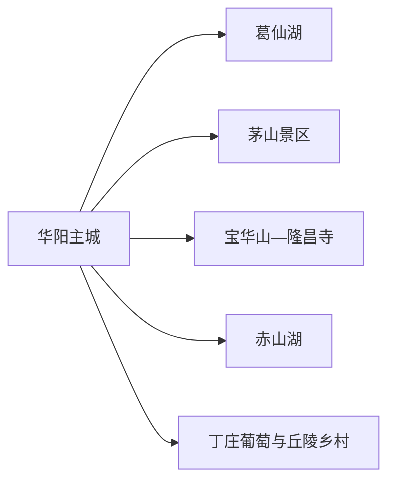
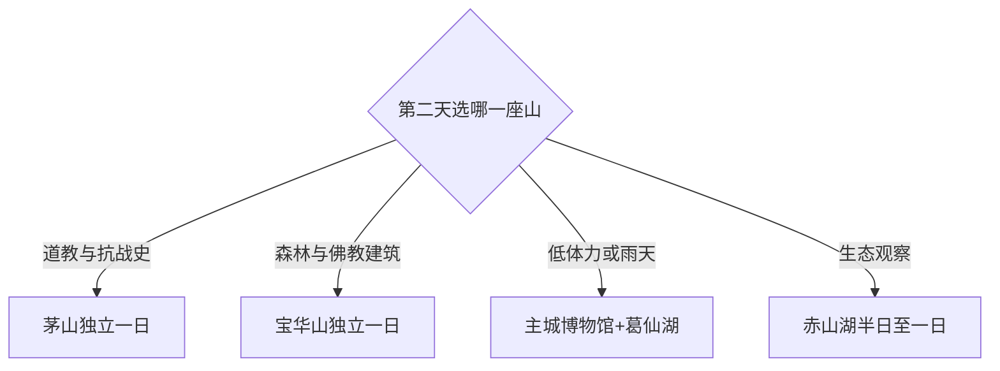

# 句容旅行指南

句容位于南京与镇江之间，核心吸引力是茅山、宝华山、赤山湖与丘陵农业。固定 **Huayang / GeoNames 8394463** 指向句容县级市驻地华阳一带，本页用主城的住宿、餐饮、场馆和交通承接该记录，并把两座名山各作为独立一日目的地。

## 城市速览

| 项目 | 信息 |
|---|---|
| 主线 | 华阳主城—葛仙湖—茅山或宝华山二选一 |
| 停留 | 主城加一座名山2天；赤山湖或农业主题再加1天 |
| 住宿 | 华阳主城适合综合交通；茅山、宝华山适合早进山和度假 |
| 交通 | 句容站与区域公路接入，景区间距离大，按单一方向安排 |
| 风险 | 山林火险、雷雨大风、石阶湿滑、宗教礼仪与自然保护边界 |

## 城市格局与游览区域

华阳主城是食宿和换乘中心；茅山位于东南方向，以道教宫观和抗战纪念为主；宝华山位于西北方向，以森林、隆昌寺和千华古村运营区为主。两山分处不同方向，各自需要半日至一天。赤山湖、葛仙湖和葡萄产区适合作为季节性补充。

## 主要景点

| 景点 | 区域 | 类型 | 核心体验 | 用时 | 环境 | 体力 | 研究价值 | 拥挤 | 优先级 |
|---|---|---|---|---:|---|---|---|---|---|
| 茅山景区 | 茅山 | 山岳宗教 | 九霄万福宫、元符万宁宫与道教文化 | 1天 | 混合 | 中高 | 很高 | 节假日高 | A |
| 新四军纪念馆与苏南抗战胜利纪念碑 | 茅山 | 纪念场所 | 苏南抗战史与山地纪念空间 | 2–3小时 | 混合 | 中 | 很高 | 团体时高 | A |
| 宝华山国家森林公园 | 宝华镇 | 山林 | 森林步道、地貌与自然观察 | 半天至1天 | 室外 | 中高 | 高 | 节假日高 | A |
| 隆昌寺 | 宝华山 | 宗教建筑 | 律宗传统、寺院建筑与山林格局 | 1–2小时 | 混合 | 中 | 很高 | 法会时高 | A |
| 千华古村运营区 | 宝华山下 | 文旅街区 | 明清风格商业街与演艺 | 1–2小时 | 混合 | 低中 | 中 | 节假日高 | B |
| 赤山湖国家湿地公园 | 郭庄方向 | 湿地 | 湖泊、湿地生态和季节鸟类 | 3–4小时 | 室外 | 中 | 高 | 周末中 | B |
| 葛仙湖公园 | 华阳主城 | 城市公园 | 湖区慢行与城市休息 | 1–2小时 | 室外 | 低 | 中 | 周末中 | B |
| 丁庄葡萄产区公开体验点 | 茅山镇 | 农业体验 | 葡萄种植、季节采摘与乡村景观 | 2–3小时 | 室外 | 低中 | 高 | 采摘季高 | B |
| 句容市博物馆 | 主城 | 博物馆 | 地方史与文物展陈 | 1–2小时 | 室内 | 低 | 高 | 团体时中 | B |

## 美食与餐饮

茅山老鹅、当地茶果、时令葡萄和江南家常菜适合按片区选择。老鹅盐分较高，可先问份量；葡萄采摘按园方划定区域、价格和称重方式进行。宗教场所周边的素食需确认营业与供餐时段，严重过敏者继续询问花生、芝麻、大豆和共用锅具。

## 经典行程

### 一日基础线
**路线**：句容市博物馆—主城午餐—葛仙湖—城市商业区。**逻辑**：先建立县级市框架，再用湖区休闲。**预约锚点**：博物馆。**休息**：主城。**删除条件**：高温雷雨时删湖区。

### 茅山一日线
**路线**：游客中心—核心宫观—午间坐休—新四军纪念主题点。**逻辑**：把宗教文化与抗战史分层阅读。**预约锚点**：门票、接驳与宫观开放。**休息**：景区服务区。**删除条件**：大风雷雨、森林管制时缩短山线。

### 宝华山一日线
**路线**：森林公园—隆昌寺公开区—千华古村运营区。**逻辑**：由自然环境进入真实寺院，再辨认当代商业街。**预约锚点**：景区与寺院公告。**休息**：山门服务区。**删除条件**：步道湿滑时保留山脚与开放建筑。

### 赤山湖生态线
**路线**：主城—赤山湖游客区域—观鸟或环湖短段—返城。**逻辑**：围绕湿地完成单主题。**预约锚点**：水位、开放区与观鸟季。**休息**：游客中心。**删除条件**：强风、暴雨或生态封闭时改主城。

### 葡萄季乡村线
**路线**：官方推荐采摘点—镇区午餐—茅山湖或乡村公共空间。**逻辑**：用一处正规园区体验农业。**预约锚点**：成熟期、价格与接待。**休息**：园区服务区。**删除条件**：非产季或田间作业时取消采摘。

### 亲子低体力线
**路线**：博物馆—午休—葛仙湖近入口。**逻辑**：室内展陈配平缓绿地。**预约锚点**：亲子活动与无障碍入口。**休息**：每站坐休。**删除条件**：高温时保留室内。

### 雨天线
**路线**：博物馆—主城餐饮—已确认开放的室内文化点。**逻辑**：减少山路和湖岸暴露。**预约锚点**：馆舍开放。**休息**：主城商业。**删除条件**：强对流时提前返宿。

## 住宿区域

华阳主城适合铁路、公路、餐饮和跨方向换乘；茅山住宿适合宫观与抗战史主题；宝华山住宿适合森林和隆昌寺早间路线。只游一座山时住对应景区，连续游两座山时比较换宿和回主城的总时间。

## 市内交通

句容站和区域公路构成主要入口，主城到茅山、宝华山、赤山湖分属不同方向。景区接驳和旅游专线会随季节调整，订房前核对首末班。山林防火区、自然保护区域、寺院生活区和葡萄生产田块按管理标识与经营方许可进入。

## 不同旅行者须知

宗教文化旅行者优先茅山或隆昌寺；抗战史兴趣者把纪念馆与纪念碑纳入茅山日；自然观察者选择宝华山或赤山湖；长者和低体力旅行者以主城、景区接驳和少量步行为主。

## 行前核对

- 核对茅山、宝华山、赤山湖的门票、接驳、开放线路和天气。
- 核对宫观寺院法会、着装、摄影和殿堂开放要求。
- 山林火险期、生态封闭区和农业生产区遵守明确限制。

## 来源与更新记录

| 来源 | 支持内容 | 核验日期 |
|---|---|---|
| [句容市政府：游](https://www.jurong.gov.cn/jurong/tour/201902/afaa408b9980415a96a221a7ff28025f.shtml) | 茅山、宝华山、隆昌寺与核心文化属性 | 2026-09-01 |
| [句容市政府：行](https://www.jurong.gov.cn/jurong/going/202211/705135aec3894d10b03741ea87178674.shtml) | 两山景区结构与公开游览点 | 2026-09-01 |
| [句容市十五五规划](https://www.jurong.gov.cn/jurong/c100278/202608/d1f40fd79490458ea864d9b0856574df.shtml) | 两山三湖、交通集散与当前文旅格局 | 2026-09-01 |
| [GeoNames 8394463](https://www.geonames.org/8394463/) | Huayang 固定人口点与位置 | 2026-09-01 |

| 日期 | 更新 |
|---|---|
| 2026-09-01 | 首次完成句容旅行研究；明确华阳驻地记录与句容县级市页面关系。 |
