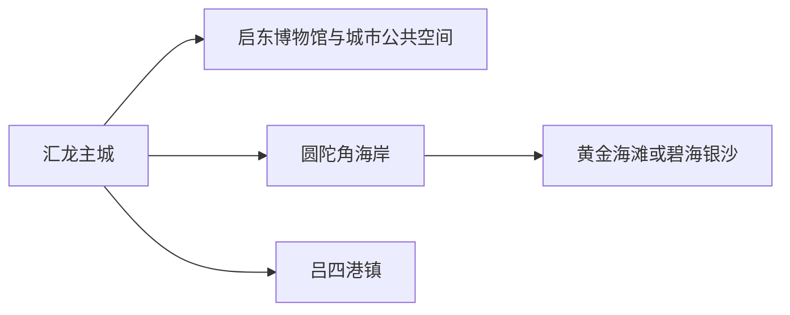
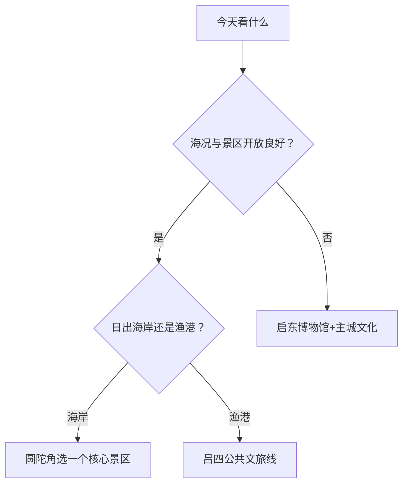

# 启东旅行指南

启东位于长江入海口北岸，适合把主城、圆陀角海岸和吕四港分开安排。主城承担住宿与公共文化，圆陀角以日出、海滩和江海景观为主，吕四港则连接渔港文化、海鲜餐饮与现实港区生产。海岸项目受潮汐、大风、雷电和运营状态影响，先锁定开放与返程，再决定当天体验。

## 城市速览

| 项目 | 信息 |
|---|---|
| 旅行主线 | 江海日出、圆陀角海岸、吕四渔港、主城文博与海洋产业 |
| 建议停留 | 1 天主城或圆陀角二选一；2 天加入另一片区；3 天再去吕四 |
| 住宿基地 | 启东主城；日出行程可选圆陀角正规住宿 |
| 步行强度 | 主城低，海岸中等，景区内部距离依运营交通而变 |
| 主要天气 | 台风、风暴潮、海上大风、雷电、强降雨、高温与冬季湿冷 |
| 潮汐提示 | 赶海、滩涂和日出体验按景区公告、潮汐与安全区选择 |
| 亲子 | 博物馆、正式海滩和游客中心活动较合适 |
| 低体力 | 选择有观光交通和近入口休息点的海岸短线 |
| 生产边界 | 吕四港、船厂、风电装备、渔船作业与滩涂养殖按生产管理 |
| 无障碍 | 设施连续性需向官方确认，核对沙滩、栈道、景区车与卫生间 |

## 城市格局与游览区域

启东市是南通市代管县级市，代码 `320681`。固定 GeoNames `1806840` 为汇龙街道一带主城驻地点；Wikidata `Q713340` 代表法定启东市，`P1566=1798079` 连接另一城市记录。两者粒度不同，本页以固定候选点建页，以法定代码界定市域。

| 区域 | 旅行价值 | 怎么安排 |
|---|---|---|
| 汇龙主城 | 住宿、餐饮、公共文化与城市服务 | 抵达日、雨天、多日基地 |
| 圆陀角 | 日出、海岸、湿地与度假项目 | 完整半日至一日，只选一组相邻项目 |
| 吕四港镇 | 渔港文化、海鲜与港口城市生活 | 白天专程前往，避开生产作业区 |
| 启隆方向 | 崇明岛北部飞地与乡村休闲 | 先核属地交通与接待，按独立远线安排 |

## 主要景点

### 主城与江海文化

| 景点 | 所在区域 | 类型 | 核心看点 | 建议用时 | 室内/室外 | 体力 | 预约难度 | 天气敏感度 | 适合旅程 |
|---|---|---|---|---|---|---|---|---|---|
| 启东博物馆 | 汇龙主城 | 地方史与海洋文化 | 沙地成陆、江海文明、城市发展与当期展览 | 1.5–2.5 小时 | 室内 | 低 | 中 | 低 | A |
| 主城公共文化与滨水空间 | 汇龙主城 | 城市休闲 | 城市生活、河网与公共活动 | 1–2 小时 | 混合 | 低 | 低 | 中 | B |
| 启东版画等公共文化展示 | 主城 | 艺术与非遗 | 版画、评弹及当期公共文化活动 | 1–2 小时 | 室内 | 低 | 中 | 低 | B |

### 海岸与港镇

| 景点 | 所在区域 | 类型 | 核心看点 | 建议用时 | 室内/室外 | 体力 | 预约难度 | 天气敏感度 | 适合旅程 |
|---|---|---|---|---|---|---|---|---|---|
| 黄金海滩景区 | 圆陀角 | 海岸、湿地与滩涂 | 江海岸线、湿地、日出与当期开放体验 | 4–6 小时 | 室外 | 中 | 高 | 极高 | A |
| 碧海银沙正式开放区 | 圆陀角 | 人工沙滩与度假 | 沙滩、水上活动和度假服务 | 4–6 小时 | 室外 | 中 | 高 | 极高 | B |
| 圆陀角江海景观大道公共段 | 圆陀角 | 海岸景观 | 江海交汇背景、堤岸与相邻景点连接 | 2–4 小时 | 室外 | 中 | 中 | 极高 | B |
| 吕四港镇公共文旅区 | 吕四港镇 | 渔港文化与海鲜 | 渔港历史、镇区生活、公开餐饮与海洋文化 | 3–5 小时 | 混合 | 中 | 中 | 高 | B |

黄金海滩、碧海银沙和景观大道是相邻但分别运营的项目，可按门票、开放和天气选择一组。海堤、滩涂、港池、码头、船厂和海上风电装备基地承担防洪或生产功能，旅行活动在明确开放区内完成。

## 美食与餐饮

| 类型 | 适合场景 | 份量 | 过敏与饮食提示 | 选择方法 |
|---|---|---|---|---|
| 吕四海鲜 | 港镇或主城正餐 | 多按重量、适合分享 | 贝类、甲壳类、鱼刺、加工费 | 下单前确认品种、重量、单价和做法 |
| 文蛤与江海小鲜 | 季节餐饮 | 一盘适合分享 | 贝类过敏、泥沙、禁捕期与来源 | 选证照清楚、明码标价餐馆 |
| 启东圆子与沙地小吃 | 早餐、加餐 | 一人份或小份 | 糯米、糖、猪油、芝麻与坚果 | 先少量尝试，问甜咸馅料 |
| 海鲜面与家常面食 | 简餐 | 一人份 | 小麦、海鲜、蛋和高钠汤底 | 先问海鲜种类和汤底 |

## 经典行程

### 一日经典路线

**路线**：启东博物馆 → 主城午餐 → 公共文化或滨水短线 → 主城晚餐

- **串联逻辑**：先理解沙地成陆与江海城市背景，再看当代城市生活。
- **预约锚点**：博物馆开放与当期展览。
- **休息安排**：午餐长休，下午路线可随时结束。
- **时间不足时**：只留博物馆与一顿地方餐饮。

### 两日城市路线

**第 1 天**：主城文化线 
**第 2 天**：圆陀角黄金海滩或碧海银沙二选一 → 海岸公共段 → 返回

- **串联逻辑**：城市史与海岸体验分日，海岸日只选一个核心项目。
- **预约锚点**：门票、日出开放、潮汐、水上项目和返程。
- **休息安排**：海岸日使用正式游客中心和室内餐饮。
- **时间不足时**：只保留一个海岸景区，不再延伸吕四。

### 三日深度路线

**路线**：主城 → 圆陀角 → 吕四港镇公共文旅区

- **串联逻辑**：主城、度假海岸与生产型港镇分别认识。
- **预约锚点**：吕四公开接待、餐饮价格与返程车辆。
- **休息安排**：港镇午餐后安排室内休息。
- **时间不足时**：删除吕四，不把两条海岸远线压在一天。

### 雨天路线

**路线**：启东博物馆 → 室内午餐 → 版画或公共文化展示 → 返回住宿

- **适用条件**：普通降雨且场馆开放。
- **串联逻辑**：全部留在主城，避开潮湿海岸和大风暴露。
- **预约锚点**：闭馆日、临展与强对流预警。
- **休息安排**：场馆座椅与午餐。
- **时间不足时**：只留博物馆。

### 亲子与低体力路线

**亲子路线**：启东博物馆 → 午餐 → 正式海滩近入口适龄项目 
**低体力路线**：主城场馆 → 长休 → 车辆到达海岸游客中心短停

- **适用条件**：海岸活动按年龄、救生和天气选择。
- **串联逻辑**：把学习与短时江海体验组合，保留快速撤回条件。
- **预约锚点**：救生、轮椅、婴儿车、景区车与卫生间。
- **休息安排**：海岸前先完成室内长休。
- **时间不足时**：只留主城场馆。

### 日出或吕四主题路线

**日出线**：圆陀角正规住宿 → 官方开放观景点 → 早餐与休息 → 海岸短线 
**吕四线**：主城 → 吕四港镇公共文旅区 → 海鲜午餐 → 返回

- **适用条件**：日出线看天气、潮汐和最早开放；吕四线看公开接待和返程。
- **串联逻辑**：两条路线各自完整，按兴趣二选一。
- **预约锚点**：住宿、观景入口、餐饮计价、车辆和末班。
- **休息安排**：日出后回住宿休息；吕四午餐后长休。
- **时间不足时**：日出线删后续海岸，吕四线删镇外延伸。

## 住宿区域

| 区域 | 优点 | 取舍 | 适合人群 | 核对项 |
|---|---|---|---|---|
| 汇龙主城 | 餐饮、住宿和叫车稳定 | 到海岸需公路往返 | 首访、无车、多日 | 停车、早餐、夜间入住 |
| 圆陀角正规度假住宿 | 便于日出和海岸项目 | 价格、餐饮与退订受旺季影响 | 海岸度假、亲子 | 实际景区入口、营业、接驳与退改 |
| 吕四港镇正规住宿 | 便于港镇慢游与早市 | 与圆陀角、主城距离较远 | 海鲜与渔港主题 | 证照、噪声、停车、返程 |

## 市内交通

启东通过公路与铁路客运联通南通、上海方向，具体到发站与跨江线路持续建设和调整。主城、圆陀角与吕四之间以公交、出租车、网约车、自驾或合规包车连接。

| 场景 | 怎么做 | 核对项 |
|---|---|---|
| 跨城到达 | 按车票和运营公告确认实际站点 | 到发站、换乘、末班、施工 |
| 主城移动 | 公交结合叫车 | 首末班、活动管制 |
| 圆陀角 | 先锁景区入口再导航 | 停车、景区车、潮汐、返程 |
| 吕四港镇 | 白天往返或当地正规住宿 | 客运、叫车、港区道路和夜返 |

## 不同旅行者须知

| 旅行者 | 推荐做法 | 重点核对 |
|---|---|---|
| 独行 | 住主城，海岸日前锁定返程 | 夜间叫车、末班、通信 |
| 亲子 | 博物馆加正式海滩适龄项目 | 救生、潮汐、防晒、卫生间 |
| 长者与低体力 | 景区车与游客中心短线 | 沙地、栈道、座椅、轮椅 |
| 摄影 | 日出只选正式观景点 | 天气、潮汐、无人机、海堤管理 |
| 海鲜爱好者 | 先定预算与品种再下单 | 重量、时价、加工费、过敏 |

## 行前核对

- 启东市政府、文旅和景区：开放、门票、日出、活动与交通。
- 海洋、气象和应急部门：潮汐、台风、风暴潮、雷电、海上大风。
- 黄金海滩、碧海银沙：入口、水上项目、救生、景区车与退改。
- 交通运营方：跨城到发、主城—海岸—吕四班次与末班。

## 来源与更新记录

| 来源 | 支持内容 | 核验日期 |
|---|---|---|
| [启东市人民政府](https://www.qidong.gov.cn/) | 市情、文旅、交通和动态入口 | 2026-08-13 |
| [启东市2024年统计公报](https://www.qidong.gov.cn/qdsrmzf/gmjj/content/b2754f5c-07e8-4865-9340-727ecc5b9dec.htm) | 文旅接待、公共文化、交通与产业背景 | 2026-08-13 |
| [南通市政府：圆陀角旅游度假区](https://www.nantong.gov.cn/ntsrmzf/sxcz/content/0bd70d96-8697-447a-966a-2926588b3c78.htm) | 黄金海滩、碧海银沙和海岸项目关系 | 2026-08-13 |
| [生态环境部：圆陀角岸段](https://www.mee.gov.cn/home/ztbd/2021/mlhwyxalzjhd/algs/jss/202109/t20210906_900691.shtml) | 海岸生态、滩涂、景观大道与保护治理 | 2026-08-13 |
| [Wikidata Q713340](https://www.wikidata.org/wiki/Q713340) | 法定启东市与另一 `P1566` 记录 | 2026-08-13 |
| [GeoNames 1806840](https://www.geonames.org/1806840/) | 固定汇龙驻地点 | 2026-08-13 |

| 日期 | 更新 |
|---|---|
| 2026-08-13 | 首次完成启东主城、圆陀角、吕四与江海安全边界研究。 |
