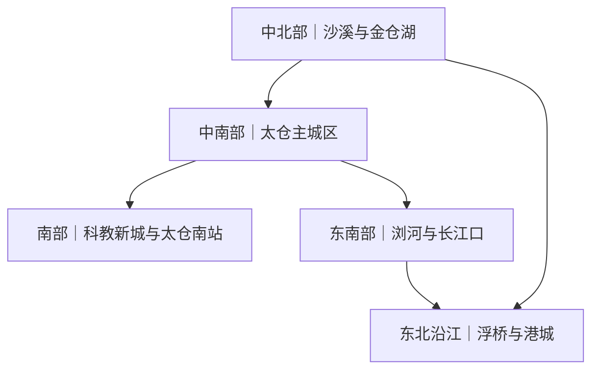

# 太仓旅行指南

太仓位于长江口南岸，是江苏省苏州市管辖的县级市。这里既有娄东文化、江南园林和沙溪水乡，也有以刘家港、浏河和郑和下西洋为线索的海运记忆。太仓南接上海，但不属于上海市域；它虽属苏州，主城区也不与苏州古城连续。市区、沙溪、浏河和港区彼此分散，适合按片区分日游览。

> 建议停留：2–3 天；只看主城区可压缩为 1 天 
> 旅行关键词：娄东文化、郑和航海、江南园林、沙溪古镇、长江口、港口城市 
> 主要体力：主城区中低强度；古镇、湿地和跨片区日为中等步行 
> 最近研究：2026-07-31

## 城市速览

| 维度 | 概况 |
|---|---|
| 主要旅行价值 | 在一座临江县级市内同时认识娄东画派与地方文脉、郑和航海和刘家港历史、江南古镇、园林以及现代港口城市的空间关系。 |
| 行政与旅行边界 | 太仓由苏州市管辖，法定县级市代码为 `320585`。本页只收录太仓市域内容，不把苏州古城、昆山或上海嘉定和宝山的景点并入。 |
| 建议停留 | 1 天可完成主城区文博与园林；2 天可增加沙溪；3 天可再选浏河长江口或港区郑和主题。港区和浏河不宜作为主城区半日顺路点。 |
| 较适宜季节 | 春、秋通常更适合古镇和滨水步行。梅雨期湿滑，盛夏高温高湿，夏秋还需关注台风外围影响、雷暴大风和长江沿岸临时管制。 |
| 预算特点 | 主城区公园和公共文化空间可控制支出；古镇内部场馆、商业度假项目、跨片区用车和郊区住宿会增加成本。 |
| 步行与体力 | 市区单个园林或文化场馆体力较低；沙溪石板路、浏河滨水段和湿地长线为中等强度。各片区之间不能连续步行。 |
| 主要天气风险 | 梅雨和短时强降雨可能造成路滑、积水与户外项目关闭；高温、高湿、江风和台风影响会改变滨江行程。 |
| 独行旅行 | 主城区和沙溪的白天游览、面点简餐较方便；港区、湿地远端和夜间返程应预先锁定交通，不进入非游览生产区域。 |
| 亲子旅行 | 博物馆、公园、古镇和商业室内项目可以组合；水边、古桥、游船、冰雪或户外活动需分别核对年龄、身高和陪同规则。 |
| 长者与低体力旅行 | 可采用“单一场馆加园林短线、车辆点到点接驳”；不宜一天跨主城、沙溪和浏河三个片区。 |
| 无障碍条件 | 公开资料不足以证明车站、道路、园林、古镇、湿地和酒店之间存在连续无障碍路线。轮椅借用、电梯入口、卫生间和车辆接驳均需向运营方确认。 |

## 城市格局与游览区域

太仓市域呈南北展开，东侧临长江，南侧与上海嘉定、宝山相邻。太仓的“临沪”是区域交通和地理关系，不等于身处上海城区；“苏州太仓”也不等于从苏州古城步行或短程地铁即可到达。旅行时应先确定当天片区，再选择铁路站和接驳方式。

下图只表示相对方位和分日关系，连线不代表存在单一公交直达。

| 片区 | 主要内容 | 游览特点 | 与其他片区的关系 |
|---|---|---|---|
| 主城区：城厢—娄东 | 太仓博物馆、南园、弇山园、宋文治艺术馆、元代三桥及城市餐饮 | 场馆与园林可用公交或短途车辆串联；同一园内可连续步行 | 首访和住宿最稳妥的基地；与铁路站、沙溪、浏河均需接驳 |
| 科教新城—太仓南站 | 铁路门户、天镜湖一带公共空间、商业与室内度假设施 | 现代城市尺度较大，不是古城步行区 | 适合晚到、早走或室内活动；前往主城区仍需公交或车辆 |
| 沙溪—金仓湖 | 沙溪古镇、七浦塘水乡风貌、金仓湖及周边乡村 | 古镇适合半日至一日；金仓湖适合天气稳定时补充户外活动 | 位于主城区以北，可沿同一公交走廊安排，但不能把两处都排成满程长线 |
| 浏河—长江口 | 浏河古镇、天妃宫、江滩湿地及古港、郑和航海线索 | 历史街镇与滨江户外并存，受江风、降雨和开放范围影响 | 位于东南临江方向，适合独立一天；不属于上海，也不与主城区连续步行 |
| 浮桥—港城—太仓港 | 郑和公园及纪念馆、港城公共服务区、现代港口景观 | 郑和公园是可游览点；集装箱码头、石化码头和作业岸线是生产及口岸管理空间 | 位于东北沿江方向，去往浏河和主城都需公路交通；不得把导航可见的码头当作观景台 |

太仓港的“港区”既包括生活和公共服务空间，也包括受物理隔离、门禁和边检管理的限定区域。旅行活动应限于官方开放的公园、场馆、街区和步道；遇到围栏、岗亭、作业车辆通道或“口岸限定区域”标识即停止前行。不跨越岸线防护设施，也不在未明确开放的岸段游泳、涉水或垂钓；雷暴、台风和强对流预警时应离开岸线。

## 主要景点

优先级用于安排时间，不代表绝对排名：**A** 为首访核心，**B** 为按兴趣补充，**C** 为远端、商业性、季节性或通常需要独立半天以上的项目。车站、餐饮街和换乘点只作为路线节点，不列作独立景点。同一景区及其内部子景点只计一个项目。

### 主城区与娄东文化

| 景点 | 区域 | 类型 | 主要看点 | 建议用时 | 室内外 | 体力 | 预约风险 | 天气影响 | 优先级 |
|---|---|---|---|---:|---|---|---|---|---|
| 太仓博物馆 | 主城区 | 博物馆 | “圆仓”建筑、太仓建制与娄东文化、万丰古船等地方历史内容 | 2–3 小时 | 室内 | 低 | 中 | 低 | A |
| 南园 | 主城区 | 园林 | 王锡爵家园背景、王时敏与张南垣参与营造的园林传统，现园为重建后的游览空间 | 1.5–2 小时 | 混合 | 低至中 | 低 | 中 | A |
| 弇山园 | 主城区 | 园林与古迹 | 王世贞园邸线索、墨妙亭、铁釜、通海泉及重建园林景观 | 1.5–2 小时 | 室外为主 | 低至中 | 低 | 中 | B |
| 宋文治艺术馆（太仓名人馆） | 主城区 | 艺术馆与名人纪念 | 宋文治书画、娄东画派延续及太仓名人专题 | 1–1.5 小时 | 室内为主 | 低 | 中 | 低 | B |
| 元代三桥 | 主城区 | 桥梁与城市遗存 | 周泾桥、州桥、皋桥组成的元代石拱桥遗存组 | 1–1.5 小时 | 室外 | 低至中 | 低 | 高 | B |

### 沙溪与中北部

| 景点 | 区域 | 类型 | 主要看点 | 建议用时 | 室内外 | 体力 | 预约风险 | 天气影响 | 优先级 |
|---|---|---|---|---:|---|---|---|---|---|
| 沙溪古镇 | 沙溪 | 历史街镇 | 七浦塘两岸老街、临水建筑、古桥、生活型古镇和内部文史场馆 | 3–5 小时 | 混合 | 中 | 中 | 中至高 | A |
| 金仓湖 | 主城以北 | 湖泊与公园 | 湖面、草地、林地和休闲步道，适合把古镇日调整为“文化加户外” | 2–3 小时 | 室外 | 中 | 低 | 高 | B |

### 浏河、长江口与航海文化

| 景点 | 区域 | 类型 | 主要看点 | 建议用时 | 室内外 | 体力 | 预约风险 | 天气影响 | 优先级 |
|---|---|---|---|---:|---|---|---|---|---|
| 浏河古镇（含天妃宫） | 浏河 | 历史街镇与建筑 | 老街、妈祖信俗、刘家港与郑和下西洋起锚地的历史线索 | 3–4 小时 | 混合 | 中 | 中 | 中至高 | A |
| 江滩湿地公园 | 浏河 | 湿地与滨江景观 | 长江口岸线、湿地生态和开阔江景 | 1.5–3 小时 | 室外 | 中 | 低 | 高 | B |
| 郑和公园（含郑和纪念馆） | 港城 | 主题公园与纪念馆 | 现代滨江主题公园及郑和纪念馆，集中说明太仓与下西洋起锚地的联系 | 2–3 小时 | 混合 | 中 | 中 | 高 | B |

“长江口旅游度假区”是覆盖浏河多处资源的区域品牌，不另列为独立景点。浏河古镇与古镇游览线上的天妃宫合并为一个文化项目，江滩湿地公园单独列项；郑和纪念馆则计入郑和公园。几处点位都涉及江海文化，但空间和功能不同，不能因主题相近便视为相邻步行点。

### 现代休闲与天气备选

| 景点 | 区域 | 类型 | 主要看点 | 建议用时 | 室内外 | 体力 | 预约风险 | 天气影响 | 优先级 |
|---|---|---|---|---:|---|---|---|---|---|
| 阿尔卑斯国际度假区 | 科教新城 | 商业度假与室内活动 | 冰雪运动、餐饮、住宿和商业设施组成的一体化项目 | 3–6 小时 | 室内为主 | 低至中 | 高 | 低 | C |

商业度假项目的营业内容、票制和项目年龄限制变化较快，适合作为明确兴趣或普通降雨时的替代，不应挤占首次认识太仓历史文化的核心时间。

## 美食与餐饮

太仓饮食处在苏南江南风味范围内，口味通常偏鲜甜、重时令。双凤、沙溪、浏河和主城区各有较鲜明的餐饮场景。以下以菜品和区域为线索，不把单家热门店当作唯一选择。

| 菜品或餐饮类型 | 常见区域 | 一个人用餐与常见份量 | 风味、过敏原与饮食限制 | 排队风险与替代方法 |
|---|---|---|---|---|
| 双凤羊肉 | 双凤镇、主城区地方菜馆 | 白切或红烧常按份销售，一人可先问小份；羊肉面更适合单人 | 肉香浓，汤和蘸料可能含较多盐；不适合素食者 | 秋冬和美食活动期较拥挤，可在主城区寻找标明双凤风味的同类店 |
| 太仓肉松 | 主城区、浏河及特产销售点 | 适合小份购买或配粥点心，不必以大包装作为旅行餐 | 猪肉制品；成品可能含糖、酱油和小麦成分，需看标签 | 老字号售罄时可比较配料表和生产信息，不以单一品牌替代整类食品 |
| 双凤爊鸡 | 双凤、主城区熟食与地方菜馆 | 多为整只或切份，独行者先确认半份或外带 | 禽肉卤制，可能含酱油、香辛料和较高盐分 | 节假日熟食档排队较长，可改选同类卤味或提前购买 |
| 糟油风味菜 | 主城区江南菜馆 | 常作为冷菜或调味菜，适合多人分食；一人先问小份 | 带酒糟发酵香气；避免酒精或对发酵食品敏感者应先询问制作方式 | 菜单没有时不必追逐名店，可改选清蒸、白灼等本地时令做法 |
| 沙溪点心 | 沙溪古镇 | 猪油米花糖、桃珍糕、酒酿饼等便于少量尝试 | 可能含猪油、糯米、酒酿、芝麻或坚果；纯素、控糖和过敏者需逐项询问 | 热门摊位拥挤时，优先选择有明码标价和配料说明的同类店 |
| 浏河水产与江南家常菜 | 浏河镇 | 鱼虾常按条、按斤或合菜计价，一人需先确认重量和做法 | 甲壳类、鱼类过敏风险高；不购买来源不明的所谓“野生长江鱼” | 点菜前确认时价、重量和加工费；以合法养殖或可追溯水产替代营销噱头 |
| 苏式汤面与简餐 | 主城区、各镇中心 | 一碗一份，最适合独行和赶车日 | 浇头常含猪肉、鱼虾、蛋、花生或小麦；清淡不等于低盐 | 早餐和午餐高峰可能排队，可错峰寻找居民区同类面馆 |

季节食材如新毛芋艿、羊肉和部分水产并非全年稳定供应。具体餐厅是否营业、是否仍提供某道菜、价格和过敏原处理能力都应在就餐前确认。

## 经典行程

### 一日经典路线

**路线**：太仓博物馆 → 主城区午餐 → 南园 → 弇山园或宋文治艺术馆二选一

- **串联逻辑**：全天留在主城区，以地方历史作为认识城市的起点，再看一座园林；下午末段按天气和兴趣选择户外园林或室内书画。
- **预约锚点**：太仓博物馆；确定闭馆日、入馆方式和当期展厅后，再安排其余无需严格时段的点位。
- **休息安排**：市民广场、主城区商场或有固定座位的餐厅；园林只走主要水景和建筑轴线，不追求每条支路。
- **时间不足时**：先删弇山园与宋文治艺术馆中的一个；若只剩半天，保留博物馆和南园。

### 两日城市路线

**第 1 天**：太仓博物馆 → 南园 → 弇山园或宋文治艺术馆 
**第 2 天**：沙溪古镇 → 古镇午餐与休息 → 金仓湖短线 → 返回主城区

- **串联逻辑**：第一天理解建制、园林和娄东文化；第二天沿主城以北的同一方向看生活型水乡，返程时再决定是否增加湖区户外段。
- **预约锚点**：第一天为博物馆，第二天为沙溪古镇内部准备进入的收费或限时场馆；公交班次是第二天的返程锚点。
- **休息安排**：沙溪古镇有固定座位的餐饮空间；金仓湖只安排一段步道，不在无座户外连续停留。
- **时间不足时**：第二天先删金仓湖，完整保留沙溪；不要为补湖区而压缩返程余量。

### 三日深度路线

**第 1 天**：太仓博物馆 → 南园 → 主城区娄东文化场馆 
**第 2 天**：沙溪古镇 → 金仓湖短线 
**第 3 天**：浏河古镇（含天妃宫和古港线索） → 午餐 → 江滩湿地开放段 → 返回

- **串联逻辑**：三天分别处理主城区、北部水乡和东南长江口，不在同一天折返跨越市域。第三天把浏河古镇文化线与江滩湿地作为同一片区串联，仍按各自开放状态删减。
- **预约锚点**：第一天博物馆、第二天沙溪内部场馆、第三天湿地与文化点位的当日开放公告及返程交通。
- **休息安排**：主城区文化场馆、沙溪镇区餐厅、浏河古镇有座位的餐饮空间；滨江段不承担主要午休。
- **时间不足时**：第三天先删湿地长线，只保留古镇、天妃宫和一处江岸公共空间；若总行程只有两天，整段浏河日删除。

### 雨天路线

**路线**：太仓博物馆 → 主城区有座位午餐 → 宋文治艺术馆 → 商场或已预约的室内项目

- **适用条件**：适用于普通降雨；暴雨、雷暴大风、台风影响或积水预警时，应减少移动或取消非必要外出。
- **预约锚点**：两座文化场馆的闭馆日、临展和入馆方式；商业室内项目必须另行核对票制与时段。
- **休息安排**：文化场馆公共区和主城区商业空间，不把园林廊亭当作强降雨避险场所。
- **时间不足时**：保留太仓博物馆，删除第二场馆和跨区室内项目。

### 亲子或低体力路线

**亲子路线**：太仓博物馆 → 主城区午餐 → 南园主环线 → 市区公园短停 
**低体力路线**：太仓博物馆 → 车辆接驳 → 南园主要建筑与水景短线 → 有座位下午茶或返程

- **减负方式**：亲子路线不叠加湿地和长古街，水边持续看护；低体力路线按“一次室内、一次室外”控制总量，园林支路全部可删。
- **预约锚点**：博物馆入馆与儿童活动规则；轮椅、推车、无障碍入口和园林台阶情况需直接询问场馆。
- **休息安排**：博物馆公共区、正式餐厅和南园入口附近的可坐区域；先确认座椅与卫生间位置。
- **时间不足时**：两条路线都先删市区公园或下午茶外的延伸，只保留博物馆加南园短线。

### 远郊一日路线

**路线**：主城区 → 郑和公园（含郑和纪念馆） → 港城官方开放的公共餐饮或休息区 → 返回主城区

- **适用条件**：适合对航海史和现代港口城市感兴趣、已锁定往返车辆且天气稳定的旅行日；不以进入码头作业区为目标。
- **预约锚点**：郑和纪念馆开放日和入馆规则、郑和公园开放范围、往返交通；如官方发布沿江风雨或口岸管制公告，以公告为准。
- **休息安排**：使用公园游客设施和港城明确对公众营业的室内空间，不在路边、堤岸或货车通道停留。
- **时间不足时**：整段港区日删除，改在主城区博物馆补充航海和古船内容；不得以翻越围栏或进入限定区域“缩短路线”。

## 住宿区域

| 区域 | 优点 | 缺点 | 适合人群 | 交通特点 |
|---|---|---|---|---|
| 主城区人民路—市民广场一带 | 餐饮、商业和公共文化设施较集中，兼顾南园与弇山园 | 与两座铁路站、沙溪、浏河均有距离 | 首访、两至三日综合行程、依靠公交与出租车 | 作为全市换乘和用餐基地较均衡，跨片区仍需预留公路时间 |
| 太仓站—娄江新城一带 | 接近主要铁路枢纽，适合早班或晚到列车 | 不是传统老城核心，步行不能覆盖主要园林和古镇 | 铁路换乘、商务、短停留 | 抵达后需公交或车辆进入主城区；列车停靠和站前施工需重查 |
| 太仓南站—科教新城 | 接近铁路站、现代商业和室内度假设施 | 前往主城区和北部古镇仍需接驳 | 室内活动、家庭度假、早晚乘车 | 公交可连接主城区，但具体线路与末班时间会调整 |
| 沙溪古镇及镇区 | 便于体验古镇早晚和本地小吃 | 跨区公交频率、夜间餐饮和酒店设施选择少于主城区；老建筑条件差异大 | 古镇摄影、慢节奏停留 | 不宜作为游览浏河或港区的唯一基地；返程班次应提前确认 |
| 浏河—长江口旅游度假区 | 方便古港、古镇和滨江行程 | 距主城区、沙溪和铁路站较远，天气对体验影响大 | 长江口主题、低密度度假 | 依赖公路和区域公交；江滩、古镇与住宿之间仍可能需要短途车辆 |
| 浮桥—港城 | 方便港区商务和郑和公园方向 | 生产物流属性强，重型车辆和非游览区域多，不适合作为普通首访基地 | 港区商务或单一郑和主题 | 与主城主要靠公交、公路；选择住宿时避开货运通道并确认夜间接驳 |

本页不推荐未经逐店核验的具体酒店。预订时应分别确认电梯、无障碍客房、淋浴防滑、夜间噪声、停车和从车站到店的实际接驳条件。

## 市内交通

太仓已有铁路连接上海、苏南和南京方向，但城市内部仍以公交、公路接驳和短途车辆为主。不要把规划或建设中的轨道线路当作已经运营，也不要因为地址写有“苏州”就从苏州主城区估算步行或地铁时间。

| 场景 | 建议与取舍 | 行前需要重查的内容 |
|---|---|---|
| 太仓站抵达 | 主要铁路枢纽，适合沪宁沿江和沪苏通方向列车；站区不在老城步行范围内 | 实际到发站、列车停靠、站前施工、公交接驳和末班时间 |
| 太仓南站抵达 | 靠近科教新城，部分行程进入上海方向较方便；若住主城区还需接驳 | 列车是否停靠、公交 G112 等线路的最新走向、夜间车辆供应 |
| 从机场抵达 | 太仓没有民用客运机场，通常比较上海虹桥、上海浦东或苏南硕放机场的机票与铁路、公路衔接 | 航班、跨城接驳、末班铁路和道路施工；不要只按直线距离选择机场 |
| 主城区移动 | 公交加短途出租车或网约车最实用；园林和场馆之间可分段步行 | 公交临时改道、场馆入口、停车点和高峰拥堵 |
| 主城区至沙溪 | 公交可连接太仓站、主城区、金仓湖与沙溪，适合白天往返；车辆接驳更利于控制总步数 | 218 路等线路是否调整、沙溪返程末班、节假日短驳和施工 |
| 主城区至浏河 | 以区域公交或公路车辆为主；到达浏河后，古镇与江滩之间仍需看当天接驳 | 旅游公交是否运营、湿地开放、返程班次和沿江天气 |
| 主城区至港城 | 公交和公路车辆承担跨片区移动；货运道路不适合临时停车观景 | 港区线路、重型车辆交通、口岸限定区边界和公园开放范围 |
| 步行与骑行 | 适合园林、古镇或单一公园内部；不适合用来串联主城、沙溪、浏河和港区 | 绿道施工、共享单车服务区、桥梁与滨水段开放状态 |
| 自驾 | 对沙溪、浏河和港城单日路线更灵活，但古镇停车与港区货车交通需额外注意 | 高速与市政施工、景区停车、节假日管制、港区禁停和限定区域 |
| 水上交通 | 长江和内河首先是航运、水利与生态空间，不应默认存在面向游客的跨江轮渡或游船 | 只有在官方公布航线、码头、天气和运营规则后才纳入行程 |

国铁车次以 [铁路 12306](https://www.12306.cn/) 为准；太仓公交的车辆位置、线路和临时改道可按 [官方实时查询说明](https://www.taicang.gov.cn/taicang/mtpl/202601/25f057d5f545477c98cad803aca75e60.shtml) 进入“太仓公交”等官方渠道重查。

## 不同旅行者须知

| 旅行维度 | 可行条件 | 主要取舍 | 需额外核对 |
|---|---|---|---|
| 独行旅行 | 主城区博物馆、园林、面馆和古镇白天活动容易独立完成 | 合菜、水产和整份羊肉不一定适合一人；远端返程选择少于主城 | 小份餐、末班公交、夜间叫车和场馆寄存 |
| 亲子旅行 | 博物馆、园林、金仓湖和室内商业项目可各选一项组合 | 古桥、水边、湿地、冰雪和户外活动需要持续看护，跨三片区会明显疲劳 | 儿童预约、身高年龄限制、推车路线和亲子卫生间 |
| 长者或低体力旅行 | 主城区可用车辆把博物馆和一座园林连接成短线 | 沙溪石板路、湿地长线和港区远距离转场不利于减负 | 最近下客点、可坐休息区、台阶、电梯和轮椅借用 |
| 无障碍需求 | 可把铁路站、住宿和场馆拆成单点，逐一向运营方确认设施 | 历史园林、古镇和江滩的连续无障碍能力不能由单个坡道推断 | 向每个场馆确认入口、卫生间、轮椅路线；同时确认酒店和车辆接驳 |
| 摄影旅行 | 沙溪临水街巷、园林、浏河古港和开放江岸各有不同题材 | 清晨和傍晚交通选择少；港口生产区严禁为了机位越界 | 三脚架、无人机、商业拍摄、古镇活动和口岸限定区域规则 |
| 预算有限 | 主城区公共文化场馆、公园和古镇公共街巷可组成低成本框架 | 跨片区用车、商业度假项目和郊区住宿会迅速抬高预算 | 免费政策、内部场馆联票、公交班次和优惠资格 |
| 晚出发或紧凑行程 | 半天只选“太仓博物馆加南园”或“沙溪古镇”一个组合 | 不应在下午临时加入浏河或港区，更不能依赖最后一班返程 | 最晚入馆、日落时间、返程末班和夜间车辆 |
| 梅雨、高温与台风影响 | 普通降雨可转为博物馆和艺术馆；高温日把户外放在早晚 | 暴雨、雷暴大风和台风影响下，湿地、江岸、园林和游船类项目可能关闭 | 江苏气象预警、太仓应急与文旅公告、场馆临时闭馆和积水信息 |

## 行前核对

| 核对事项 | 为什么需要重查 | 建议核对时间 | 官方入口 |
|---|---|---|---|
| 太仓博物馆与宋文治艺术馆开放、闭馆日和展览 | 常设展厅、临展、团体活动和入馆方式会调整 | 确定日期后及到访前一日 | [太仓文博艺术空间](https://www.taicang.gov.cn/taicang/tcwh/202212/cb4edd487e434a1788d9467bc3b53aef.shtml) |
| 南园、弇山园开放与活动 | 园林维护、票制、花展、活动和天气会改变游览范围；不同官方页面的历史票价信息存在差异 | 到访前一周及当天 | [南园](https://www.taicang.gov.cn/taicang/msgj/202002/36080b3cfda148efbb4ffd4f95613c77.shtml)；[弇山园](https://www.taicang.gov.cn/taicang/msgj/202002/b3c8d3e9f0464cccadcbeabc2354ae57.shtml) |
| 沙溪古镇内部场馆、票务和短驳 | 公共街巷与内部场馆不是同一票制，活动期还可能交通管制 | 排入路线前及到访当天 | [沙溪古镇](https://www.taicang.gov.cn/taicang/yztc/202002/d3ac52be71b64ceb83bc9cd0d31774fa.shtml) |
| 浏河古镇、江滩湿地和旅游公交 | 滨江开放范围、公交、活动和水上项目受天气与季节影响 | 远郊日前一日及当天 | [长江口旅游度假区](https://www.taicang.gov.cn/taicang/yztc/202002/ae74ac0eb2944cf0a0b53b10c87b4d01.shtml) |
| 郑和公园与纪念馆 | 公园和室内纪念馆开放时段可能不同，票务和闭馆日会调整 | 确定港区日后及到访前一日 | [郑和公园](https://www.taicang.gov.cn/taicang/msgj/202002/a38368542eab4bd6b144232c0648797e.shtml) |
| 口岸限定区域与港区交通 | 码头作业面、引桥和边检区域有封闭管理，边界与通行要求可能更新 | 进入港城方向前及现场 | [太仓口岸限定区域通告](https://www.taicang.gov.cn/taicang/gsgg/202607/82b4ee7e19b9477fb4e0e73ffdc6992f.shtml) |
| 国铁、公交与道路施工 | 列车停站、公交线路、末班、节假日短驳和施工改道都会变化 | 购票时、出发前一周及当天 | [铁路 12306](https://www.12306.cn/)；[太仓公交实时查询说明](https://www.taicang.gov.cn/taicang/mtpl/202601/25f057d5f545477c98cad803aca75e60.shtml) |
| 暴雨、高温、台风和长江沿岸风险 | 强对流和极端天气可能造成场馆闭园、道路积水、江岸封闭与活动取消 | 出发前三日及每天早晨 | [江苏省气象局](http://js.cma.gov.cn/)；[太仓市人民政府](https://www.taicang.gov.cn/) |
| 无障碍设施连续性 | 有电梯或坡道不等于从交通站点到展厅、卫生间和住宿全程可达 | 预约前直接联系各运营方 | 各场馆、车站与酒店官方电话或服务台 |
| 季节菜和具体餐厅营业 | 菜品供应、营业状态、价格、份量及过敏原处理变化频繁 | 排入路线前及就餐当天 | 餐厅官方渠道与现场明码标价信息 |

## 来源与更新记录

### 主要来源

| 来源 | 类型 | 支持内容 | 核验日期 |
|---|---|---|---|
| [太仓市人民政府：行政区划](https://www.taicang.gov.cn/taicang/ftrq/202002/18dc310f1c2044edb3a328ad25bb9b79.shtml) | 政府 | 太仓隶属苏州、行政范围及区镇构成 | 2026-07-31 |
| [太仓市人民政府：太仓概览](https://www.taicang.gov.cn/taicang/tcgl/tcgl.shtml) | 政府 | 地理边界、自然条件、历史文化、主要旅游资源与地方食品 | 2026-07-31 |
| [太仓市人民政府：沙溪古镇的“烟火”与魅力](https://www.taicang.gov.cn/taicang/tpxw/202202/f8119dc7cea642d6b87a5389e1dd9ff7.shtml) | 政府 | 沙溪古镇的生活型街区、猪油米花糖、桃珍糕和酒酿饼等地方点心 | 2026-07-31 |
| [太仓市人民政府：国土空间规划解读](https://www.taicang.gov.cn/taicang/zxft/202504/fb55fe6863bd4c9c8ff73f70343df14f.shtml) | 政府与规划部门 | 中心城区、港城、沙溪和浏河的组团关系及在建轨道边界 | 2026-07-31 |
| [太仓市人民政府：太仓名胜景点](https://www.taicang.gov.cn/taicang/tcwh/202009/01e9afd4cf944e18b598def581c625d8.shtml) | 文体广旅部门 | 南园、弇山园、沙溪古镇和元代桥梁的属性与主要看点 | 2026-07-31 |
| [太仓市人民政府：文博艺术空间](https://www.taicang.gov.cn/taicang/tcwh/202212/cb4edd487e434a1788d9467bc3b53aef.shtml) | 文体广旅部门 | 太仓博物馆、宋文治艺术馆和文博空间性质 | 2026-07-31 |
| [太仓市人民政府：2026 春季文旅线路](https://www.taicang.gov.cn/taicang/whtyzc/202604/8eab4a481da04518981b916411e77e1f.shtml) | 文体广旅部门 | 郑和—浏河与沙溪—博物馆的官方主题串联依据 | 2026-07-31 |
| [太仓市人民政府：郑和公园](https://www.taicang.gov.cn/taicang/msgj/202002/a38368542eab4bd6b144232c0648797e.shtml) | 景区信息 | 郑和公园位置、纪念馆属性和港区航海主题 | 2026-07-31 |
| [太仓市人民政府：长江口旅游度假区](https://www.taicang.gov.cn/taicang/yztc/202002/ae74ac0eb2944cf0a0b53b10c87b4d01.shtml) | 官方旅游信息 | 浏河古镇、天妃宫、江滩湿地与古港主题的整体关系 | 2026-07-31 |
| [太仓市人民政府：浏河历史文化名镇](https://www.taicang.gov.cn/taicang/qzdt/202401/8f382024d75747789c5eca2ea69dca0d.shtml) | 政府 | 浏河古港、郑和起锚地、娄东文化和地方非遗背景 | 2026-07-31 |
| [太仓市人民政府：行在太仓](https://www.taicang.gov.cn/taicang/xztc/202002/8dbc0733d17e4a078f962e3e23d8ceb4.shtml) | 政府与交通信息 | 太仓站、太仓南站、铁路和公路交通结构 | 2026-07-31 |
| [太仓市交运局：公交线路调整](https://www.taicang.gov.cn/taicang/jtgg/202506/9a044a0d913949a08c77198b97f47804.shtml) | 公共交通运营信息 | 太仓站、主城区、金仓湖和沙溪之间的公交走廊；班次仅作动态核对项 | 2026-07-31 |
| [太仓市人民政府：旅游公共服务实施方案](https://www.taicang.gov.cn/taicang/zfbwj/202503/9bed546893664fc9b2d7d1bd4ac125ab.shtml) | 政府规划 | 全域慢行与旅游公交的结构、动态调整属性 | 2026-07-31 |
| [太仓市人民政府：口岸限定区域通告](https://www.taicang.gov.cn/taicang/gsgg/202607/82b4ee7e19b9477fb4e0e73ffdc6992f.shtml) | 政府与口岸管理 | 港区码头限定区域、封闭隔离和通行边界 | 2026-07-31 |
| [太仓市人民政府：强降雨安全通知](https://www.taicang.gov.cn/taicang/bmgg/202406/ef26ebec885f4421ba0b04f01cb5bc3f.shtml) | 政府与文旅主管部门 | 恶劣天气下景区、公园和水上旅游项目的停运风险 | 2026-07-31 |
| [江苏省气象局](http://js.cma.gov.cn/) | 气象主管部门 | 暴雨、高温、台风和强对流的动态预警入口 | 2026-07-31 |
| [GeoNames：Taicang](https://www.geonames.org/1793703/taicang.html) | 开放地名数据 | GeoNames ID `1793703` | 2026-07-31 |
| [Wikidata：Q61985](https://www.wikidata.org/wiki/Q61985) | 开放结构化数据 | 太仓县级市实体、Wikidata ID 与苏州行政归属消歧 | 2026-07-31 |

### 更新记录

| 日期 | 更新内容 |
|---|---|
| 2026-07-31 | 首次完成太仓行政与旅行边界、城市格局、景点去重、餐饮、路线、住宿、交通、通用旅行条件、港区安全和官方来源研究。 |
