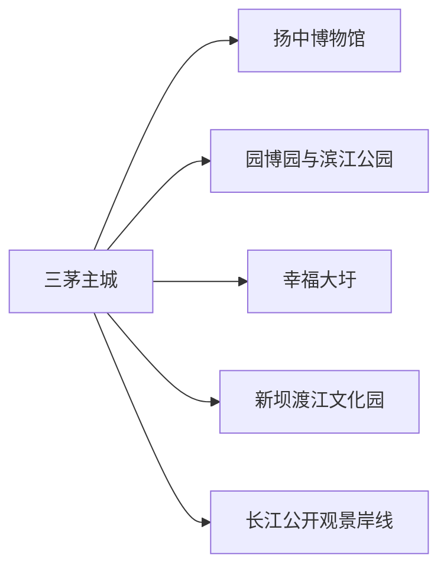
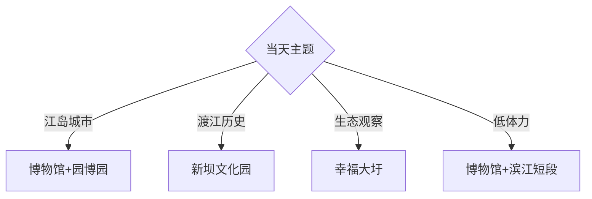

# 扬中旅行指南

扬中是镇江东部长江中的江岛县级市，适合围绕江岛地理、渡江战役记忆、圩田湿地和河豚饮食安排一至两天。固定 **Sanmao / GeoNames 1796682** 对应扬中主城三茅街道，本页用扬中市级旅行结构完整承接。

## 城市速览

| 项目 | 信息 |
|---|---|
| 主线 | 扬中博物馆—园博园公共区—滨江公园—渡江文化园 |
| 停留 | 主城1天；新坝渡江文化与圩田生态另加半天至1天 |
| 住宿 | 三茅主城便于餐饮与公交；新坝适合北部专题 |
| 交通 | 以公路桥梁接入镇江、丹阳和泰州方向，岛内用公交与短途车辆 |
| 风险 | 长江汛情、圩田临水、港区作业、雷雨大风和河豚食品安全 |

## 城市格局与游览区域

三茅主城承担食宿、博物馆和商业；园博园、滨江公园与圩田展示江岛生态；新坝渡江文化园位于北部，适合独立半日。长江岸线同时承担防洪、航运和工业功能，观景选择开放公园与明确公共区域。

## 主要景点

| 景点 | 区域 | 类型 | 核心体验 | 用时 | 环境 | 体力 | 研究价值 | 拥挤 | 优先级 |
|---|---|---|---|---:|---|---|---|---|---|
| 扬中市博物馆 | 三茅 | 博物馆 | 江岛成陆、地方史与馆藏文物 | 2小时 | 室内 | 低 | 很高 | 团体时中 | A |
| 扬中园博园公共游览区 | 主城近郊 | 园林公园 | 江岛园林、湿地与城市休闲 | 2–3小时 | 室外 | 低中 | 中 | 周末中 | A |
| 滨江公园 | 三茅 | 滨江空间 | 长江视野与城市岸线 | 1–2小时 | 室外 | 低 | 中 | 傍晚中 | B |
| 渡江文化园 | 新坝镇 | 纪念园 | “我送亲人过大江”主题展馆与雕塑 | 2小时 | 混合 | 低 | 很高 | 团体时高 | A |
| 幸福大圩公开区 | 油坊方向 | 圩田湿地 | 圩田、水网、农业与鸟类观察 | 2–3小时 | 室外 | 中 | 高 | 周末中 | B |
| 河豚文化相关公开展陈 | 主城 | 饮食文化 | 河豚产业、烹饪规范与地方饮食 | 1–2小时 | 室内 | 低 | 高 | 节庆时高 | B |
| 雷公岛或江岛公开观景点 | 岛域岸线 | 自然观察 | 江岛地貌与航运景观 | 1–2小时 | 室外 | 中 | 中 | 低 | C |
| 太平禅寺公开区 | 三茅方向 | 宗教建筑 | 地方佛教建筑与社区信仰 | 1小时 | 混合 | 低 | 中 | 法会时高 | C |
| 新坝老街公开段 | 新坝镇 | 集镇街区 | 北部集镇生活与工业城市演变 | 1–2小时 | 室外 | 低 | 中 | 中 | C |

## 美食与餐饮

河豚、刀鱼馄饨、江鲜和秧草等是扬中饮食线索。河豚选择取得相应资质、加工流程清晰的正规餐饮场所，并按当季供应和个人健康状况决定；江鲜遵循禁捕规定与正规供应链。严重过敏者说明鱼类、甲壳类、贝类和共用锅具风险。

## 经典行程

### 一日基础线
**路线**：扬中市博物馆—主城午餐—园博园—滨江公园。**逻辑**：从江岛历史进入当代生态空间。**预约锚点**：博物馆。**休息**：主城与园博园。**删除条件**：雷雨大风时删滨江段。

### 渡江文化线
**路线**：主城—新坝渡江文化园—新坝镇区—返城。**逻辑**：围绕一个真实历史地点完成半日。**预约锚点**：展馆开放与讲解。**休息**：新坝镇区。**删除条件**：团体包场时调整到博物馆。

### 江岛生态线
**路线**：园博园—幸福大圩公开区—返城。**逻辑**：比较城市园林与生产圩田。**预约锚点**：开放范围、鸟季和返程。**休息**：园博园服务区。**删除条件**：汛情、强风或农业作业时缩短圩田段。

### 河豚饮食线
**路线**：文化展陈—正规餐馆—滨江短步行。**逻辑**：先理解规范，再安排一餐。**预约锚点**：餐厅资质、当季供应和菜单。**休息**：餐厅。**删除条件**：健康状况或供应条件不合适时改江南家常菜。

### 新坝集镇线
**路线**：渡江文化园—新坝老街公开段—镇区公共空间。**逻辑**：把纪念史与今天的集镇生活相连。**预约锚点**：展馆与返程。**休息**：镇区。**删除条件**：高温时缩短街区。

### 亲子低体力线
**路线**：博物馆—午休—园博园近入口。**逻辑**：室内展陈配平缓绿地。**预约锚点**：亲子活动和无障碍入口。**休息**：每站坐休。**删除条件**：高温时保留室内。

### 雨天线
**路线**：博物馆—河豚文化室内展陈—主城餐饮。**逻辑**：降低江岸与圩田暴露。**预约锚点**：场馆开放。**休息**：室内商业。**删除条件**：防汛响应时按通知减少移动。

## 住宿区域

三茅主城适合博物馆、餐饮、公交和跨桥出行；新坝适合渡江文化园和北部工业城市观察；园博园周边适合公园与安静住宿。多数首次到访者住三茅，在北部或圩田中选择一个专题。

## 市内交通

扬中通过公路桥梁与周边城市连接，订票时把公路换乘时间纳入总行程。岛内公交和短途车辆可串联主城、新坝和圩田。防洪堤、航道、码头、船厂、电气产业园和水源保护区执行明确通行限制。

## 不同旅行者须知

历史旅行者优先博物馆和渡江文化园；自然观察者选择园博园与幸福大圩；饮食旅行者把河豚安排在合规餐馆；长者和轮椅使用者以博物馆、园博园平缓段为主，并确认连续无障碍路线。

## 行前核对

- 核对博物馆、渡江文化园和园博园的开放、活动与最晚入场。
- 核对长江水位、雷雨大风、跨桥交通和岛内末班。
- 河豚餐饮核对经营资质、当季供应和加工条件；港区、船厂和防洪设施遵守明确限制。

## 来源与更新记录

| 来源 | 支持内容 | 核验日期 |
|---|---|---|
| [江苏省民政厅：扬中渡江文化园](https://mzt.jiangsu.gov.cn/art/2022/6/15/art_86188_10494422.html) | 园区位置、照片故事、展馆与纪念主题 | 2026-09-01 |
| [江苏省林业局：幸福大圩](https://lyj.jiangsu.gov.cn/art/2026/7/31/art_7085_11811260.html) | 圩田生态、鸟类与当前保护背景 | 2026-09-01 |
| [江苏省统计局：扬中博物馆数字化](https://tj.jiangsu.gov.cn/art/2023/9/6/art_85272_11005913.html) | 扬中博物馆馆藏与公共文化服务 | 2026-09-01 |
| [GeoNames 1796682](https://www.geonames.org/1796682/) | Sanmao 固定人口点与位置 | 2026-09-01 |

| 日期 | 更新 |
|---|---|
| 2026-09-01 | 首次完成扬中旅行研究；明确三茅驻地记录与扬中江岛县级市页面关系。 |
