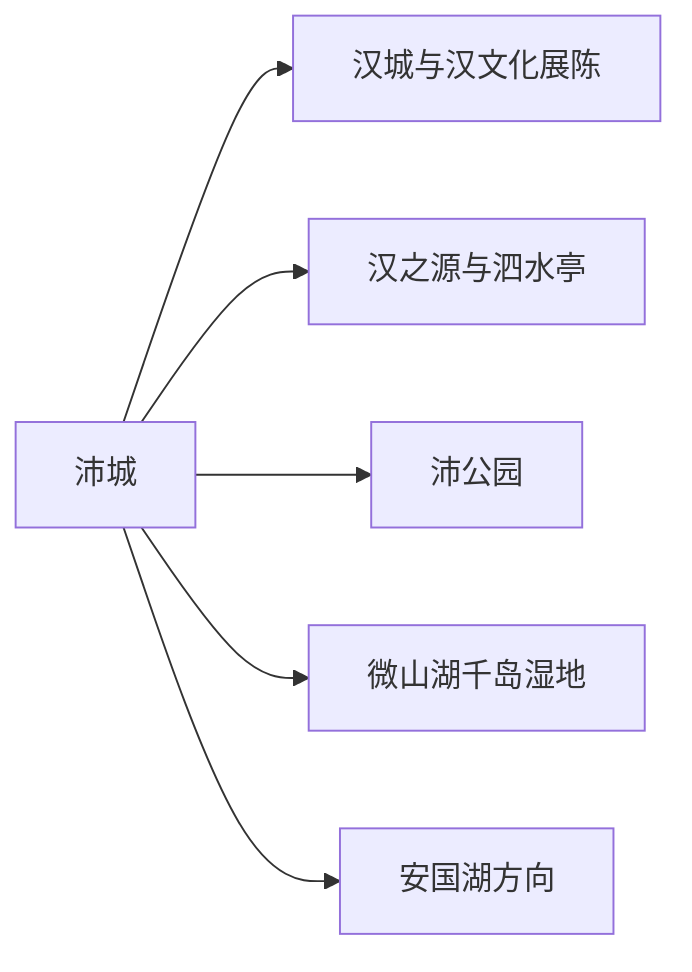
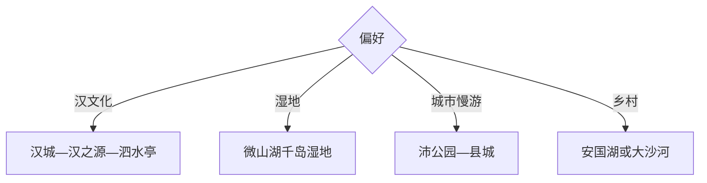

# 沛县旅行指南

沛县适合做徐州北部的汉文化与湖滨湿地短途：县城用汉城、汉之源、泗水亭和沛公园串起地方叙事，微山湖千岛湿地与安国湖方向留给生态日。一天看县城核心，两天可把人文和水域分开。

## 城市速览

| 项目 | 信息 |
|---|---|
| 主线 | 沛城—汉城—汉之源—泗水亭—沛公园—微山湖千岛湿地 |
| 停留 | 县城1天；增加湿地共2天 |
| 住宿 | 沛城适合餐饮交通，湖区住宿按开放和接驳选择 |
| 交通 | 从徐州乘铁路或公路抵达，县城公交与网约车，湖区另做接驳 |
| 风险 | 湖区水情、夏季暴晒雷雨、湿地蚊虫、游船和临水活动规则 |
| 边界 | 湿地保育区、航道、码头作业区、文物展陈和演出后台按开放范围进入 |

## 城市格局与游览区域

固定 `Peicheng / GeoNames 1798972` 是沛县主城，本页按法定沛县 `Q1361247` 组织。汉文化点集中在县城，微山湖与安国湖属于不同水域方向，适合分日并把开放水情作为先决条件。

## 主要景点

| 景点 | 区域 | 类型 | 核心体验 | 用时 | 环境 | 体力 | 预约风险 | 天气影响 | 优先级 |
|---|---|---|---|---:|---|---|---|---|---|
| 沛县汉城景区 | 沛城 | 主题文化区 | 汉文化展陈、仿古空间与活动 | 3–5小时 | 室内外 | 中 | 高 | 中 | A |
| 汉之源景区 | 沛城 | 历史文化 | 刘邦故里叙事与汉代文化线索 | 2–4小时 | 室内外 | 低中 | 中 | 中 | A |
| 汉高祖原庙及公开展区 | 县城 | 历史建筑 | 地方纪念传统与相关展陈 | 1–2小时 | 室内外 | 低 | 高 | 低 | A |
| 泗水亭公园 | 县城 | 历史公园 | 地名典故、城市绿地与轻步行 | 1–2小时 | 室外 | 低 | 低 | 高 | B |
| 沛公园 | 城区 | 城市公园 | 湖岸、园林与城市休闲 | 2–4小时 | 室外 | 低中 | 低 | 高 | B |
| 微山湖千岛湿地景区 | 湖区 | 湿地生态 | 芦苇、水鸟、湖岛与科普 | 半日至1天 | 室外 | 中 | 很高 | 极高 | A |
| 安国湖国家湿地公园公开区 | 安国镇方向 | 湿地生态 | 湿地修复、鸟类与水岸观察 | 3–5小时 | 室外 | 中 | 高 | 极高 | B |
| 大沙河公开农旅点 | 西部乡镇 | 乡村农旅 | 果园、河岸与季节采摘 | 半日 | 室外 | 中 | 高 | 很高 | C |

## 美食与餐饮

县城可找狗肉之外的多样本地选择，如冷面、鼋汁狗肉的正规替代介绍、湖鲜、羊肉汤与家常菜；是否选择地方传统肉食可按个人饮食偏好决定。湖鲜先问品种、时价、份量和加工费，湿地日自备饮水。

## 经典行程

### 一日经典线
**路线**：汉城—汉之源—泗水亭—县城晚餐。**逻辑**：在紧凑范围完成汉文化主线。**预约锚点**：汉城展陈与演出。**休息**：汉城商业服务点。**删除条件**：闭馆时改沛公园。

### 两日人文湿地线
**路线**：首日县城汉文化；次日微山湖千岛湿地。**逻辑**：把固定开放时间和天气敏感水域分开。**预约锚点**：湿地、游船和接驳。**休息**：游客中心。**删除条件**：水情或大风时取消湖区。

### 汉文化深读线
**路线**：汉之源—汉高祖原庙—汉城展陈—泗水亭。**逻辑**：从历史线索到当代展示。**预约锚点**：讲解、展馆与活动。**休息**：县城。**删除条件**：开放点减少时保留汉城与汉之源。

### 湖滨生态线
**路线**：千岛湿地宣教区—公开栈道—正规水上项目。**逻辑**：先理解湿地，再决定是否上船。**预约锚点**：水位、船班、救生装备。**休息**：游客中心。**删除条件**：雷雨、大风或停航时只留陆上区。

### 亲子线
**路线**：汉城互动展陈—午休—沛公园。**逻辑**：用文化活动搭配开放绿地。**预约锚点**：演出与儿童项目。**休息**：县城商业区。**删除条件**：高温时缩短公园段。

### 乡村季节线
**路线**：安国湖或大沙河正规接待点—湿地/果园体验—乡镇午餐。**逻辑**：按当季物候二选一。**预约锚点**：花果期、接待与道路。**休息**：乡镇。**删除条件**：季节偏差时改县城。

### 低体力线
**路线**：汉城核心展陈—车辆到泗水亭—沛公园短段。**逻辑**：以室内和短平路控制强度。**预约锚点**：无障碍入口和落客点。**休息**：汉城。**删除条件**：高温时只留室内。

## 住宿区域

沛城县城适合所有首次旅行者，可覆盖汉文化点、餐饮和长途交通；湖区住宿适合日出、观鸟或两日生态行程，优先选择有明确经营、消防和返程安排的接待点；徐州住宿适合把沛县作为单日往返。

## 市内交通

县城景点可用公交、网约车和分段步行串联。微山湖、安国湖与大沙河分属不同方向，出发前确认入口、停车和返程；游船只选持证经营点，水上航线按当日气象水情执行。

## 不同旅行者须知

历史爱好者集中县城；观鸟者优先清晨湿地并使用长焦；亲子家庭选汉城与公园；低体力者减少湖区长栈道。湿地核心保育区、芦苇繁育区、航道、闸站和码头作业区保留明确限制。

## 行前核对

- 核对汉城、汉之源、湿地景区、游船与安国湖公开区开放。
- 核对水位、风力、雷雨、蚊虫防护、湖区接驳和末班返程。
- 观鸟保持安静距离，临水活动穿戴救生装备，采摘走正规接待点。

## 来源与更新记录

| 来源 | 支持内容 | 核验日期 |
|---|---|---|
| [财政部：沛县旅游设施](https://www.mof.gov.cn/zhengwuxinxi/xinwenlianbo/jiangsucaizhengxinxilianbo/201506/t20150619_1259012.htm) | 汉之源、汉城、沛公园与微山湖千岛湿地 | 2026-09-01 |
| [GeoNames 1798972](https://www.geonames.org/1798972/) | Peicheng 固定主城点 | 2026-09-01 |
| [Wikidata Q1361247](https://www.wikidata.org/wiki/Q1361247) | 沛县实体与跨库标识 | 2026-09-01 |

| 日期 | 更新 |
|---|---|
| 2026-09-01 | 首次完成沛县旅行研究，按汉文化、城市公园与湖滨湿地组织。 |
