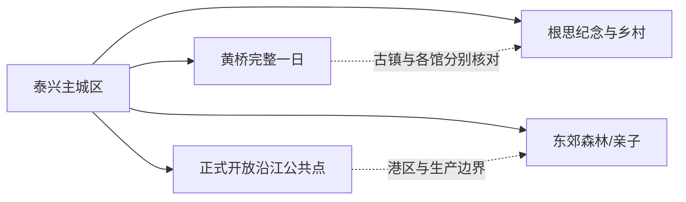
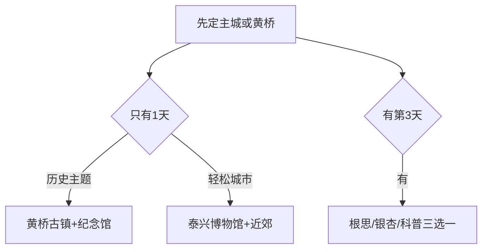

# 泰兴旅行指南

泰兴适合拆成三个旅行模块：主城区的博物馆与城市生活、黄桥镇的古镇与战役纪念体系、根思—东郊等乡村和生态方向。第一次来可先住主城，用一整天去黄桥；沿江工业带、港区和生态岸线则按正式开放活动与保护要求理解，不把生产道路当作滨江游线。

> 建议停留：主城半日至 1 天；黄桥另留 1 天；乡村或生态线再留 1 天  
> 旅行关键词：黄桥古镇、黄桥战役、泰兴博物馆、杨根思、黄桥烧饼、银杏乡村  
> 主要体力：城区低；古镇步行与乡村长线为中等  
> 最近研究：2026-08-13

## 城市速览

| 项目 | 旅行信息 |
|---|---|
| 主要旅行价值 | 在泰兴博物馆理解县级市历史，在黄桥古镇与纪念馆认识商贸和革命史，再用乡村与生态方向补充地方生活 |
| 建议停留 | 1 天只做黄桥或主城；2 天完成两者；3 天再选根思、东郊森林或当期乡村线 |
| 较舒适季节 | 春秋适合古镇和乡村；梅雨、台风、高温和冬季寒潮会影响户外与长江岸线 |
| 预算特点 | 城区和古镇较易控制；跨镇车辆、活动票务与乡村体验是主要增量 |
| 步行强度 | 主城场馆低；黄桥古街和分散旧址为中等；乡村线取决于车辆 |
| 主要天气风险 | 暴雨、雷电、台风、高温、寒潮、道路积水和长江高水位 |
| 独行旅行 | 主城与黄桥镇区较易安排；远镇返程先锁定 |
| 亲子旅行 | 博物馆、航天/科技类当期开放项目和古镇短线可组合 |
| 长者与低体力旅行 | 选择主城一馆或黄桥纪念馆主馆，分散旧址按车辆减量 |
| 无障碍信息 | 新场馆可询问协助；老街、旧址、乡村和岸线设施连续性需向官方确认 |

## 城市格局与游览区域

泰兴市是泰州市代管的法定县级市，代码 `321283`。固定 GeoNames `1793533` 是主城 `PPLA3` 居民点；Wikidata `Q1365433` 表达县级市并关联行政记录 `1793532`。本页用固定点定位主城，以法定代码和县级市实体覆盖黄桥、根思、沿江等完整市域。

| 区域 | 主要内容 | 怎么安排 | 边界提示 |
|---|---|---|---|
| 泰兴主城区 | 市博物馆、公共文化、住宿餐饮 | 抵离、雨天和首日底盘 | 场馆地址与开放按当期公告 |
| 黄桥镇 | 古镇、新四军黄桥战役纪念馆、丁文江纪念馆等 | 单列一整日 | 古镇街巷与各馆是不同开放单元 |
| 根思乡—宣堡等方向 | 杨根思纪念、银杏与乡村 | 半日至一日 | 纪念场所、村庄和农田分别守边界 |
| 东郊森林与城市近郊 | 生态休闲、亲子与当期活动 | 作为低至中体力补充 | 只进入正式开放区域 |
| 沿江产业与生态岸线 | 港口、化工、制造与长江生态空间 | 只按具名公共点或正式研学 | 码头、堤防、水厂、厂区和专用路禁止进入 |

黄桥古镇是公共街巷与公办景点组合，新四军黄桥战役纪念馆的新馆、旧址和纪念设施按一个纪念体系理解；丁文江纪念馆、何氏宗祠等独立场馆则另核开放。这样既能完整安排行程，也避免把古镇内部每个小点重复计数。

## 主要景点

### 主城与黄桥

| 景点 | 区域 | 类型 | 主要看点 | 建议用时 | 室内外 | 体力 | 预约风险 | 天气影响 | 优先级 |
|---|---|---|---|---:|---|---|---|---|---|
| 泰兴市博物馆 | 主城区 | 公共博物馆 | 泰兴历史、地方文物与城市发展 | 2–3 小时 | 室内 | 低 | 中 | 低 | A |
| 黄桥古镇公共开放区 | 黄桥镇 | 3A 目标建设中的历史街区/古镇 | 古街、商贸、建筑与地方生活 | 3–5 小时 | 混合 | 中 | 中 | 中 | A |
| 新四军黄桥战役纪念馆 | 黄桥镇 | 纪念馆与旧址体系 | 黄桥战役、新馆和当期开放纪念设施 | 2–4 小时 | 混合 | 中 | 高 | 中 | A |
| 丁文江纪念馆 | 黄桥镇 | 名人纪念馆、科学史 | 丁文江生平与中国地质科学史 | 1–2 小时 | 室内 | 低 | 高 | 低 | B |
| 裕泰和茶庄等正式开放历史建筑 | 黄桥镇 | 历史建筑 | 古镇商业与社会生活史 | 1–2 小时 | 混合 | 低至中 | 很高 | 中 | B |

### 纪念、生态与乡村

| 景点 | 区域 | 类型 | 主要看点 | 建议用时 | 室内外 | 体力 | 预约风险 | 天气影响 | 优先级 |
|---|---|---|---|---:|---|---|---|---|---|
| 杨根思烈士陵园/纪念空间 | 根思乡 | 纪念场所 | 英烈事迹与纪念教育 | 2–3 小时 | 混合 | 中 | 高 | 中 | B |
| 东郊森林公园正式开放区 | 城市近郊 | 森林、休闲 | 近郊林地、步道和季节活动 | 2–4 小时 | 室外 | 中 | 中 | 高 | B |
| 泰兴航天科技馆等当期开放科普点 | 市域具名场馆 | 科普、亲子 | 航天与科技体验 | 2–3 小时 | 室内 | 低 | 很高 | 低 | C |
| 宣堡古银杏或乡村具名开放点 | 宣堡等 | 生态、乡村 | 银杏景观与季节乡村生活 | 3–6 小时 | 室外 | 中 | 很高 | 很高 | C |

## 美食与餐饮

| 类型 | 适合区域 | 份量与选择 | 饮食提醒 | 怎么选 |
|---|---|---|---|---|
| 黄桥烧饼 | 黄桥及全市点心店 | 单个或小袋，单人友好 | 甜咸馅可能含猪油、肉、虾、芝麻和麸质 | 先问馅料和出炉时间，多家同类可替代 |
| 泰兴白果与银杏制品 | 正规餐馆、商店 | 少量尝试 | 白果需充分熟制，儿童和成人都不宜过量 | 选择标示加工方式与净含量的产品 |
| 江鲜与河鲜 | 主城正规餐馆 | 多人分享 | 禁渔期、来源、时价、鱼刺和过敏 | 选择合法来源、熟制和明码标价 |
| 早茶、面点与家常菜 | 主城、黄桥镇区 | 单人至多人均可 | 汤底、猪油、虾籽和共锅需询问 | 用一份主食加小菜控制份量 |

## 经典行程

### 一日经典路线

**路线**：黄桥战役纪念馆 → 黄桥镇午餐与黄桥烧饼 → 黄桥古镇公共街巷 → 丁文江纪念馆或一处正式开放旧址。

- **串联逻辑**：先建立战役背景，再看古镇商贸与人物史。
- **适用条件**：各馆开放且有可靠往返黄桥交通。
- **预约锚点**：纪念馆主馆与分散旧址。
- **休息安排**：黄桥镇区午休。
- **时间不足时**：保留纪念馆主馆和古镇核心街巷。

### 两日城市路线

**第 1 天**：泰兴市博物馆 → 主城午餐 → 近郊公共空间。  
**第 2 天**：黄桥完整一日。

- **串联逻辑**：第一天认识全市，第二天深入黄桥。
- **适用条件**：住主城或黄桥一晚者。
- **预约锚点**：博物馆、黄桥各馆和返程。
- **休息安排**：主城与黄桥镇区分别午休。
- **时间不足时**：第一天缩成博物馆，黄桥不压缩。

### 三日深度路线

**第 1 天**：主城。  
**第 2 天**：黄桥。  
**第 3 天**：根思纪念、宣堡银杏或当期科普点三选一。

- **串联逻辑**：城市、古镇和第三主题分日处理。
- **适用条件**：自驾或已确认乡镇接驳。
- **预约锚点**：第三天具名场馆/接待点和季节状态。
- **休息安排**：镇区正规餐饮。
- **时间不足时**：删除第三天。

### 雨天路线

**路线**：泰兴市博物馆 → 午餐 → 当期开放科普馆或主城公共展览。

- **串联逻辑**：留在主城室内，减少古街和乡村移动。
- **适用条件**：普通降雨、城市交通正常。
- **预约锚点**：两座场馆开放。
- **休息安排**：馆内和商业区。
- **时间不足时**：只保留博物馆。

### 亲子或低体力路线

**亲子方案**：博物馆精选展 → 午餐 → 当期开放航天/科普馆。  
**低体力方案**：黄桥纪念馆主馆 → 镇区长休 → 古街短段。

- **串联逻辑**：亲子重互动，低体力重单馆和短街巷。
- **适用条件**：先核场馆时段、儿童规则、落客和座席。
- **预约锚点**：科普馆或纪念馆。
- **休息安排**：每 60–90 分钟休息。
- **时间不足时**：删除第二个点。

### 远郊一日路线

**根思线**：主城 → 杨根思纪念空间 → 镇区午餐 → 返回。  
**银杏乡村线**：主城 → 宣堡具名开放点 → 午餐 → 当期步道 → 返回。

- **串联逻辑**：纪念与生态各自成线，一天只选一个方向。
- **适用条件**：场馆/花叶期、道路和返程已确认。
- **预约锚点**：纪念场所、乡村接待和车辆。
- **休息安排**：镇区或正式服务点。
- **时间不足时**：只保留一个主点。

## 住宿区域

| 区域 | 优点 | 取舍 | 适合人群 | 交通提示 |
|---|---|---|---|---|
| 泰兴主城区 | 餐饮、交通和服务集中 | 去黄桥需车辆 | 首访、独行、多方向 | 核对客运到发和实际住宿位置 |
| 黄桥镇 | 方便古镇晨晚和纪念馆 | 夜间选择少于主城 | 黄桥深度、摄影 | 确认停车、最晚到店和次日离开 |
| 乡镇正规住宿 | 接近专项活动 | 运营和退改波动大 | 自驾、活动旅行者 | 只订地址与证照清楚的住宿 |

## 市内交通

| 场景 | 建议方式 | 怎么做 | 动态核对 |
|---|---|---|---|
| 跨城抵达 | 道路客运、自驾、周边铁路站转乘 | 以票面站名和最终下车点为准 | 班次、末班、行李 |
| 主城—黄桥 | 道路客运、公交、合规包车或自驾 | 黄桥完整日，先定返程 | 上下车点、节假日拥堵、停车 |
| 根思/宣堡 | 公交、车辆或活动接驳 | 一天一个方向 | 场馆、花叶期、返程 |
| 沿江 | 只到具名公共开放点 | 使用公共道路和正式停车 | 防汛、港区、堤防与施工管制 |

## 不同旅行者须知

| 旅行者 | 优先选择 | 需要确认 | 备选方案 |
|---|---|---|---|
| 独行者 | 主城与黄桥镇区 | 末班和夜间叫车 | 主城半日 |
| 亲子家庭 | 博物馆、科普馆 | 年龄、时段和互动项目 | 一馆一餐 |
| 长者与低体力者 | 纪念馆主馆、古街短段 | 落客、座席、卫生间 | 主城博物馆 |
| 自驾者 | 一天一个乡镇方向 | 停车、疲劳、沿江管制 | 主城停车后换乘 |
| 历史主题者 | 黄桥纪念体系 | 旧址开放和讲解 | 主馆精选展 |

安全、法律和生产边界保持明确：长江港口、化工园区、码头、水厂、堤防工程和企业专用道路不属于公共滨江游线；纪念场所保持安静，农田、银杏生产地和居民院落只按具名接待范围进入。

## 行前核对

- 在[泰兴市人民政府](https://www.taixing.gov.cn/)查看场馆、交通和活动。
- 黄桥逐项确认古镇公办景点、纪念馆主馆和旧址开放。
- 第三天乡村线确认花叶期、接待、道路和返程。
- 查看气象、长江水情、防汛和交通管制。
- 通过正规客运与铁路渠道确认跨城到发。
- 无障碍旅行逐段确认场馆、古街、车辆和住宿。

## 来源与更新记录

### 主要来源

| 来源 | 机构 | 支持内容 | 核验日期 |
|---|---|---|---|
| [泰兴市 2026 年文旅线路](https://www.taixing.gov.cn/zwgk/xxgk/zdly/ggwhfw/art/2026/art_9899347f05114732b31ce14a8728fbfb.html) | 泰兴市人民政府 | 黄桥、丁文江、何氏宗祠、乡村和科普线路 | 2026-08-13 |
| [黄桥古镇元旦接待](https://www.taixing.gov.cn/xwzx/txxw/art/2026/art_0b5b8dbf870e4bbe88c9f32b86122717.html) | 泰兴市人民政府 | 古镇、纪念馆、丁文江与开放历史建筑 | 2026-08-13 |
| [博物馆定级信息](https://www.taixing.gov.cn/zwgk/xxgk/zdly/ggwhfw/art/2024/art_a2eae514e73a42bebf89c9b32ccaaf85.html) | 泰兴市人民政府 | 泰兴博物馆与黄桥战役纪念馆 | 2026-08-13 |
| [黄桥镇 2025 年政府工作报告](https://www.taixing.gov.cn/zwgk/xxgk/fggw/bmxzwj/art/2025/art_98f6b0ed2d96477196375fdb7743ec27.html) | 黄桥镇人民政府 | 古镇建设、历史建筑和近期开放方向 | 2026-08-13 |
| [泰兴市政府工作报告](https://www.taixing.gov.cn/zwgk/xxgk/tjrdbg/art/2026/art_72fe6a8c0edd4017a143fffead731620.html) | 泰兴市人民政府 | 城市服务、文旅和乡村方向 | 2026-08-13 |
| [GeoNames 1793533](https://sws.geonames.org/1793533/about.rdf) | GeoNames | 固定主城 PPLA3 点 | 2026-08-13 |
| [Wikidata Q1365433](https://www.wikidata.org/wiki/Q1365433) | Wikidata | 泰兴市实体与行政记录关系 | 2026-08-13 |
| [民政部行政区划代码服务](https://dmfw.mca.gov.cn/xzqh/getList?code=321283&trimCode=false&maxLevel=3) | 民政部 | 泰兴市法定代码和层级 | 2026-08-13 |
| [江苏省气象局](http://js.cma.gov.cn/) | 气象主管部门 | 天气与灾害预警 | 2026-08-13 |
| [中国铁路 12306](https://www.12306.cn/) | 铁路运营方 | 跨城铁路动态核对 | 2026-08-13 |

### 更新记录

| 日期 | 更新内容 |
|---|---|
| 2026-08-13 | 建立研究版；区分固定主城点与县级市行政记录；将黄桥具体景点、路线、餐饮和住宿所有权迁入本页，并明确沿江生产与生态边界。 |
