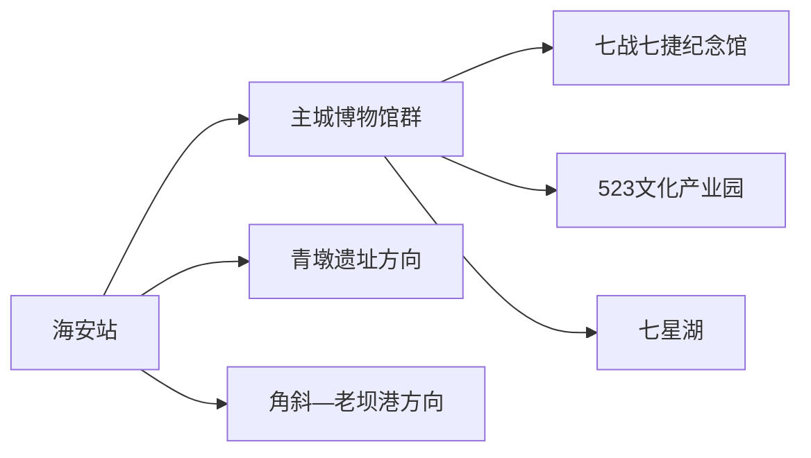
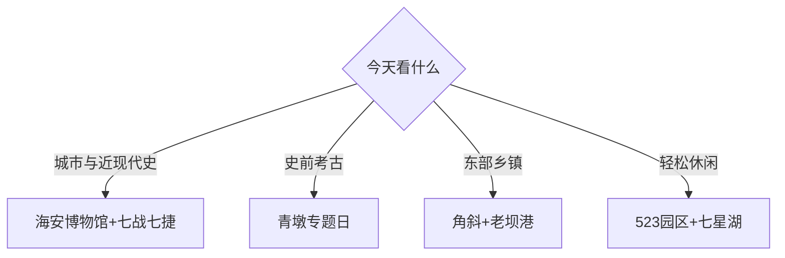

# 海安旅行指南

海安位于南通北部、里下河水网与江海平原交接处，适合把县域博物馆、青墩遗址、苏中抗战史和水乡物产组织成一至两天。固定快照中的 **Hai’an / GeoNames 1809116** 对应现行海安市，本页以海安主城为住宿和交通中心。

## 城市速览

| 项目 | 信息 |
|---|---|
| 主线 | 海安博物馆—苏中七战七捷纪念馆—523文化产业园—七星湖 |
| 停留 | 主城1天；青墩或东部乡镇另加1天 |
| 住宿 | 海安站—主城商业区便于抵离；青墩和沿海方向适合专题自驾 |
| 交通 | 海安站接入铁路，县域点位以公交、预约车辆或自驾串联 |
| 风险 | 高温雷雨、河网临水、乡村道路、馆舍闭馆与农业生产边界 |

## 城市格局与游览区域

主城集中海安博物馆、韩公馆、七战七捷纪念馆和公共文化设施，适合铁路抵达后的完整一天。青墩遗址及相关展陈位于西北方向，角斜红旗民兵史绩陈列馆和东部滨海、水产主题又是一条长线；选择其中一个方向更从容。

## 主要景点

| 景点 | 区域 | 类型 | 核心体验 | 用时 | 环境 | 体力 | 研究价值 | 拥挤 | 优先级 |
|---|---|---|---|---:|---|---|---|---|---|
| 海安博物馆与韩公馆 | 主城 | 博物馆与历史建筑 | 地方史、青墩文物和韩国钧旧居 | 2–3小时 | 室内 | 低 | 很高 | 节假日中 | A |
| 苏中七战七捷纪念馆 | 主城 | 纪念馆 | 苏中战役史与专题展陈 | 2小时 | 室内 | 低 | 很高 | 团体时高 | A |
| 523文化产业园 | 主城 | 艺术园区 | 当代艺术、工作室与旧空间更新 | 1–2小时 | 混合 | 低 | 中 | 活动时高 | B |
| 七星湖生态园 | 城南 | 城市公园 | 湖区步道和抵离日休闲 | 1–2小时 | 室外 | 低中 | 中 | 周末中 | B |
| 青墩遗址及专题展陈 | 南莫镇方向 | 考古遗址 | 江海平原史前文化与遗址环境 | 半天 | 混合 | 低中 | 很高 | 团体时中 | A |
| 江淮文化园 | 主城近郊 | 园林文化园 | 仿古园林与文化陈设 | 2–3小时 | 混合 | 低中 | 中 | 周末中 | B |
| 新四军联抗纪念馆 | 墩头方向 | 纪念馆 | 苏中联合抗战史 | 1–2小时 | 室内 | 低 | 高 | 团体时中 | B |
| 角斜红旗民兵史绩陈列馆 | 角斜 | 纪念馆 | 民兵史与东部乡镇历史 | 1–2小时 | 室内 | 低 | 高 | 团体时中 | B |
| 老坝港滨海公开空间 | 东部沿海 | 海岸与渔镇 | 江海堤岸、渔港生活与日落 | 2–3小时 | 室外 | 中 | 中 | 节假日中 | C |

## 美食与餐饮

河豚、河鲜、海产、米酒和江海家常菜是常见线索。河豚优先选择证照、来源和加工流程清晰的正规经营场所；水产按称重、时价、加工费和做法逐项确认。过敏者点单时说明鱼类、甲壳类、贝类及共用锅具风险。

## 经典行程

### 一日基础线
**路线**：海安博物馆—午休—七战七捷纪念馆—523文化产业园。**逻辑**：从地方通史进入近现代史，再看当代更新。**预约锚点**：两馆开放。**休息**：主城商业区。**删除条件**：闭馆日保留园区与七星湖。

### 博物馆线
**路线**：海安博物馆—韩公馆公开区—七战七捷纪念馆。**逻辑**：把人物、地方史和战役史分层阅读。**预约锚点**：临展与团队接待。**休息**：两馆之间午餐。**删除条件**：展厅维护时删对应馆。

### 青墩考古线
**路线**：主城—青墩遗址专题展陈—遗址公开区—返城。**逻辑**：围绕一个考古主题完成半日至一日。**预约锚点**：展陈与遗址开放。**休息**：镇区。**删除条件**：暴雨或遗址维护时改主城博物馆。

### 红色史迹线
**路线**：七战七捷纪念馆—新四军联抗纪念馆。**逻辑**：以两个明确馆舍串起苏中抗战史。**预约锚点**：馆舍开放与讲解。**休息**：主城或墩头镇区。**删除条件**：接驳不足时只留主城馆。

### 东部乡镇线
**路线**：角斜陈列馆—镇区午餐—老坝港公开滨海段。**逻辑**：先看乡镇历史，再接江海环境。**预约锚点**：陈列馆和返程车辆。**休息**：角斜或老坝港镇区。**删除条件**：大风、雷雨或岸线管制时删滨海段。

### 亲子低体力线
**路线**：海安博物馆—午休—七星湖近入口段。**逻辑**：室内展陈配平缓公园。**预约锚点**：馆内亲子活动。**休息**：馆内与商业区。**删除条件**：高温时只留室内。

### 雨天线
**路线**：海安博物馆—七战七捷纪念馆—正规商业空间。**逻辑**：把移动压缩在主城。**预约锚点**：两馆最晚入场。**休息**：每馆后坐休。**删除条件**：强对流时减少换点并提前返宿。

## 住宿区域

海安站—主城商业区适合铁路抵离、两馆和餐饮；城南适合七星湖与公路出发；青墩、角斜和老坝港方向以持证住宿、夜间交通和次日路线为筛选条件。多数首次到访者住主城更稳妥。

## 市内交通

海安站是主要铁路入口，主城景点用公交、出租车和网约车串联。青墩、墩头、角斜与老坝港跨越不同方向，先核对县域公交末班和返程；自驾进入村镇时在公共停车区停放，堤防、养殖塘和作业码头按管理标识通行。

## 不同旅行者须知

历史爱好者优先博物馆、青墩与两类纪念馆；亲子家庭选择海安博物馆和七星湖；摄影者把滨海段放在天气稳定的傍晚；轮椅与婴儿车使用者逐站确认坡道、电梯、卫生间和遗址地面连续性。

## 行前核对

- 核对博物馆、纪念馆、青墩展陈的闭馆日、预约与最晚入场。
- 核对县域公交末班、雷雨大风和沿海堤岸开放状态。
- 农田、养殖塘、港口作业区和居民院落按公开接待范围进入。

## 来源与更新记录

| 来源 | 支持内容 | 核验日期 |
|---|---|---|
| [海安市政府：旅游资源](https://www.haian.gov.cn/hasrmzf/lyzy/content/fd96a68f-6b05-40b8-bcd7-333d42ab3ebb.html) | 青墩、博物馆、纪念馆、乡村与饮食主题 | 2026-09-01 |
| [海安市文广旅局：研学线路](https://www.haian.gov.cn/haswgxj/bmdt/content/94701fed-a801-48e1-9971-38642855e0c6.html) | 七战七捷、韩公馆、联抗与角斜陈列馆关系 | 2026-09-01 |
| [海安市文广旅局：2026年计划](https://www.haian.gov.cn/haswgxj/gzgh/content/8823710c-298b-43d7-a329-d97dd67cfa6e.html) | 场馆数字化、青墩展览与当前文旅方向 | 2026-09-01 |
| [GeoNames 1809116](https://www.geonames.org/1809116/) | Hai’an 固定人口点与位置 | 2026-09-01 |

| 日期 | 更新 |
|---|---|
| 2026-09-01 | 首次完成海安旅行研究；建立主城、青墩与东部乡镇三层路线。 |
