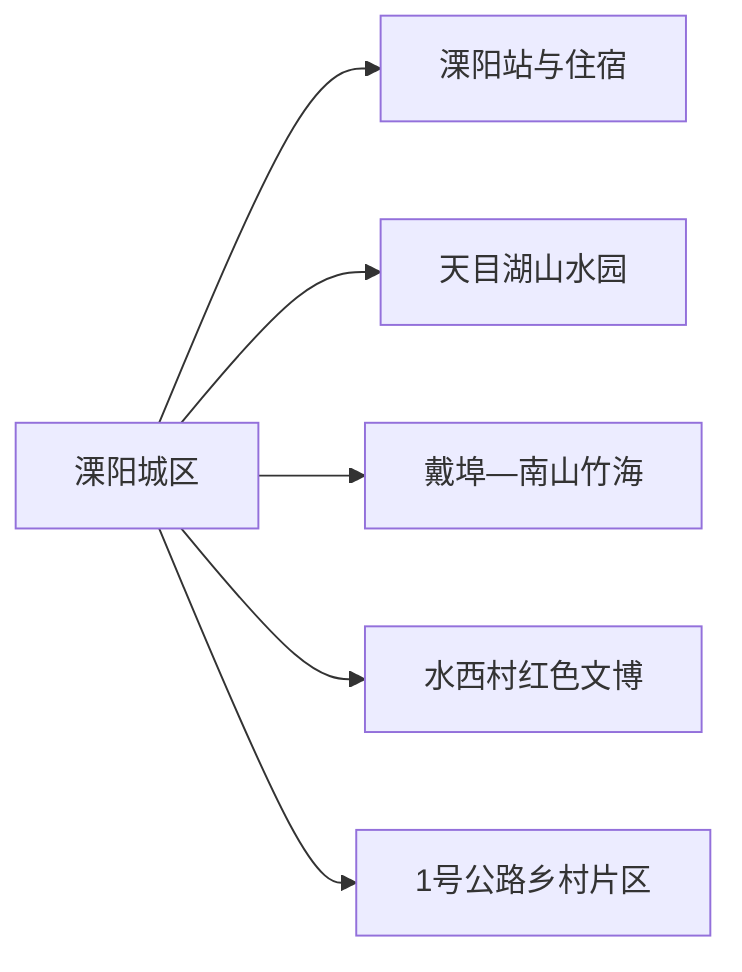
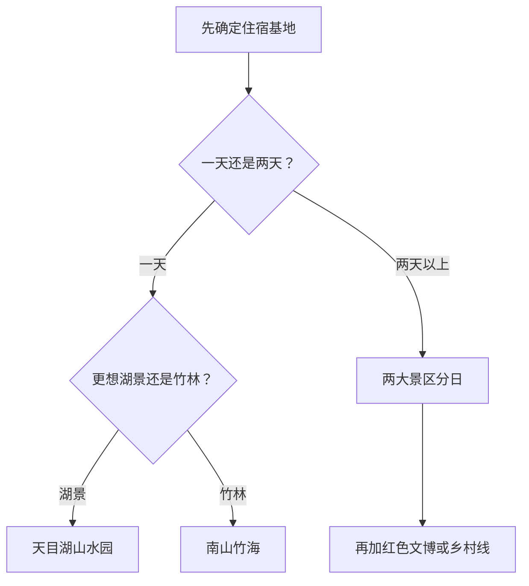

# 溧阳旅行指南

溧阳是常州代管的县级市，旅行价值集中在天目湖、南山竹海、新四军江南指挥部纪念馆与 1 号公路沿线乡村。天目湖山水园和南山竹海虽同属天目湖大品牌，却是两个不连续入口，各自都能占去大半天；最实用的安排是主城或湖区连住两晚，每天完成一个大项目。

## 城市速览

| 项目 | 信息 |
|---|---|
| 旅行主线 | 天目湖山水园、南山竹海、御水温泉、新四军江南指挥部纪念馆、1 号公路 |
| 建议停留 | 1 天只选山水园或南山竹海；2 天完成两者；3 天加入红色文博或乡村线 |
| 住宿基地 | 溧阳城区适合多方向；天目湖镇适合湖区度假；戴埠适合南山竹海 |
| 步行强度 | 城区低；山水园中等；南山竹海中高，景区内部距离大 |
| 主要天气 | 梅雨、雷暴、高温、台风外围、山洪、森林火险与冬季湿冷 |
| 温泉提示 | 项目卫生、儿童和健康规则各自独立，预订房间不自动包含所有温泉权益 |
| 亲子 | 山水园或南山竹海二选一，搭配纪念馆短线 |
| 低体力 | 城区、纪念馆与景区车可覆盖的短段更合适 |
| 生产边界 | 水库、水电、茶园、竹林、农业与道路作业区按正式开放范围活动 |
| 无障碍 | 设施连续性需向官方确认，核对景区车、码头、坡道、电梯和卫生间 |

## 城市格局与游览区域

溧阳市法定代码为 `320481`。固定 GeoNames `1802788` 名为 Licheng，别名同时包含溧城镇和溧阳市，对应薄地点实体 `Q49279113`；法定溧阳市实体为 `Q1365505`，其 `P1566=1802781` 连接另一记录。本页以固定驻地点进入覆盖，以法定代码确定市域。溧阳属于常州代管县级市，旅行内容从常州父页迁入本页。

| 区域 | 旅行价值 | 怎么安排 |
|---|---|---|
| 溧阳城区 | 铁路、住宿、餐饮、地方公共文化 | 抵达日与多方向基地 |
| 天目湖镇 | 山水园、湖区度假、茶与鱼头餐饮 | 完整一日或住宿一晚 |
| 戴埠—南山竹海 | 竹林、山地、古道与温泉 | 完整一日，景区内部按交通选线 |
| 水西村方向 | 新四军江南指挥部纪念馆与红色历史 | 半日至一日，可与北部乡村线组合 |
| 1 号公路沿线 | 彩虹公路、乡村、茶园与骑行背景 | 选一段正规道路和一个接待点，不追求全线 |

## 主要景点

### 湖区与山地

| 景点 | 所在区域 | 类型 | 核心看点 | 建议用时 | 室内/室外 | 体力 | 预约难度 | 天气敏感度 | 适合旅程 |
|---|---|---|---|---|---|---|---|---|---|
| 天目湖山水园景区 | 天目湖镇 | 湖泊与度假、5A 组成 | 湖岛、游船、湖岸景观和旅游服务 | 5–8 小时 | 室外 | 中 | 高 | 极高 | A |
| 南山竹海景区 | 戴埠镇 | 竹林山地、5A 组成 | 竹文化博物馆、古官道、静湖与山地景观 | 5–8 小时 | 混合 | 中高 | 高 | 极高 | A |
| 御水温泉等正规温泉项目 | 戴埠—南山方向 | 温泉度假 | 经核验经营项目的温泉与休息设施 | 2–4 小时 | 混合 | 低 | 高 | 中 | B |
| 1 号公路选段 | 市域乡村 | 交通旅游与乡村景观 | 彩虹路段、茶田、村落和正式驿站 | 3–6 小时 | 室外 | 中 | 高 | 高 | B |

### 城区、文博与乡村

| 景点 | 所在区域 | 类型 | 核心看点 | 建议用时 | 室内/室外 | 体力 | 预约难度 | 天气敏感度 | 适合旅程 |
|---|---|---|---|---|---|---|---|---|---|
| 新四军江南指挥部纪念馆 | 水西村 | 红色历史、纪念馆 | 江南抗战、指挥部旧址与陈列 | 2–3 小时 | 混合 | 低至中 | 中 | 中 | A |
| 溧阳博物馆或当期公共文化展馆 | 溧阳城区 | 地方史与公共文化 | 地方历史、考古、非遗和当期展览 | 1.5–2.5 小时 | 室内 | 低 | 中 | 低 | B |
| 高静园等城区历史园林 | 溧阳城区 | 园林与城市文化 | 城区历史、园林和公共休闲 | 1–2 小时 | 室外 | 低 | 低 | 中 | B |
| 曹山或瓦屋山正式开放项目 | 市域北部 | 乡村、山地与季节项目 | 茶园、乡村休闲和经运营方开放的体验 | 4–6 小时 | 室外 | 中 | 高 | 高 | C |

天目湖山水园与南山竹海按两个入口分别排日。景区品牌、度假区和整片水库山林并不等同于全部开放；游船、水上项目、古道、温泉和乡村体验分别核对票务、天气与运营。

## 美食与餐饮

| 类型 | 适合场景 | 份量 | 过敏与饮食提示 | 选择方法 |
|---|---|---|---|---|
| 天目湖砂锅鱼头 | 多人正餐 | 常见 2–4 人分享 | 鱼类、鱼刺、大豆、小麦、酒料与高钠汤底 | 一人先问小锅或鱼片做法，确认重量与价格 |
| 溧阳白芹 | 时令合菜 | 一盘适合分享 | 可能使用猪油、肉汤或蚝油 | 问清季节、做法与是否可素炒 |
| 溧阳扎肝 | 地方合菜 | 一盘多人分享 | 猪肉、内脏、豆制品、小麦与酒料 | 不吃内脏时改选白芹、笋或其他时蔬 |
| 乌米饭与米制点心 | 早餐或加餐 | 一人份 | 糯米、糖、坚果和植物染料来源 | 先买小份，查看配料和储存 |
| 溧阳茶 | 茶歇、伴手礼 | 按杯或包装 | 咖啡因与空腹饮用 | 在正规茶店少量试饮，查看产地标签 |

## 经典行程

### 一日经典路线

**路线**：溧阳城区或天目湖住宿 → 天目湖山水园 → 湖区晚餐 → 返回

- **串联逻辑**：把一天完整留给湖区入口、游船和休息，不再跨到南山竹海。
- **预约锚点**：门票、游船、景区车、天气和最晚返程。
- **休息安排**：游客中心、码头服务区和正规餐饮承担中场休息。
- **时间不足时**：缩短岛屿或游船组合，只保留山水园核心环节。

### 两日湖区与竹海路线

**第 1 天**：天目湖山水园 
**第 2 天**：南山竹海 → 可选正规温泉项目 → 返回

- **串联逻辑**：两个不连续大景区分日，第二天温泉只作为体力允许时的收尾。
- **预约锚点**：两景区票务、景区车、竹筏或索道、温泉时段与住宿权益。
- **休息安排**：每天一个主景区，午间在游客服务区坐下用餐。
- **时间不足时**：第二天只保留南山竹海，温泉顺延。

### 三日深度路线

**第 1 天**：天目湖 
**第 2 天**：南山竹海 
**第 3 天**：新四军江南指挥部纪念馆 → 1 号公路选段或城区公共文化

- **串联逻辑**：第三天从度假转向历史与乡村，强度明显下降。
- **预约锚点**：纪念馆、1 号公路活动、乡村接待和车辆。
- **休息安排**：第三天午餐放在城区或成熟镇区。
- **时间不足时**：第三天只保留纪念馆。

### 雨天路线

**路线**：溧阳博物馆或公共文化展馆 → 城区午餐 → 新四军江南指挥部纪念馆当期开放室内区域 → 住宿

- **适用条件**：普通降雨且道路、场馆正常开放。
- **串联逻辑**：用两座文化场馆替代湖面、竹林和山路。
- **预约锚点**：场馆开馆、临时活动与道路积水。
- **休息安排**：城区餐馆和场馆观众区。
- **时间不足时**：只完成一座场馆和城区用餐。

### 亲子路线

**路线**：天目湖山水园 **或** 南山竹海 → 景区午休 → 近入口亲子项目 → 住宿

- **适用条件**：两座大景区二选一，儿童身高、船艇和景区车规则已确认。
- **串联逻辑**：所有活动留在同一园区，减少上下车和跨镇移动。
- **预约锚点**：儿童票、船艇、推车、卫生间和活动年龄。
- **休息安排**：正午在室内餐饮或游客中心长休。
- **时间不足时**：保留一条短游径或一次船艇体验。

### 低体力路线

**路线**：城区公共文化场馆 → 午间长休 → 高静园短段或天目湖近入口观景

- **适用条件**：车辆落客、坡度、景区车、座椅和卫生间已确认。
- **串联逻辑**：一座室内主项配一段平缓公共空间。
- **预约锚点**：无障碍入口、最近停车和返程车辆。
- **休息安排**：午间至少两小时，随时可提前结束户外段。
- **时间不足时**：只保留场馆。

### 红色文博与乡村主题路线

**路线**：溧阳城区 → 新四军江南指挥部纪念馆 → 正规乡村餐饮 → 1 号公路一个选段 → 返回

- **适用条件**：纪念馆、乡村接待和道路状态已经确认。
- **串联逻辑**：围绕市域北部或同一公路方向组合，避免跨到天目湖远端。
- **预约锚点**：讲解、停车、乡村活动、道路施工和最晚返程。
- **休息安排**：纪念馆服务设施和成熟镇区餐饮。
- **时间不足时**：保留纪念馆，1 号公路只走返程顺路短段。

## 住宿区域

| 区域 | 优点 | 取舍 | 适合人群 | 交通提示 |
|---|---|---|---|---|
| 溧阳城区—溧阳站 | 铁路、餐饮和多方向交通均衡 | 距湖区、竹海仍需车辆 | 首访、公共交通、多方向旅行 | 核对站前公交、出租和早出接驳 |
| 天目湖镇 | 靠近山水园、湖区餐饮和度假设施 | 去南山竹海仍需转场 | 湖区慢游、家庭度假 | 问清到具体景区入口的接送和停车 |
| 戴埠—南山竹海 | 便于竹海、温泉和早晚山地体验 | 与城区、天目湖山水园分开 | 竹海为主、温泉过夜 | 确认温泉权益、餐食、夜间交通和退改 |
| 正规乡村住宿 | 接近 1 号公路或季节活动 | 服务与交通差异大 | 自驾、明确乡村主题者 | 核对消防、合法经营、充电和返程 |

## 市内交通

溧阳站是主要铁路门户。城区、天目湖镇、戴埠—南山竹海和北部乡村分属不同方向，适合公交、景区交通、出租或正规预约车辆组合。1 号公路更适合自驾或有明确车辆安排的旅行，骑行只选择路况和补给清楚的短段。

| 场景 | 怎么走 | 出发前确认 |
|---|---|---|
| 铁路抵达 | 从溧阳站进入城区或住宿片区 | 车次、公交、出租、夜间接站和行李 |
| 天目湖山水园 | 公交、景区交通、出租或自驾 | 入口、停车、游船与返程 |
| 南山竹海 | 公路前往戴埠方向 | 景区车、索道、道路、最晚入园和夜间返程 |
| 1 号公路 | 自驾或预约车辆走选定短段 | 施工、临停、骑行安全、充电与乡村接待 |
| 常州联程 | 按铁路或道路跨城 | 常州站、常州北站、溧阳站名称与住宿切换 |

## 不同旅行者须知

| 旅行者 | 更合适的安排 | 重点核对 |
|---|---|---|
| 亲子家庭 | 山水园或南山竹海单日 | 船艇、索道、推车、卫生间和午休 |
| 长者或低体力 | 城区文博加湖区近入口短线 | 景区车、坡度、落客、电梯与温泉健康要求 |
| 自驾旅行 | 两大景区分日，1 号公路选段 | 停车、充电、山路、疲劳驾驶和夜间返程 |
| 骑行旅行 | 只选择路况、补给和天气清楚的短段 | 头盔、照明、机动车混行、雷雨和救援 |
| 摄影旅行 | 湖区、竹海和乡村各留独立时段 | 开闭园、三脚架、无人机、防火与商业拍摄 |

## 行前核对

| 项目 | 为什么会变 | 何时核对 | 官方入口 |
|---|---|---|---|
| 天目湖与南山竹海 | 票务、游船、索道、景区车和天气分别变化 | 购票前、前一日、当天 | [溧阳市人民政府：南山竹海](https://www.liyang.gov.cn/html/czly/2020/NKNFQEKH_0710/138951.html)及景区官方渠道 |
| 温泉 | 经营、卫生、健康和儿童规则独立 | 预订与入池前 | 所选温泉项目官方渠道 |
| 纪念馆 | 开馆、讲解和团体活动调整 | 前一日 | 溧阳市文旅与纪念馆公告 |
| 1 号公路 | 施工、活动、骑行和交通管理动态变化 | 出发前三日及当天 | [溧阳市人民政府](https://www.liyang.gov.cn/) |
| 铁路 | 车次和停靠动态变化 | 购票与出发前 | [中国铁路 12306](https://www.12306.cn/) |
| 天气 | 梅雨、雷暴、台风和山洪影响湖区山地 | 出发前三日滚动查看 | [江苏省气象局](https://js.cma.gov.cn/) |

## 来源与更新记录

| 来源 | 支持内容 | 核验日期 |
|---|---|---|
| [溧阳市人民政府](https://www.liyang.gov.cn/) | 市情、交通、文旅和动态入口 | 2026-08-13 |
| [溧阳市政府：南山竹海](https://www.liyang.gov.cn/html/czly/2020/NKNFQEKH_0710/138951.html) | 竹文化博物馆、古官道、静湖与景区整体关系 | 2026-08-13 |
| [常州市政府：天目湖旅游度假区](https://www.changzhou.gov.cn/ns_news/307811928476156) | 天目湖、山水园、南山竹海、御水温泉与度假区关系 | 2026-08-13 |
| [溧阳市政府：天目湖镇乡村旅游](https://www.liyang.gov.cn/html/czly/2025/AQAFAJIK_0917/33972.html) | 天目湖镇、乡村旅游、森林覆盖与接待背景 | 2026-08-13 |
| [溧阳市政府：全域旅游与 1 号公路](https://www.liyang.gov.cn/html/czly/2020/IQKPQDDP_1217/147066.html) | 1 号公路串联景区和乡村的背景 | 2026-08-13 |
| [民政部行政区划代码服务](https://dmfw.mca.gov.cn/xzqh/getList?code=32&trimCode=true&maxLevel=3) | 溧阳市法定层级与代码 `320481` | 2026-08-13 |
| [GeoNames 1802788](https://www.geonames.org/1802788/licheng.html) | 固定溧城驻地点名称、坐标与别名 | 2026-08-13 |
| [Wikidata Q1365505](https://www.wikidata.org/wiki/Q1365505) | 法定溧阳市实体、P1566 与行政代码交叉核对 | 2026-08-13 |
| [中国铁路 12306](https://www.12306.cn/) | 实时铁路车次 | 2026-08-13 |
| [江苏省气象局](https://js.cma.gov.cn/) | 天气预警入口 | 2026-08-13 |

| 日期 | 更新 |
|---|---|
| 2026-08-13 | 首次完成溧阳公众旅行指南；明确天目湖山水园与南山竹海分日、住宿选择、1 号公路和溧城驻地点粒度。 |
