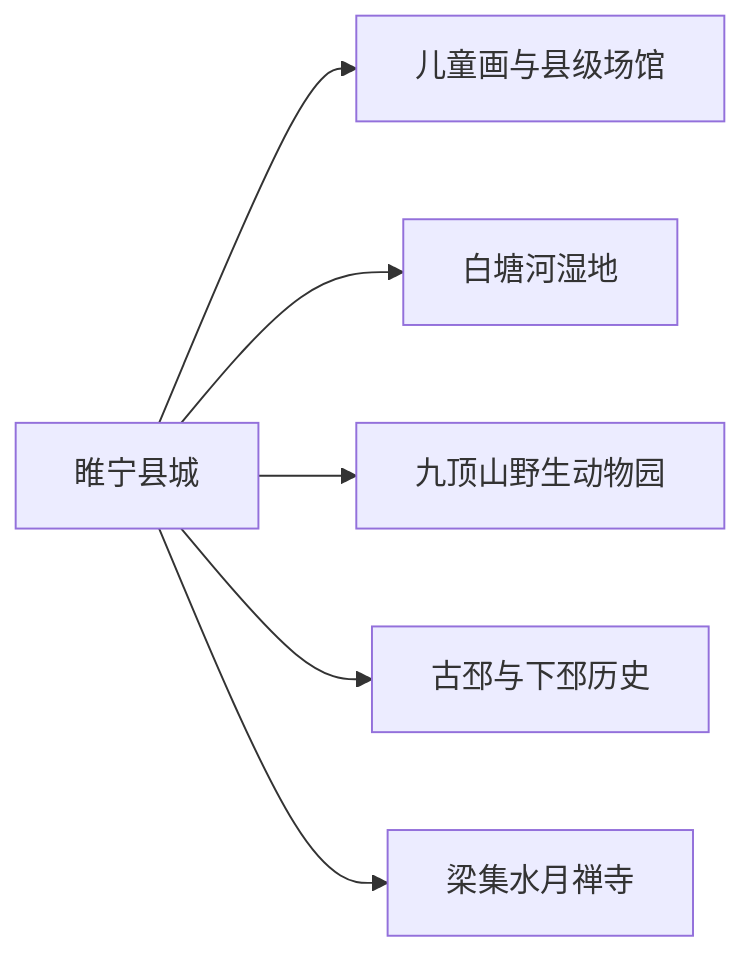
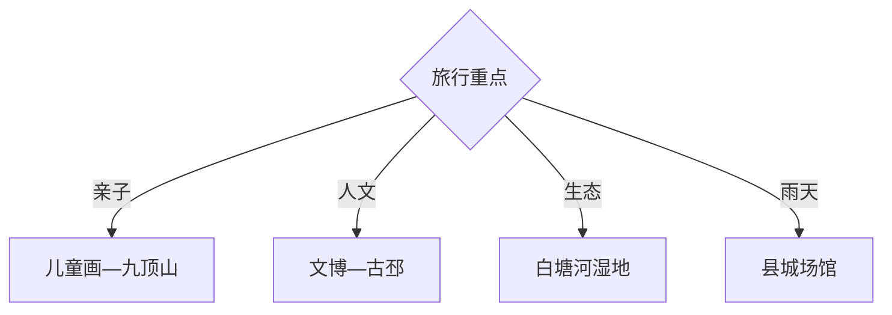

# 睢宁旅行指南

睢宁适合把儿童画与县城公共文化、白塘河湿地、九顶山动物园和下邳历史线组合成1—2天。各点分布在县城与乡镇，先按亲子、人文或湿地确定主线，再核对场馆和景区当期开放。

## 城市速览

| 项目 | 信息 |
|---|---|
| 主线 | 县城文博—儿童画—白塘河—九顶山—古邳或水月禅寺 |
| 停留 | 县城半日至1天；增加远线共2天 |
| 住宿 | 县城交通餐饮便利，远端住宿只为单一主题 |
| 交通 | 从徐州、宿迁等方向铁路或公路进入，乡镇点用公交、正规包车或自驾 |
| 风险 | 暑热雷雨、湿地水情、动物互动规则、乡道夜行 |
| 边界 | 湿地保育区、动物后场、宗教场所、遗址和农业生产区按开放范围进入 |

## 城市格局与游览区域

固定 `Suicheng / GeoNames 1793899` 是睢宁县城人口点，本页以法定县域 `Q1197694` 组织。县城文化设施可连续安排，九顶山、古邳和梁集属于不同方向，一天选择一条远线更稳妥。

## 主要景点

| 景点 | 区域 | 类型 | 核心体验 | 用时 | 环境 | 体力 | 预约风险 | 天气影响 | 优先级 |
|---|---|---|---|---:|---|---|---|---|---|
| 睢宁县博物馆及公共文化中心 | 县城 | 地方文博 | 县史、考古与地方艺术 | 1.5–3小时 | 室内 | 低 | 中 | 低 | A |
| 睢宁儿童画相关展陈 | 县城 | 艺术与非遗 | 儿童画传统、创作与研学 | 1.5–3小时 | 室内 | 低 | 高 | 低 | A |
| 白塘河湿地公园公开区 | 县城周边 | 湿地公园 | 水岸、观鸟与生态慢行 | 2–4小时 | 室外 | 低中 | 中 | 高 | A |
| 徐州九顶山野生动物园 | 县域 | 动物园 | 动物观察与亲子活动 | 半日至1天 | 混合 | 中 | 高 | 高 | A |
| 水月禅寺景区 | 梁集镇 | 宗教建筑 | 寺院空间与地方宗教文化 | 2–4小时 | 混合 | 低中 | 中 | 中 | B |
| 古邳镇与下邳历史公开点 | 古邳镇 | 历史遗址 | 下邳地名、古城线索与镇区文化 | 半日 | 室外为主 | 中 | 高 | 高 | B |
| 睢梁河景观带 | 县城 | 城市滨水 | 夜间照明、慢行与城市生活 | 1–2小时 | 室外 | 低 | 低 | 中 | B |
| 房湾湿地或乡村公开点 | 县域 | 湿地农旅 | 水乡景观与季节乡村 | 半日 | 室外 | 中 | 高 | 很高 | C |

## 美食与餐饮

县城可选徐州风味把子肉、地锅、烙馍和面食，乡镇按当日供应选择家常菜。地锅适合共享，先问辣度与份量；动物园和湿地日自备饮水，野生动植物保持观察距离。

## 经典行程

### 两日基础线
**路线**：县城文博—儿童画—白塘河—次日九顶山。**逻辑**：文化与亲子自然体验分日。**预约锚点**：展陈、动物园。**休息**：县城和园内服务区。**删除条件**：天气不稳时保留县城室内线。

### 县城文化线
**路线**：县博物馆—儿童画展陈—睢梁河景观带。**逻辑**：从地方史到当代艺术再到城市生活。**预约锚点**：开馆与研学。**休息**：公共文化中心。**删除条件**：闭馆时保留滨河短线。

### 九顶山亲子线
**路线**：动物园正式入口—核心展区—午休—教育活动。**逻辑**：完整留给大型园区。**预约锚点**：门票、车辆区和互动规则。**休息**：园内服务点。**删除条件**：极端天气或动物福利管控时取消。

### 湿地慢行线
**路线**：白塘河正式入口—科普区—公开步道—县城。**逻辑**：用半日观察水岸生态。**预约锚点**：开放、水情与观鸟季。**休息**：游客服务点。**删除条件**：汛情、雷暴或保育管控时改场馆。

### 下邳历史线
**路线**：县博物馆—古邳镇—下邳历史公开点。**逻辑**：先用展陈建立年代，再到现场辨认地理。**预约锚点**：接待与讲解。**休息**：古邳镇。**删除条件**：遗址未开放时只保留县城展陈。

### 宗教与乡镇线
**路线**：水月禅寺—梁集镇午餐—乡村公共空间。**逻辑**：围绕单一乡镇慢游。**预约锚点**：寺院开放和活动日。**休息**：梁集镇。**删除条件**：宗教活动或维护期间改白塘河。

### 低体力线
**路线**：县博物馆—儿童画展陈—车辆游睢梁河。**逻辑**：集中县城并减少园区长距离。**预约锚点**：落客与无障碍。**休息**：场馆。**删除条件**：高温时只留室内。

## 住宿区域

睢宁县城适合铁路、公路、餐饮和医疗补给；九顶山周边住宿适合亲子完整日，核对接驳与退改；古邳、梁集等乡镇住宿适合特定活动，确认消防、热水、供餐和夜间交通。

## 市内交通

睢宁站和县城公路客运承担主要进入交通。县城到动物园、古邳、梁集等方向需核对当日公交和返程；自驾关注园区停车与乡道。大型园区按正式游览交通组织，不把工作人员通道作为捷径。

## 不同旅行者须知

亲子家庭优先儿童画与动物园；历史兴趣者选博物馆和古邳；生态旅行者走湿地公开步道；低体力者集中县城。动物互动按年龄与安全规则，湿地保育区、遗址、宗教活动区和农田保留明确限制。

## 行前核对

- 核对博物馆、儿童画展陈、动物园、湿地、寺院和古邳点位开放。
- 核对铁路公交、园区接驳、乡道、雷雨水情及返程时间。
- 动物园遵守投喂与互动规则，湿地走公开步道，宗教场所按现场礼仪参观。

## 来源与更新记录

| 来源 | 支持内容 | 核验日期 |
|---|---|---|
| [徐州市公共资源交易：睢宁县文博设施](https://ggzy.zwb.xz.gov.cn/jyxx/003001/003001006/50.html) | 博物馆、艺术馆、规划馆与图书馆建设 | 2026-09-01 |
| [徐州市公共资源交易：睢梁河等城市空间](https://ggzy.zwb.xz.gov.cn/jyxx/003004/003004002/20260424/e898ff8d-3042-461d-9d51-2c6aff874568.html) | 睢梁河景观带与县城空间 | 2026-09-01 |
| [睢宁县人民政府](http://www.cnsn.gov.cn/) | 县域公告与公共服务入口 | 2026-09-01 |
| [GeoNames 1793899](https://www.geonames.org/1793899/) | Suicheng 固定人口点 | 2026-09-01 |
| [Wikidata Q1197694](https://www.wikidata.org/wiki/Q1197694) | 睢宁县实体与跨库标识 | 2026-09-01 |

| 日期 | 更新 |
|---|---|
| 2026-09-01 | 首次完成睢宁旅行研究，按儿童画、湿地、动物园与下邳历史组织。 |
