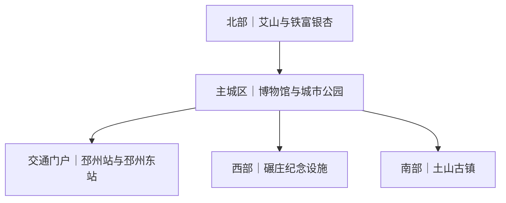

# 邳州旅行指南

邳州位于江苏西北部、徐州以东，是徐州市代管的县级市，也是陇海铁路与京杭大运河交会处的一座独立城市。旅行内容从邳州市博物馆和主城区公园展开，向北延伸到艾山与银杏林，向西可到淮海战役碾庄圩战斗纪念馆，向南另有土山古镇。几组目的地相距较远，适合按片区分日，而不是拼成一条连续步行线。

> 建议停留：2–3 天；只游主城区可压缩为 1 天 
> 旅行关键词：地方文博、艾山、银杏、京杭大运河、淮海战役、土山古镇、苏北饮食 
> 主要体力：主城区中低强度；山地、林区与远端跨片区日为中等至较高强度 
> 最近研究：2026-08-12

## 城市速览

| 项目 | 旅行信息 |
|---|---|
| 主要旅行价值 | 通过地方博物馆、城市水系、艾山与银杏产业景观、革命纪念设施和历史镇落，认识苏北县级城市的历史、生态与当代生活。 |
| 行政与旅行边界 | 邳州法定行政代码为 `320382`，由徐州市代管，但不是徐州主城区的普通远郊。邳州与新沂分别按独立城市规划，景点和线路互不混用。 |
| 建议停留 | 1 天完成博物馆与主城区公园；2 天增加艾山—铁富方向；3 天可再选碾庄纪念线或土山古镇。银杏季、红色主题和古镇主题不必一次全部覆盖。 |
| 较舒适季节 | 春、秋通常更适合户外步行。银杏变色期短且每年不同，不应只按固定日期订行程；盛夏高温、强对流和集中降雨会削弱山地与林区体验，冬季需关注寒潮和结冰。 |
| 预算特点 | 主城区公共文化场馆与公园可构成较低支出的基础行程；艾山门票或内部项目、跨片区车辆、远端住宿和节假日用车是主要增量。 |
| 步行强度 | 博物馆与单个城市公园为低至中等；艾山存在坡道、台阶和较长园路，银杏林、古镇与纪念园区也会增加步数。各片区之间应乘车。 |
| 主要天气风险 | 暴雨、雷暴大风、盛夏高温与城市积水；山林另受防火、落枝和湿滑影响，河湖与运河沿线受水位、施工和管理边界影响。 |
| 独行旅行 | 主城区场馆、早餐和面食容易独立安排；北部、碾庄和土山的返程选择较少，出发前应先锁定交通。八大碗、整鱼和部分羊肉菜更适合多人分享。 |
| 亲子旅行 | 博物馆、桃花岛公园和沙沟湖水杉公园可组成较轻松的一天；山地、水边、林间道路和纪念场馆需要分别处理体力、看护与参观秩序。 |
| 长者与低体力旅行 | 可采用“一座场馆加一处公园、车辆点到点接驳”；艾山长线、银杏林长距离步行和同日跨两个远端镇不利于减负。 |
| 无障碍信息 | 公开资料不足以证明车站、场馆、古镇、山地与林区之间存在连续无障碍路线。入口坡度、电梯、轮椅借用、无障碍卫生间和接驳位置需向各运营方确认。 |

邳州的 Wikidata 实体为 `Q1342853`，其 GeoNames 属性 `P1566` 对应 `1785716`。行政代管关系不会改变这座县级市的独立旅行尺度。

## 城市格局与游览区域

主城区承担铁路到达、住宿、餐饮和文博游览；艾山、银杏时光隧道位于北部铁富方向，碾庄圩战斗纪念馆及李超时纪念馆在碾庄方向，土山古镇又是另一条远端线路。下图只表示相对方位和分日关系，连线不代表存在直达公交。

| 区域 | 主要内容 | 游览特点 | 与其他区域的关系 |
|---|---|---|---|
| 主城区与运河街道 | 邳州市博物馆、桃花岛公园、城市餐饮与生活服务 | 场馆和公园可用公交或短途车辆组合；京杭大运河是城市格局背景，不等于所有岸线都可进入 | 最适合作为住宿与换乘基地；前往北部、碾庄和土山均需公路接驳 |
| 沙沟湖—东湖—高铁片区 | 沙沟湖水杉公园、现代城市公共空间、邳州东站 | 城市尺度较舒展，适合公园短线或铁路抵离，不是传统街巷步行区 | 与主城区可用公交或车辆衔接；住在高铁站附近不等于步行可达博物馆 |
| 铁富—艾山 | 艾山九龙风景区、银杏时光隧道及银杏产业景观 | 山地景区与村镇林带是两个游览单元；秋季客流、交通管制和季相变化明显 | 处于同一北部方向，可在完整一天内组合，但两处之间仍需车辆 |
| 港上及北部银杏片区 | 官方列出的银杏主题公园、古银杏与乡村景观 | 银杏首先是经济林和农业生产体系；只有明确开放的公园、道路和服务区属于旅行空间 | 可作为铁富方向的替代或延伸，不因林木连片就穿越苗圃、农田和村民院落 |
| 碾庄方向 | 淮海战役碾庄圩战斗纪念馆、李超时纪念馆 | 纪念设施适合按历史主题安排，需保持肃静并遵守烈士纪念设施保护规则 | 两馆可在同一镇方向组合；与艾山、土山不宜同日反复折返 |
| 土山方向 | 土山古镇及其关帝庙、明清建筑和革命遗址 | 公共街镇与内部建筑开放状态可能不同，适合独立半日至一日 | 与主城区和碾庄均需公路交通；先确定返程，再决定停留长度 |
| 运河、新港与铁路生产空间 | 京杭大运河、邳州新港、陇海铁路及相关货运设施 | 航道、码头、堆场、专用线、桥梁和水利设施以运输或生产功能为主 | 只在官方开放的公园、客运站和公共道路活动，不把货运港或铁路设施列作景点 |

大墩子遗址等考古地点说明邳州悠久的历史，但文物保护单位或考古遗址的存在不等于设有公众入口。本页只把有现行官方游览或场馆证据的项目列入景点表；未见开放公告的遗址、墓葬和考古工地通过博物馆展陈认识，不自行进入。

## 主要景点

优先级用于安排时间，不代表绝对排名：**A** 为首访核心，**B** 为按兴趣补充，**C** 为远端、季节性或通常需要独立半天以上的目的地。车站、市场入口和观景位置只作为路线节点，不列作独立景点。同一景区及其内部子景点只作为一个项目记录。

### 主城区文博与公园

| 景点 | 区域 | 类型 | 主要看点 | 建议用时 | 室内外 | 体力 | 预约风险 | 天气影响 | 优先级 |
|---|---|---|---|---:|---|---|---|---|---|
| 邳州市博物馆 | 主城区 | 综合博物馆 | “千秋邳邑”历史文化陈列、汉画像石、地方考古与红色文物，从馆藏建立邳州历史框架 | 2–3 小时 | 室内 | 低 | 中 | 低 | A |
| 桃花岛公园 | 主城区 | 城市公园与水系 | 公园水系、公共园林和连接六保河—京杭大运河的城市水系关系；以正式公园范围为游览边界 | 1.5–2.5 小时 | 室外 | 低至中 | 低 | 高 | B |
| 沙沟湖水杉公园 | 沙沟湖片区 | 城市公园 | 大尺度水杉、湖面、园路与新汉风公共景观，适合城市休整和季节观察 | 2–3 小时 | 室外为主 | 中 | 低 | 高 | B |

### 北部山林与银杏

| 景点 | 区域 | 类型 | 主要看点 | 建议用时 | 室内外 | 体力 | 预约风险 | 天气影响 | 优先级 |
|---|---|---|---|---:|---|---|---|---|---|
| 艾山九龙风景区 | 铁富镇 | 山地风景区 | 山地、湖面、宗教建筑与景区园路构成的综合游览单元；只按官方开放入口和线路活动 | 4–6 小时 | 室外为主 | 中高 | 中 | 高 | A |
| 银杏时光隧道 | 铁富镇姚庄村 | 季节性林带与乡村景观 | 成行银杏构成的道路景观，秋季叶色最受关注，也可观察银杏经济林与村镇生活 | 1.5–3 小时 | 室外 | 中 | 中高 | 高 | C |

银杏时光隧道与更大范围的银杏林、银杏博览园或乡村片区不能重复计算。秋季活动、临时交通组织、停车和开放道路应以邳州官方公告为准；不要进入苗圃、采收区、农业机械作业面或无公共入口的林地，也不要攀树、采摘或捡食来源不明的银杏果。

### 历史镇落与纪念设施

| 景点 | 区域 | 类型 | 主要看点 | 建议用时 | 室内外 | 体力 | 预约风险 | 天气影响 | 优先级 |
|---|---|---|---|---:|---|---|---|---|---|
| 淮海战役碾庄圩战斗纪念馆 | 碾庄镇 | 纪念馆与烈士纪念设施 | 战役陈列、纪念碑、烈士安葬区及纪念园区，在战役发生地理解淮海战役碾庄圩战斗 | 2.5–4 小时 | 混合 | 中 | 中 | 中 | B |
| 王杰烈士纪念馆 | 运河街道张楼方向 | 纪念馆与烈士纪念设施 | 王杰烈士事迹陈列、烈士墓和纪念空间，认识王杰精神的形成背景 | 1.5–2.5 小时 | 混合 | 低至中 | 中 | 中 | B |
| 土山古镇 | 土山镇 | 历史镇落与建筑 | 关帝庙、明清建筑、古镇街巷及近现代历史遗址；公共街巷与内部建筑按各自开放规则参观 | 3–5 小时 | 混合 | 中 | 中 | 中至高 | C |

淮海战役碾庄圩战斗纪念馆内部的纪念馆、纪念碑、烈士安葬区、碑林等按一个完整纪念设施记录；王杰烈士墓和事迹陈列馆也不拆开累计。土山古镇与其中关帝庙、历史建筑按一座古镇景区理解。烈士纪念设施保护范围内不得从事与纪念英烈无关或有损纪念氛围的活动。

河湖堤防、水库、灌渠、京杭大运河航道、邳州新港和铁路沿线均不因地图可见而对游客开放。艾山周边存在水土保持与水利工程，遇施工围挡、封育区、泄洪沟、塘坝或防火管制即停止前行；邳州新港为公铁水联运货运设施，不列入游览路线。

## 美食与餐饮

邳州饮食兼有苏北与鲁南风格，常见咸香、胡椒和辣味，煎饼、汤食、羊肉、整鱼与合菜并存。主城区成熟餐饮区最容易控制份量，铁富、八义集等乡镇菜更适合与对应片区同日寻找。以下按菜品类型选择，不把某一家店写成唯一答案。

| 菜品或餐饮类型 | 常见区域 | 一个人用餐与常见份量 | 风味、过敏原与饮食限制 | 排队风险与替代方法 |
|---|---|---|---|---|
| 邳州八大碗 | 主城区地方菜馆、宴席餐饮 | 本质上是成组宴席菜，通常适合多人；独行者先问能否单点其中一两碗或提供小份 | 具体组合会有猪肉、鸡肉、蛋、豆制品、小麦、酱油和高盐汤汁；清真、素食及严重过敏者需逐道确认 | 宴席和节假日风险较高；不必凑齐八碗，可在普通地方菜馆选少量代表菜 |
| 羊肉汤与伏羊菜 | 八义集及全城羊肉餐馆 | 羊肉汤可按碗点，适合单人；羊排、羊席和大盘菜更适合共享 | 羊肉、动物油脂和盐分较高，胡椒或辣椒可明显；清真属性不能只凭“羊肉”判断 | 入伏、冬季和饭点较集中，可改选居民区同类汤馆并提前问份量 |
| 胡辣汤与面点早餐 | 主城区、铁富及居民区早餐店 | 按碗和按个售卖，适合独行与赶车 | 胡椒感较强；汤底可能含肉、蛋、小麦勾芡，油条和包点含麸质并可能交叉接触大豆、芝麻 | 早餐高峰短而集中，错峰选择配料说明清楚的同类店即可 |
| 煎饼卷炸鱼小炒或家常炒菜 | 主城区与乡镇家常菜馆 | 煎饼可按张，炒菜常为共享份；一人先问半份或少点一种 | 小麦麸质、鱼类、花椒和辣椒风险明显；炸鱼有鱼刺，厨房可能共用油锅 | 热门家常菜馆晚餐时拥挤，可改为煎饼加一份现炒蔬菜或小份肉菜 |
| 铁富粉丝糕、豆皮与豆腐菜 | 铁富镇及主城区地方菜馆 | 粉丝糕和豆制品可按份分享，一人先问小份 | 含大豆、山芋淀粉；蘸汁可能含小麦、蚝油或肉汤，“豆制品”不自动等于纯素 | 景区附近选择少时，可在镇区正规餐馆寻找同类菜，不追单一招牌店 |
| 沂河鱼与烤鱼 | 铁富及地方鱼菜馆 | 常按条或重量计价，单人不易控制份量 | 鱼类过敏、鱼刺、辣椒及高盐酱汁是主要风险；下单前确认重量、时价和加工费 | 节假日与晚餐排队较多；以来源可追溯的合法养殖水产替代“野生”营销 |
| 银杏果入菜与银杏制品 | 铁富、银杏主题区域及正规特产销售点 | 只少量品尝加工成熟的产品，不把沿路捡拾果实当零食 | 白果含致敏和有毒成分，不能生食或过量食用；儿童、过敏者和有特殊健康情况者应更加谨慎 | 选择标示原料和生产信息的成品；无法确认处理方式时，改选不含白果的点心或家常菜 |
| 邳州炒货 | 主城区、乡镇正规食品店 | 瓜子、花生等便于小包装购买，适合途中补充 | 花生、坚果、芝麻和调味粉过敏风险高；注意盐、糖及交叉加工 | 节庆集市拥挤时，选择标签、保质期和生产信息完整的同类产品 |

“微辣”“不辣”“素菜”在不同厨房含义不一。点餐时应同时确认辣椒、胡椒、肉汤、酱油、小麦、花生、芝麻、鱼虾和共用油锅；具体餐厅是否营业、菜单与份量仍需当天核对。

## 经典行程

### 一日经典路线

**路线**：邳州市博物馆 → 主城区午餐 → 桃花岛公园 → 沙沟湖水杉公园短线

- **串联逻辑**：上午先用博物馆建立地方历史框架，下午以两座正式城市公园理解水系、绿地和当代城区；场馆与公园之间使用公交或短途车辆，不假定全程连续步行。
- **预约锚点**：邳州市博物馆的闭馆日、临展和入馆规则；两座公园遇大型活动或恶劣天气也需查看公告。
- **休息安排**：博物馆公共区、主城区有固定座位的餐厅，以及公园正式服务节点；不把水边亭台当作雷雨避险场所。
- **时间不足时**：先删沙沟湖长线，只保留博物馆与桃花岛公园；若只剩半天，完整参观博物馆后在主城区短停。

### 两日城市路线

**第 1 天**：邳州市博物馆 → 桃花岛公园 → 主城区晚餐 
**第 2 天**：主城区出发 → 艾山九龙风景区 → 铁富镇休息 → 银杏时光隧道（开放且季相合适时） → 返回

- **串联逻辑**：第一天处理城市历史与公共空间，第二天完整留给北部山林；艾山和铁富银杏处于同一方向，但仍以车辆衔接。
- **预约锚点**：第一天为博物馆，第二天为艾山票务、入口与返程交通；秋季再增加银杏季交通组织和停车公告。
- **休息安排**：第一天在主城区，第二天在艾山游客服务区或铁富镇区有座位的餐饮空间；银杏道路不承担主要午休。
- **时间不足时**：非银杏季直接删除时光隧道；银杏季若客流或返程不稳，也先保留艾山、删除林带延伸。

### 三日深度路线

**第 1 天**：邳州市博物馆 → 桃花岛公园 → 沙沟湖水杉公园短线 
**第 2 天**：艾山九龙风景区 → 铁富镇午餐 → 银杏时光隧道或官方开放的银杏主题空间二选一 
**第 3 天**：淮海战役碾庄圩战斗纪念馆 → 碾庄镇午餐与休息 → 李超时纪念馆 → 返回主城区

- **串联逻辑**：三天分别承担城市文博、北部生态和碾庄革命历史，避免每天跨越多个远端方向。第三天的两处纪念设施位于同一镇方向，内容和参观秩序一致。
- **预约锚点**：博物馆、艾山和两座纪念馆的开放公告；第二、三天都要先锁定往返交通和最后入场时间。
- **休息安排**：主城区成熟商业区、铁富镇区和碾庄镇区；纪念设施内以参观为主，正餐安排在馆外合适区域。
- **时间不足时**：第二天删银杏延伸，第三天删李超时纪念馆；若总行程只有两天，整段碾庄日删除，不压缩成匆忙打卡。

### 雨天路线

**路线**：邳州市博物馆 → 主城区有座位午餐 → 王杰烈士纪念馆的室内陈列

- **适用条件**：仅适用于普通降雨且道路、场馆正常开放。暴雨、雷暴大风、积水或预警升级时减少移动，不前往山地、林带、古镇和河湖岸线。
- **串联逻辑**：两座场馆均从主城区以道路交通衔接，避开山地和长距离露天步行；先在博物馆停留较长时段，再视雨势决定是否前往第二馆。
- **预约锚点**：两馆的闭馆、最后入场、团队接待和展厅开放范围。
- **休息安排**：在主城区商业空间或正规餐厅完成午休，纪念设施内保持安静，不以室外园区作避雨场所。
- **时间不足时**：只保留邳州市博物馆，删除第二馆；不为凑满路线在强降雨中跨区。

### 亲子或低体力路线

**亲子路线**：邳州市博物馆 → 主城区午餐 → 桃花岛公园有护栏和服务设施的短线 
**低体力路线**：邳州市博物馆 → 车辆接驳 → 沙沟湖水杉公园靠近入口的平缓短段 → 返回住宿区

- **串联逻辑**：两条路线都以博物馆为唯一室内锚点，下午各选一座正式城市公园并用车辆接驳，不跨入北部或乡镇方向；亲子与低体力条件不同，因此不合并为同一条长线。
- **减负方式**：亲子路线不叠加艾山和长林带，水边持续看护；低体力路线控制为“一馆一园”，不追求环湖或穿园，事先确认最近下客点和座椅。
- **预约锚点**：博物馆儿童入馆、推车与寄存规则；轮椅、无障碍入口和公园步道连续性需向运营方确认。
- **休息安排**：博物馆公共区、正式餐厅和公园入口附近的可坐区域；先确认卫生间位置。
- **时间不足时**：两条路线都删除公园延伸，只保留博物馆主展和一段主城区休息。

### 土山古镇一日路线

**路线**：主城区 → 土山古镇公共街巷 → 关帝庙及当日开放建筑 → 镇区午餐与休息 → 返回

- **适用条件**：适合对历史镇落和三国文化感兴趣、已确定往返车辆的天气稳定日；公共街巷、文保建筑和活动空间按现场开放边界分别处理。
- **串联逻辑**：全天只走主城区至土山一个往返方向，到达后以古镇公共街巷串联当日开放建筑，不再绕行艾山或碾庄。
- **预约锚点**：古镇内部建筑的开放、票务、节庆交通和返程车辆；不把宣传中的所有历史点位视为同一时段必然开放。
- **休息安排**：使用镇区正规餐饮和景区明确设置的服务区，不在文保建筑门槛、消防通道或居民院落内停留。
- **时间不足时**：先删外围延伸，保留古镇主街和一处开放建筑；返程不稳时整段取消，不与艾山或碾庄硬拼。

## 住宿区域

| 区域 | 优点 | 缺点 | 适合人群 | 交通特点 |
|---|---|---|---|---|
| 主城区运河街道与成熟商业区 | 餐饮、日常服务和城市交通较集中，兼顾博物馆、桃花岛公园和多方向换乘 | 与邳州东站、艾山、碾庄和土山都有距离；具体街段可能有交通噪声 | 首访、两至三日综合行程、依靠公交和短途车辆 | 作为市域换乘基地最均衡，远端日仍需预留公路时间 |
| 邳州站周边 | 对车票实际停靠邳州站的行程接驳直接，生活服务相对成熟 | 站前环境、铁路噪声和步行品质因具体位置而异；不等于所有景点集中 | 普速铁路抵离、短住、早晚乘车 | 购票时确认站名；到博物馆和公园仍可能需要公交或车辆 |
| 邳州东站—高铁片区 | 适合高铁早到晚走，站区道路和新城服务较明确 | 不是传统主城步行核心，晚间餐饮与公交便利度取决于具体地段 | 高铁换乘、商务、只住一晚 | 抵达后通过公交或车辆进入主城区；列车停靠和末班接驳需重查 |
| 沙沟湖—东湖片区 | 接近现代城市公共空间和公园，环境较舒展 | 去北部、碾庄和土山仍需跨片区，公园附近不等于餐饮密集 | 偏好安静、城市公园、现代城区 | 适合车辆接驳，订房时核对到车站和餐饮区的真实距离 |
| 铁富—艾山镇区 | 便于清晨进入艾山或银杏片区，减少北部日往返 | 住宿、夜间餐饮和公共交通选择少于主城区；秋季价格与客流波动明显 | 艾山深度、银杏摄影、愿意住乡镇者 | 依赖公路交通，预订前确认接送、停车、晚间返程和景区入口 |
| 碾庄或土山镇区 | 便于单一红色主题或古镇慢游 | 不适合作为全市通用基地，住宿条件和夜间出行差异较大 | 单一主题、次日继续镇域活动者 | 先确认住宿合法营业、到景点的车辆与次日返程，不用直线距离代替路程 |

本页不推荐未经逐店核验的具体酒店。预订时应确认电梯、无障碍客房、淋浴防滑、夜间噪声、停车、从车站到店的接驳，以及乡镇住宿的前台和餐饮营业时间。

## 市内交通

邳州有邳州站和邳州东站等铁路站名，具体客运状态、停靠车次和到发站必须以购票当日的中国铁路 12306 为准。市内以公交、公路车辆和分段步行为主，北部山林、碾庄与土山不宜仅凭地图估算通勤。

| 场景 | 建议与取舍 | 行前需要重查的内容 |
|---|---|---|
| 从邳州站抵达 | 认准车票上的完整站名，再按住宿和主城区目的地选择公交、出租车或网约车 | 车次是否停靠、出站口、站前施工、夜间上客点和末班公交 |
| 从邳州东站抵达 | 高铁门户与主城区不是同一连续步行区，携行李时车辆接驳更直接 | 列车停靠、公交走向、末班时间、站区施工和夜间车辆供应 |
| 从机场抵达 | 邳州没有民用客运机场；按实际航班比较徐州、连云港等机场与铁路、公路衔接，不只看直线距离 | 航班、机场接驳、跨城末班、道路施工与行李转运时间 |
| 主城区移动 | 公交加短途车辆最实用，单一公园或场馆内部再步行；不把运河两岸和城市公园全部串成步行长线 | 公交临时改道、景点入口、道路施工、积水和共享交通服务区 |
| 前往艾山与铁富银杏 | 白天公路接驳为主，节假日或银杏季先看交通管制；回程车辆比去程更应提前锁定 | 景区专线或城乡公交是否运营、停车、管制道路、返程末班和林区开放 |
| 前往碾庄 | 按纪念馆正式地址选择城乡交通或车辆；镇区内两座纪念馆也需留接驳时间 | 纪念馆开放、公交或客运站、末班、道路施工及团体活动 |
| 前往土山 | 适合完整半日至一天，自驾或预约车辆更容易控制返程；公共交通方案须当日核对 | 班次、下车点、古镇活动交通管制、停车和夜间返程 |
| 步行与骑行 | 只用于场馆、公园、古镇和开放林带内部；跨主城、艾山、碾庄与土山不可依靠连续步行 | 步道施工、共享单车范围、水边封闭、林区防火和夜间照明 |
| 自驾 | 对北部与乡镇日更灵活，但银杏季、节庆和纪念活动可能停车紧张 | 临时交通管制、景区停车、乡镇集市、涉水路段和大货车通道 |
| 水上交通 | 京杭大运河首先是航运与水利空间，不默认存在面向游客的轮渡或游船 | 只有官方公布航线、码头、票务和安全规则后才纳入行程 |

邳州新港已经开展公铁水联运货运业务，属于生产和物流空间。货运码头、堆场、专用线、装卸设备、桥下空间和作业道路不作为观景点；铁路正线、货场、站场非旅客区域和信号设施同样不得进入。铁路摄影只在允许停留的公共区域进行，并遵守无人机、三脚架和重要设施周边规定。

## 不同旅行者须知

| 旅行维度 | 可行条件 | 主要取舍 | 需额外核对 |
|---|---|---|---|
| 独行旅行 | 主城区博物馆、公园、早餐和面食容易单独完成 | 八大碗、整鱼和部分羊肉菜份量偏大；远端回程不能临时碰运气 | 小份菜、末班交通、夜间上客点和乡镇返程 |
| 亲子旅行 | 博物馆加一座城市公园可控制节奏 | 艾山台阶、林区车辆、水边、银杏果和纪念场馆秩序增加看护负担 | 儿童预约、推车路线、亲子卫生间、景区项目年龄与身高规则 |
| 长者或低体力旅行 | 每天一馆一园，跨点乘车，可避开山地长线 | 站区换乘、景区入口至核心点的距离可能高于地图直线距离 | 最近下客点、座椅、园内交通、电梯和轮椅借用 |
| 无障碍需求 | 优先现代馆舍、铁路站和有游客中心的正式入口 | 古镇门槛、山地、林间道路和河湖岸线无法据公开资料确认连续可达 | 设施连续性需向官方确认；逐处询问坡道、电梯、卫生间、轮椅路线和站车协助 |
| 摄影旅行 | 城市水杉、银杏林、艾山和历史镇落题材差异明显 | 银杏季拥挤，山林、纪念设施、文保建筑、铁路和港区拍摄边界不同 | 日出日落开放、三脚架、闪光灯、商业拍摄、无人机与林区防火规则 |
| 预算有限 | 以博物馆、城市公园、公交和日常面食组成主城区一天 | 免费但遥远的乡镇目的地可能增加车辆成本；银杏季住宿与用车波动较大 | 场馆免费或优惠资格、公交、寄存、停车和明码标价 |
| 晚出发或紧凑行程 | 半天只选博物馆加桃花岛公园，或一座纪念馆 | 下午不临时加入艾山、银杏、碾庄和土山，最后入场通常早于闭馆 | 最晚入场、返程列车、行李寄存和夜间公交叫车 |
| 高温、暴雨、寒潮或林火风险 | 普通降雨转室内；高温把户外放在较凉时段；寒潮减少水边和山地停留 | 雷暴、暴雨和大风取消山林、水岸与古镇长线，防火管制时服从封闭 | 邳州重要天气提示、江苏气象预警、景区闭园、积水与交通退改规则 |

## 行前核对

| 核对事项 | 为什么需要重查 | 建议核对时间 | 官方入口 |
|---|---|---|---|
| 邳州市博物馆开放、闭馆日与展览 | 临展、团队活动、维护和入馆方式会变化，常设展厅也可能分区开放 | 排路线前及到访前一日 | [邳州市博物馆晋升国家二级博物馆](http://www.pz.gov.cn/001/001002/20240828/6f065287-0812-49bc-8b01-fb0066fadb73.html)；场馆当日官方渠道 |
| 艾山九龙风景区 | 门票、开放入口、园内交通、宗教活动与山林管理具有时效性 | 购票前、到访前一日及当天 | [邳州市人民政府：游在邳州](http://www.pz.gov.cn/mlxz/007002/007002006/20210126/a971662d-0b45-448b-bb13-a04dc66137d4.html)；[2026 年春节交通管制示例](http://www.pz.gov.cn/govxxgk/014098897_10/2026-02-14/93472a20-2e7d-4e06-8610-d447bac5190e.html) |
| 银杏时光隧道与银杏主题空间 | 叶色、活动、停车、村道交通、农业作业和开放道路每年变化 | 秋季出发前一周、前三日及当天 | [邳州市人民政府：游在邳州](http://www.pz.gov.cn/mlxz/007002/007002006/20210126/a971662d-0b45-448b-bb13-a04dc66137d4.html)；[邳州“银杏黄”](http://www.pz.gov.cn/govxxgk/668379890/2023-11-14/5d85eb46-ddb4-4ff7-b34e-dabc562d77e1.html) |
| 碾庄圩、王杰与李超时纪念设施 | 开放时间、团队接待、纪念活动和保护管理会改变参观节奏 | 确定日期后及到访前一日 | [邳州市人民政府：红色记忆](http://www.pz.gov.cn/mlxz/007002/007002005/20210126/e25c260e-162c-45fe-b86f-c75fabdabe68.html)；[烈士纪念设施保护范围](http://www.pz.gov.cn/govxxgk/014098897_24/2024-12-26/e9591122-eed7-495e-adc4-81bbf941edb7.html) |
| 土山古镇内部建筑与活动 | 公共街巷、文保建筑、展陈和节庆活动不一定同门同票或同时开放 | 排入路线前及到访当天 | [邳州市人民政府：土山古镇](http://www.pz.gov.cn/govxxgk/014098985/2023-04-30/8f9e1345-e454-40ad-9d54-31b1ec34d218.html) |
| 国铁、公交与城乡交通 | 车次、停站、公交线路、末班、施工和节假日专线会调整 | 购票时、出发前一周及当天 | [中国铁路 12306](https://www.12306.cn/)；[公交调整公告示例](http://www.pz.gov.cn/govxxgk/014098897_21/2024-09-02/f6215892-e2ee-498f-91c6-ccf69ff974c6.html) |
| 河湖、运河、艾山水利工程与新港边界 | 水位、施工、泄洪、防汛和货运作业会改变岸线与道路开放 | 前往水边、艾山或新港周边前及现场 | [河湖和水利工程管理范围](http://www.pz.gov.cn/govxxgk/014098897/2020-06-22/c01a6f19-e2ab-4d0e-8c74-88d9e0fdaaf3.html)；[艾山小流域治理](https://ggzy.zwb.xz.gov.cn/jyxx/003003/003003001/20260508/8c4a200a-8de9-48d4-8835-9105ff42da88.html)；[邳州新港货运运行](http://www.pz.gov.cn/001/001002/20260422/3f5efa4f-2571-44c7-bdd6-8f0e3719040b.html) |
| 高温、暴雨、雷暴、寒潮和林火 | 户外景区、林带、古镇道路、河湖岸线和铁路公路都可能受影响 | 出发前三日、每天早晨及进入户外前 | [江苏省气象局](http://js.cma.gov.cn/)；[邳州市重要天气应对工作提示单](http://www.pz.gov.cn/govxxgk/014098897/2025-07-04/2fb7c419-e852-4e55-a363-30bff6e0b974.html) |
| 无障碍设施连续性 | 单个坡道或电梯不能证明从车站、停车点到展厅和卫生间全程可达 | 预约前直接联系各机构 | 场馆、景区、铁路站与酒店官方电话或服务台；资料不足时按“需向官方确认”处理 |
| 餐厅、银杏食品、展览和节庆 | 营业、菜单、份量、食品处理和活动日期变化频繁 | 排入路线前及用餐当天 | 餐厅与主办方官方渠道；[市场监管总局：银杏果风险提示](https://www.samr.gov.cn/spcjs/yjjl/art/2022/art_6b42cdb8f21c418c9095cdea89efca9a.html) |

## 来源与更新记录

### 主要来源

| 来源 | 类型 | 支持内容 | 核验日期 |
|---|---|---|---|
| [邳州市人民政府：邳州概况](http://www.pz.gov.cn/mlxz/007001/20210121/66934ad7-cd88-4cdf-8a66-7045a7033185.html) | 市政府 | 城市位置、陇海铁路与京杭大运河关系、镇街结构、南北文旅格局、交通与产业空间 | 2026-08-12 |
| [江苏省民政厅：江苏省县以上行政区划代码](https://mzt.jiangsu.gov.cn/art/2023/4/25/art_78635_10994579.html) | 省级民政部门 | 邳州法定行政代码 `320382` 及徐州代管关系的代码依据 | 2026-08-12 |
| [邳州市人民政府：游在邳州](http://www.pz.gov.cn/mlxz/007002/007002006/20210126/a971662d-0b45-448b-bb13-a04dc66137d4.html) | 市政府旅游信息 | 艾山、银杏时光隧道、桃花岛公园、沙沟湖水杉公园、银杏主题空间、古栗园和土山古镇的官方游览依据 | 2026-08-12 |
| [邳州市人民政府：邳州市博物馆晋升国家二级博物馆](http://www.pz.gov.cn/001/001002/20240828/6f065287-0812-49bc-8b01-fb0066fadb73.html) | 市政府与文博信息 | 博物馆等级、馆藏规模及“千秋邳邑”、汉画像石和红色文物等展陈结构 | 2026-08-12 |
| [邳州市人民政府：红色记忆](http://www.pz.gov.cn/mlxz/007002/007002005/20210126/e25c260e-162c-45fe-b86f-c75fabdabe68.html) | 市政府旅游与纪念设施信息 | 碾庄圩、王杰、李超时等纪念馆的位置、属性与内部组成 | 2026-08-12 |
| [邳州市退役军人事务局：烈士纪念设施保护范围](http://www.pz.gov.cn/govxxgk/014098897_24/2024-12-26/e9591122-eed7-495e-adc4-81bbf941edb7.html) | 市级主管部门 | 王杰、碾庄圩和李超时纪念设施的正式名称、地址、保护范围与行为边界 | 2026-08-12 |
| [土山镇：畅游土山古镇](http://www.pz.gov.cn/govxxgk/014098985/2023-04-30/8f9e1345-e454-40ad-9d54-31b1ec34d218.html) | 镇政府与官方旅游信息 | 土山古镇作为现行旅游目的地及其历史文化主题 | 2026-08-12 |
| [邳州市市场监督管理局：邳州八大碗制作规范](http://www.pz.gov.cn/govxxgk/014098897_5/2024-10-12/ed33c6f1-a5cd-44ff-8beb-714facc3eb14.html) | 市级市场监管部门 | 邳州八大碗的地方特色餐饮属性与标准化背景 | 2026-08-12 |
| [铁富镇：味道邳州](http://www.pz.gov.cn/govxxgk/668379890/2022-08-16/839e49be-4518-45f5-b8dd-022638ac738b.html) | 镇政府 | 铁富粉丝糕、豆制品、胡辣汤、煎饼、鱼菜和银杏入菜等饮食线索 | 2026-08-12 |
| [八义集镇：伏羊美食文化](http://www.pz.gov.cn/govxxgk/014098141/2020-07-25/cb1896fa-4f34-409f-a633-67bb66bbab0b.html) | 镇政府 | 入伏食羊肉、喝羊肉汤的地区饮食文化 | 2026-08-12 |
| [国家市场监督管理总局：银杏果风险提示](https://www.samr.gov.cn/spcjs/yjjl/art/2022/art_6b42cdb8f21c418c9095cdea89efca9a.html) | 国家级食品安全主管部门 | 白果不能生食或过量食用、致敏与加工风险 | 2026-08-12 |
| [邳州市河湖和水利工程管理与保护范围公告](http://www.pz.gov.cn/govxxgk/014098897/2020-06-22/c01a6f19-e2ab-4d0e-8c74-88d9e0fdaaf3.html) | 市政府与水务部门 | 运河、河湖、堤防和水利工程存在法定管理保护边界 | 2026-08-12 |
| [徐州市公共资源交易平台：艾山小流域综合治理](https://ggzy.zwb.xz.gov.cn/jyxx/003003/003003001/20260508/8c4a200a-8de9-48d4-8835-9105ff42da88.html) | 市级公共机构与水务工程 | 艾山周边泄洪沟、塘坝、防汛道路和封育治理的施工与安全背景 | 2026-08-12 |
| [邳州市人民政府：邳州新港公铁水联运运行](http://www.pz.gov.cn/001/001002/20260422/3f5efa4f-2571-44c7-bdd6-8f0e3719040b.html) | 市政府与交通信息 | 新港的货运、煤炭专列和公铁水联运生产属性，用于明确生产区域边界 | 2026-08-12 |
| [中国铁路 12306](https://www.12306.cn/) | 铁路运营方 | 邳州站、邳州东站的现行客运车次、停靠站与购票入口 | 2026-08-12 |
| [江苏省气象局](http://js.cma.gov.cn/) | 气象主管部门 | 江苏及邳州方向的高温、暴雨、雷暴大风、寒潮等动态预警入口 | 2026-08-12 |
| [GeoNames：Pizhou `1785716`](https://www.geonames.org/1785716/pizhou.html) | 开放地名数据（CC BY 4.0） | 项目固定快照中的邳州城市记录与 GeoNames ID | 2026-08-12 |
| [Wikidata：邳州市 `Q1342853`](https://www.wikidata.org/wiki/Q1342853) | 开放结构化数据（CC0） | 邳州县级市实体、行政代码与 `P1566=1785716` 标识对应 | 2026-08-12 |

### 更新记录

| 日期 | 更新内容 |
|---|---|
| 2026-08-12 | 首次整理邳州行政与旅行边界、城市格局、景区关系、餐饮、路线、住宿、交通、通用旅行条件，以及林业农业生产、河湖水利、文保考古、港区铁路安全边界。 |
