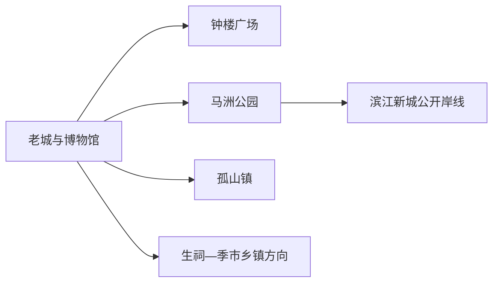
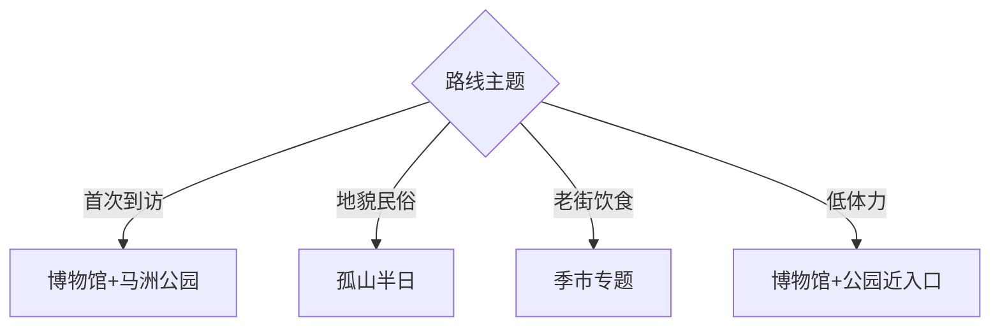

# 靖江旅行指南

靖江位于长江北岸，与江阴隔江相望，旅行主线是马洲沙洲城市史、孤山地貌、滨江公共空间和以蟹黄汤包、江鲜为代表的地方饮食。固定 **Jingjiang / GeoNames 1805639** 对应现行靖江市，不是其他地区同名街道。

## 城市速览

| 项目 | 信息 |
|---|---|
| 主线 | 靖江博物馆—马洲公园—钟楼广场—滨江新城 |
| 停留 | 主城1天；孤山或乡镇主题另加半天 |
| 住宿 | 老城便于餐饮与公交；滨江新城适合公园和次日跨江 |
| 交通 | 泰州、无锡和江阴方向以公路接入，市内公交与短途车辆串联 |
| 风险 | 长江岸线、船厂港区、汛期水位、雷雨大风和节假日餐饮排队 |

## 城市格局与游览区域

老城适合地方史、餐饮和日常街区，马洲公园与滨江新城展示水利、沙洲和现代城市空间。孤山位于北部，是地质与民俗专题点；长江沿线同时分布船厂、码头和工业设施，旅行活动集中在明确开放的公园、展馆和公共岸线。

## 主要景点

| 景点 | 区域 | 类型 | 核心体验 | 用时 | 环境 | 体力 | 研究价值 | 拥挤 | 优先级 |
|---|---|---|---|---:|---|---|---|---|---|
| 靖江市博物馆 | 主城 | 博物馆 | 马洲成陆、城市史与地方文化 | 2小时 | 室内 | 低 | 很高 | 团体时中 | A |
| 马洲公园 | 滨江新城 | 城市公园 | 容湖、水利景观和沙洲主题浮雕 | 2–3小时 | 室外 | 低中 | 高 | 周末中 | A |
| 钟楼广场与老城街区 | 老城 | 城市街区 | 城市地标、日常商业与饮食 | 1–2小时 | 混合 | 低 | 中 | 用餐时高 | B |
| 滨江新城公开岸线 | 城南 | 滨江空间 | 长江视野、堤岸与现代城市界面 | 1–2小时 | 室外 | 低中 | 中 | 周末中 | B |
| 孤山 | 孤山镇 | 地质与民俗 | 江北孤丘、山体步道与庙会文化 | 2–3小时 | 室外 | 中 | 高 | 庙会时高 | A |
| 岳王庙公开区 | 生祠方向 | 历史纪念 | 岳飞文化与地方纪念传统 | 1小时 | 混合 | 低 | 中 | 节庆时中 | B |
| 季市老街公开段 | 季市镇 | 历史街镇 | 水乡集镇格局与地方小吃 | 1–2小时 | 室外 | 低 | 高 | 节假日中 | B |
| 牧城公园 | 滨江片区 | 湿地公园 | 河岸绿地与低体力休闲 | 1–2小时 | 室外 | 低 | 中 | 周末中 | C |
| 刘国钧故居公开展陈 | 生祠方向 | 名人史迹 | 工商业人物与近代地方史 | 1小时 | 室内 | 低 | 高 | 团体时中 | B |

## 美食与餐饮

靖江蟹黄汤包、江鲜、肉脯和季市风味适合按季节选择。汤包出笼温度高，先开口散热再食用；江鲜按禁捕规定和正规供应链选择，点单时确认时价、重量与加工费。甲壳类、鱼类、芝麻和猪肉过敏或饮食限制需逐项询问馅料、汤底和共用厨具。

## 经典行程

### 一日基础线
**路线**：靖江市博物馆—老城午餐—马洲公园—滨江新城。**逻辑**：先读马洲城市史，再进入水利和长江空间。**预约锚点**：博物馆。**休息**：老城与马洲公园服务区。**删除条件**：大风雷雨时删岸线。

### 城市历史线
**路线**：博物馆—钟楼广场—老城街区。**逻辑**：从展陈走进今天的城市生活。**预约锚点**：馆舍开放。**休息**：老城餐饮。**删除条件**：时间不足时保留博物馆。

### 孤山半日线
**路线**：主城—孤山公开步道—镇区休息—返城。**逻辑**：围绕江北孤丘完成单一主题。**预约锚点**：山体开放和庙会交通。**休息**：山脚。**删除条件**：雷雨、结冰或人流管制时改博物馆。

### 滨江公园线
**路线**：马洲公园—牧城公园—公开岸线短段。**逻辑**：用公园观察沙洲、水利与现代滨江。**预约锚点**：汛情和公园公告。**休息**：马洲公园。**删除条件**：高水位、大风或施工时只留内湖段。

### 季市饮食线
**路线**：季市老街公开段—正规餐馆—乡镇公共文化点。**逻辑**：以集镇生活和饮食为主。**预约锚点**：店铺营业与返程。**休息**：镇区。**删除条件**：接驳不足时改老城餐饮。

### 亲子低体力线
**路线**：博物馆—午休—马洲公园近入口。**逻辑**：室内展陈搭配平缓绿地。**预约锚点**：亲子活动和无障碍入口。**休息**：每站坐休。**删除条件**：高温时缩短公园。

### 雨天线
**路线**：博物馆—老城餐饮—已确认开放的文化场馆。**逻辑**：减少跨片区移动。**预约锚点**：馆舍最晚入场。**休息**：室内商业。**删除条件**：强对流时提前返宿。

## 住宿区域

老城适合地方餐饮、博物馆和公交；马洲公园—滨江新城适合低噪住宿、晨间公园与跨江公路出发；孤山和季市方向以专题行程为主，多数游客当天往返主城更方便。

## 市内交通

靖江以公路交通为主，可从泰州、无锡、江阴等方向接入。主城点位用公交和短途车辆，孤山、季市、生祠需预留返程。跨江通道是交通设施，船厂、码头、仓储和生产岸线按安保与作业边界管理。

## 不同旅行者须知

城市史旅行者优先博物馆和马洲公园；地貌爱好者选择孤山；饮食旅行者把汤包和江鲜安排在正规餐馆；长者、儿童和轮椅使用者以博物馆、马洲公园平缓段为主，并确认连续无障碍路线。

## 行前核对

- 核对博物馆、名人故居和乡镇文化点的开放与预约。
- 核对长江水位、雷雨大风、孤山步道与返程交通。
- 进入江岸时选择开放公园和观景区，港口、船厂与作业堤段遵守明确限制。

## 来源与更新记录

| 来源 | 支持内容 | 核验日期 |
|---|---|---|
| [靖江市政府：马洲公园](https://www.jingjiang.gov.cn/zjjj/mljj/art/2017/art_37c8c66d3e1249ccbc1b2a0bf3b53889.html) | 容湖、公园格局与沙洲文化浮雕 | 2026-09-01 |
| [靖江市政府：孤山风景区](https://www.jingjiang.gov.cn/zjjj/mljj/art/2017/art_e2fcb998ae93442ea3574110b5608fd8.html) | 孤山地貌、庙会与公开景点 | 2026-09-01 |
| [靖江市政府](https://www.jingjiang.gov.cn/) | 当前公共信息与行前核对入口 | 2026-09-01 |
| [GeoNames 1805639](https://www.geonames.org/1805639/) | Jingjiang 固定人口点与位置 | 2026-09-01 |

| 日期 | 更新 |
|---|---|
| 2026-09-01 | 首次完成靖江旅行研究；区分公共滨江空间与港口船厂生产岸线。 |
