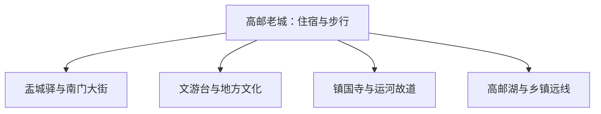

# 高邮旅行指南

高邮以邮驿文化、大运河遗产和湖城生活见长。老城的盂城驿、南门大街、文游台适合连续步行；镇国寺、大运河故道和高邮湖在城市西侧，应根据水情、交通和开放条件单独安排。

> 建议停留：2 天；加入湖区或乡镇为 3 天<br>
> 旅行关键词：盂城驿、大运河、镇国寺、文游台、高邮湖、咸鸭蛋<br>
> 主要体力：老城低至中等；湖区和乡镇为中等<br>
> 最近研究：2026-08-13

## 城市速览

| 项目 | 旅行信息 |
|---|---|
| 主要旅行价值 | 在老城与运河西岸理解中国邮驿、运河水利、地方文学与湖区生活 |
| 建议停留 | 1 天看老城；2 天增加镇国寺与运河；3 天再选湖区或乡镇远线 |
| 较舒适季节 | 春秋适合老城步行；夏季湿热多雨，湖区与运河受水位和雷暴影响 |
| 预算特点 | 老城中低预算，湖区车辆、船舶或乡镇远线增加支出 |
| 步行强度 | 老城可连续走，古建台阶与运河西岸接驳带来额外负担 |
| 主要天气风险 | 梅雨、短时强降雨、雷电、高温、湖面大风与洪水调度 |
| 独行旅行 | 老城餐饮和住宿方便，湖区项目先锁返程 |
| 亲子旅行 | 邮驿、博物馆和运河科普可组合，临水活动核救生与年龄规则 |
| 长者与低体力旅行 | 住宿选老城或车站附近，镇国寺与老城分时安排 |
| 无障碍信息 | 城区公共空间可提前询问；古驿、古塔、堤岸和船舶资料有限，设施连续性需向官方确认 |

## 城市格局与游览区域

高邮市由扬州市代管，法定代码 **321084**。GeoNames `1810309`、Wikidata `Q1253949` 和法定代码精确对应。京杭大运河从城市西侧通过，高邮湖位于更西方向；老城、运河遗产与湖区不是一段连续步行路线。



| 区域 | 主要内容 | 游览特点 | 与其他区域的关系 |
|---|---|---|---|
| 南门老城 | 盂城驿、南门大街和历史街巷 | 可连续步行，适合一整段 | 与镇国寺需跨运河或车辆接驳 |
| 文游台—城区文化 | 文游台、抗战纪念与公共展馆 | 室内外结合，适合补足半日 | 可与老城同日组合 |
| 运河西岸 | 镇国寺、运河故道和堤岸公开段 | 临水、古建与水利并存 | 受水情、施工与交通影响 |
| 高邮湖与乡镇 | 正式湖区项目、菱塘、界首等 | 往返时间长，季节性明显 | 每次选择一个有明确接待的方向 |

## 主要景点

### 老城与运河

| 景点 | 区域 | 类型 | 主要看点 | 建议用时 | 室内外 | 体力 | 预约风险 | 天气影响 | 优先级 |
|---|---|---|---|---:|---|---|---|---|---|
| 盂城驿景区 | 南门老城 | 古建、邮驿文化 | 明代驿站、邮驿展陈和完整院落游线 | 2–4 小时 | 混合 | 低至中 | 中 | 中 | A |
| 南门大街与高邮当铺公开区域 | 老城 | 历史街区、古建 | 老城街巷、传统商业和当期开放院落 | 1.5–3 小时 | 混合 | 低 | 中 | 中 | B |
| 文游台景区 | 城区 | 文学、古建 | 秦观文化、园林和当期展陈 | 1.5–3 小时 | 混合 | 低至中 | 中 | 中 | A |
| 镇国寺景区 | 运河西岸 | 古建、运河遗产 | 古塔、寺院与大运河环境 | 2–3 小时 | 混合 | 低至中 | 中 | 高 | A |
| 抗日战争最后一役纪念馆 | 城区 | 纪念馆 | 抗战史与地方历史展陈 | 1.5–3 小时 | 室内 | 低 | 中 | 低 | B |

### 湖区、遗址与乡镇

| 景点 | 区域 | 类型 | 主要看点 | 建议用时 | 室内外 | 体力 | 预约风险 | 天气影响 | 优先级 |
|---|---|---|---|---:|---|---|---|---|---|
| 高邮湖正式游览项目 | 湖区 | 湖泊、水上体验 | 持证码头、合规航线和湖滨公共空间 | 半天至 1 天 | 室外 | 中 | 高 | 极高 | B |
| 龙虬庄遗址公开展示 | 龙虬镇方向 | 考古遗址 | 新石器时代遗址及正式展示范围 | 3–5 小时 | 混合 | 中 | 高 | 高 | B |
| 菱塘回族乡公开文化点 | 菱塘方向 | 社区、建筑文化 | 古清真寺等正式开放空间与乡镇生活 | 半天至 1 天 | 混合 | 中 | 高 | 高 | C |
| 界首古镇公开段 | 北部乡镇 | 古镇、运河文化 | 老街、运河节点与当期开放展陈 | 半天至 1 天 | 混合 | 中 | 高 | 高 | C |

盂城驿内部建筑和邮驿博物馆按一个完整景区游览。大运河航道、堤防、水闸、泵站和高邮湖生产水面承担航运、防洪或渔业功能；旅行选择公共堤岸、正式景区、持证码头与公布航线。

## 美食与餐饮

| 菜品或餐饮类型 | 常见区域 | 一个人用餐与常见份量 | 风味、过敏原与饮食限制 | 排队风险与替代方法 |
|---|---|---|---|---|
| 高邮咸鸭蛋 | 老城、正规商店 | 一枚或小包装适合尝鲜 | 含蛋，盐分较高；包装品看许可、日期和储存 | 选有完整标签的小包装 |
| 蒲包肉等地方熟食 | 城区 | 切小份适合分享 | 含猪肉、盐和香辛料，冷食注意储存 | 选择有许可、现切现售门店 |
| 运河湖鲜 | 城区正规餐馆 | 多按份或重量，一人先问小份 | 鱼刺与水产过敏；看来源、时价和加工费 | 改点明码标价的养殖鱼或家常菜 |
| 界首茶干与董糖 | 老城、界首及正规特产店 | 小包装作点心或手信 | 茶干含大豆，董糖可能含芝麻、糖与坚果 | 看配料和过敏原标签 |

## 经典行程

```mermaid
flowchart TD
    S["先走老城邮驿线"] --> O["盂城驿与南门大街"]
    O --> D{ "是否再有一天" }
    D -->|是| W["镇国寺与运河西岸"]
    D -->|否| C["文游台或纪念馆收尾"]
    W --> F{ "第三天" }
    F -->|有| L["湖区或乡镇择一"]
    F -->|无| X["返程"]
```

### 一日经典路线

**路线**：盂城驿 → 南门大街 → 城区午餐 → 文游台或纪念馆

- **串联逻辑**：上午沿老城理解邮驿，下午用文学或历史场馆补充背景。
- **预约锚点**：盂城驿、文游台、纪念馆闭馆日和老城停车。
- **休息安排**：南门大街或城区坐席午餐，下午在场馆休息。
- **时间不足时**：保留盂城驿与南门大街。

### 两日城市路线

**第 1 天**：盂城驿—老城；**第 2 天**：镇国寺 → 运河公开岸线 → 城区。

- **串联逻辑**：老城和运河西岸分日，避免跨河接驳挤压古建参观。
- **预约锚点**：镇国寺开放、道路/桥梁、运河水情和住宿。
- **休息安排**：第二天午间回城区或正式游客服务区。
- **时间不足时**：第二天只留镇国寺。

### 三日深度路线

**第 1 天**：老城；**第 2 天**：运河西岸；**第 3 天**：高邮湖、龙虬庄或一个乡镇方向择一。

- **串联逻辑**：前两天完成城市核心，第三天按兴趣选择水上、考古或乡镇文化。
- **预约锚点**：湖区船线、遗址/乡镇接待、车辆和天气。
- **休息安排**：远线使用正式服务点，日落前回城区。
- **时间不足时**：整段删第 3 天。

### 雨天路线

**路线**：抗战纪念馆 → 午餐 → 盂城驿或文游台当期开放室内展陈

- **适用条件**：普通降雨且城区无积水；暴雨和洪水预警时避开湖区与堤岸。
- **预约锚点**：闭馆、积水、公交和水情。
- **休息安排**：场馆间短程车辆，保留午间长休。
- **时间不足时**：只留一处室内场馆。

### 亲子或低体力路线

**亲子路线**：盂城驿邮驿展陈 → 午休 → 纪念馆<br>
**低体力路线**：文游台可达部分 → 午餐 → 南门大街短段

- **减负方式**：亲子线以叙事展陈为主；低体力线缩短堤岸和古建台阶。
- **预约锚点**：讲解、儿童活动、场馆电梯和上下客点。
- **休息安排**：午间回老城住宿区，下午可提前结束。
- **时间不足时**：两条路线都只保留首个核心点。

### 远郊一日路线

**路线**：高邮城区 → 高邮湖正式项目、龙虬庄或一个乡镇方向 → 城区

- **适用条件**：水情、开放、车辆和返程均确认；三个方向择一。
- **预约锚点**：码头/场馆、天气、乡镇接待和返程。
- **休息安排**：在正式游客中心或镇区午休。
- **时间不足时**：改为镇国寺与城区运河短段。

## 住宿区域

| 区域 | 优点 | 缺点 | 适合人群 | 交通特点 |
|---|---|---|---|---|
| 南门老城附近 | 步行进入盂城驿与历史街区 | 停车、隔音和老建筑电梯条件差异大 | 首访、文化主题者 | 核对真实步行距离和停车 |
| 高邮城区或车站方向 | 餐饮、铁路和跨区车辆方便 | 老城氛围较弱 | 多日、无车、早晚车次者 | 适合去运河与远线 |
| 湖区正式住宿 | 靠近湖景和水上项目 | 船班、餐饮与天气依赖高 | 湖区休闲、自驾者 | 先确认运营、停车与退改 |

## 市内交通

| 场景 | 建议与取舍 | 行前需要重查的内容 |
|---|---|---|
| 铁路抵达 | 高邮站与高邮北站服务片区不同，以车票站名选住宿与接驳 | 12306、公交、末班和夜间到达 |
| 老城步行 | 盂城驿—南门大街适合连续步行 | 高温、降雨、施工和石板路 |
| 前往镇国寺与湖区 | 公交、出租或正规预约车辆，船线另行购票 | 桥梁道路、水情、码头和返程 |
| 自驾 | 适合乡镇与湖区 | 洪水、堤路管理、停车和充电 |

## 不同旅行者须知

| 旅行维度 | 可行条件 | 主要取舍 | 需额外核对 |
|---|---|---|---|
| 独行旅行 | 老城和场馆易自行组合 | 湖区与乡镇提前锁返程 | 末班与码头联系方式 |
| 亲子旅行 | 邮驿与运河科普较合适 | 临水和古建台阶增加照看 | 年龄、救生、推车与讲解 |
| 长者或低体力旅行 | 老城附近住宿、短车接驳 | 古驿院落和堤岸仍有台阶/距离 | 电梯、座椅与入口 |
| 无障碍需求 | 优先新建场馆和城区公共空间 | 古驿、古塔、堤岸和船舶资料不足 | 设施连续性需向官方确认 |
| 摄影旅行 | 老城、运河与湖区可分主题 | 航道、文物与无人机拍摄有规则 | 日出开放、设备与许可 |
| 特殊天气 | 城区场馆可替代 | 暴雨、大风与洪水调度影响湖区 | 气象、水利和景区公告 |

## 行前核对

| 核对事项 | 为什么需要重查 | 建议核对时间 | 官方入口 |
|---|---|---|---|
| 盂城驿、镇国寺与场馆 | 闭馆、活动和修缮会调整 | 到访前一日 | [高邮市人民政府](https://www.gaoyou.gov.cn/) |
| 湖区与运河水情 | 水位、风浪和防洪影响码头与堤岸 | 出发前三日及当天 | [江苏省水利厅](https://jswater.jiangsu.gov.cn/) |
| 铁路与公交 | 两站、末班和接驳影响住宿选择 | 购票时及出发当天 | [中国铁路 12306](https://www.12306.cn/) |
| 天气 | 梅雨、雷暴、高温与大风影响户外 | 出发前三日及当天 | [江苏省气象局](http://js.cma.gov.cn/) |

## 来源与更新记录

### 主要来源

| 来源 | 类型 | 支持内容 | 核验日期 |
|---|---|---|---|
| [高邮市人民政府](https://www.gaoyou.gov.cn/) | 市政府 | 属地公告、场馆、交通与动态入口 | 2026-08-13 |
| [高邮全域旅游资料](https://www.gytoday.cn/yw/2018-12-21/64476.html) | 市级媒体 | 盂城驿、文游台、镇国寺、运河与乡镇文旅格局 | 2026-08-13 |
| [江苏省人大：扬州市大运河文化遗产保护条例](https://www.jsrd.gov.cn/qwfb/d_sjfg/202304/t20230410_1191701.shtml) | 地方性法规 | 高邮大运河遗产点和保护边界 | 2026-08-13 |
| [新华网江苏：高邮文旅](https://js.news.cn/20251225/7ed05f2524b04372beb01525fcfa0216/c.html) | 中央媒体地方频道 | 盂城驿、文游台、乡村与地方食品的现行文旅背景 | 2026-08-13 |
| [民政部行政区划查询](https://dmfw.mca.gov.cn/xzqh/getList?code=32&trimCode=true&maxLevel=3) | 政府开放接口 | 高邮市代码 `321084` 与扬州代管关系 | 2026-08-13 |
| [GeoNames 1810309](https://www.geonames.org/1810309/gaoyou.html) | 开放地理数据 | 固定城市点与 PPLA3 分类 | 2026-08-13 |
| [Wikidata Q1253949](https://www.wikidata.org/wiki/Q1253949) | 开放知识图谱 | 高邮市实体、P1566 与法定代码 | 2026-08-13 |
| [中国铁路 12306](https://www.12306.cn/) | 铁路运营方 | 高邮站、高邮北站与车次核对 | 2026-08-13 |

### 更新记录

| 日期 | 更新内容 |
|---|---|
| 2026-08-13 | 首次完成高邮独立旅行研究；扬州父页收敛为行政关系和跨城链接。 |
