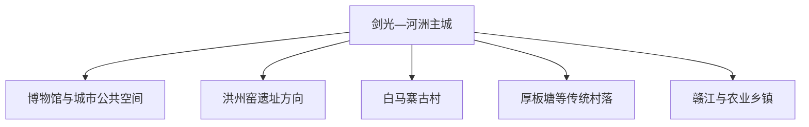
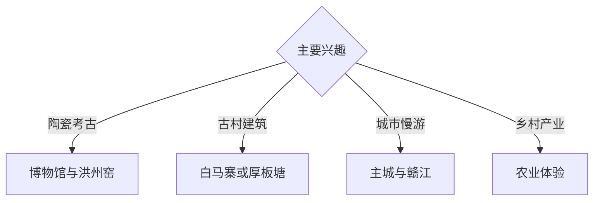

# 丰城旅行指南

丰城位于赣江中游，以洪州窑、剑文化、古村、富硒农业与河洲城市生活构成独立旅行主题。固定快照中的 **Jianguang / GeoNames 1806248** 锚定剑光一带主城；洪州窑遗址、白马寨与厚板塘等方向需要分别安排车程。

## 城市速览

| 项目 | 信息 |
|---|---|
| 主线 | 剑邑主城—洪州窑—传统村落—赣江与农业 |
| 停留 | 主城 1 天；窑址或古村方向各另留半日至 1 天 |
| 住宿 | 剑光—河洲主城便于餐饮、铁路与多方向接驳 |
| 交通 | 铁路与公路抵达，乡镇远点宜约车或自驾 |
| 季节 | 春秋适合古村与遗址；汛期关注赣江水位与乡村道路 |
| 预算 | 文博与城市慢行支出较低，远郊车辆是主要增量成本 |

## 城市格局与游览区域

主城承担住宿、餐饮和铁路接驳；洪州窑强调考古与陶瓷史，古村方向强调聚落与地方生活。遗址保护区、古建内部、赣江行洪空间和农业生产区依公告及现场边界参观。

## 主要景点

| 景点 | 区域 | 类型 | 核心体验 | 用时 | 环境 | 体力 | 研究价值 | 拥挤 | 优先级 |
|---|---|---|---|---:|---|---|---|---|---|
| 丰城市博物馆—洪州窑博物馆 | 主城 | 博物馆 | 洪州窑、剑邑历史与地方文物 | 2–3 小时 | 室内 | 低 | 很高 | 低 | A |
| 剑邑广场与主城公共空间 | 主城 | 城市漫行 | 城市尺度、居民生活与地方记忆 | 1–2 小时 | 室外 | 低 | 中 | 傍晚中 | B |
| 洪州窑遗址依法开放点 | 曲江等方向 | 考古遗址 | 青瓷窑业、窑址分布与考古保护 | 半天 | 室外 | 中 | 很高 | 低 | A |
| 白马寨传统村落公开区 | 张巷方向 | 古村 | 赣派民居、巷道与宗族聚落 | 半天 | 混合 | 低中 | 高 | 节假日中 | A |
| 厚板塘传统村落公开区 | 筱塘方向 | 古村 | 古建、乡土空间与地方生活 | 半天 | 混合 | 低中 | 高 | 低 | B |
| 赣江公共滨水空间 | 市域北部 | 河流景观 | 江河城市、堤岸与落日 | 2 小时 | 室外 | 低 | 中 | 傍晚中 | B |
| 富硒农业公开体验点 | 乡镇 | 农业体验 | 稻作、农产品与乡村产业 | 半天 | 室外 | 低中 | 中 | 季节性 | C |

## 美食与餐饮

丰城冻米糖、米粉、米粑、地方河鲜和赣菜小炒适合分餐体验。主城生活街区选择较密集；品尝河鲜时按当季供应点单，富硒属于产地与产业标签，具体营养信息以规范标识为准。

## 经典行程

### 主城一日线
**路线**：博物馆—地方午餐—剑邑公共空间—滨水慢行。**逻辑**：先建立地方史，再观察当代城市。**预约锚点**：博物馆开放。**休息**：主城商业区。**删除条件**：高温时缩短滨水段。

### 洪州窑专题线
**路线**：博物馆陶瓷展—依法开放窑址—返城。**逻辑**：展厅信息为野外遗址提供背景。**预约锚点**：遗址开放与车辆。**休息**：主城。**删除条件**：暴雨或遗址暂停开放时保留博物馆。

### 白马寨古村线
**路线**：主城—白马寨公开街巷—地方午餐—返程。**逻辑**：给完整聚落半天以上。**预约锚点**：古建开放。**休息**：村镇正规餐饮点。**删除条件**：道路受天气影响时改主城。

### 厚板塘古村线
**路线**：主城—厚板塘公开区—乡村景观—返程。**逻辑**：聚焦赣派建筑与生活空间。**预约锚点**：车辆和讲解。**休息**：镇区。**删除条件**：时间不足时与白马寨二选一。

### 赣江慢游线
**路线**：主城文博—公共堤岸—城市公园—晚餐。**逻辑**：用低体力路线理解河流城市。**预约锚点**：汛情公告。**休息**：滨水公共服务区。**删除条件**：高水位或雷雨时转室内。

### 亲子低体力线
**路线**：博物馆—主城午餐—短段公园。**逻辑**：室内外切换且步行可控。**预约锚点**：亲子活动。**休息**：主城。**删除条件**：疲劳时保留博物馆。

### 两日组合线
**路线**：首日主城与博物馆；次日洪州窑或一个古村。**逻辑**：考古与乡村方向分日。**预约锚点**：第二日车辆。**休息**：连续住主城。**删除条件**：一天时保留主城线。

## 住宿区域

剑光—河洲主城适合铁路接驳、餐饮和多方向出发；古村附近正规住宿更适合慢游。订房核对车站距离、夜间接驳、消防、停车和汛期退改。

## 市内交通

铁路站点与主城之间使用公交或出租车；洪州窑、白马寨、厚板塘及农业乡镇提前确认城乡班次与返程。自驾按古村停车、堤岸交通和乡村窄路组织行驶。

## 不同旅行者须知

陶瓷史旅行者把博物馆放在窑址之前；建筑兴趣者在两座古村中择一深游；亲子家庭选择文博与主城公园；摄影者优先清晨古村或傍晚滨水。考古探方、文物本体、宗祠非开放空间、堤防作业区与农田保留明确限制。

## 行前核对

- 核对博物馆、洪州窑依法开放点与古村重点建筑开放。
- 核对赣江水位、暴雨、高温和乡村道路信息。
- 核对铁路站点、城乡班次、返程与约车覆盖。
- 核对农业体验是否接待散客及当季活动。

## 来源与更新记录

| 来源 | 支持内容 | 核验日期 |
|---|---|---|
| [丰城市博物馆—洪州窑博物馆](https://www.fcsbwg.cn/) | 馆址、开放服务、洪州窑藏品与地方历史 | 2026-09-03 |
| [丰城市人民政府](https://www.jxfc.gov.cn/) | 城市公告、交通、天气与公共服务核对入口 | 2026-09-03 |
| [GeoNames 1806248](https://www.geonames.org/1806248/) | Jianguang 固定人口点与丰城主城位置 | 2026-09-03 |
