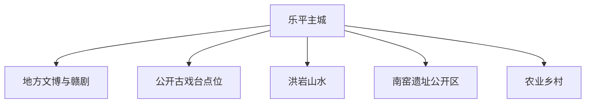
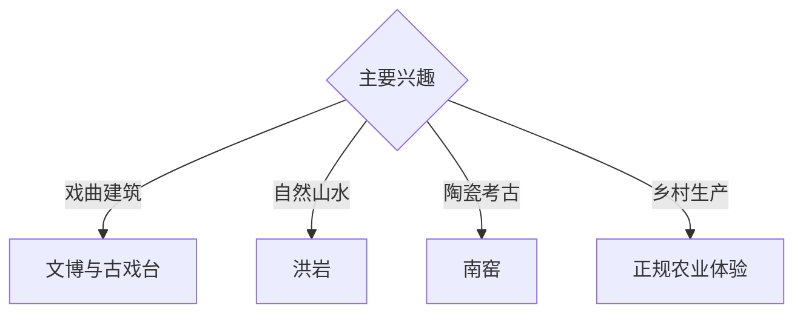

# 乐平旅行指南

乐平位于赣东北，以遍布城乡的古戏台、赣剧传统、洪岩山水、南窑遗址与蔬菜农业形成旅行主线。固定快照中的 **Leping / GeoNames 1804156** 对应主城；古戏台是分布式文化遗产，适合选择公开点位，而非追求逐处打卡。

## 城市速览

| 项目 | 信息 |
|---|---|
| 主线 | 城市文博—古戏台—赣剧—洪岩山水—南窑考古 |
| 停留 | 主城与戏台 1 天；洪岩或考古方向另留 1 天 |
| 住宿 | 主城交通餐饮便利；洪岩正规住宿适合山水慢游 |
| 交通 | 铁路、公路抵达，乡村戏台和山地提前安排车辆 |
| 季节 | 春秋适合村落与山地；汛期关注洞穴、河谷和山路 |
| 预算 | 城区消费平实，远郊车辆与讲解是主要增量成本 |

## 城市格局与游览区域

主城承担住宿、交通与公共文化；古戏台散布在村落和宗祠空间，洪岩与南窑分属远郊。古建内部、宗族活动、考古工作区、洞穴水域、农业生产区按产权、开放和安全边界活动。

## 主要景点

| 景点 | 区域 | 类型 | 核心体验 | 用时 | 环境 | 体力 | 研究价值 | 拥挤 | 优先级 |
|---|---|---|---|---:|---|---|---|---|---|
| 乐平古戏台公开代表点 | 城乡多点 | 古建与戏曲 | 戏台营造、宗族空间与赣剧传统 | 半天 | 混合 | 低中 | 很高 | 节庆中 | A |
| 地方文博或古戏台专题展陈 | 主城区 | 博物馆 | 城市史、赣剧、古戏台与地方名人 | 2–3小时 | 室内 | 低 | 很高 | 低 | A |
| 洪岩仙境依法开放区 | 洪岩镇 | 洞穴与山水 | 喀斯特洞穴、山林与乡村景观 | 1天 | 混合 | 中 | 高 | 节假日中 | A |
| 南窑遗址公开展示 | 接渡方向 | 考古遗址 | 唐代窑业、陶瓷生产与景德镇区域关系 | 半天 | 混合 | 低中 | 很高 | 低 | B |
| 赣剧正式演出 | 主城或乡村 | 戏曲 | 声腔、舞台与活态传承 | 依场次 | 室内外 | 低 | 很高 | 节庆高 | A |
| 水上古戏台等正规景区点 | 洪岩方向 | 文化景观 | 戏台主题与乡村休闲 | 2–3小时 | 室外 | 低 | 中 | 节假日中 | B |
| 正规蔬菜农业体验 | 市域乡村 | 农业 | 江南菜乡、生产链与季节采收 | 2–3小时 | 混合 | 低 | 中 | 季节性 | C |

## 美食与餐饮

乐平适合寻找桃酥、狗肉之外的多样赣东北家常菜、米粉、腌菜与时令蔬菜；对特定肉类有忌口时直接说明。主城一人用餐选择多，乡村团餐提前确认份量、辣度和营业时段。

## 经典行程

### 主城戏曲线
**路线**：地方展陈—午餐—公开古戏台代表点—正式演出。**逻辑**：先理解营造与剧种，再看活态舞台。**预约锚点**：演出和古建开放。**休息**：主城。**删除条件**：无演出时保留展陈与戏台。

### 古戏台专题线
**路线**：主城—两至三处公开代表戏台—返程。**逻辑**：少量点位对比类型，控制乡村车程。**预约锚点**：村落接待与产权开放。**休息**：乡镇。**删除条件**：民俗活动占用时尊重社区安排。

### 洪岩山水线
**路线**：主城—洪岩景区—正规乡村餐—返程。**逻辑**：给洞穴和山地完整白天。**预约锚点**：景区与道路。**休息**：游客中心。**删除条件**：强降雨、山洪或洞穴关闭时改主城线。

### 南窑考古线
**路线**：文博展陈—南窑公开区—陶瓷主题补充。**逻辑**：从出土材料进入生产遗址。**预约锚点**：遗址开放和讲解。**休息**：主城。**删除条件**：考古工作调整时只保留展陈。

### 乡村农业线
**路线**：正规农业基地—乡村午餐—公开戏台。**逻辑**：连接当代生产与乡土文化。**预约锚点**：经营主体。**休息**：乡镇。**删除条件**：非采收季改戏曲线。

### 亲子低体力线
**路线**：地方展陈—单处古戏台—主城公园。**逻辑**：减少车程和台阶。**预约锚点**：场馆。**休息**：主城。**删除条件**：疲劳时只保留展陈。

### 两日组合线
**路线**：首日戏曲与古戏台；次日洪岩或南窑二选一。**逻辑**：文化与远郊拆日。**预约锚点**：第二日交通。**休息**：连续住主城。**删除条件**：一天时保留戏曲线。

## 住宿区域

主城适合铁路、公路、餐饮和多方向出发；洪岩正规住宿适合早入山水景区。乡村住宿核对消防、交通、夜间抵达、餐食和汛期退改。

## 市内交通

乐平市站等铁路站点服务不同车次，订票后核对实际到站。主城用公交、出租车和网约车；乡村戏台、洪岩与南窑提前安排车辆。古村道路较窄，自驾依指定停车点步行进入。

## 不同旅行者须知

戏曲爱好者先查演出；建筑旅行者选择有明确开放的代表戏台；亲子与长者以主城和单点短线为主；洞穴旅行者准备防滑鞋。文物保护区、宗祠非开放空间、考古工作区、洞穴封闭段与农业设施执行明确限制。

## 行前核对

- 核对古戏台代表点、赣剧演出、地方场馆与村落接待。
- 核对洪岩洞穴、步道、汛情和地质灾害预警。
- 核对南窑公开范围、讲解与考古工作安排。
- 核对铁路站点、城乡班次和返程车辆。

## 来源与更新记录

| 来源 | 支持内容 | 核验日期 |
|---|---|---|
| [乐平市政府：古戏台简介](https://www.lps.gov.cn/ztzl/gxtzx/gxtjj/t605371.shtml) | 古戏台数量、分布与文化属性 | 2026-09-03 |
| [乐平市政府：历史文化资源保护利用](https://www.lps.gov.cn/ztzl/lpslswhyjh/zslt/t936029.shtml) | 赣剧、古戏台、南窑与地方历史结构 | 2026-09-03 |
| [GeoNames 1804156](https://www.geonames.org/1804156/) | Leping 固定人口点与乐平主城位置 | 2026-09-03 |

