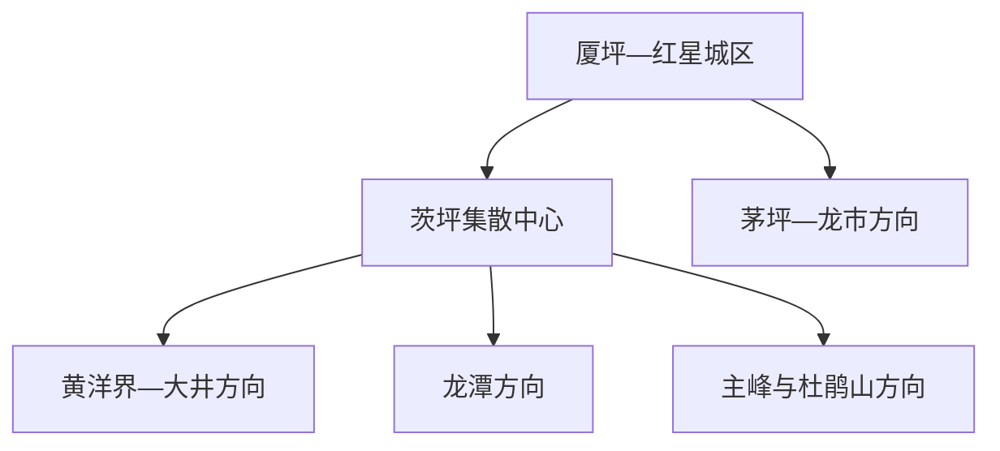
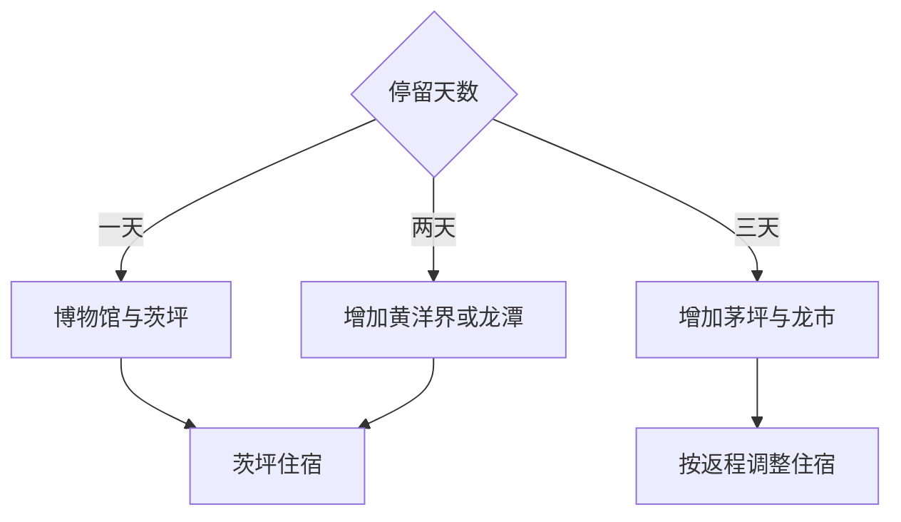

# 井冈山旅行指南

井冈山市位于罗霄山脉中段，红星城区、茨坪、黄洋界、龙潭、茅坪与龙市共同承载革命历史和山地生态。固定快照中的 **Xiaping / GeoNames 1923909** 对应厦坪—红星城区一带；旅行集散通常在茨坪，市政府驻地与核心景区并非同一片区。

## 城市速览

| 项目 | 信息 |
|---|---|
| 主线 | 茨坪文博—黄洋界—龙潭—茅坪—龙市会师 |
| 停留 | 茨坪核心 2 天；茅坪与龙市另加 1 天 |
| 住宿 | 茨坪便于景交与核心景区；红星城区便于高铁站接驳 |
| 交通 | 高铁、公路和景区观光车组合，先按景交线路分组 |
| 季节 | 春秋与杜鹃花期热门；全年关注雨雾、雷暴、结冰和火险 |
| 预算 | 景区交通、住宿和讲解是主要成本 |

## 城市格局与游览区域

红星城区承担井冈山站接驳与市政服务，茨坪是景区住宿和观光车中心；黄洋界、龙潭、主峰、茅坪与龙市属于不同景交或公路方向。革命旧址、烈士纪念空间、自然保护区、森林防火区和山地步道按景区运营与保护边界游览。

## 主要景点

| 景点 | 区域 | 类型 | 核心体验 | 用时 | 环境 | 体力 | 研究价值 | 拥挤 | 优先级 |
|---|---|---|---|---:|---|---|---|---|---|
| 井冈山革命博物馆 | 茨坪 | 博物馆 | 革命根据地形成、军事与群众工作 | 3小时 | 室内 | 低 | 很高 | 团体时高 | A |
| 黄洋界景区 | 茨坪北部 | 革命旧址与山地 | 哨口、保卫战历史与山脊地形 | 半天 | 室外 | 中 | 很高 | 旺季高 | A |
| 茨坪革命旧址与烈士陵园 | 茨坪 | 纪念地 | 旧居、纪念设施与根据地生活 | 半天 | 混合 | 中 | 很高 | 纪念日高 | A |
| 龙潭景区 | 茨坪近郊 | 瀑布与山谷 | 瀑布群、森林与山地水系 | 半天 | 室外 | 中高 | 高 | 旺季中高 | A |
| 大井与小井公开旧址 | 黄洋界方向 | 革命旧址 | 村落、医院旧址与山地后勤 | 半天 | 混合 | 低中 | 很高 | 团体时中 | B |
| 茅坪八角楼等公开旧址 | 茅坪方向 | 革命旧址 | 早期根据地治理、居住与文献史 | 半天 | 混合 | 低中 | 很高 | 节假日中 | A |
| 龙市会师纪念公开区 | 龙市镇 | 纪念地 | 井冈山会师与边界城镇历史 | 半天 | 混合 | 低 | 很高 | 纪念日中 | B |

## 美食与餐饮

井冈山适合寻找红米饭、南瓜汤之外的竹笋、烟笋烧肉、山野菜、米粉和赣南家常菜。茨坪选择最多，远线餐饮偏团餐；野生菌和野菜选择正规来源与充分加工，点餐时说明辣度和过敏原。

## 经典行程

### 茨坪核心线
**路线**：革命博物馆—茨坪旧址—烈士陵园—主街休息。**逻辑**：先建立历史框架，再进入纪念空间。**预约锚点**：博物馆与纪念设施。**休息**：茨坪。**删除条件**：时间不足时保留博物馆与一处纪念地。

### 黄洋界历史线
**路线**：茨坪景交—黄洋界—大井或小井公开点—返回。**逻辑**：沿同一景交方向理解哨口与后勤。**预约锚点**：景交和开放点。**休息**：换乘站。**删除条件**：大雾、结冰或交通调整时按景区缩短。

### 龙潭山水线
**路线**：茨坪—龙潭景区—依法开放瀑布步道—返回。**逻辑**：给山谷水系半天。**预约锚点**：景交和步道。**休息**：游客服务点。**删除条件**：暴雨、山洪或步道关闭时改文博线。

### 茅坪旧址线
**路线**：茨坪或红星城区—茅坪八角楼等公开点—返程。**逻辑**：补充早期根据地治理与生活。**预约锚点**：车辆与场馆。**休息**：茅坪服务区。**删除条件**：远线交通不足时保留茨坪。

### 龙市会师线
**路线**：红星城区—龙市会师纪念区—地方街区—返程。**逻辑**：以完整半天理解会师历史。**预约锚点**：纪念馆和车辆。**休息**：龙市镇。**删除条件**：大型纪念活动时服从分流。

### 亲子低体力线
**路线**：革命博物馆—茨坪短段旧址—景交观景点。**逻辑**：减少长阶梯和山路。**预约锚点**：儿童讲解与景交。**休息**：茨坪。**删除条件**：疲劳时只保留博物馆。

### 三日组合线
**路线**：首日茨坪；次日黄洋界与龙潭二选一；第三日茅坪与龙市。**逻辑**：核心、山地与远线分日。**预约锚点**：景交与第三日车辆。**休息**：连续住茨坪。**删除条件**：两天时删除第三日。

## 住宿区域

茨坪适合景区观光车、餐饮和早晚步行；红星城区适合井冈山站与公路接驳；龙市或茅坪正规住宿适合专题远线。旺季订房核对景区准入、停车、供暖除湿、行李与退改。

## 市内交通

井冈山站位于红星城区方向，抵达后再转茨坪；景区内按观光车线路和换乘站组织。茅坪、龙市等远线提前确认公路车辆。雨雾、结冰和大型活动可能改变交通，按现场指挥调整。

## 不同旅行者须知

历史旅行者从博物馆开始；亲子与长者用景交减少步行；徒步者控制单日山地组团；摄影者遵守纪念与军事遗址拍摄要求。烈士纪念核心空间、旧址非开放房间、自然保护核心区、封闭林道和森林防火区保留明确限制。

## 行前核对

- 核对门票、实名、景交、索道与各景区开放组合。
- 核对博物馆、烈士陵园、黄洋界、龙潭、茅坪和龙市状态。
- 核对井冈山站接驳、茨坪交通与远线车辆。
- 核对雨雾、雷暴、山洪、结冰、森林火险和大型活动管制。

## 来源与更新记录

| 来源 | 支持内容 | 核验日期 |
|---|---|---|
| [井冈山管理局：景点推荐](https://www.jgstour.com/article/spotlist) | 茨坪、黄洋界、龙潭、茅坪、龙市等景区结构 | 2026-09-03 |
| [井冈山管理局：景区服务与资讯](https://www.jgstour.com/) | 景区官方入口、交通、票务与公告体系 | 2026-09-03 |
| [GeoNames 1923909](https://www.geonames.org/1923909/) | Xiaping 固定人口点与红星城区位置 | 2026-09-03 |

