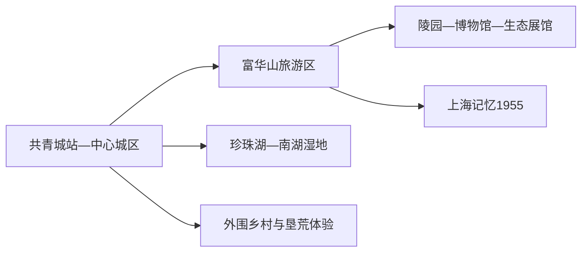
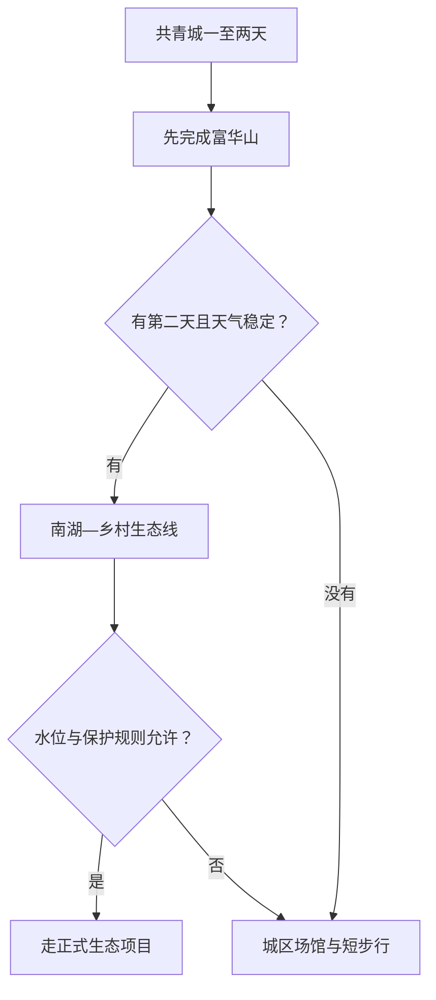

# 共青城旅行指南

共青城是一座以青年垦荒史、富华山纪念与博物馆群、南湖湿地和鄱阳湖生态教育为主线的小城。铁路到达方便，核心内容可在一至两天完成；湖滨湿地、乡村研学和低空体验则按季节、运营与安全规则另选。

## 城市速览

| 项目 | 信息 |
|---|---|
| 旅行主线 | 富华山旅游区、胡耀邦陵园、共青城市博物馆、上海记忆 1955、南湖湿地 |
| 建议停留 | 核心研学线 1 天；加入湿地与垦荒体验 2 天 |
| 住宿基地 | 共青城站—中心城区便于到达、餐饮和跨区移动 |
| 步行强度 | 富华山中等；城区与公园低至中；乡村项目视场地而定 |
| 主要天气 | 暑热、强降雨、雷暴、湖区大风、洪水与湿地水位变化 |
| 预约核心 | 陵园与场馆、研学项目、低空体验、乡村车辆与返程 |
| 边界重点 | 陵园礼仪、湿地保护、水域、科研设施和低空活动按管理范围使用 |
| 无障碍 | 核心场馆可优先询问电梯与轮椅；山地园路连续性需确认 |

## 城市格局与游览区域

共青城是九江市代管的县级市，法定代码 `360482`；GeoNames `10378130` 与 Wikidata `Q987256` 对应城市实体。富华山位于城市核心文化区，火车站和中心城区提供交通住宿，南湖与珍珠湖形成生态休闲方向，外围乡镇分布垦荒和乡村项目。

| 区域 | 旅行价值 | 怎么安排 |
|---|---|---|
| 富华山旅游区 | 纪念、垦荒史、城市博物馆与生态科普 | 留大半日至一日 |
| 中心城区 | 铁路、住宿、餐饮和城市生活 | 作为旅行基地 |
| 珍珠湖—南湖 | 城市公园、湿地与湖滨公共空间 | 天气稳定时半日 |
| 乡村与研学方向 | 垦荒体验、生态农业和当期运营活动 | 车辆落实后独立半日以上 |

## 主要景点

| 景点 | 所在区域 | 类型 | 核心看点 | 建议用时 | 室内/室外 | 体力 | 预约难度 | 天气敏感度 | 适合旅程 |
|---|---|---|---|---|---|---|---|---|---|
| 富华山旅游区 | 城市核心区 | 综合文化景区 | 青年垦荒史、生态文明与城市记忆 | 4–7 小时 | 混合 | 中 | 中高 | 中 | A |
| 胡耀邦陵园 | 富华山内 | 纪念地 | 纪念空间、人物生平与环境设计 | 1–2 小时 | 混合 | 中 | 中高 | 中 | A |
| 共青城市博物馆 | 富华山内 | 城市博物馆 | 共青垦荒、建市历程与地方文化 | 2–3 小时 | 室内 | 低 | 中高 | 低 | A |
| 江西生态文明展示馆等科普场馆 | 富华山内 | 科普与研学 | 鄱阳湖生态、模型试验与生态文明主题 | 2–4 小时 | 室内 | 低 | 高 | 低 | B |
| 上海记忆 1955 主题街区 | 富华山方向 | 历史主题街区 | 上海青年垦荒记忆与街区体验 | 1–3 小时 | 混合 | 低至中 | 中 | 中 | B |
| 珍珠湖公园与南湖公开步道 | 城区 | 公园与湿地 | 湖滨景观、城市绿地与季节观鸟 | 1–3 小时 | 室外 | 低至中 | 低 | 极高 | B |

富华山内部多个场馆、陵园和公园共同构成一个综合旅游区，路线按当日开放选择重点。鄱阳湖与南湖的水域、滩涂和湿地保护范围随水位与生态管理变化，游览使用公开步道、观景点和正式活动。

## 美食与餐饮

| 类型 | 适合场景 | 份量 | 过敏与饮食提示 | 怎么选 |
|---|---|---|---|---|
| 赣北米粉 | 早餐与简餐 | 一人份 | 米制品、肉臊、辣椒、花生和大豆 | 先问汤底、辣度与配料 |
| 鄱阳湖合规水产 | 城区多人正餐 | 多为共享 | 鱼刺、甲壳类、酱油和辣椒 | 核对来源、品种、重量和价格 |
| 瓦罐汤与家常菜 | 城区日常用餐 | 一人或共享 | 肉类、蛋和较高盐分 | 选配料可说明的小份组合 |
| 乡村餐饮 | 外围体验日 | 共享更方便 | 共锅、野菜来源、花生和辣椒 | 选择证照与价格清楚的经营点 |

## 经典行程

### 一日富华山路线

**路线**：游客中心 → 胡耀邦陵园 → 共青城市博物馆 → 午餐 → 一处生态科普场馆 → 上海记忆 1955

- **串联逻辑**：景区内部连续串联纪念、城市史与生态教育。
- **预约锚点**：陵园、博物馆、科普馆与讲解。
- **休息安排**：午餐后转室内场馆。
- **时间不足时**：保留陵园与城市博物馆。

### 两日城市与生态路线

**第 1 天**：富华山核心线 
**第 2 天**：珍珠湖—南湖公开步道—外围垦荒体验项目

- **串联逻辑**：城市历史与生态休闲分日。
- **预约锚点**：场馆、湿地开放与乡村交通。
- **休息安排**：第二天正午回城区用餐。
- **时间不足时**：删除外围项目，保留湖滨短段。

### 垦荒历史路线

**路线**：共青城市博物馆 → 上海记忆 1955 → 午餐 → 当期开放的共青精神体验项目

- **适用条件**：体验项目运营与交通已确认。
- **预约锚点**：讲解、团队接待和开放时段。
- **休息安排**：午后先看室内展陈。
- **时间不足时**：保留博物馆与主题街区。

### 雨天路线

**路线**：共青城市博物馆 → 午餐 → 江西生态文明展示馆或当期开放科普馆

- **适用条件**：普通降雨且城区交通稳定；洪水预警时远离湖岸。
- **预约锚点**：场馆开放与临时闭馆。
- **休息安排**：两馆之间完整午休。
- **时间不足时**：只保留城市博物馆。

### 亲子路线

**路线**：城市博物馆 → 午休 → 生态科普场馆 → 富华公园短段

- **串联逻辑**：历史和生态各一个学习主题，户外段可控。
- **预约锚点**：儿童活动、推车、电梯和卫生间。
- **休息安排**：正午全部在室内。
- **时间不足时**：保留两座场馆。

### 低体力路线

**路线**：车辆到达富华山核心入口 → 一座场馆 → 午餐长休 → 珍珠湖近入口短段

- **适用条件**：落客与无障碍入口已经确认。
- **预约锚点**：电梯、轮椅、坡度和返程。
- **休息安排**：每段控制在一小时左右。
- **时间不足时**：删除湖滨段。

### 鄱湖生态延伸路线

**路线**：城区早出发 → 正式湿地或乡村生态项目 → 服务点午休 → 原路返回

- **适用条件**：水位、天气、候鸟保护和运营稳定。
- **预约锚点**：准确入口、车辆、观鸟规则和返程。
- **休息安排**：使用正式游客设施。
- **时间不足时**：整段删除，改走南湖公共短线。

## 住宿区域

| 区域 | 优点 | 取舍 | 适合人群 | 核对项 |
|---|---|---|---|---|
| 共青城站—中心城区 | 铁路、餐饮和叫车方便 | 去外围项目仍需车辆 | 首访、公共交通旅行 | 车站距离、隔音、早餐和夜间入住 |
| 富华山周边 | 接近核心景区和场馆 | 节庆时客流波动 | 研学、亲子 | 步行入口、停车、团体活动与退改 |
| 南湖与大学城方向 | 环境较安静 | 餐饮与夜间交通需核对 | 慢游、长住 | 叫车、夜间入住、湖岸距离与防潮 |

## 市内交通

| 场景 | 怎么做 | 行前核对 |
|---|---|---|
| 铁路到达 | 共青城站转公交、出租或住宿接驳 | 车次、站前接驳与夜间交通 |
| 核心城区—富华山 | 公交、出租或短程车辆直达景区入口 | 运营时段、落客和闭园 |
| 南湖与乡村项目 | 自驾或正规包车按单一方向安排 | 路况、停车、返程和项目运营 |
| 九江或南昌联游 | 给共青城留完整一天，按票面到发站换乘 | 车次、行李和末班接驳 |

## 不同旅行者须知

| 旅行者 | 推荐做法 | 重点核对 |
|---|---|---|
| 独行 | 住站区或中心城区，以富华山为核心 | 乡村返程、夜间叫车与入住 |
| 亲子 | 场馆加公园短段 | 儿童预约、推车、电梯和防晒 |
| 长者与低体力 | 一次只选一座馆和一段公园 | 坡度、轮椅、落客和座椅 |
| 摄影与观鸟 | 湖滨项目单独安排 | 水位、保护期、长焦、三脚架和无人机 |
| 低空体验 | 只使用持证运营项目 | 天气、保险、年龄健康条件与退改 |

## 行前核对

- 共青城市政府旅游向导：富华山、博物馆、珍珠湖及当期项目。
- 景区与场馆：开放、预约、讲解、研学与无障碍设施。
- 江西气象、水利、林业和应急信息：高温、暴雨、湖区风浪与水位。
- 中国铁路 12306：共青城站车次与退改。

## 来源与更新记录

| 来源 | 支持内容 | 核验日期 |
|---|---|---|
| [共青城市政府：富华山旅游区](https://www.gongqing.gov.cn/whgdxwcblyj/fdzdgknr_187269/zdly_309372/shgysy/ly/202507/t20250724_6979118.html) | 富华山范围、陵园、博物馆与科普场馆 | 2026-09-01 |
| [共青城市政府：旅游向导](https://www.gongqing.gov.cn/08/cygq/lyxd/gqly/) | 官方景点清单与城市游览入口 | 2026-09-01 |
| [共青城市文旅发展规划](https://www.gongqing.gov.cn/fdzdxxgk/01/00/zcwj/ptwj_164881/202212/t20221227_5893975.html) | 垦荒、研学、生态和乡村线路 | 2026-09-01 |
| [Wikidata Q987256](https://www.wikidata.org/wiki/Q987256) | 共青城市实体对齐 | 2026-09-01 |
| [GeoNames 10378130](https://www.geonames.org/10378130/) | 固定共青城城市点 | 2026-09-01 |
| [江西省气象局](http://jx.cma.gov.cn/) | 气象预警 | 2026-09-01 |

| 日期 | 更新 |
|---|---|
| 2026-09-01 | 首次完成富华山、垦荒史、生态科普和湖滨方向研究，并明确湿地、水域与低空活动边界。 |
