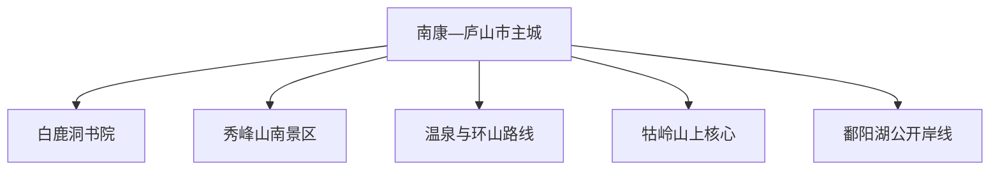
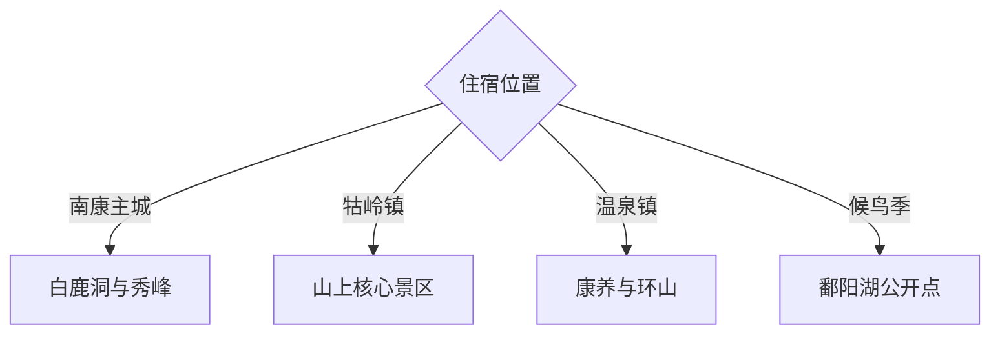

# 庐山旅行指南

庐山市位于庐山南麓与鄱阳湖西岸，南康主城、秀峰、白鹿洞书院、温泉和湖滨共同构成山—城—湖结构。固定快照中的 **Nankang / GeoNames 1799946** 对应南康主城；牯岭镇属于庐山风景名胜区山上核心，与山南和湖滨点位需要按交通分日。

## 城市速览

| 项目 | 信息 |
|---|---|
| 主线 | 南康主城—白鹿洞书院—秀峰—牯岭—鄱阳湖 |
| 停留 | 山南与主城 2 天；牯岭核心另留 1–2 天；湖滨按季节加半日至1天 |
| 住宿 | 南康便于高铁和环山；牯岭适合山上慢游；温泉镇适合休息 |
| 交通 | 高铁、景区交通、索道与公路组合，山上车辆依景区规则 |
| 季节 | 四季差异大，雨雾、雷暴、结冰和鄱阳湖水位均需核对 |
| 预算 | 景区交通、住宿与多日票制是主要成本 |

## 城市格局与游览区域

南康主城承担庐山站接驳与山南集散；秀峰、白鹿洞、温泉和牯岭分属不同入口与交通体系。庐山自然保护、风景名胜、文物和森林防火边界叠加，旅行沿售票、景交和正式步道进行；鄱阳湖岸线随水位与生态保护动态调整。

## 主要景点

| 景点 | 区域 | 类型 | 核心体验 | 用时 | 环境 | 体力 | 研究价值 | 拥挤 | 优先级 |
|---|---|---|---|---:|---|---|---|---|---|
| 白鹿洞书院 | 白鹿镇 | 书院与古建 | 中国书院史、理学与山水空间 | 半天 | 混合 | 低中 | 很高 | 节假日高 | A |
| 秀峰景区 | 白鹿镇 | 山岳与人文 | 瀑布、摩崖石刻、山峰与诗歌 | 半天至1天 | 室外 | 中高 | 很高 | 旺季高 | A |
| 牯岭镇与山上核心景区 | 庐山山上 | 山岳与历史街区 | 云雾山城、近代建筑与山岳景观 | 1–2天 | 混合 | 中高 | 很高 | 旺季很高 | A |
| 南康古城与西宁街公共区 | 主城区 | 城市街区 | 山下城市史、地方生活与集散功能 | 2–3小时 | 室外 | 低 | 中 | 傍晚中 | B |
| 东林大佛依法开放区 | 温泉方向 | 宗教建筑 | 佛教文化、轴线空间与山麓景观 | 半天 | 混合 | 中 | 高 | 节假日中高 | B |
| 温泉镇正规温泉体验 | 温泉镇 | 温泉与休闲 | 山麓温泉、康养与行程恢复 | 2–3小时 | 室内 | 低 | 中 | 周末中 | B |
| 鄱阳湖公开观景与候鸟点 | 湖滨 | 湖泊与生态 | 水位季相、湿地与候鸟 | 半天 | 室外 | 低中 | 很高 | 鸟季中 | B |

## 美食与餐饮

庐山石鸡、石鱼、石耳等名目常见于地方菜，但野生来源、物种保护和供应真实性需要谨慎核对；更稳妥的选择包括庐山云雾茶、九江米粉、湖鲜的合法养殖产品和赣北家常菜。山上与山下价格和营业节奏不同，订餐时确认食材、份量与明码标价。

## 经典行程

### 山南经典线
**路线**：南康主城—白鹿洞书院—午餐—秀峰。**逻辑**：书院与山水处于同一山南方向。**预约锚点**：门票、交通和讲解。**休息**：白鹿镇。**删除条件**：强降雨时保留书院并缩短山路。

### 牯岭山上一日线
**路线**：按景区交通抵达牯岭—历史街区—一组核心景点—住宿。**逻辑**：以单组团减少景交折返。**预约锚点**：进山、索道或景交及住宿。**休息**：牯岭。**删除条件**：大雾或结冰时听从景区线路调整。

### 山上两日线
**路线**：首日牯岭与近距离核心；次日另一组正式开放景点。**逻辑**：把东西线或不同景交组团拆开。**预约锚点**：票制和住宿。**休息**：连续住牯岭。**删除条件**：只住一晚时保留开放稳定的一组。

### 鄱阳湖生态线
**路线**：主城—官方开放湖滨点—观鸟或水位景观—返程。**逻辑**：围绕季节和水位选择点位。**预约锚点**：保护公告与车辆。**休息**：沿线正规服务点。**删除条件**：封护、洪水、大风或低能见度时顺延。

### 温泉恢复线
**路线**：主城—东林大佛依法开放区—正规温泉。**逻辑**：把低强度文化与休息组合。**预约锚点**：温泉和场所开放。**休息**：温泉镇。**删除条件**：宗教活动或维护时只保留温泉。

### 亲子低体力线
**路线**：南康文博—白鹿洞书院低坡段—正规温泉。**逻辑**：减少长阶梯与多次景交。**预约锚点**：无障碍和儿童泡浴规则。**休息**：主城或温泉镇。**删除条件**：疲劳时保留一处文化点。

### 三日山城组合线
**路线**：首日山南；次日牯岭；第三日山上另一组或鄱阳湖。**逻辑**：山上山下分日并留天气机动。**预约锚点**：住宿与景交。**休息**：按次日方向换宿。**删除条件**：天气不稳时第三日作为机动。

## 住宿区域

南康主城适合高铁和山南路线；牯岭适合山上早晚与连续游览；温泉镇适合低体力与康养；白鹿镇民宿便于书院和秀峰。订房核对景区准入、接驳、供暖除湿、停车与恶劣天气退改。

## 市内交通

庐山站位于山下，九江站是另一跨城入口，订票后核对实际站点。进山交通、索道和景交按庐山景区当期规则；山南各点宜公交、约车或自驾分组。步道遇雷暴、结冰、落石和封闭时按现场绕行或停止进入。

## 不同旅行者须知

首访者先决定住山上还是山下；亲子与长者减少长阶梯和多次换乘；徒步者携带防滑、防雨和保暖层；观鸟者保持保护距离。自然保护区核心区、封闭林道、非承载冰面、摩崖文物和湖滨封护区保留明确限制。

## 行前核对

- 核对庐山进山、景交、索道、门票联动和各入口开放。
- 核对白鹿洞、秀峰、东林大佛、温泉及湖滨点状态。
- 核对雨雾、雷暴、结冰、森林火险、鄱阳湖水位与候鸟保护。
- 核对庐山站、九江站、换宿与行李转运。

## 来源与更新记录

| 来源 | 支持内容 | 核验日期 |
|---|---|---|
| [庐山市政府：白鹿洞书院](https://www.lushan.gov.cn/yxls/rwss/t_5217756.html) | 书院位置、历史与文物属性 | 2026-09-03 |
| [庐山市政府：秀峰景区](https://www.lushan.gov.cn/bmxzxxgk/bumeng/whgdxwcbj/fdzdgknr_195359/lvyou/202512/t20251231_7134055.html) | 秀峰山水、古迹与摩崖石刻 | 2026-09-03 |
| [庐山市政府：2025年政府工作报告](https://www.lushan.gov.cn/zwgk_194695/zfxxgkzl_194696/fdzdgknr_194705/qtfd/zfgzbg/202501/t20250122_6837276.html) | 山上山下、环湖与城区旅游格局 | 2026-09-03 |
| [GeoNames 1799946](https://www.geonames.org/1799946/) | Nankang 固定人口点与庐山市主城位置 | 2026-09-03 |

