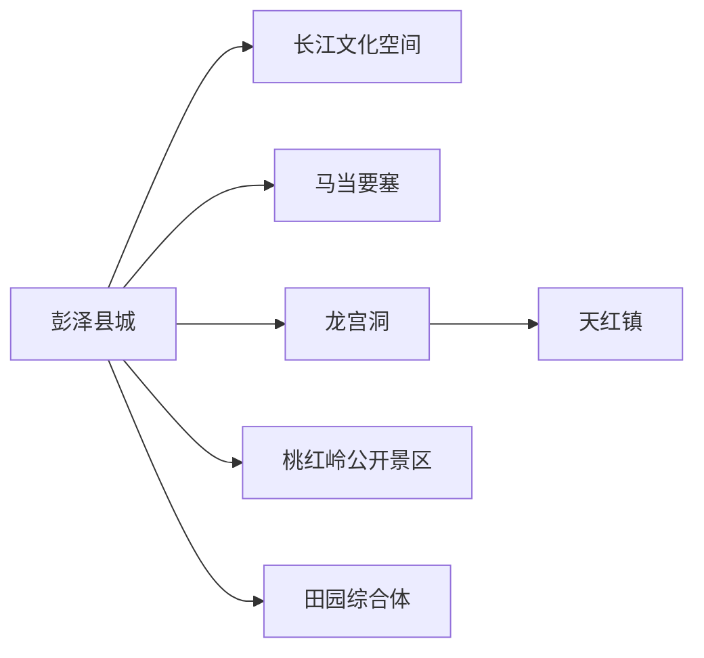
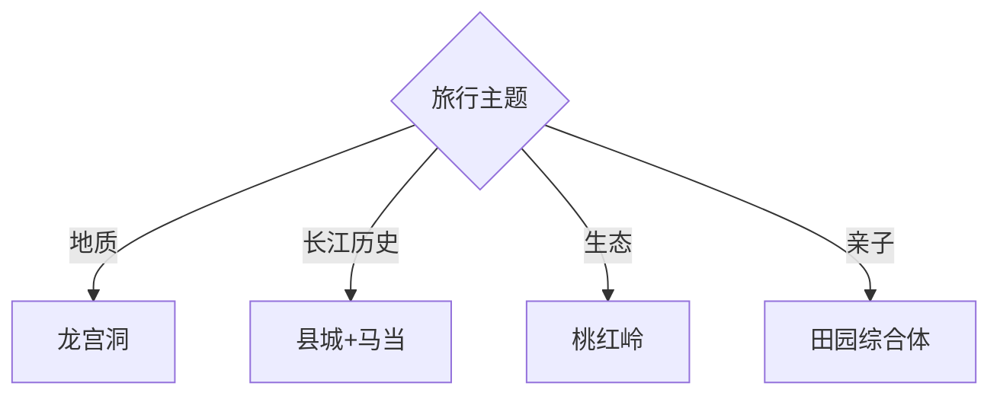

# 彭泽旅行指南

彭泽位于长江南岸，适合把龙宫洞的地下喀斯特、马当要塞的江防历史、县城文化空间与桃红岭生态放在2—3天内理解。景点方向分散，自驾或合规包车更省时，公共交通旅行则每天集中一个方向。

## 城市速览

| 项目 | 信息 |
|---|---|
| 主线 | 龙城县城—龙宫洞—马当要塞—长江文化空间—桃红岭 |
| 停留 | 县城半日；龙宫洞1天；历史或生态方向另1天 |
| 住宿 | 县城适合交通补给；龙宫洞方向适合早入园；乡村住宿适合单一主题 |
| 交通 | 铁路、公路到县城，远端景区用班车、合规包车或自驾 |
| 风险 | 溶洞湿滑、游船水情、长江汛期、山林火险、野生动物与乡道夜行 |
| 边界 | 桃红岭保护区、长江岸线、港口生产区、炮台遗址和溶洞支洞按开放范围进入 |

## 城市格局与游览区域

固定 **Pengze / GeoNames 1798900** 对应九江市彭泽县，本页以实体 `Q1335508` 锁定县域。县城是铁路与餐饮基地，龙宫洞在西南，马当沿江，桃红岭生态区域另在山地；每天按一条地理走廊往返，比横穿县域赶场更稳妥。

## 主要景点

| 景点 | 区域 | 类型 | 核心体验 | 用时 | 环境 | 体力 | 研究价值 | 拥挤 | 优先级 |
|---|---|---|---|---:|---|---|---|---|---|
| 龙宫洞风景区 | 天红镇 | 溶洞景区 | 洞穴、地下水体与钟乳石 | 半日至1天 | 室内 | 中 | 很高 | 旺季高 | A |
| 玉壶洞开放游线 | 龙宫洞景区 | 水洞 | 船行与水旱洞组合 | 1–2小时 | 室内 | 中 | 高 | 旺季高 | B |
| 马当要塞文化园 | 马当镇 | 军事遗址 | 长江江防与抗战历史 | 半日 | 混合 | 中 | 很高 | 中 | A |
| 长江国家文化公园彭泽段公开空间 | 县城沿江 | 滨江文化 | 长江航运、城市与公共景观 | 2–4小时 | 室外 | 低中 | 高 | 周末中 | B |
| 五柳书院与狄公楼相关开放点 | 县城 | 人文纪念 | 陶渊明、狄仁杰与县史线索 | 2–4小时 | 混合 | 低 | 很高 | 低 | B |
| 桃红岭梅花鹿景区 | 桃红岭外围 | 生态景区 | 梅花鹿科普与栖息地外围观察 | 半日 | 室外 | 中 | 高 | 季节高 | B |
| 凯瑞田园综合体 | 太泊湖方向 | 农旅 | 稻渔、亲子与乡村体验 | 半日 | 室外 | 低中 | 中 | 节假日高 | C |
| 蔓谷田园综合体 | 农业产业园 | 农旅 | 花卉、森林探索与亲子活动 | 半日 | 混合 | 低中 | 中 | 节假日高 | C |

## 美食与餐饮

县城可选彭泽鲫、蒸米粑、豆粑、麻糍粑和赣北家常菜，田园方向常见小龙虾、稻渔和农家菜。水产点餐先看当日价格与计量方式，溶洞日程前选择清淡早餐；自然区域自带饮水并带走垃圾。

## 经典行程

### 两日基础线
**路线**：县城人文—沿江公共空间—次日龙宫洞。**逻辑**：先建立长江与县史，再进入自然主景。**预约锚点**：洞穴票务、游船与住宿。**休息**：县城。**删除条件**：水洞停航时保留旱洞开放段。

### 龙宫洞深游线
**路线**：游客中心—龙宫洞—玉壶洞开放段—景区展演。**逻辑**：完整理解溶洞群。**预约锚点**：门票、船班、末次入园与洞温。**休息**：游客中心。**删除条件**：积水、检修或容量管控时缩短。

### 长江人文线
**路线**：五柳书院相关点—狄公楼—长江文化公园公开区。**逻辑**：从人物史走到滨江空间。**预约锚点**：场馆开放与讲解。**休息**：县城。**删除条件**：汛期岸线管控时改室内展陈。

### 马当江防线
**路线**：县城—马当要塞文化园—正式沿江观景点—返城。**逻辑**：结合地形理解江防史。**预约锚点**：遗址开放、车辆与返程。**休息**：马当镇。**删除条件**：暴雨、汛情或遗址维护时取消。

### 桃红岭生态线
**路线**：正规景区入口—科普展陈—公开观察区—返程。**逻辑**：以栖息地和物种保护为主。**预约锚点**：开放、讲解与观察季节。**休息**：游客中心。**删除条件**：防火、繁殖期或保护管控时改县城。

### 田园亲子线
**路线**：凯瑞或蔓谷二选一—农事体验—县城晚餐。**逻辑**：只选一个园区留足体验时间。**预约锚点**：运营项目、年龄和收费。**休息**：园区。**删除条件**：活动停开或高温时改文博。

### 低体力线
**路线**：县城展陈—车辆游沿江—龙宫洞短段或田园园区。**逻辑**：用车辆和室内空间减少远足。**预约锚点**：无障碍、洞内台阶与落客点。**休息**：每站服务区。**删除条件**：洞内湿滑时留县城。

## 住宿区域

龙城县城适合铁路、餐饮和各方向往返；天红镇或龙宫洞周边适合早进景区；乡村住宿适合田园或生态主题。订房时核对夜间交通、热水、空调、餐饮、消防和退改，山地与沿江远点在天黑前返程。

## 市内交通

彭泽站和县城客运承担主要进入交通，龙宫洞、马当和桃红岭方向分散。班车信息按旅行日期向客运与景区核对；包车明确合法运营、等候、山路与返程费用。长江沿岸还有港口和生产道路，观景使用公共道路与正式开放点。

## 不同旅行者须知

地质兴趣者优先龙宫洞；历史兴趣者选县城与马当；亲子家庭选洞穴短线或单一田园园区；生态观察者通过桃红岭正规入口；长者关注洞内台阶和湿度。保护区核心、动物繁殖区域、港口作业区、非开放炮台结构和溶洞支洞保留明确限制。

## 行前核对

- 核对龙宫洞各洞段、船班、马当要塞、县城场馆和桃红岭公开区的开放。
- 核对铁路与班车、暴雨、长江水情、山林防火、洞内温度和返程时间。
- 观察梅花鹿保持距离，沿江与洞穴只走正式游线，生产岸线按现场边界通行。

## 来源与更新记录

| 来源 | 支持内容 | 核验日期 |
|---|---|---|
| [文化和旅游部：农旅融合振兴之旅](https://zhuanti.mct.gov.cn/dhxlsfn2022/jiangxi/detail/2358.html) | 桃红岭、凯瑞、蔓谷、美食与县域线路 | 2026-09-01 |
| [彭泽县政府工作报告转载页](https://www.zgcounty.com/wap/news/49174.html) | 龙宫洞、马当要塞、长江文化公园与文旅布局 | 2026-09-01 |
| [九江文旅相关平台：龙宫洞](https://yangtze.silkroadinfo.org.cn/2022/0120/c144a3971108/page.htm) | 龙宫洞位置与自然特征 | 2026-09-01 |
| [GeoNames 1798900](https://www.geonames.org/1798900/) | Pengze 固定人口点及坐标 | 2026-09-01 |
| [Wikidata Q1335508](https://www.wikidata.org/wiki/Q1335508) | 彭泽县实体与跨库标识 | 2026-09-01 |

| 日期 | 更新 |
|---|---|
| 2026-09-01 | 首次完成彭泽旅行研究，按溶洞、长江历史、生态和田园组织。 |
